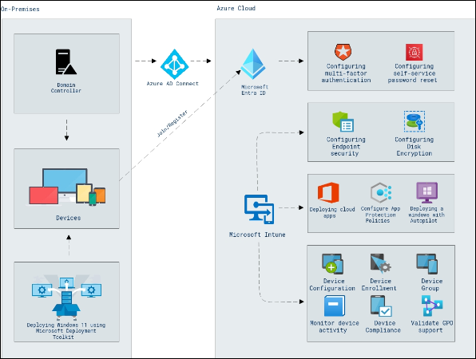

# Lab Scenario Preview: MD-102 : Microsoft 365 Endpoint Administrator

### Lab overview

In this lab, you will explore tasks such as managing identity, security, access, policies, updates, and apps for endpoints, and implementing scalable solutions for deploying and managing endpoints using tools like Microsoft Intune, Windows 365, Windows Autopilot, and Microsoft Entra ID.

## Objective
  
After completing this lab, you will be able to:

- Manage and Syncronize Identities.
- Configure and manage Entra Join/Register.
- Enroll devices and manage through Intune.
- Monitor device and User activity in Intune.
- Configure MFA and self service password reset.
- Configure Endpoint security and Disk Encryption using Intune.
- Deploy Windows using Microsoft Deployment Toolkit.

## Architecture Diagram

  

## Note

Once you understand the lab's content, you can start the Hands-on Lab by clicking the **Launch** button located at the top right corner which leads you to the lab environment and lab guide interface . You can also have a detailed preview of the full lab guide [here](https://experience.cloudlabs.ai/#/labguidepreview/9dbe613e-e62d-4824-ab67-6dc22e020e3c), prior to launching your environment.
