# Practice Lab: Managing Identities in Entra ID

## WWL Tenants - Terms of Use

If you are being provided with a tenant as a part of an instructor-led training delivery, please note that the tenant is made available for the purpose of supporting the hands-on labs in the instructor-led training. 

Tenants should not be shared or used for purposes outside of hands-on labs. The tenant used in this course is a trial tenant and cannot be used or accessed after the class is over and are not eligible for extension. 

Tenants must not be converted to a paid subscription. Tenants obtained as a part of this course remain the property of Microsoft Corporation and we reserve the right to obtain access and repossess at any time.

## Summary

In this lab, you will use the Entra ID admin center to create and modify users, assign administrative roles, create and modify groups, and manage license assignments in Entra ID.

## Exercise 1: Creating users in Entra ID

### Scenario

You need to create user accounts in Entra ID for new employees that will start next week. New users are listed in the following table:

| Name           | User Name                             | Password   | Job title         | Department |
| -------------- | ------------------------------------- | ---------- | ----------------- | ---------- |
| Edmund Reeve   | `ereeve@yourtenant.onmicrosoft.com`   | Pa55-w.rd! | HR Rep            | HR         |
| Miranda Snider | `msnider@yourtenant.onmicrosoft.com`  | Pa55-w.rd! | Helpdesk Manager  | Operations |
| Allan Deyoung  | `AllanD@yourtenant.onmicrosoft.com`   | Pa55-w.rd! | Accountant        | Accounting |
| Joni Sherman   | `JoniS@yourtenant.onmicrosoft.com`    | Pa55-w.rd! | Marketing Head    | Marketing  |
| Alex Wilber    | `AlexW@yourtenant.onmicrosoft.com`    | Pa55-w.rd! | Support Executive | Support    |
| Cody Godinez   | `cgodinez@yourtenant.onmicrosoft.com` | Pa55-w.rd! | Sales Rep         | Sales      |

_Note: For location use either your local region or United States._

You've also been told that several more employees will be hired over the next couple of months. You've decided that scripting would be a far more efficient method of adding a large number of new users. You've decided to create a PowerShell script and test it out when you create Cody, Allan, Joni and Alex accounts.

### Task 1: Create users by using the Microsoft Entra admin center

In this task you will sign in to the SEA-SVR1 server using the Contoso administrator account and prepare the system by closing Server Manager.

1. Switch to **SEA-SVR1** from top left dropdown, sign in as **Contoso\\Administrator** with the password of **Pa55w.rd**.

    

    > **Note :** If you’re unable to switch the VM from the dropdown menu, you can also access the VM directly from the desktop of your Host VM.

    

    

2. Close **Server Manager**.

3. On the taskbar, select **Microsoft Edge**.

    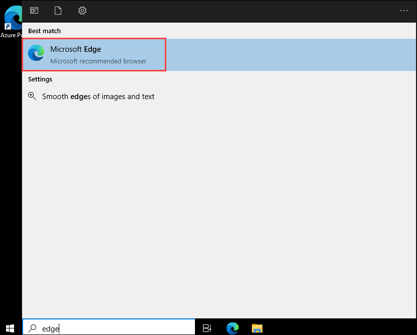

4. In the address bar, enter **<https://entra.microsoft.com>**.

    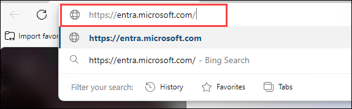

1. On the Sign in tab, you will see the login screen. Enter the following **email/username (1)**, and click on **Next (2)**.

   **Email/Username:** <inject key="AzureAdUserEmail"></inject>

    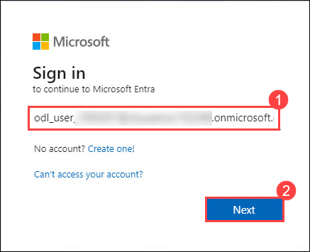

1. Now enter the following password and click on **Sign in**.

    **Password:** <inject key="AzureAdUserPassword"></inject>.

    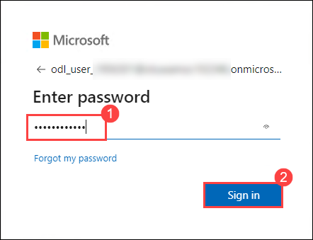

7. At the Save password prompt, select **Save & Turn on**.

8. At the Stay signed in prompt, select **No**. The Entra admin center opens.

    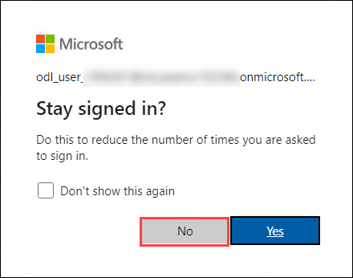

   >**Note**: If the prompt asks for **Action Required** Select **Ask later**.

9. In the Microsoft Entra admin center, in the left navigation pane, under **Entra ID (1)** click on  **Users (2)** and select **All users (3)**. On the **Users | All users** page, select **+ New user (4)** then select **Create new user (5)**.

    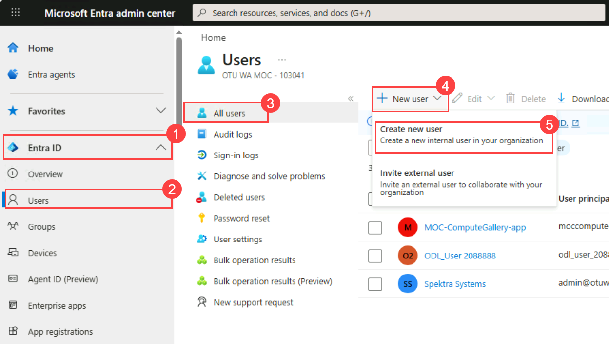

    >**Note:** Take note of the users that already exist as members of the Azure AD domain. The **On-premises sync enabled** column states **No** for all current users. This indicates that each user was created directly in Azure AD and not synchronized from an on-premises directory service.

11. On the **Create new user** page, enter the following:

    - User Principal Name: **`ereeve` (1)**
    - Display Name: **Edmund Reeve (2)**
    - Uncheck **Auto-generated password (3)**
    - Next to **Password**, enter **Pa55-w.rd! (4)**
    - Select **Next:Properties (5)** located at the bottom of the page.
 
      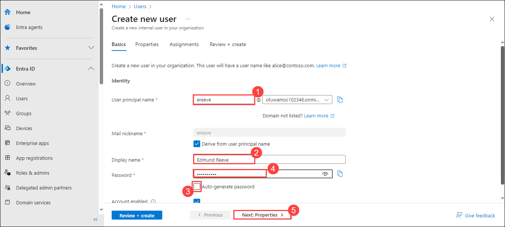

1. Under the **Properties** tab.

    - First name : **Edmund (1)**
    - Last name : **Reeve (2)**
    - User type : **Member (3)**
    - Job title : **HR Rep (4)**
    - Department : **HR (5)**

      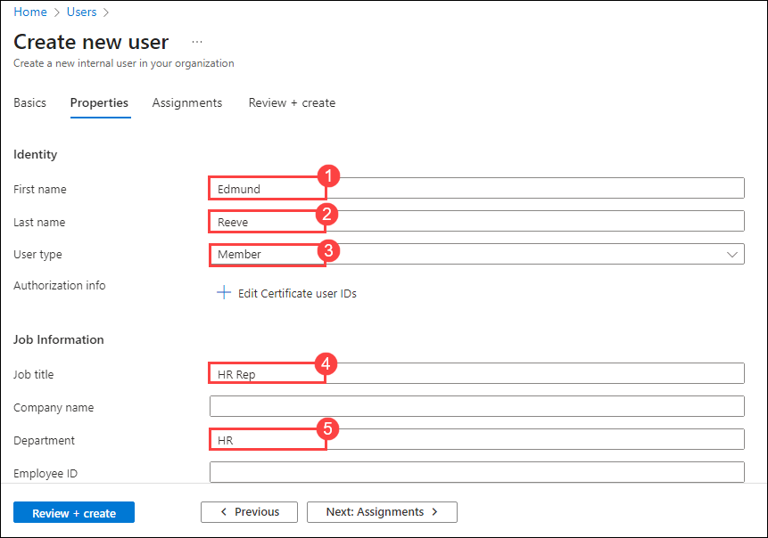

      >**Note:** The **Member** user type is the default user type. This user type is used for most users in an organization.

20. Scroll down under **Settings**, next to **Usage location**, select **United States (6)** and select **Next:Assignments (7)** located at the bottom of the page.

    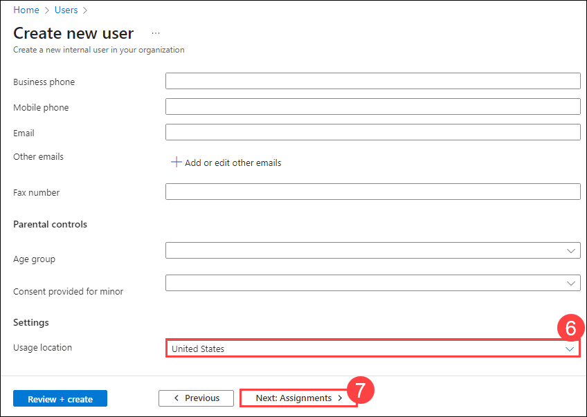

22. On the **Assignments** page, note that no assignments are selected. Then select **Next:Review + create** located at the bottom of the page.

    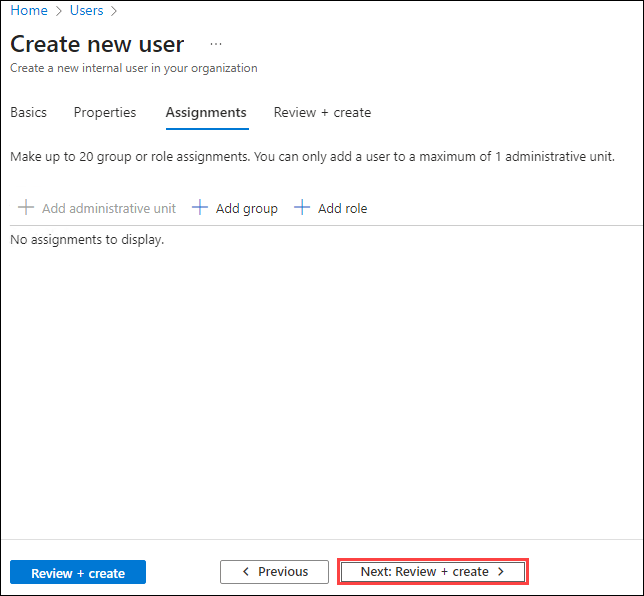

    > by default no groups are assigned to the user. This is because the user is not a member of any groups until you assign them. 

24. Select **Create**.

    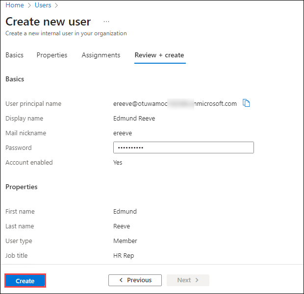

25. On the **Users | All users** page, select **New user (1)** then select **Create new user (2)**.

    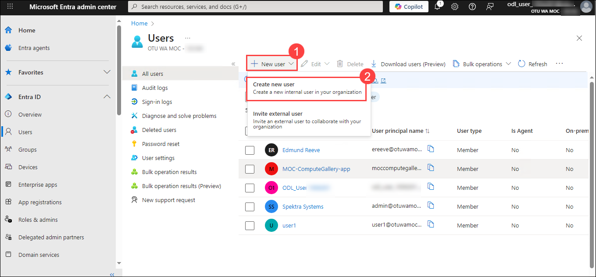

26. On the **Create new user** page, enter the following:

    - User Principal Name: **`msnider` (1)**
    - Display Name: **Miranda Snider (2)**
    - Uncheck **Auto-generated password (3)**
    - Next to **Password**, enter **Pa55-w.rd! (4)**
    - Select **Next:Properties (5)** located at the bottom of the page
     
      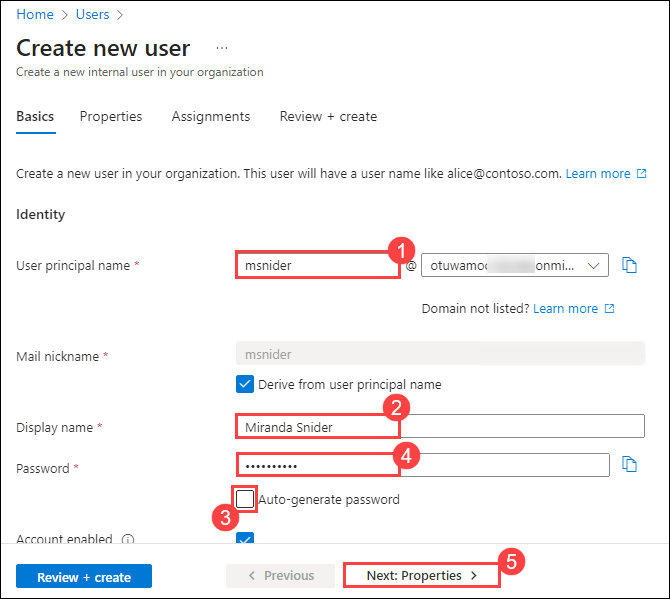

1. Under the **Properties** tab.

    - First name : **Miranda (1)**
    - Last name : **Snider (2)**
    - User type : **Member (3)**
    - Job title : **Helpdesk Manager (4)**
    - Department : **Operations (5)**

      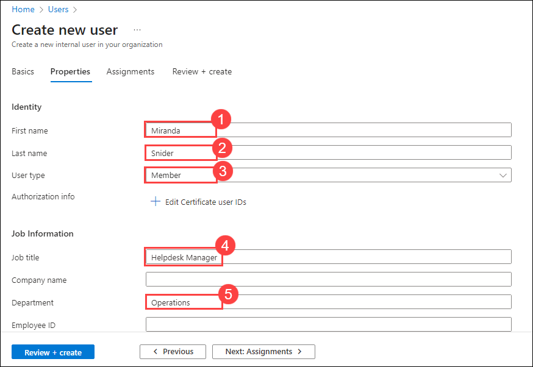

      >**Note:** The **Member** user type is the default user type. This user type is used for most users in an organization.

35. Scroll down next to **Usage location**, select **United States (6)** and select **Next:Assignments (7)** located at the bottom of the page.

    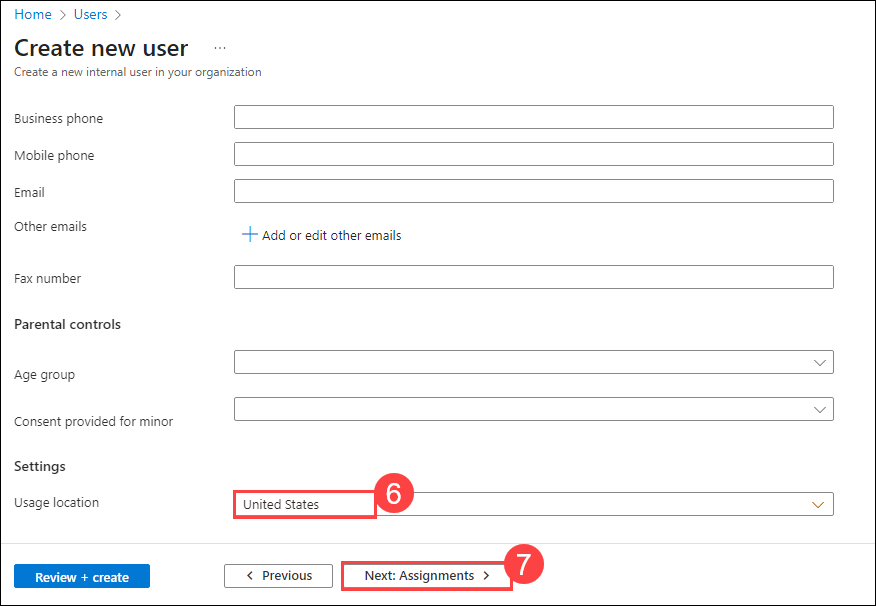

22. On the **Assignments** page, note that no assignments are selected. Then select **Next:Review + create** located at the bottom of the page.

    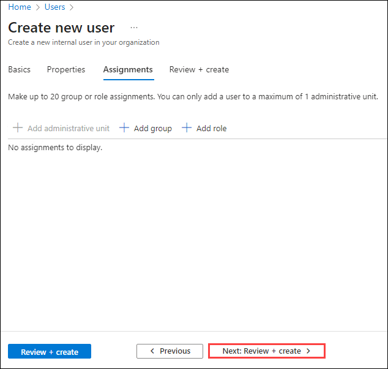

    > by default no groups are assigned to the user. This is because the user is not a member of any groups until you assign them.

39. Select **Create**.

    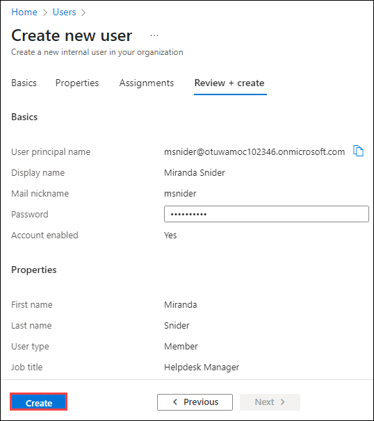

40. Minimize the **Microsoft Edge** window.

### Task 2: Disable the security defaults (Only if it set to Enabled)

1. Navigate to: **Entra ID > Overview > Properties** in the Microsoft entra admin center.

2. Select: **Manage security defaults**.

3. On the **Security defaults** side screen, if Security defaults are enabled, set them to **Disabled**.

4. From the drop-down list, select **My organization is using Conditional Access**.
Select **Save**.

    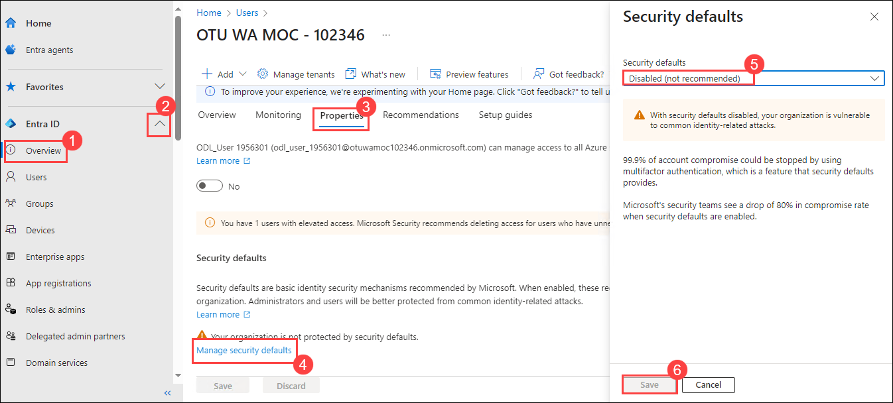

5. A pop-up will appear to confirm disabling Security defaults. Select **Disable**.

### Task 3: Create users by using Powershell

In this task, you will disable the security defaults in the Entra admin center by accessing the security settings and turning off the default security configuration.

1. On **SEA-SVR1**, On windows search bar search for **powershell (1)**. Right click on **Windows Powershell (2)** and then select **Run as Administrator (3)**.

    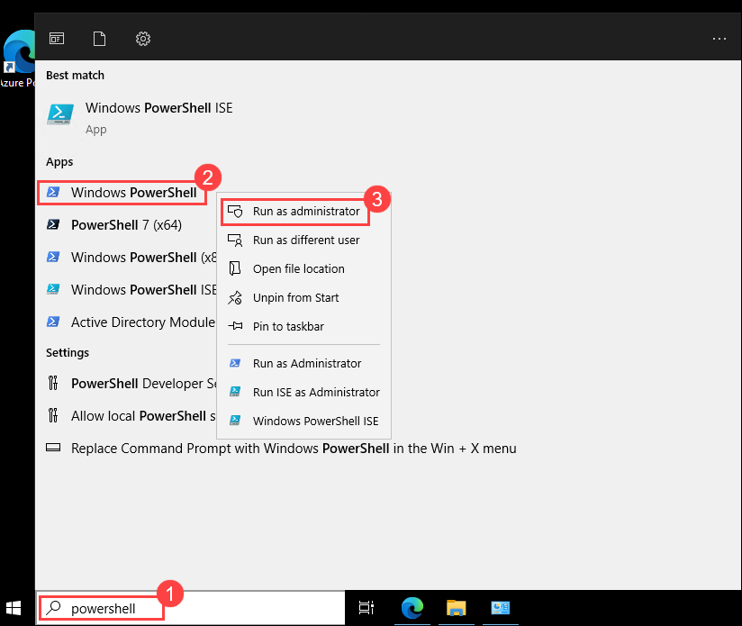

2. In the **Windows PowerShell** window, type the following command, and then press **Enter**. If prompted, enter **Y** and **A** at the NuGet and repository messages respectively:

    ```
    Install-Module Microsoft.Graph -Scope CurrentUser
    ```

    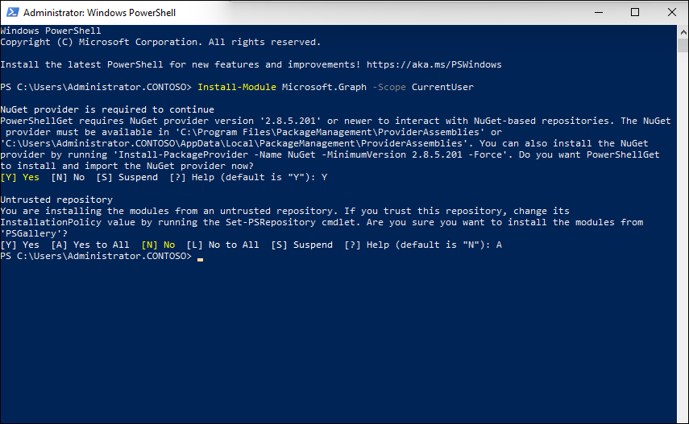

3. In the **Windows PowerShell** window, type the following command, and then press **Enter**:

    ```
    Connect-MgGraph -scopes "user.readwrite.all, group.readwrite.all"
    ```

4. Select **Work or school account** and click **continue** on **Let's get you sign in page**

    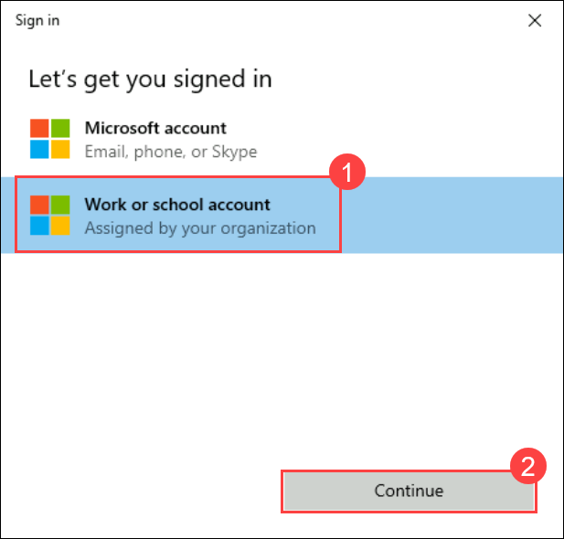

1. A new tab in **Microsoft Edge** will appear prompting you to sign in. In the **Sign in to your account** dialog box, sign in as **<inject key="AzureAdUserEmail"></inject>** with the tenant password, and then select **Sign in**.

    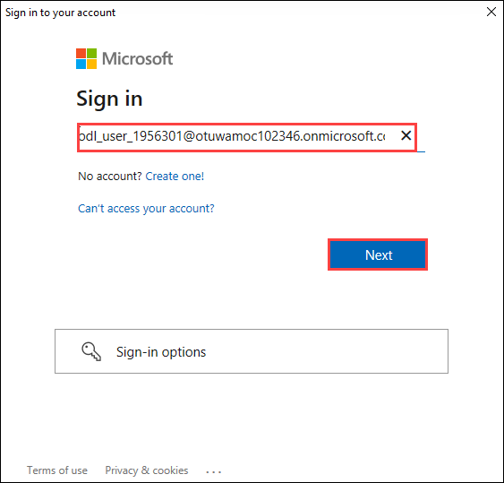

    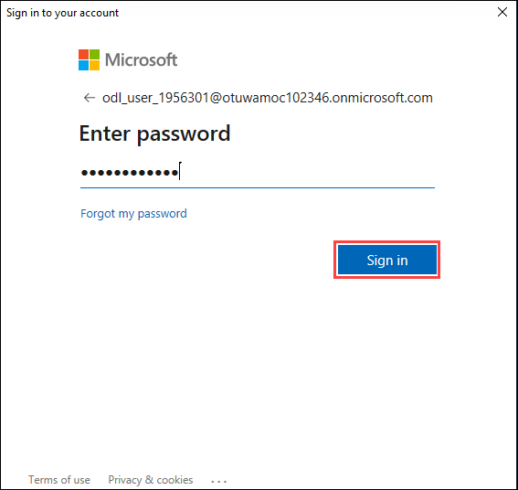

   > **Note** - If the account already exists then click on it.

6. On the **Permissions Requested** prompt that appears, check **Consent on behalf of your organization** and then select **Accept**.

    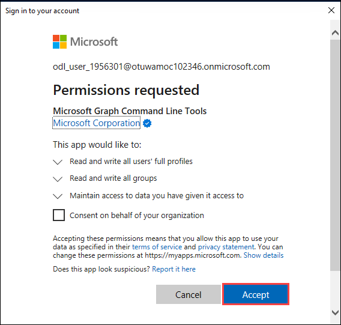

7. Close out of the **Authentication complete** tab and then minimize **Microsoft Edge**

8. Back In the **Windows PowerShell** window, type the following code to create a new profile object, and then press **enter**. Replace **Pa55-w.rd!** with a complex password of your choice:

   >**Note**: Copy paste the Commands on notepad before pasting it in the powershell to avoid mistakes.

    ```
    $PWProfile = @{
      Password = "Pa55-w.rd!";
      ForceChangePasswordNextSignIn = $false
    }
    ```

9. Next, type the following code to create a new user, and then press **Enter**. Be sure to replace **yourtenant** with your assigned tenant name:

    ```
    New-MgUser `
        -DisplayName "Cody Godinez" `
        -GivenName "Code" -Surname "Godinez" `
        -MailNickname "cgodinez" `
        -UsageLocation "US" `
        -UserPrincipalName "cgodinez@yourtenant.onmicrosoft.com" `
        -PasswordProfile $PWProfile -AccountEnabled `
        -Department "Sales" -JobTitle "Sales Rep"
    ```
    
    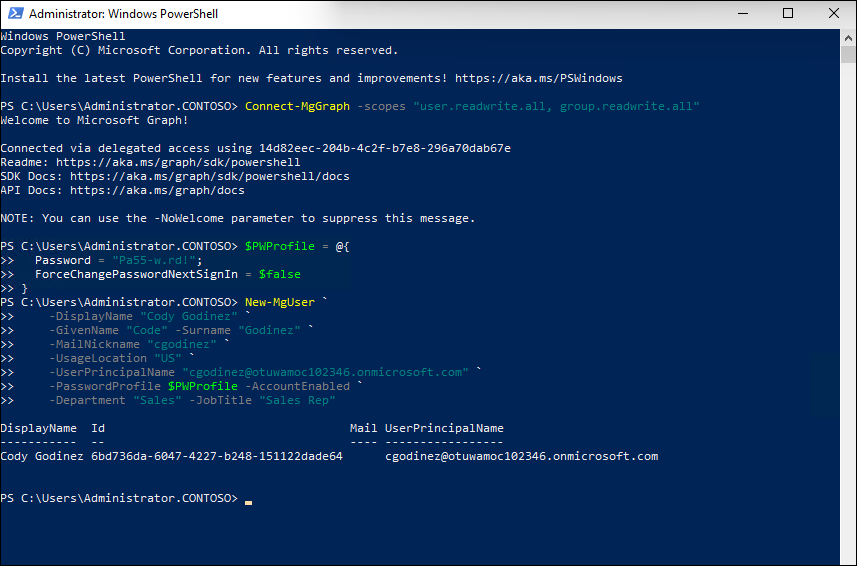


    ```
    New-MgUser `
        -DisplayName "Allan Deyoung" `
        -GivenName "Allan" -Surname "Deyoung" `
        -MailNickname "alland" `
        -UsageLocation "US" `
        -UserPrincipalName "AllanD@yourtenant.onmicrosoft.com" `
        -PasswordProfile $PWProfile -AccountEnabled `
        -Department "Accounting" -JobTitle "Accountant"
    ```

   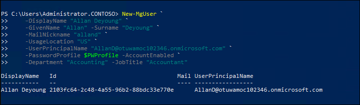

    ```
    New-MgUser `
        -DisplayName "Joni Sherman" `
        -GivenName "Joni" -Surname "Sherman" `
        -MailNickname "jonis" `
        -UsageLocation "US" `
        -UserPrincipalName "JoniS@yourtenant.onmicrosoft.com" `
        -PasswordProfile $PWProfile -AccountEnabled `
        -Department "Marketing" -JobTitle "Marketing head"
    ```
 
    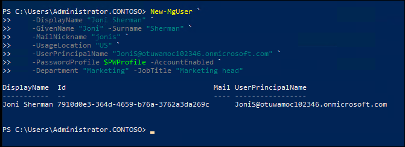
  
    ```
    New-MgUser `
        -DisplayName "Alex Wilber" `
        -GivenName "Alex" -Surname "Wilber" `
        -MailNickname "alexw" `
        -UsageLocation "US" `
        -UserPrincipalName "AlexW@yourtenant.onmicrosoft.com" `
        -PasswordProfile $PWProfile -AccountEnabled `
        -Department "Support" -JobTitle "Support Executive"
    ```    
   
    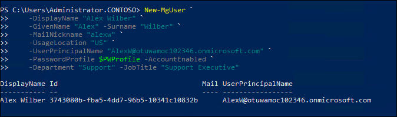

10. To confirm that the users was created, In the **PowerShell** window, type the following command and then press **Enter**:

    ```
    Get-MgUser
    ```

    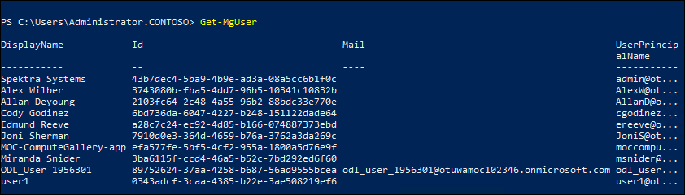

    >**Note:** Verify that the list of users from your tenant is displayed. Also take note of which users have a license assigned. Any user with the **isLicensed** value of **False** has not been assigned a license.

**Results**: After completing this exercise, you will have successfully created new user accounts in Entra ID.

## Exercise 2: Assigning Administrative Roles in Entra ID

### Scenario

You need to review and modify the current administrative roles for your tenant.

You have been provided a list of users should have administrative roles assigned as indicated in the following table.  

| Name           | Must be able to:                         | Administrative Role needed: |
| -------------- | ---------------------------------------- | --------------------------- |
| Allan Deyoung  | Manage the tenant                        | Global administrator        |
| Edmund Reeve   | Manage users, group, and password resets | User administrator          |
| Miranda Snider | Manage password resets                   | Helpdesk administrator      |

### Task 1: Review and Assign Administrative Roles

In this task, you will review different administrative roles in Entra ID and assign the correct roles to specific users, such as Global Administrator, User Administrator, and Helpdesk Administrator.

1. On SEA-SVR1, switch to Microsoft Edge.

2. In the **Microsoft Entra admin center**, in the Navigation pane, expand **Entra ID (1)** click on Show more Select **Roles & admins (2)**. In **All roles (3)** tab, using the search box, search for **Global administrator**. Select **Global administrator (4)** (select the name, not the checkbox).

    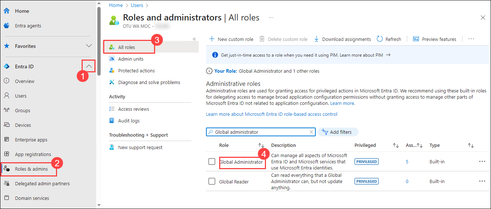

6. In the **Assignments** pane, select **Add assignments** and select **Allan Deyoung (1)** and select **Add (2)**. go back to the role assignment section by clicking on the cancel **X** on top right side.

    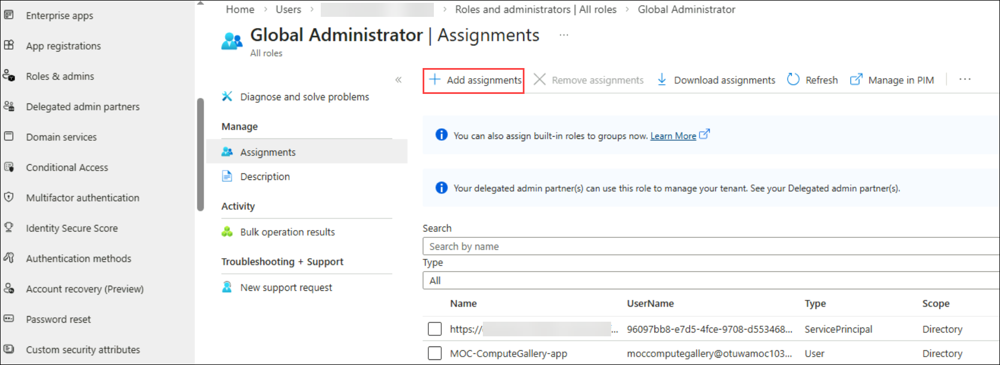

    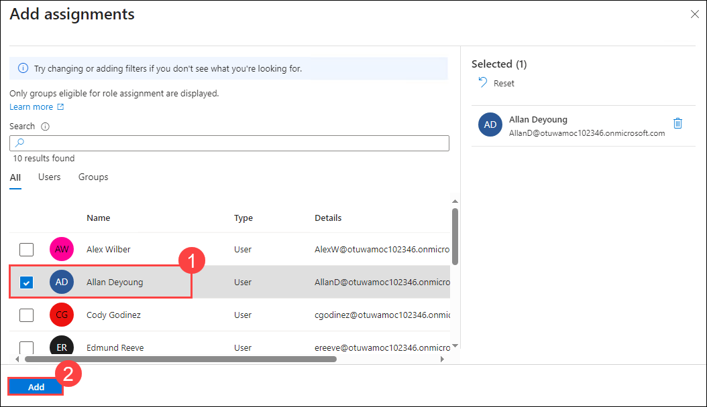

8. In **Roles and administrators|All roles** using the search box, search for **User administrator**. Select **User administrator**

    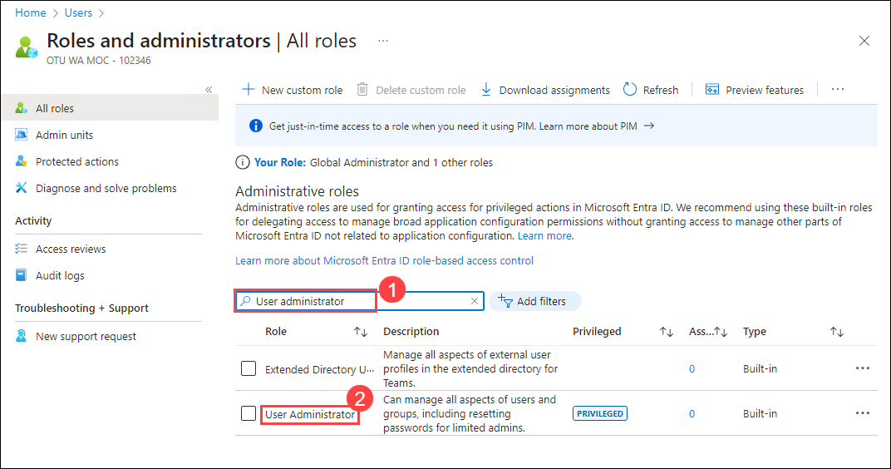

12. In the **User administrator** pane, select **Add assignments**.

    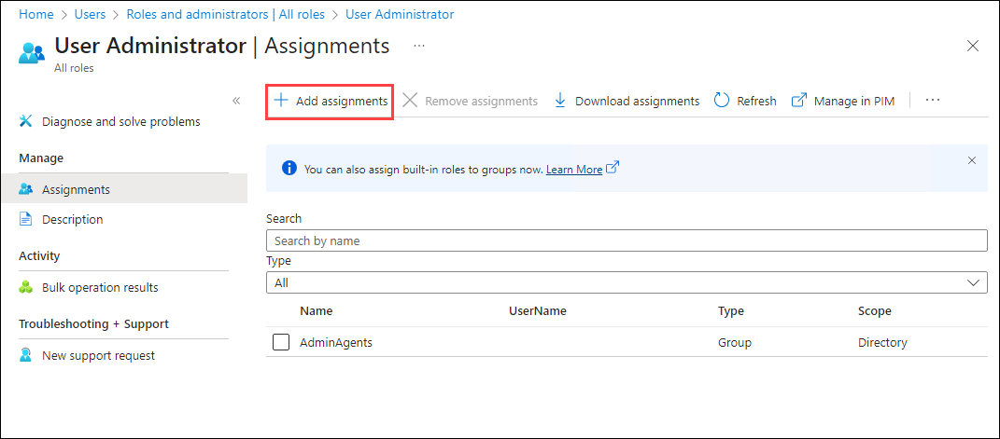

13. In the **Add assignments** pane, search for and select **Edmund Reeve** and select **Add**.

    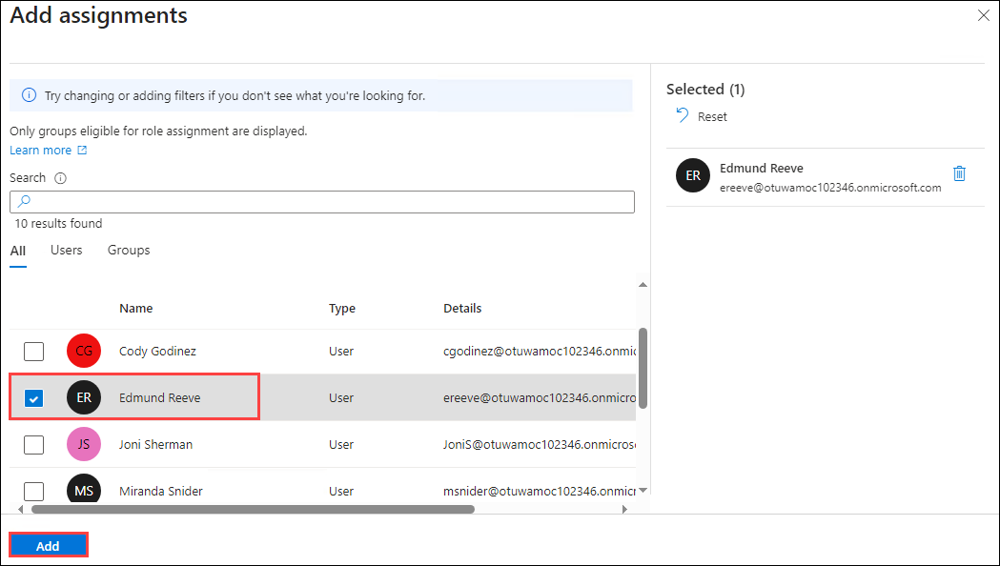

15. In the navigation breadcrumbs, select **Roles & administrators | All roles**.

16. Using the search box, search for **Helpdesk administrator (1)** and select **Helpdesk administrator (2)**.

    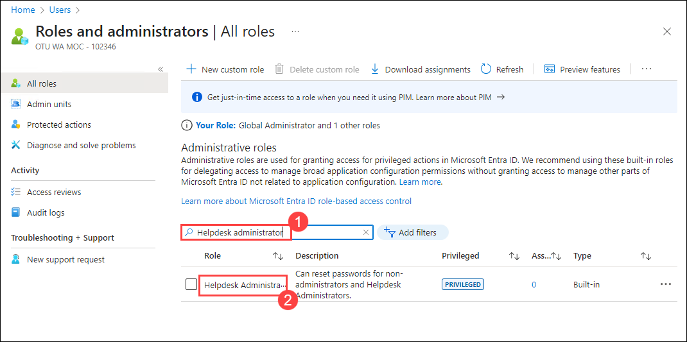

18. In the **Helpdesk administrator** pane, select **Add assignments**.

    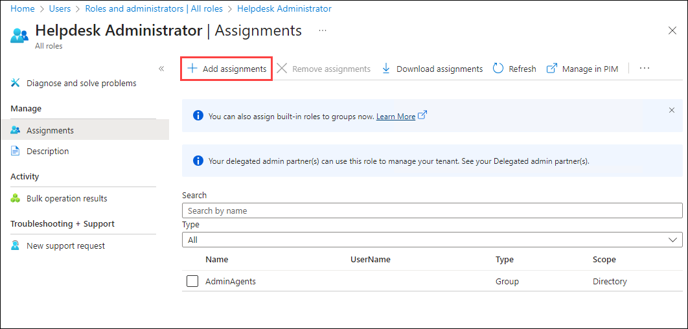

19. In the **Add assignments** pane, search for and select **Miranda Snider** and select **Add**

    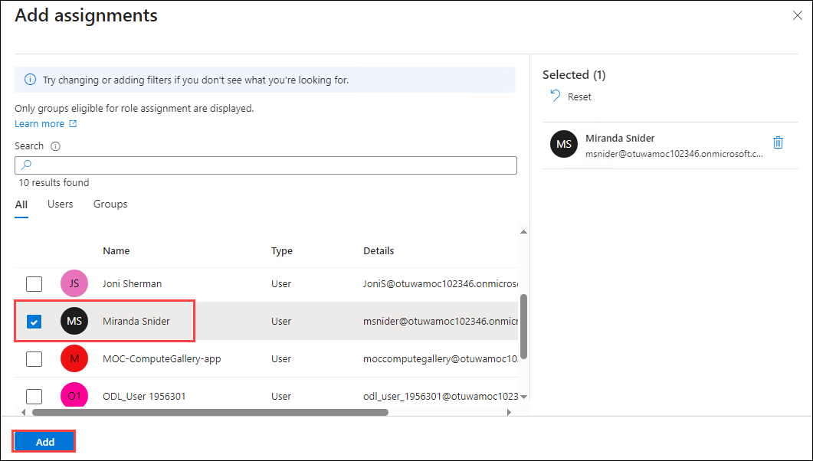

21. In the navigation pane, select **Home**.

**Results**: After completing this exercise, you should have successfully assigned administrative roles to users.

## Exercise 3: Creating and managing groups and validating license assignment

### Scenario

You need to add the three new users to a Security group and assign licenses as indicated in the following table.  

| Name           | Member of:       | License to assign                                            |
| -------------- | ---------------- | ------------------------------------------------------------ |
| Edmund Reeve   | Contoso_Managers | Office 365 E5, Enterprise Mobility + Security E5 via group membership |
| Miranda Snider | Contoso_Managers | Office 365 E5, Enterprise Mobility + Security E5 via group membership |
| Cody Godinez   | Contoso_Sales    | Office 365 E5, Enterprise Mobility + Security E5 via group membership direct assignment |
| Allan Deyoung  | Contoso_Admins | Office 365 E5, Enterprise Mobility + Security E5 via group membership |
| Alex Wilber  | Contoso_Admins | Office 365 E5, Enterprise Mobility + Security E5 via group membership |

You also been asked to modify the Company branding for the sign-in page.

### Task 1: Create groups by using the Microsoft Entra admin center

In this task, you will create security groups in the Entra admin center and add the appropriate users to each group.

1. On **SEA-SVR1**, in the Microsoft Entra admin center, in the navigation pane, select **Entra ID > Groups** > **All groups**. and select **New group**

    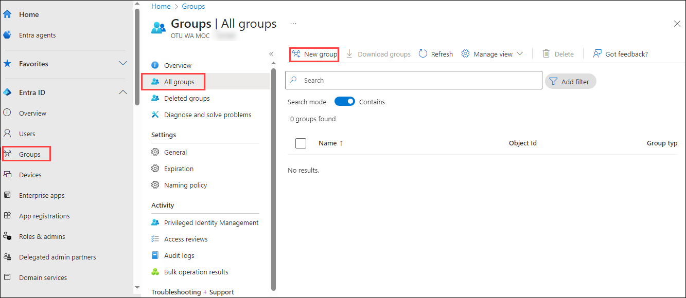

3. On the **New Group** page, enter the following:

    - Group type: **Security (1)**
    - Group name: **Contoso_Managers (2)**
    - Membership type: **Assigned (3)**
    - Members : click on **No members selected (4)**

      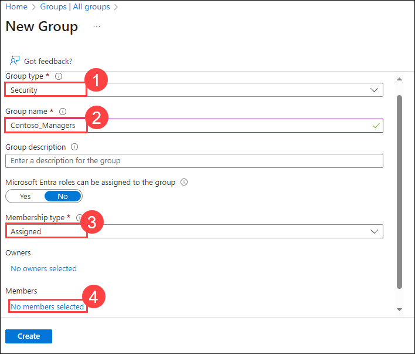

5. In the Add members page add **Edmund Reeve and** **Miranda Snider** **(5)**, and then click **Select (6)**.

    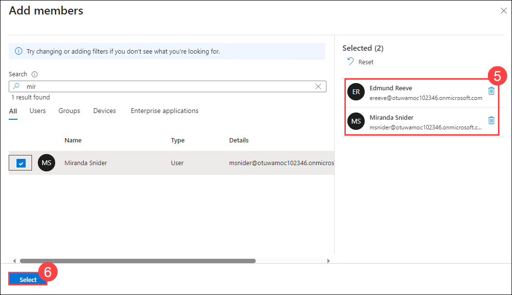

6. Select **Create**.

    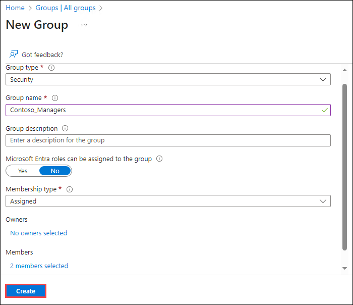

1. Back in **Groups|All groups (1)** tab, select **New group (2)**.

    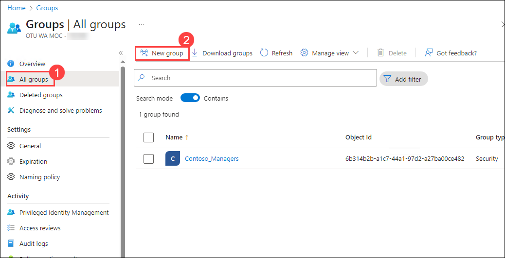

3. On the **New Group** page, enter the following:

    - Group type: **Security (1)**
    - Group name: **Contoso_Admins (2)**
    - Membership type: **Assigned (3)**
    - Members : click on **No members selected (4)**

      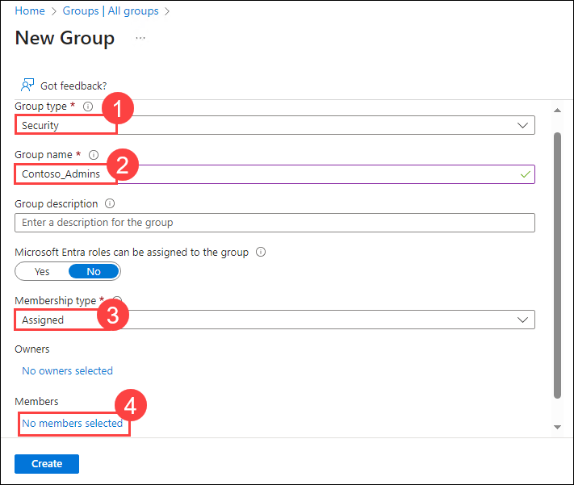

5. In the Add members page add **Allan Deyoung and** **Alex Wilber**, and then click **Select**.

    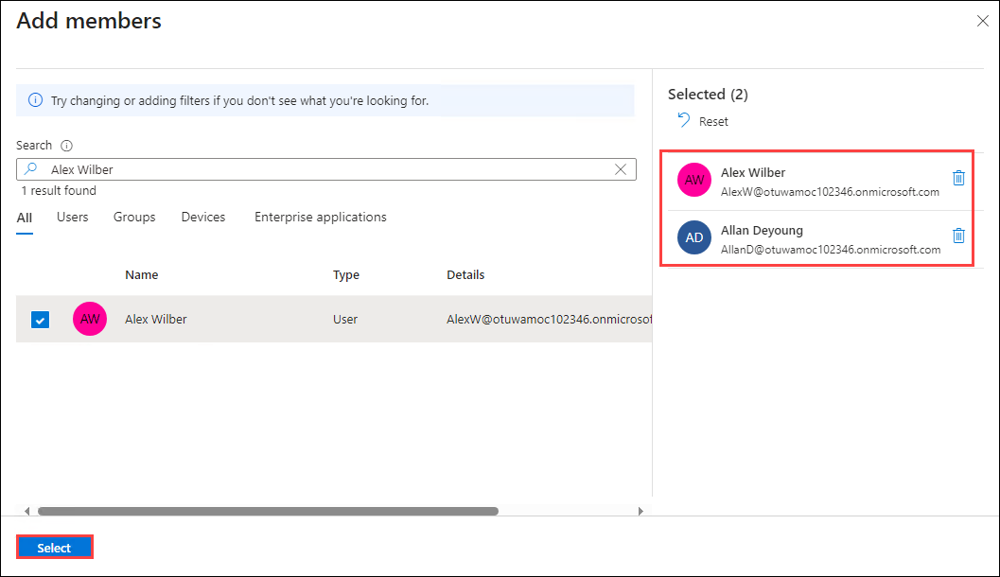

6. Select **Create**.

    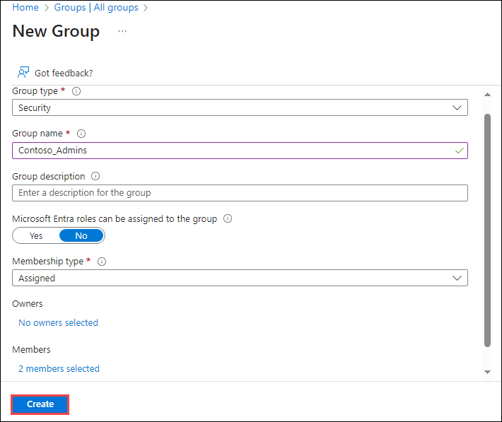

### Task 2: Create groups by using PowerShell

In this task you will use PowerShell to create a new security group, find it, and add a user to the group by running Microsoft Graph PowerShell commands.

1. On SEA-SVR1, switch to Windows PowerShell.

2. In the **Windows PowerShell** window, type the following code to create a new group, and then press **Enter**:

    ```
    New-MgGroup -DisplayName “Contoso_Sales” -Description “Contoso_Sales_team_users” -MailEnabled:$false -Mailnickname "Contoso_Sales" -SecurityEnabled
    ```

    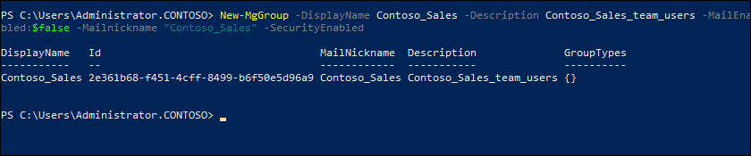

3. In the **Windows PowerShell** window, type the following command, and then press **Enter**:

    ```
    Get-MgGroup
    ```

    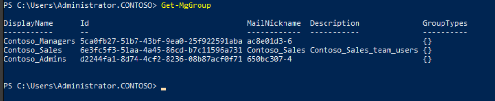

4. Verify that you get the list of groups in your tenant, including the Contoso_Sales group you just created.

5. In the **Windows PowerShell** window, type the following code to define a variable as the Contoso_Sales group, and then press **Enter**:

    ```
    $group = Get-MgGroup | Where-Object {$_.DisplayName -eq "Contoso_Sales"}
    ```

6. In the **Windows PowerShell** window, type the following code to define another variable as the user, and then press **Enter**:

    ```
    $user = Get-MgUser | Where-Object {$_.DisplayName -eq "Cody Godinez"}
    ```

7. In the **Windows PowerShell** window, type the following code to add Cody to Contoso_Sales using set variables, and then press **Enter**:

    ```
    New-MgGroupMember -GroupId $group.Id -DirectoryObjectId $user.Id
    ```

8. In the **Windows PowerShell** window, type the following code, and then press **Enter**:

    ```
    Get-MgGroupMember -GroupId $group.Id | FL
    ```

    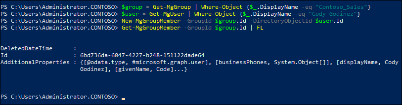

9. Verify that you see **Cody Godinez** as value in **AdditionalProperties**.

10. Close PowerShell.

### Task 3: Review licenses

In this task you will review available licenses, customize the sign-in page branding, and assign Microsoft 365 and EMS E5 licenses to users and groups using both the Entra admin center and the Microsoft 365 admin center.

1. In the Microsoft Entra admin center, in the navigation pane, select **Billing (1)** > **Licenses (2)**.

    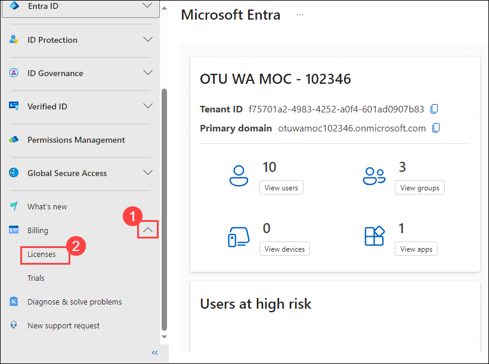

2. On the **Licenses|Overview** page, under **Manage**, select **All products (1)**.Take note of the current licenses available and assigned for **Enterprise Mobility + Security E5** and **Office 365 E5** **(2)**.

    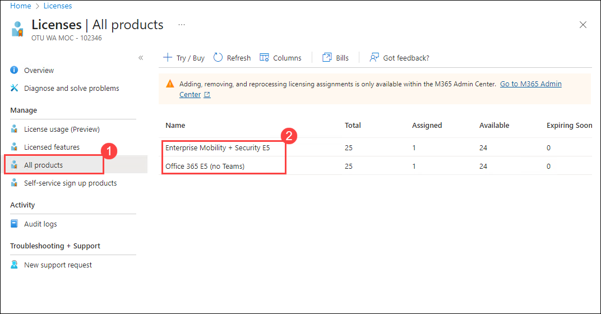

3. In the Microsoft Entra admin center, in the Navigation pane, select **Entra ID** and click on **Company branding (1)**. On the **Company Branding** page, under **Default sign-in experience (2)**, select **Customize (3)**

    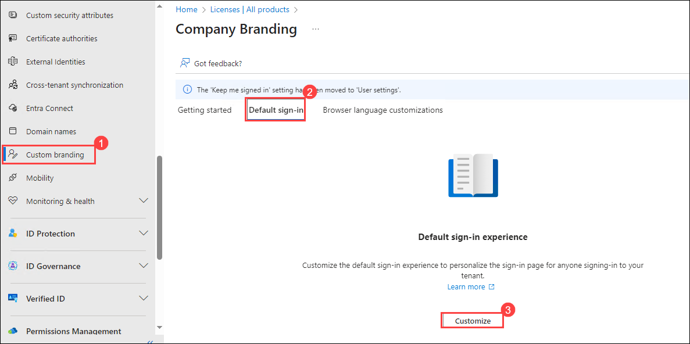

5. On the **Customize default sign-in experience** page, navigate to the **Sign-in form** tab and configure the following settings:

    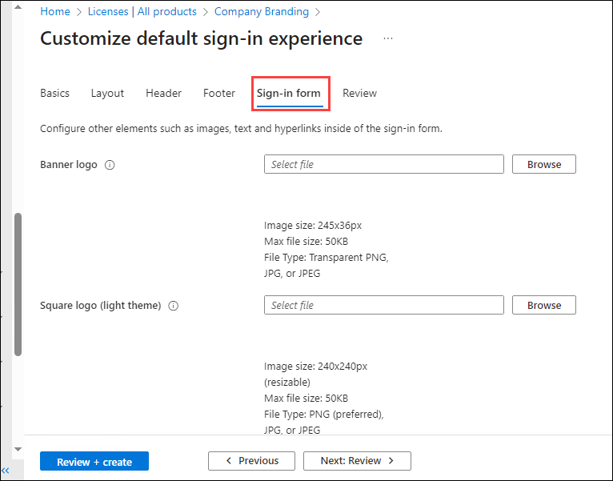

   - Sign-in page text: **Contoso Corp. Sign-in Page (1)**

    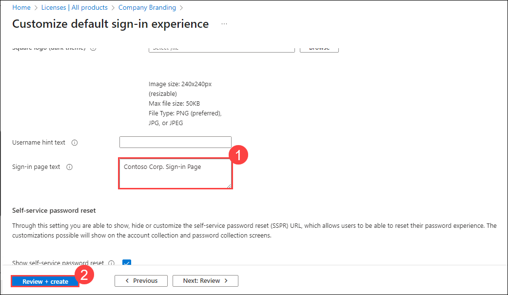

6. Select **Review + Create (2)**, review the settings and then select **Create**.

7. In the Microsoft Entra admin center, in the Navigation pane, select **Entra ID > Users** > **All users**.

    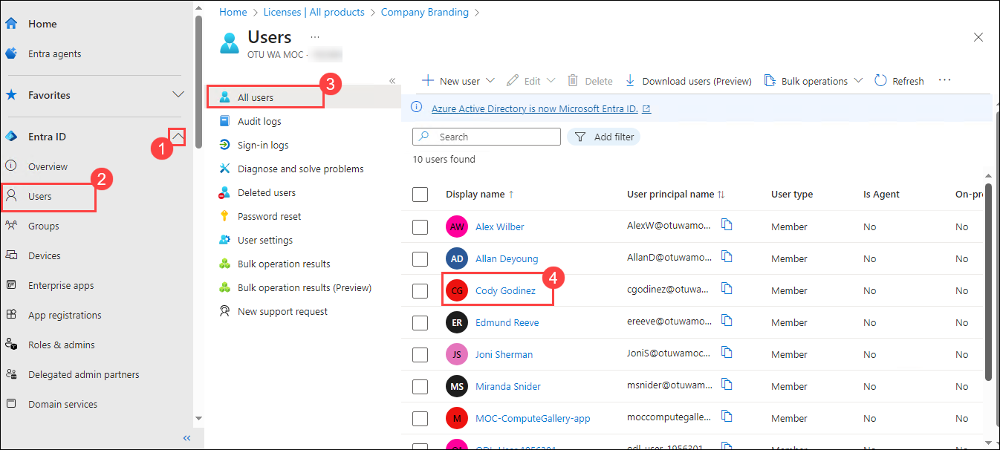

8. In the user list, select **Cody Godinez**.

9. In the Cody Godinez Profile page, under Manage, select **Licenses**.

   >**Note:**Notice that Cody does not have any current license assignments. And that licensing must now be performed in the 365 Admin center.

1. Open a new tab in **Microsoft Edge**, in the address bar, enter **https://admin.microsoft.com**.

    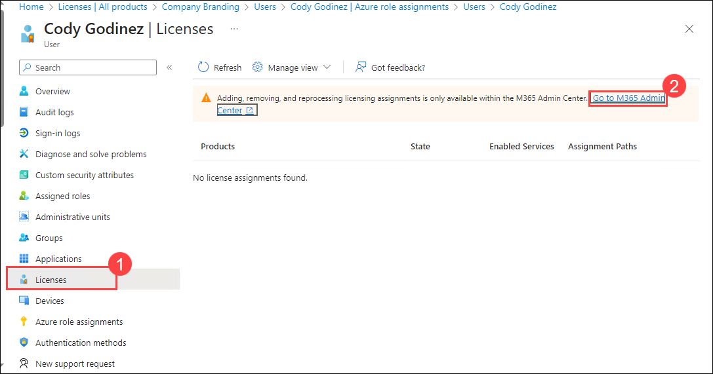

1. In the navigation pane on the left, select **Users** > **Active users**. In the user list, select **Cody Godinez** (select the name, not the checkbox).

    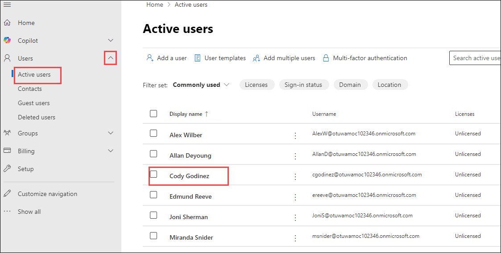

1. Select the **Licenses and apps (1)** tab. Select the check boxes next to **Enterprise Mobility + Security E5** and **Office 365 E5 (no Teams) (2)** and click on **Save changes (3)**.

    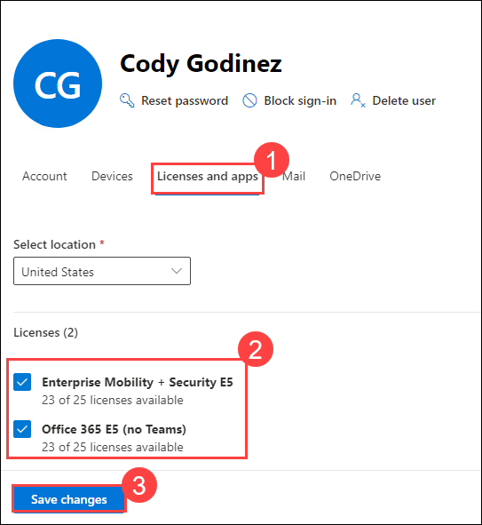

1. Once the changes have been saved, select the **X** in the upper-right corner to close the **Cody Godinez** pane. 

1. In the Microsoft 365 admin center, in the Navigation pane, select **Billing (1)** > **Licenses (2)**. In the **Subscriptions** list, select **Enterprise Mobility + Security E5 (3)**.

    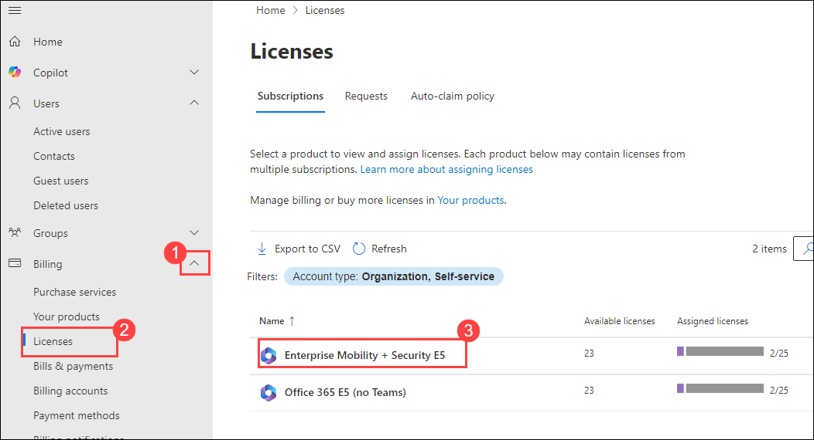

1. Select the **Groups** tab, and then select **+ Assign licenses**.

    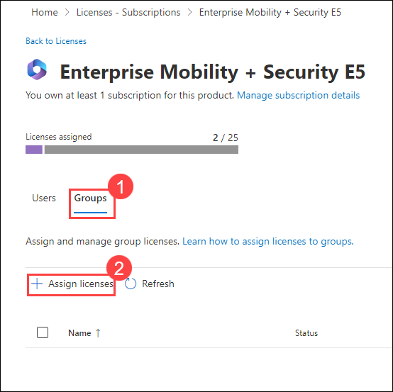

1. Navigate into the **Enter a group name** textbox, and select the **Contoso_Managers** and **Contoso_Admins** group.

1. Select **Assign**.

    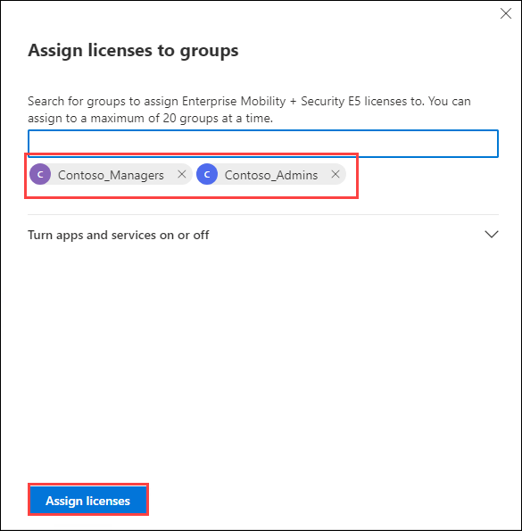

1. On the **You assigned licenses to 2 groups** pane, select the **X** in the upper-right corner to close it.

1. In the upper-left corner of the **Enterprise Mobility + Security E5** page, select the **Back to licenses** link.

1. In the **Subscriptions** list, select **Office 365 E5 (no Teams)**.

    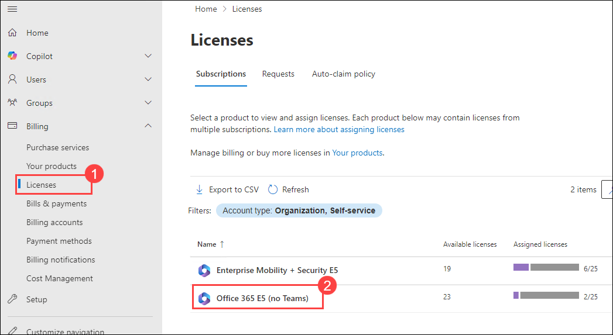

1. Select the **Groups (1)** tab, and then select **+ Assign licenses (2)**.

    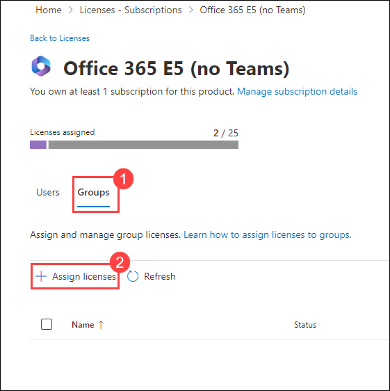

1. Navigate into the **Enter a group name** textbox, and select the **Contoso_Managers** and **Contoso_Admins** group.

1. Select **Assign**.

    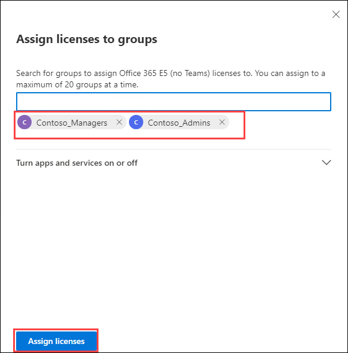

1. On the **You assigned licenses to 2 groups** pane, select the **X** in the upper-right corner to close it.

    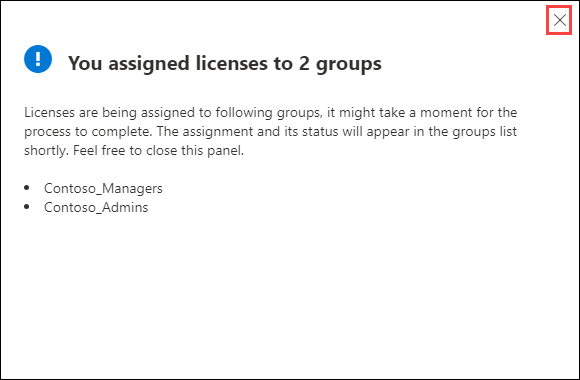

1. In the Microsoft 365 admin center, in the Navigation pane, select **Billing** > **Licenses**. In the **Subscriptions** list, select **Office 365 E5 (no Teams)**.

   >**Note:** Take note of the users that are assigned the Office 365 E5 license. Notice the Assignment Paths column which indicates how license assignment is configured for each user. Edmund and Miranda both receive their license assignment from their membership in the Contoso_Managers group. Allan and Alex both receive heir license assignment from their membership in the Contoso_Admins group. You may need to select **Refresh** a couple of times to update the Assignment path column.

22. Close Microsoft Edge.

**Results**: After completing this exercise, you should have successfully created and managed groups, modified company branding, and assigned licenses.

**END OF LAB**
