# Lab 03: Configuring and managing Entra Join

## Summary

In this lab, you will configure Azure AD Join settings and perform both standard and hybrid Azure AD join scenarios for Windows devices.

> **!IMPORTANT**: Once you launch the track, you’ll have access to a virtual machine (VM) for **40 hours**. The displayed track duration of **4 days 8 hours (104 hours)** indicates the time frame during which you can use your VM. Please plan your lab sessions accordingly. If the VM uptime of **40 hours** is fully exhausted before completing the labs, access will be lost. To avoid this and for detailed instructions on VM usage and stopping/deallocating the VM, refer to the Getting Started page.  

> If the full 40 hours of VM uptime is exhausted, the VM will no longer be accessible, and **the lab duration cannot be extended**.

### Prerequisites

To following lab(s) must be completed before this lab:

- 0102-Synchronizing Identities by using Microsoft Entra Connect

  > Note: You will also need a mobile phone that can receive text messages used to secure Windows Hello sign in authentication to Azure AD.

## Exercise 1: Configuring Entra Join

### Scenario

You need to configure Entra ID device settings to ensure that all users are allowed to join devices to Entra ID. You also need to ensure that users can only join a maximum of 20 devices and that Allan Deyoung is added as a local administrator on all Entra joined devices. Finally, you will verify that Entra join works as expected by having Joni Sherman join SEA-WS1 to the tenant.

### Task 1: Configure Entra join Device settings

In this task you will configure device settings in Entra ID, allow users to join devices, set the device limit, add a device administrator, and enable SMS authentication.

1. On **SEA-SVR1**, if necessary, sign in as **Contoso\\Administrator** with the password of **Pa55w.rd** and close Server Manager.

    

    > **Note :** If you’re unable to switch the VM from the dropdown menu, you can also access the VM directly from the desktop of your Host VM.

    

    

2. On the taskbar select **Microsoft Edge**, in the address bar type **https://entra.microsoft.com**, and then press **Enter**.

3. Sign in as user **<inject key="AzureAdUserEmail"></inject>**, and use the tenant Admin password **<inject key="AzureAdUserPassword"></inject>**, If the **Stay signed in?** prompt appears, select **No**. 

   > The Microsoft Entra admin center opens.

4. In the Microsoft Entra admin center, in the navigation pane, expand **Entra ID (1)**. Select **Devices (2)** and select **All devices (3)**. 

    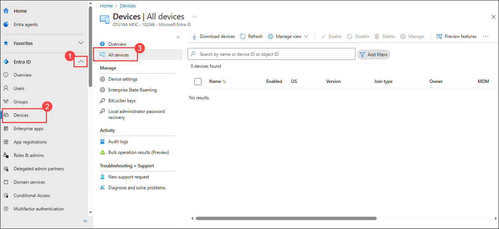

   > Notice that there are no devices found, as you have not joined any devices yet.

6. On the **Devices | All devices** page, On the left menu select **Device settings (1)**.On the **Devices|Device settings** page, in the details pane, under **Users may join devices to Microsoft Entra**, verify that **All (2)** is selected. On the **Devices|Device settings** page, in the details pane, under **Users may join devices to Microsoft Entra**, verify that **All (2)** is selected.

    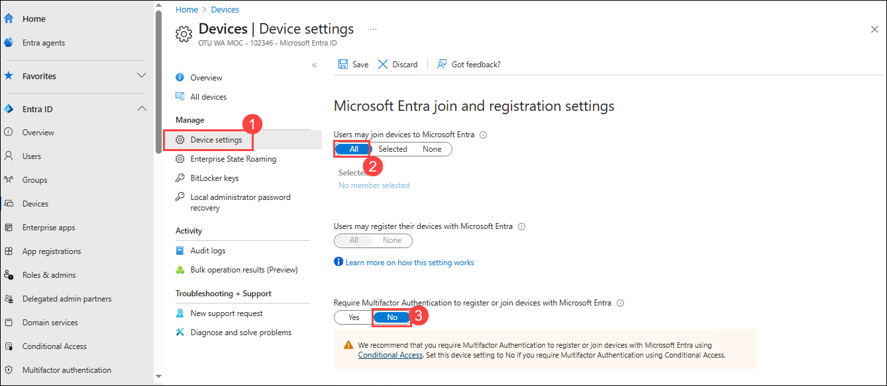

   > This indicates that all Entra users are permitted to join Windows 10 or newer devices to Microsoft Entra. Note that this setting does not apply to hybrid Entra joined devices, or devices joined by using Windows Autopilot self-deployment mode.

9. In the **Maximum number of devices per user** section, select **20 (4)**. Then under **Local administrator settings**, select **Manage Additional local administrators on all Entra joined devices (5)**. The Device Administrators page opens.

    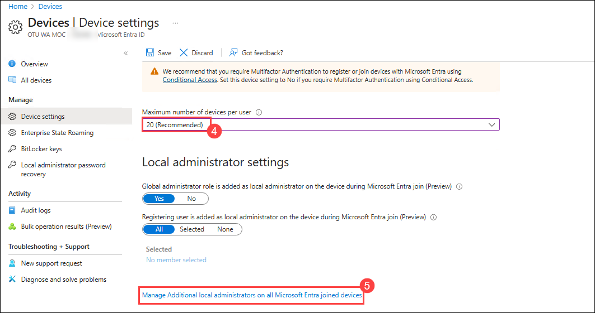

11. In the Device Administrators page, select **+ Add assignments**.

    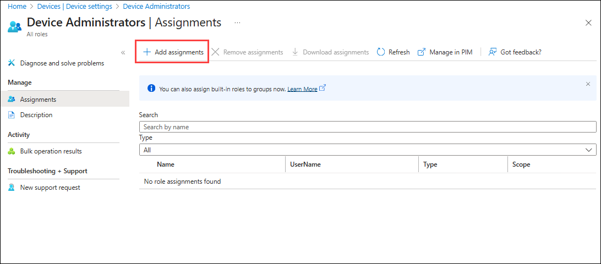

12. In the Search box, enter **Allan Deyoung**, select the **Allan Deyoung (1)** user object, and then select **Add (2)**. 

    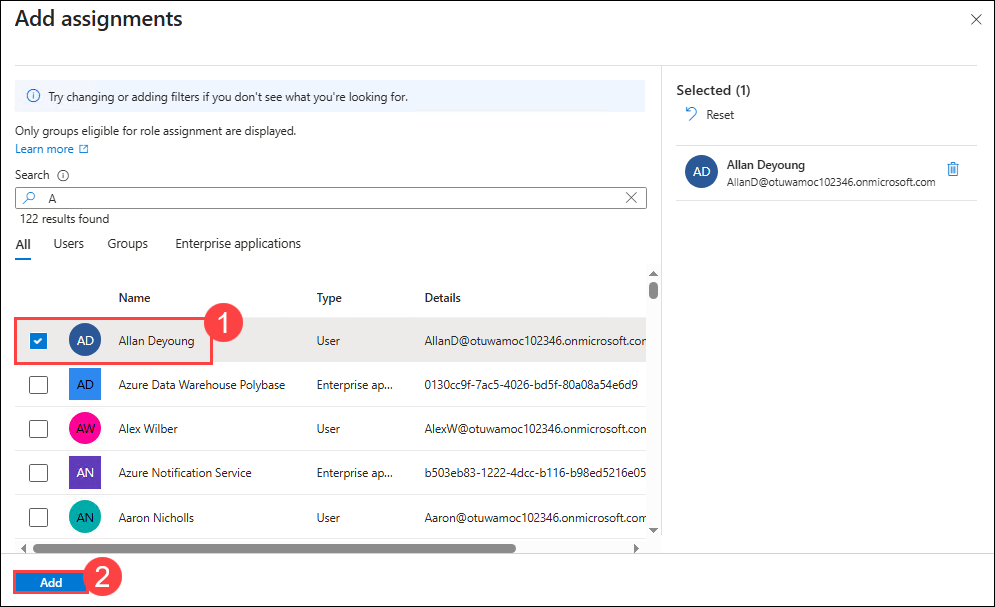

    > Allan Deyoung will now be added as a Device Administrator on all Entra joined devices.

13. In the navigation breadcrumbs, select the **Devices | Device settings** link at the top of the page.

    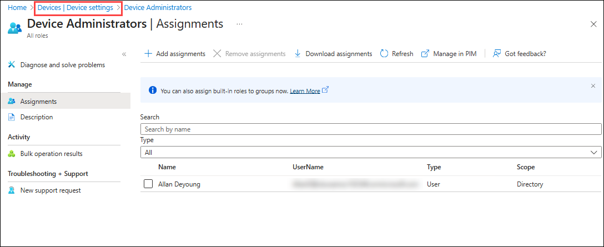

14. On the Device settings page, select **Save**.

    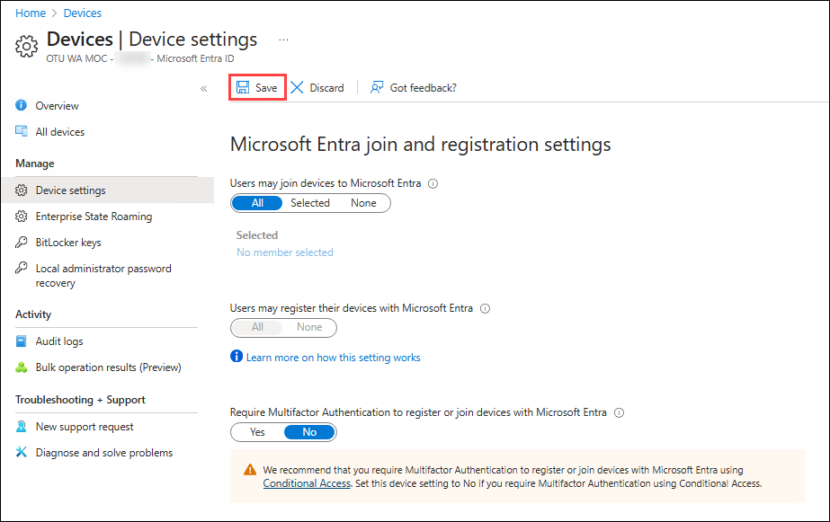

15. In the Microsoft Entra admin center, in the navigation pane, expand **Entra ID** select **Authentication methods** then navigate to **Policies** under Manage then select **SMS**

    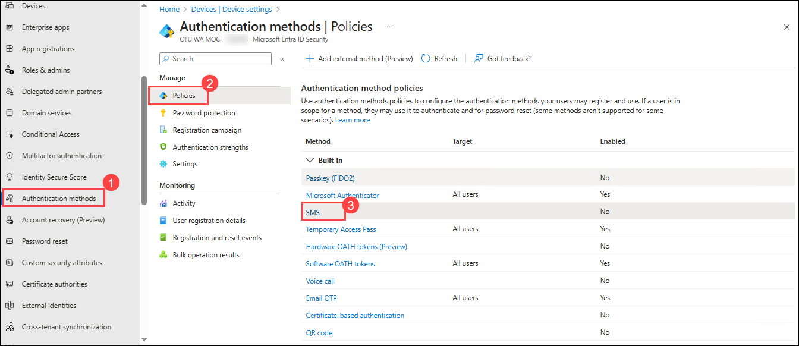

18. Select **Enable (2)**. At the bottom of the page, select **Save (3)**.

    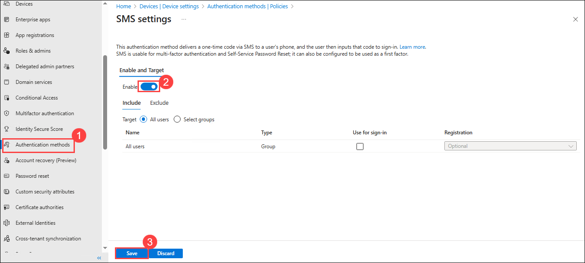 

### Task 2: Perform an Entra Join

In this task you will join the SEA-WS1 computer to Entra ID using a user account.

1. Switch to **HOSTVM** and sign in to **SEA-WS1** VM through desktop shortcut as **Admin** with the password of **Pa55w.rd**.

   

2. On the taskbar, select **Start (1)** and then select **Settings (2)**.

    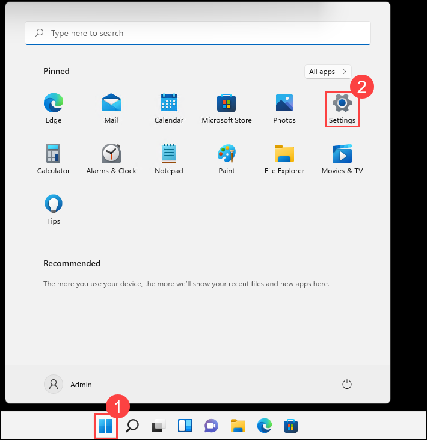 

3. In the **Settings** window, select **Accounts (1)**. On the Accounts page, select **Access work or school (2)**.

    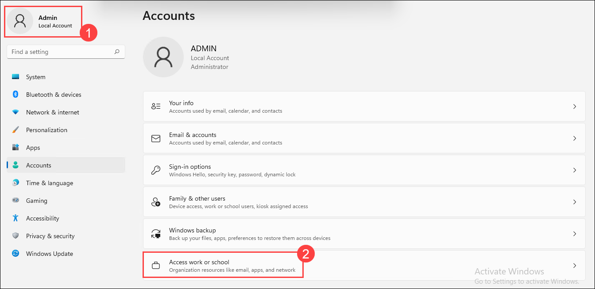 

5. In the **Access work or school** page, select **Connect**.

    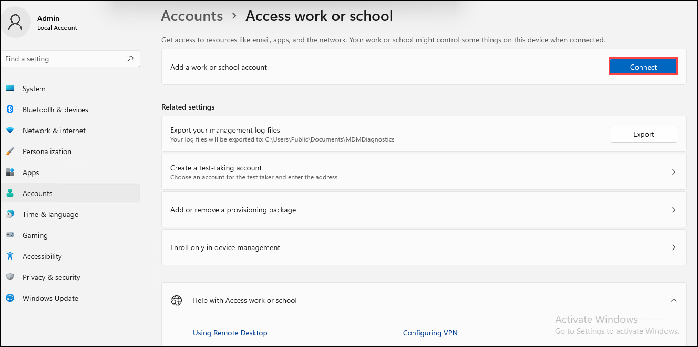 

6. In the **Microsoft account** window, select **Join this device to Entra ID**.

    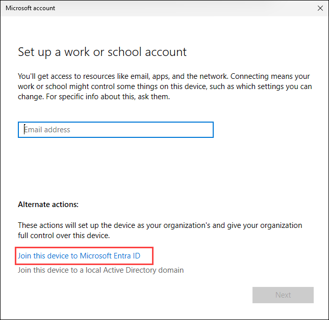 

7. On the **Sign in** page, type **`JoniS@yourtenant.onmicrosoft.com`** and then select **Next**.

    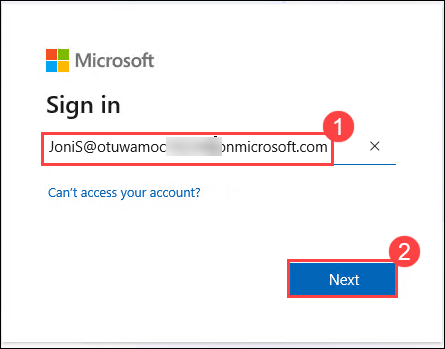 

   >**Note**: Replace **"yourtenant"** with your Tenant Name

9. On the **Enter password** page, enter the user password provided i.e **Pa55-w.rd!**  and then select **Sign in (2)**.

    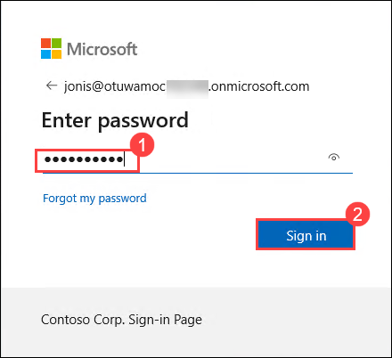 

10. On the **Make sure this is your organization** dialog box, select **Join**.

    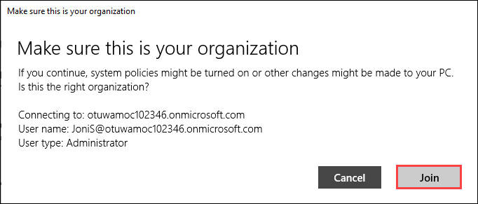 

11. On the **You're all set!** page, select **Done**.

    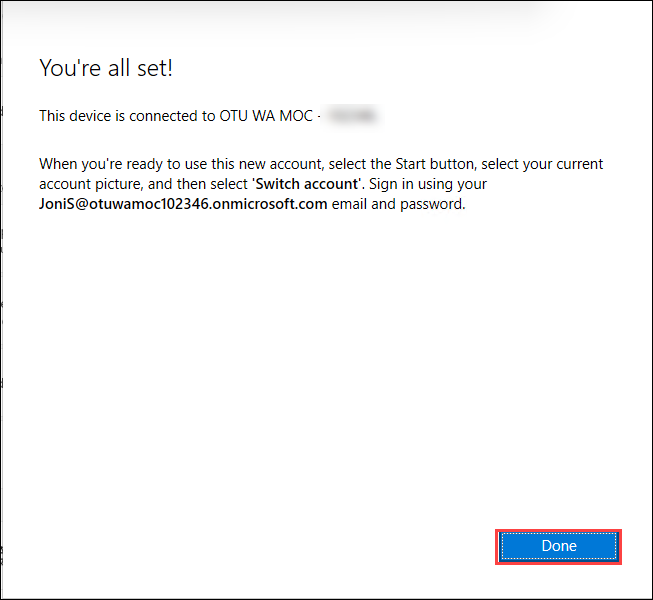 

12. On the **Access work or school** page, verify that **Connected to Contoso's Azure AD** is displayed.

    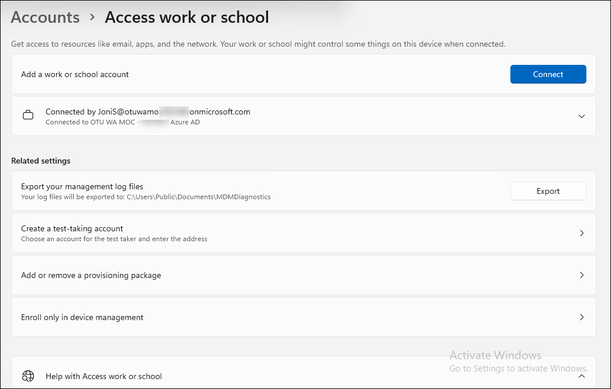 

13. Close the **Settings** page.

### Task 3: Validate Entra Join

In this task you will confirm that SEA-WS1 is successfully Entra joined by checking device status and local administrator membership.

1. On SEA-WS1, right-click **Start**, and then select **Windows Terminal (Admin)**. At the User Account Control, select **Yes**.

    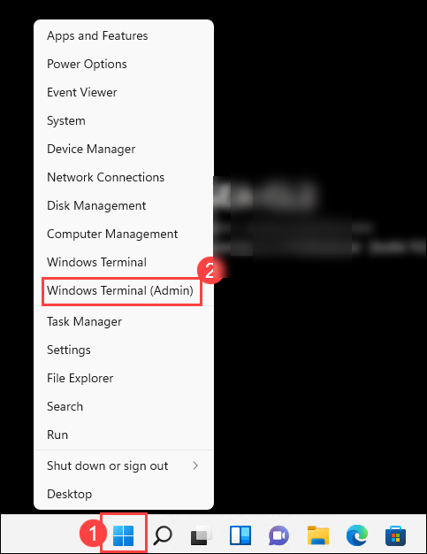 

    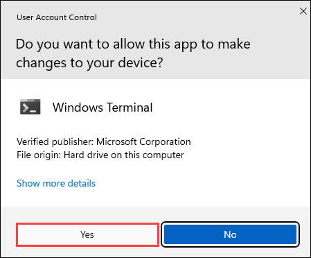 

2. In the PowerShell console, type the following and press **Enter**: 

    ```
    dsregcmd /status
    
    ```

3. In the output under **Device State**, verify that **AzureAdJoined : YES** is displayed. 

    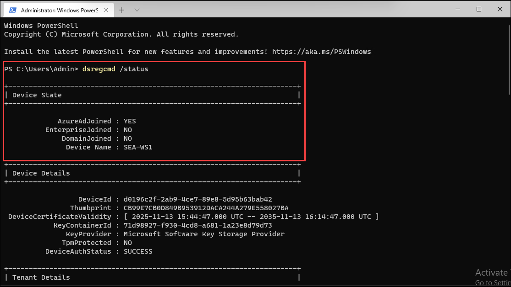

   > This indicates that the device is Entra joined.

4. Close PowerShell.

5. Right-click **Start (1)** and then select **Computer Management (2)**.

    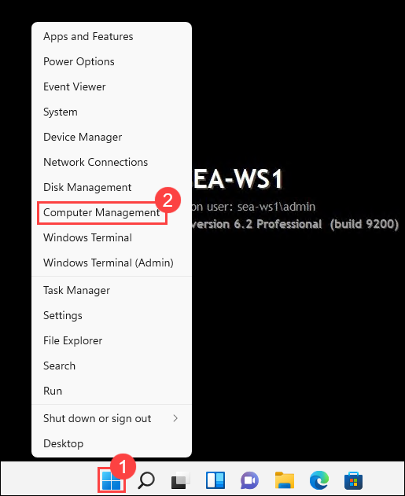

6. In Computer Management, expand **Local Users and Groups (1)**, and then select **Groups (2)** and double-click the **Administrators (3)** group.

    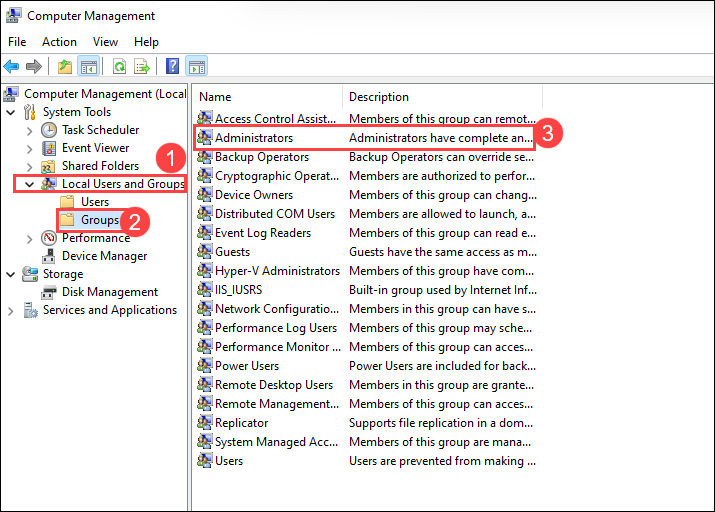

    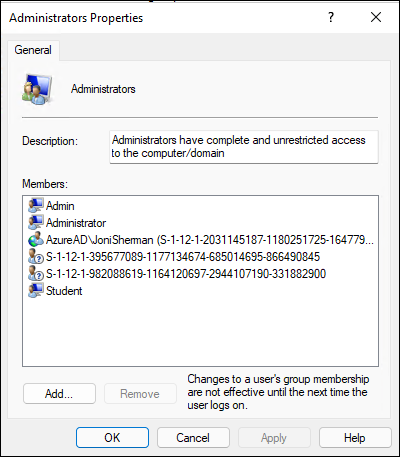

   > **Note :** that Joni Sherman has been added as a local Administrator on SEA-WS1. Also notice two security principals represented by their security identifiers (SID). These two SIDs represent the Entra ID global administrator role, and the Entra joined device administrator role. 

8. Close all open windows and sign out of SEA-WS1.

9. Switch to **SEA-SVR1**.

     

10. In Microsoft Edge, go to `https://entra.microsoft.com/` in the Microsoft Entra admin center,Sign in if required and expand **Identity**.

11. Select **Devices**, and then select **All devices**.

    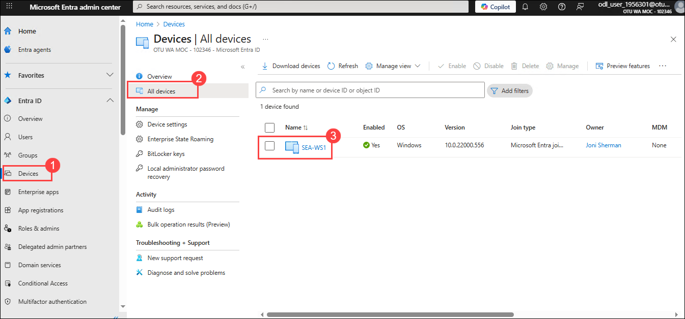

    > In the Devices pane, notice that SEA-WS1 is listed. 

12. Verify that the **Join Type** is listed as **Microsoft Entra joined** and that the owner is **Joni Sherman**. 

    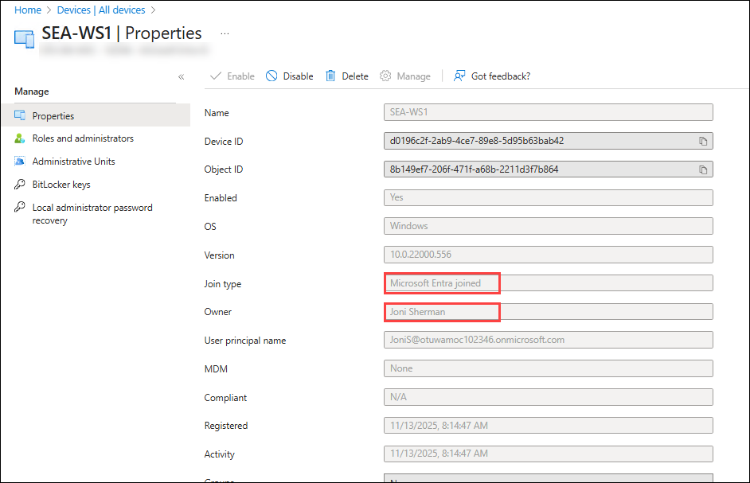

    > Also note that the MDM column shows None. This indicates that this device is not yet managed by Microsoft Intune.

### Task 4: Sign in to Windows as an Entra User

In this task you will sign in to Windows using an Entra user account and complete required authentication setup.

1. Switch to **HOSTVM** and Sign out from **SEA-WS1** VM, if you are already signed in to admin and sign in with Other user.

     

   >**Note** : Before proceeding with the next step, ensure that you are in basic session mode and able to view Clipboard in the menu bar as shown in the below image. If not please change it to the basic session by selecting the icon which was highlighted in the tool bar in the below image.

    

2. On the sign-in page select Other Users, to view the Other User option you may need to **Maximize** the Hyper v session window.

    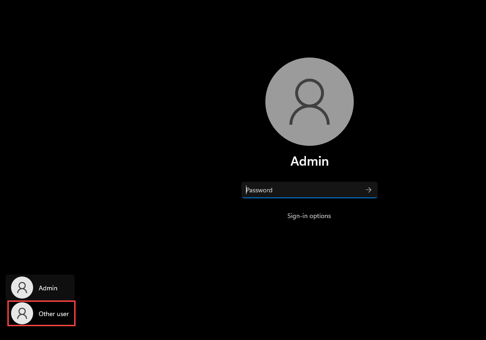

3. Then sign in as **`JoniS@yourtenant.onmicrosoft.com`** with the user password as provided by your instructor i.e **Pa55-w.rd!** . 

    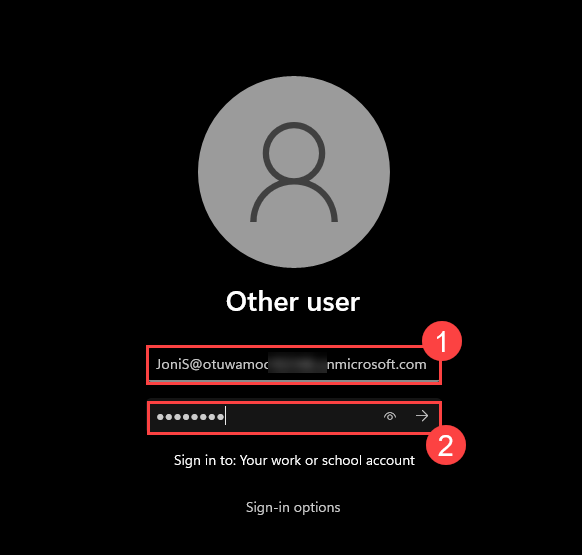

   > Wait for the profile to be created.

4. At the **Use Windows Hello with your account** page, select **OK**.

    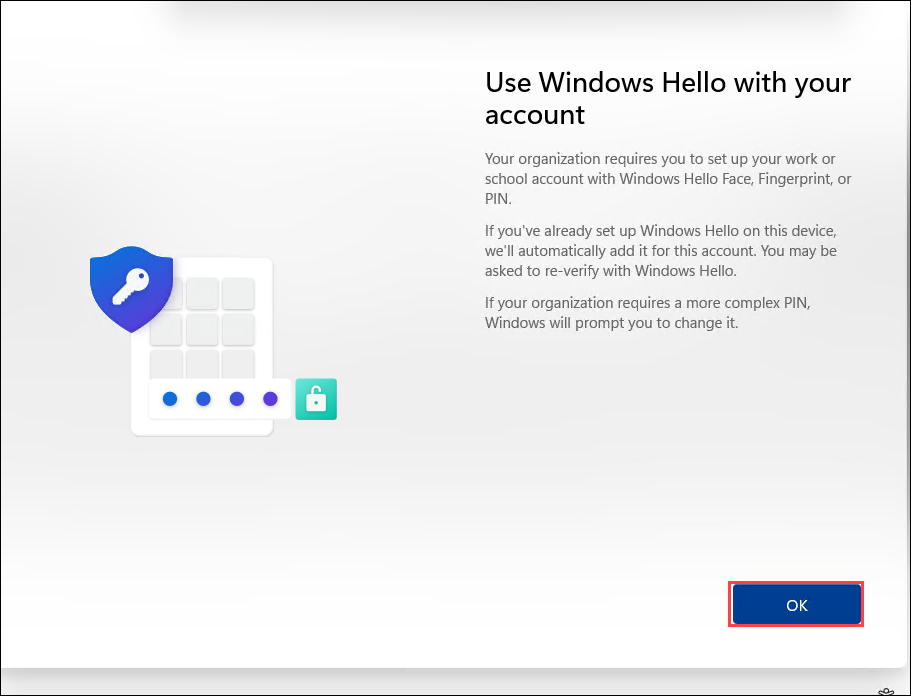

6. On the **Keep your account secure** page, select **Next**.

    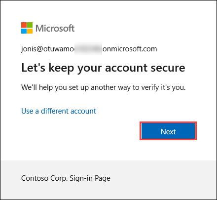

7. In the **Install Microsoft Authenticator page** select **Set up a different way to sign in**.

    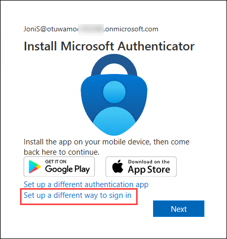

8. On the **Add a sign-in method** page, select **Phone.**

    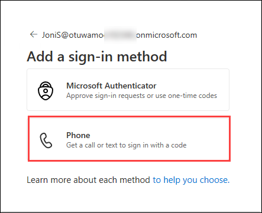

1. On the **Add your phone number** page, select your **Country code** and in the **Phone number** field, enter your mobile phone number which is able to receive text messages, then select **Next**.

    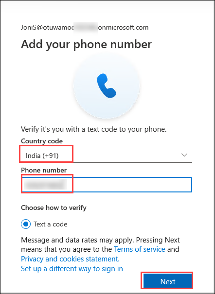

9. When you receive the verification code, enter the code on the **Verify your phone number** page and then select **Next**.

    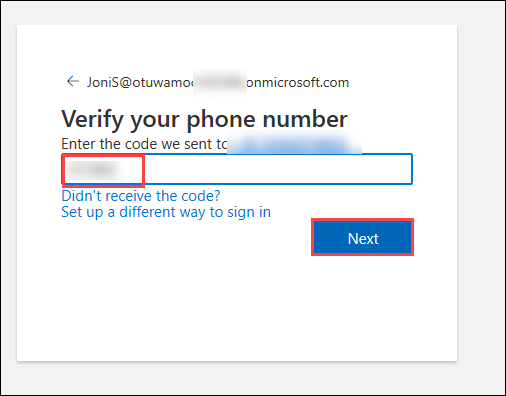

10. On the **Phone number added** page, select **Done**.

11. On the **Set up a PIN** page, in the **New PIN** and **Confirm PIN** boxes, type **102938** and then select **OK**.

    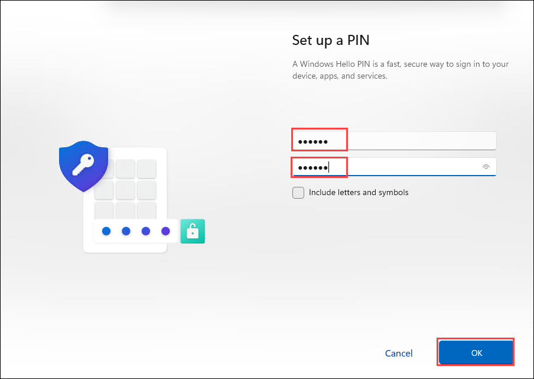

12. On the **All set!** page, select **OK**.

    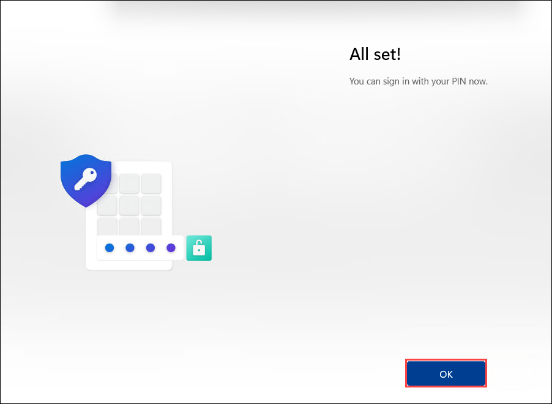

 > Also note if you are not able to perform from above Step 4th to 12th, you can ignore those steps and proceed with the Next Task.

### Task 5: Remove a Windows device from Entra

In this task you will disconnect the SEA-WS1 computer from Entra ID and remove the device association.

1. On SEA-WS1, signed in as **azuread\jonisherman**, select **Start (1)** and then select **Settings (2)**.

    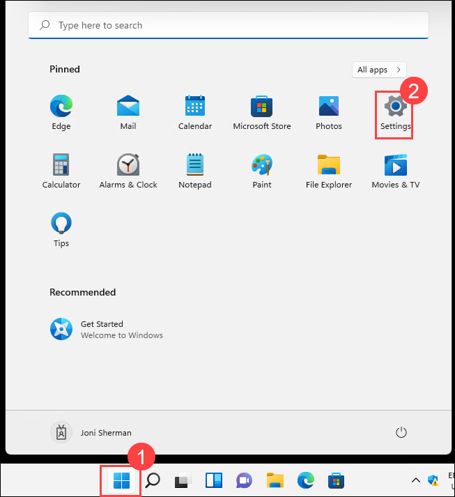

2. In the **Settings** window, select **Accounts (1)**.

3. On the Accounts page, select **Access work or school (2)**.

    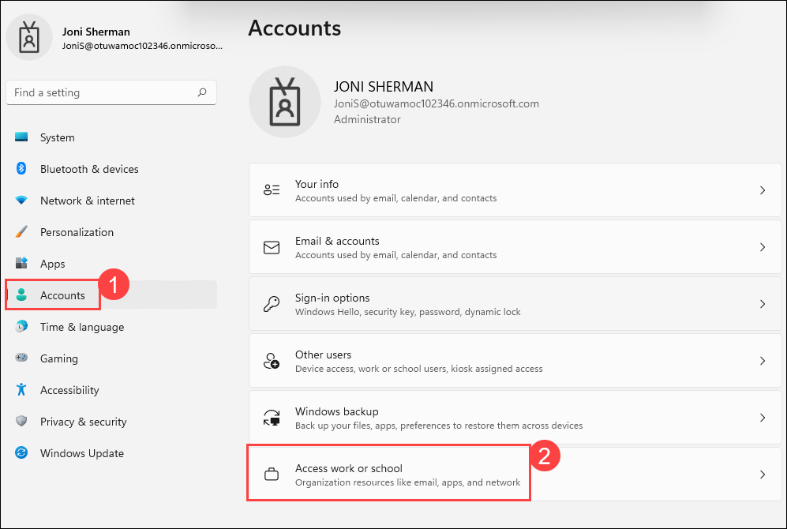


4. In the **Access work or school** page, select **Connected to Contoso's Azure AD**.

5. Select **Disconnect** and then select **Yes**.

    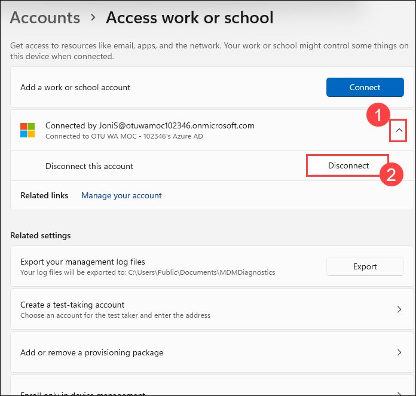

6. On the **Disconnect from the organization** page, select **Disconnect**.

    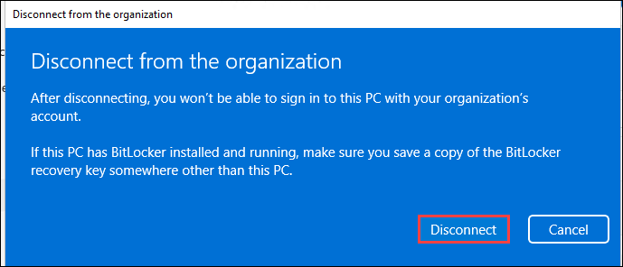

7. On the **Windows Security** dialog box, in the **Email address** box, enter **Admin** and in the **Password** box, type **Pa55w.rd**. Select **OK**.

    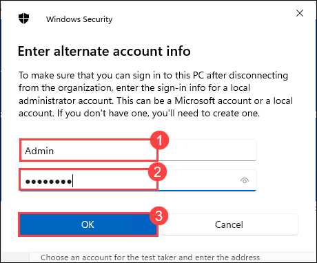

8. In the **Restart your PC** dialog box, select **Restart now**. SEA-WS1 restarts.

    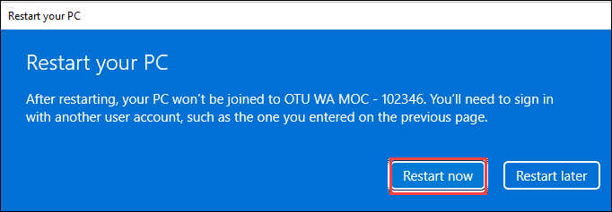

**Results**: After completing this exercise, you will have configured Microsoft Entra device settings, joined a device to Entra, and removed a device from Entra.

## Exercise 2: Configuring Entra Hybrid Join

### Scenario

Some Contoso Windows devices are currently joined to the local Active Directory Domain Services. To enable those devices to seamlessly access cloud services you plan to enable Entra hybrid join. You will test Entra hybrid join by re-configuring Microsoft Entra Connect and testing out the process on SEA-CL2.

### Task 1: Prepare the environment

In this task you will prepare your on-premises environment for hybrid join by creating an organizational unit and moving the SEA-CL2 device into it.

1. Switch to **SEA-SVR1**.

2. Select **Start (1)**, expand **Windows Administrative Tools (2)**, and then select **Active Directory Users and Computers (3)**.

    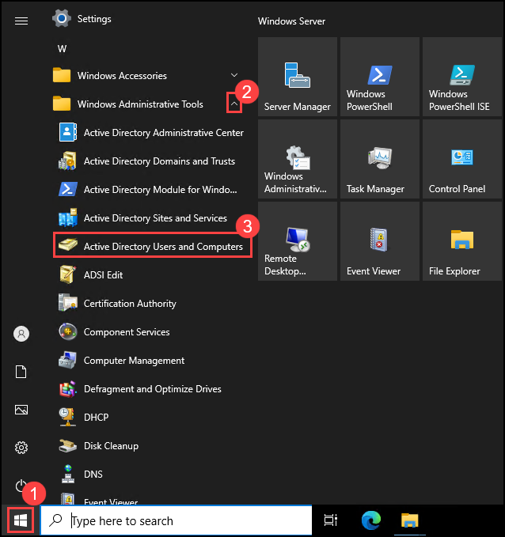

3. In **Active Directory Users and Computers**, right-click **Contoso.com (1)**, point to **New (2)**, and then select **Organizational Unit (3)**.

    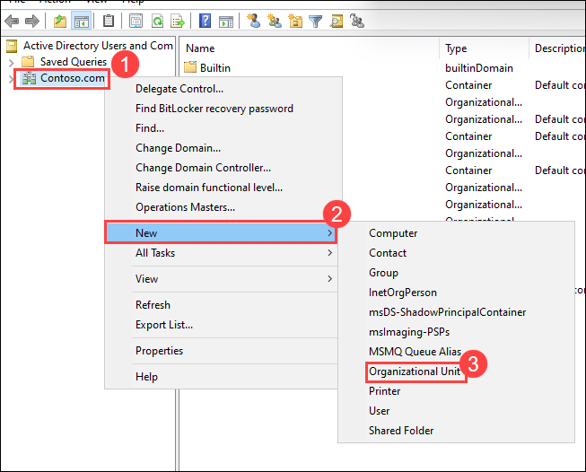

4. In the **New-Object - Organizational Unit** dialog box, type **`Entra ID clients` (1)** and then select **OK (2)**.

    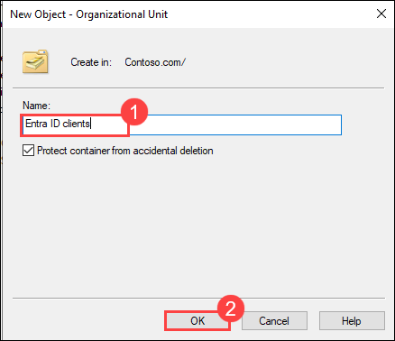

5. In the navigation pane, select **Seattle Clients (1)**. Right-click **SEA-CL2 (2)** and then select **Move (3)**.

    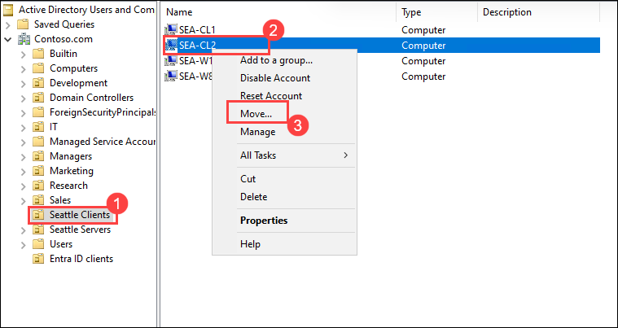

7. In the **Move** dialog box, select **Entra ID clients (1)** and then select **OK (2)**.

    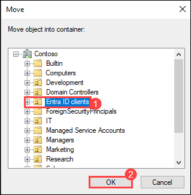

8. Close **Active Directory Users and Computers**.

### Task 2: Configure Entra hybrid join in Azure Active Directory Connect 

In this task you will configure Entra hybrid join using Microsoft Entra Connect to enable domain-joined devices to register with Entra ID.

1. On **SEA-SVR1**, on the **Desktop**, double-click **Azure AD Connect**.

    

2. In the **Microsoft Entra Connect Sync** window select **Configure**.

    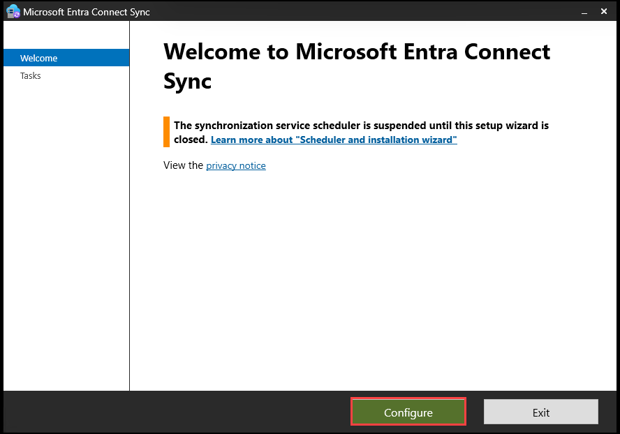

3. On the **Additional tasks** page, select **Configure device options (1)** and select **Next (2)**.

    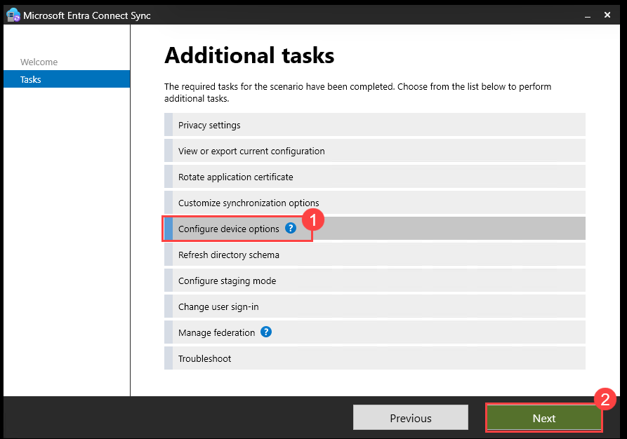

4. On the **Overview** page, select **Next**.

    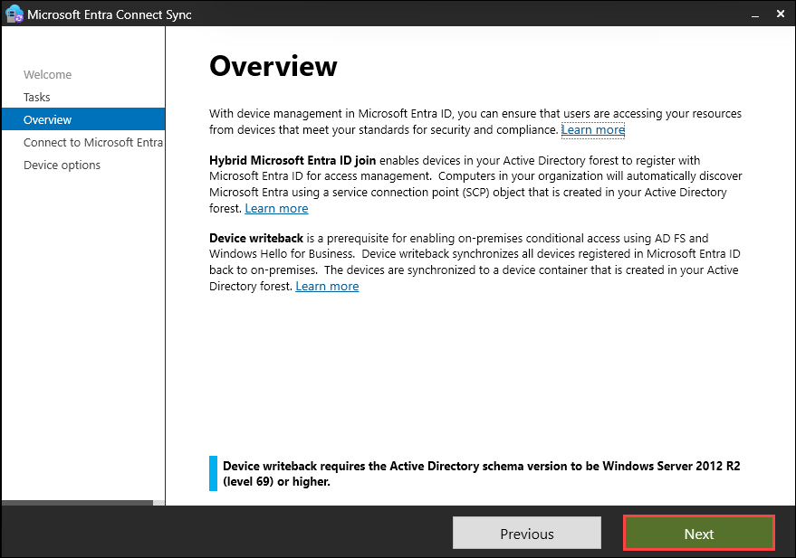

5. On the **Connect to Microsoft Entra ID** page, select **Next**.

    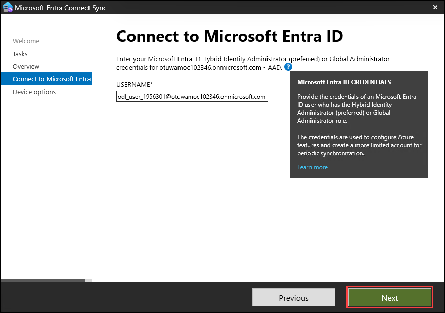

6. On the **Sign in to your account** window, select the tenant admin account - **<inject key="AzureAdUserEmail"></inject>**, and then enter the tenant password - **<inject key="AzureAdUserPassword"></inject>**  and select **Sign in**.

7. On the **Device options (1)** page, select **Configure Hybrid Microsoft Entra ID join (2)**, and then select **Next (3)**.

    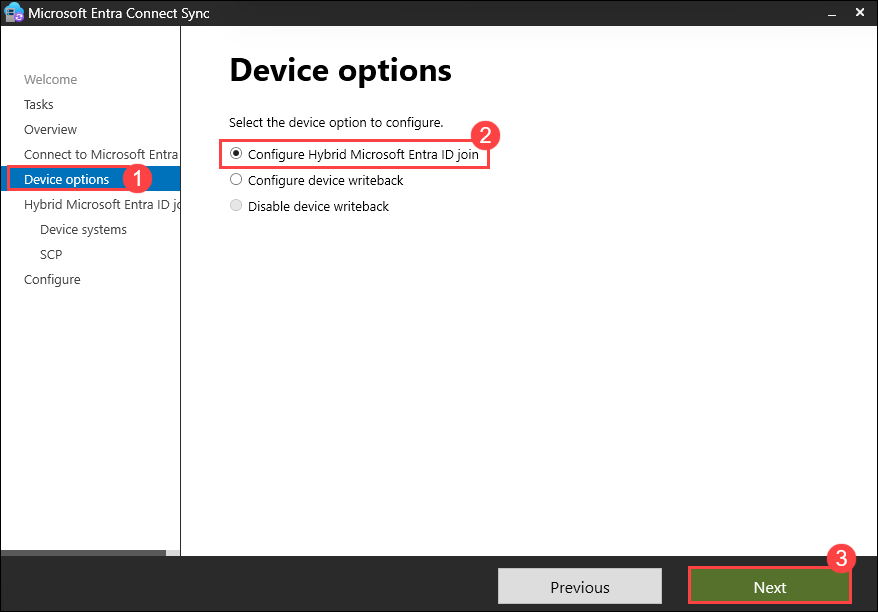

8. On the **Device operating systems (1)** page, select **Windows 10 or later domain-joined devices (2)**, and then select **Next (3)**.

    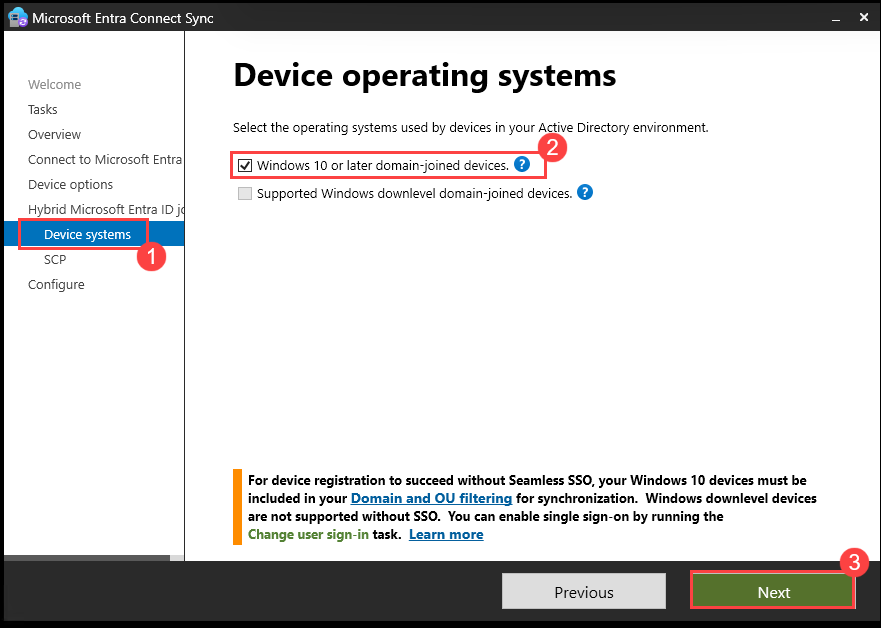

9. On the **SCP configuration** page, select the check box next to **Contoso.com**. 

    

10. Select **Microsoft Entra ID** from the **Authentication Service** dropdown and select **Add**. 

    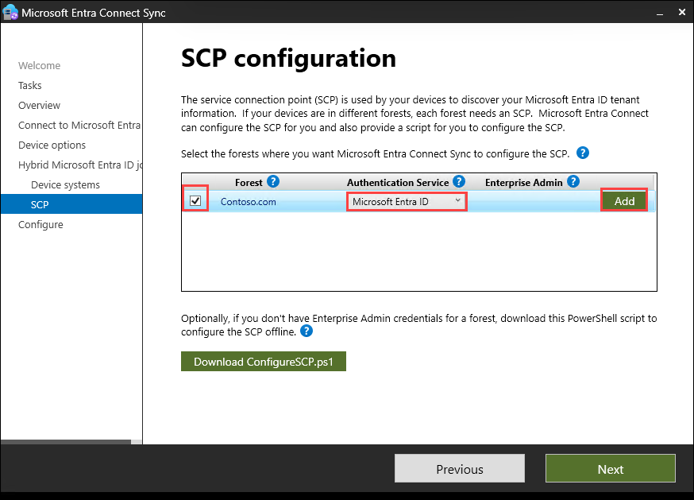

11. In the **Enterprise Admin Credentials** window enter **Contoso\\Administrator** as **User name (1)** and **Pa55w.rd** as **Password (2)**. Select **OK (3)** and select **Next**.

    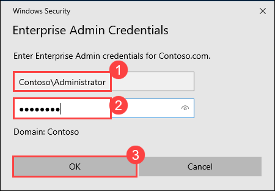

12. In the **Ready to configure** page, select **Configure** to run the configuration.

    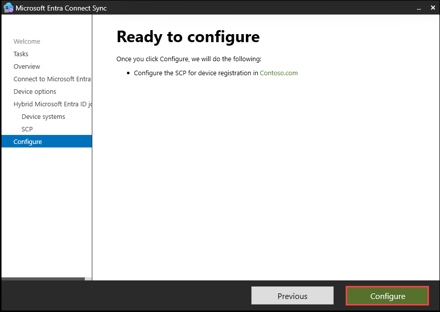

    >**Note** : If you encounter any directory synchronization errors, proceed with the upcoming labs as planned. You can return to this task and the following ones after completing the final lab. Please be aware that directory synchronization may take up to 24 hours to complete.

13. When the configuration is complete, select **Exit**.

    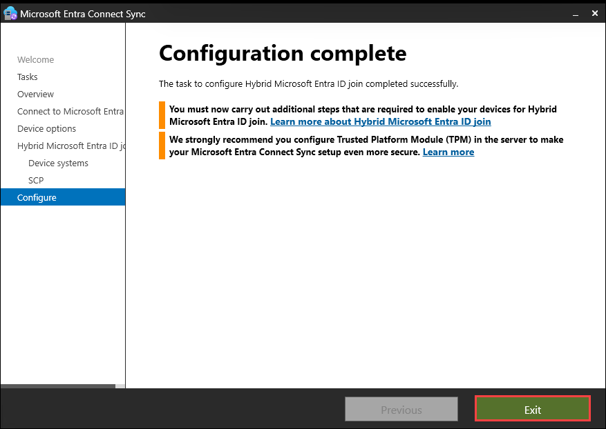

14. Switch to **SEA-CL2**.

    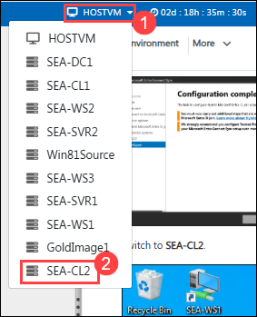

15. At the sign-in page, select the **Power** button and then select **Restart**.

    >**Note** Restarting **SEA-CL2** will enable quicker discovery of the SCP created by reconfiguring AAD Connect.

16. After **SEA-CL2** has restarted, sign in as **Contoso\\Administrator** with the password of **Pa55w.rd**.

    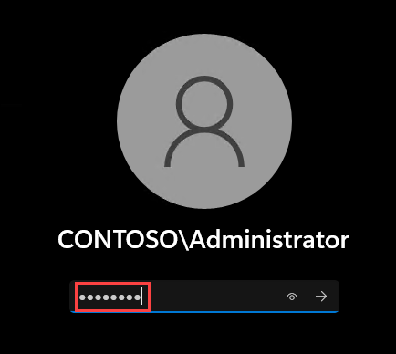

### Task 3: Re-configure Azure AD Connect to sync the new OU

In this task you will update Azure AD Connect sync settings to include the new OU created for hybrid join devices.

1. On **SEA-SVR1**, on the **Desktop**, double-click **Azure AD Connect**.

2. In the **Microsoft Azure Active Directory Connect** window select **Configure**.

    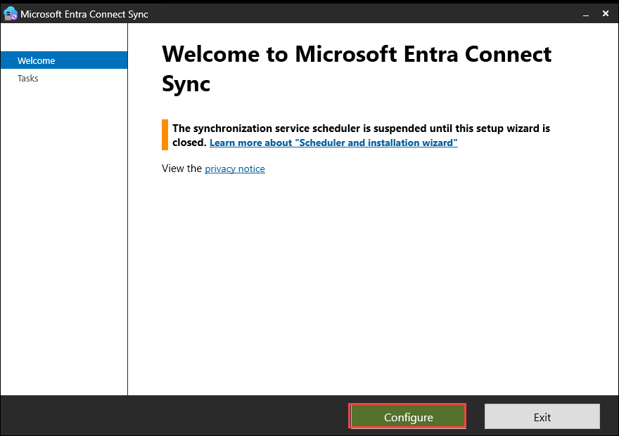

3. On the **Additional tasks** page, select **Customize synchronization options** and select **Next**.

    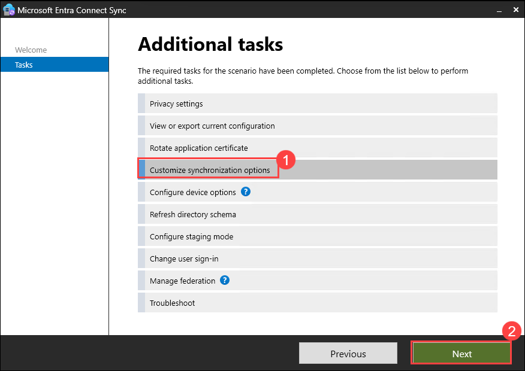

4. On the **Connect to Azure AD** page enter the Admin Tenant password into the **PASSWORD** box, i.e **<inject key="AzureAdUserPassword"></inject>** then select **Next**.

5. On the **Connect your directories** page, select **Next**.

    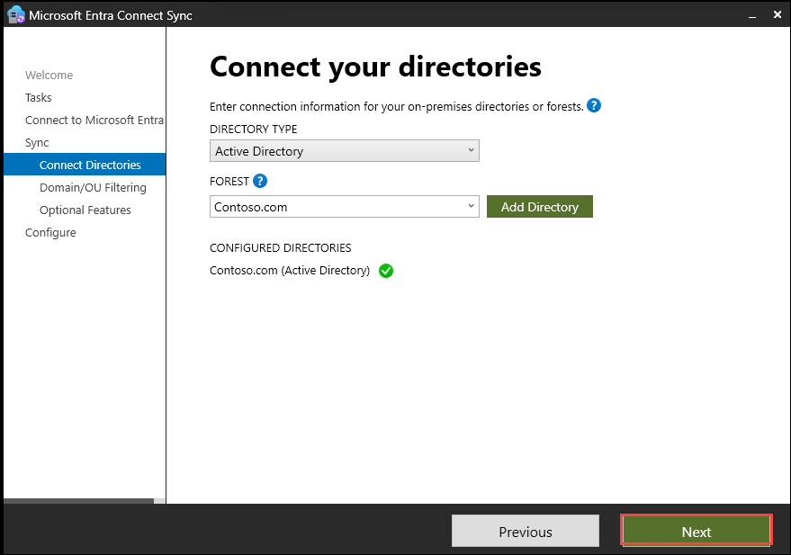

6. On the **Domain and OU filtering** page, ensure that **Sync selected domains and OUs** is selected and then expand **Contoso.com**.

7. Select the check box next to **Entra ID clients**. Do not make any other changes and then select **Next**.

    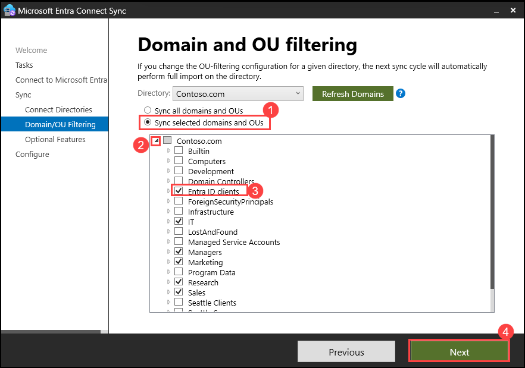

8. In the **Optional features** page, do not make any changes and then select **Next**.

    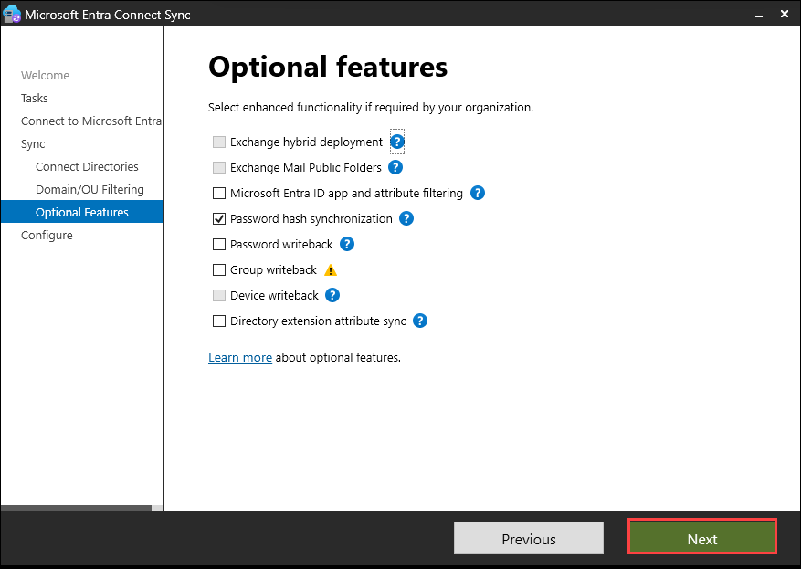

9. In the **Ready to configure** window, select **Configure** to run the configuration and start synchronization.

    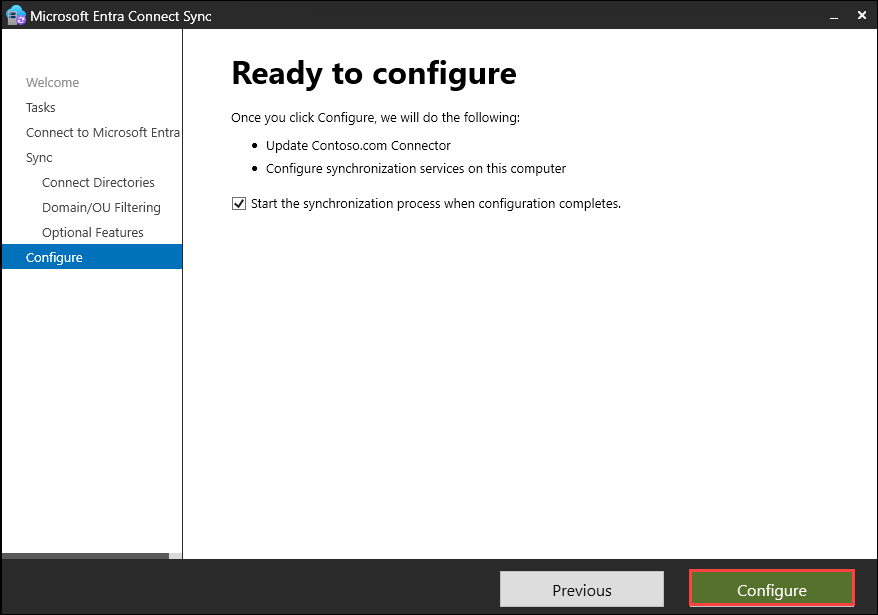

10. When the configuration is complete, select **Exit**.

    > **Note**: AAD Connect synchronizes automatically now when you modify the OUs being synced. You can use the **Synchronization Service** to monitor sync status.

### Task 4: Verify the Entra hybrid join 

In this task you will verify that SEA-CL2 has successfully completed Entra hybrid join by checking device status locally and in the Entra admin center.

1. Switch to **HOSTVM** and select **SEA-CL2** VM desktop shortcut and sign in as **Contoso\\Administrator** with the password of **Pa55w.rd**.

2. Once logged in, Right-click **Start**, select **Shut down or sign out**, and then select **Restart**.

    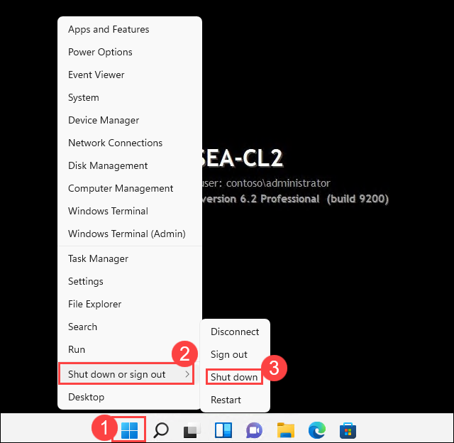

    >Note: The reboot will trigger the hybrid Azure AD join on SEA-CL2._
   
3. After **SEA-CL2** has restarted, sign in as **Contoso\\Administrator** with the password of **Pa55w.rd**.
    
4. On the taskbar, right-click **Start** and select **Windows Terminal (Admin)**.

    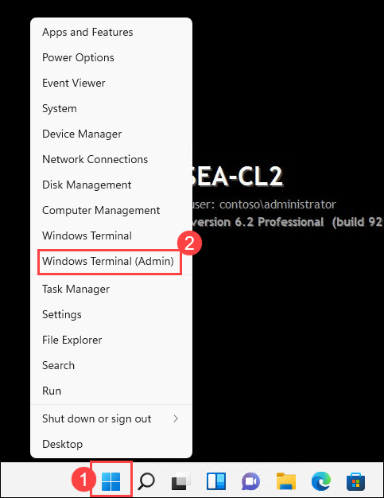

5. In the **Windows PowerShell** window, type the following command, and then press **Enter**:

    ```
    dsregcmd /status
    ```

6. In the output under **Device State**, verify that **AzureAdJoined : YES** and **DomainJoined : YES** are displayed.

    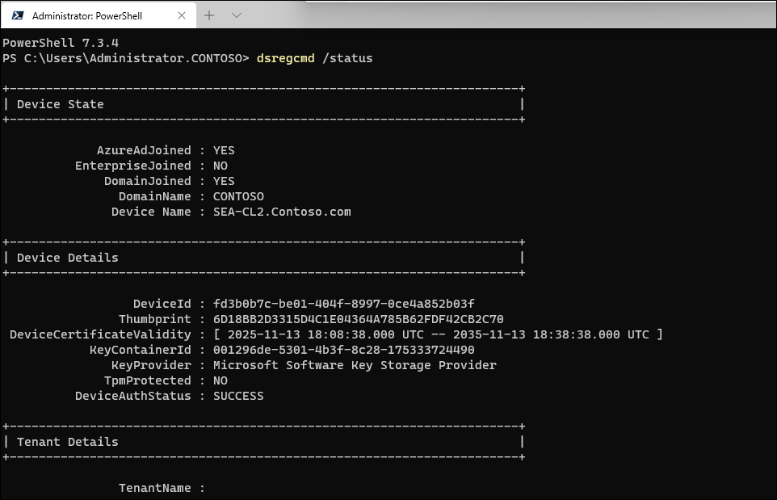

   > **Note**: If the device is not yet joined to Azure AD, switch back to **SEA-SRV1** and run the command below. Once completed, switch back to SEA-CL2 and restart the computer once more.
   
   ```
   Start-ADSyncSyncCycle -PolicyType Delta
   ```

7. Close all windows on SEA-CL2 and sign out.

8. Switch to **SEA-SVR1** and switch to the Microsoft Entra admin center.

9. Expand **Entra ID**, and then select **Devices** > **All devices**. 

    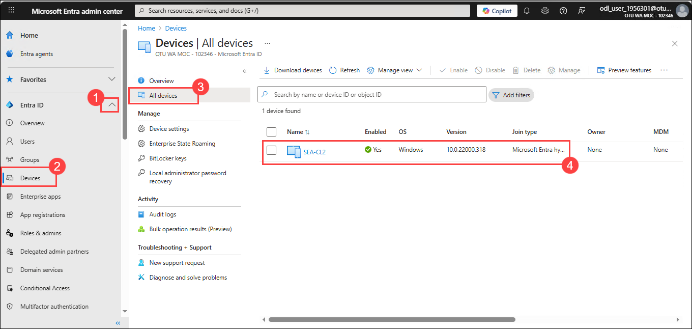

10. Verify that **SEA-CL2** has **Microsoft Entra hybrid joined** as value for the row **Join Type**. If necessary, select the **Refresh** button if SEA-CL2 is not listed.

11. Close all windows on **SEA-SVR1**.

**Results**: After completing this exercise, you will have successfully configured and validated Entra hybrid join.

Click on **Next** from the lower right corner to move on to the next page.

  

