# Practice Lab: Manage Entra ID device registration

## Summary

In this lab, you will perform Entra ID device registration using a Windows device.

> **!IMPORTANT**: Once you launch the track, you’ll have access to a virtual machine (VM) for **40 hours**. The displayed track duration of **30 days** indicates the time frame during which you can use your VM. Please plan your lab sessions accordingly. If the VM uptime of **40 hours** is fully exhausted before completing the labs, access will be lost. To avoid this and for detailed instructions on VM usage and stopping/deallocating the VM, refer to the Getting Started page.  

> If the full 40 hours of VM uptime is exhausted, the VM will no longer be accessible, and **the lab duration cannot be extended**.

## Exercise 1: Configuring Entra device registration

### Scenario

Several users have asked to use their personal iOS, Android, and Windows devices to access Contoso cloud resources. Since Contoso does not own the devices, you do not want to have the users perform an Entra join for full device management. Instead, you need to ensure that users are able to register their devices with Entra, which still allows you to apply company policy to apps as needed, and still permit users to access Contoso resources. You will test out Entra device registration using a Windows 11 device.

### Task 1: Configure Microsoft Entra device registration

In this task you will review the device registration settings in Entra ID to ensure all users are allowed to register their personal devices.

1. On **SEA-SVR1**, if necessary, sign in as **Contoso\\Administrator** with the password of **Pa55w.rd** and close **Server Manager**.

    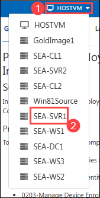

    > **Note :** If you’re unable to switch the VM from the dropdown menu, you can also access the VM directly from the desktop of your Host VM.

    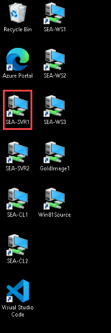

    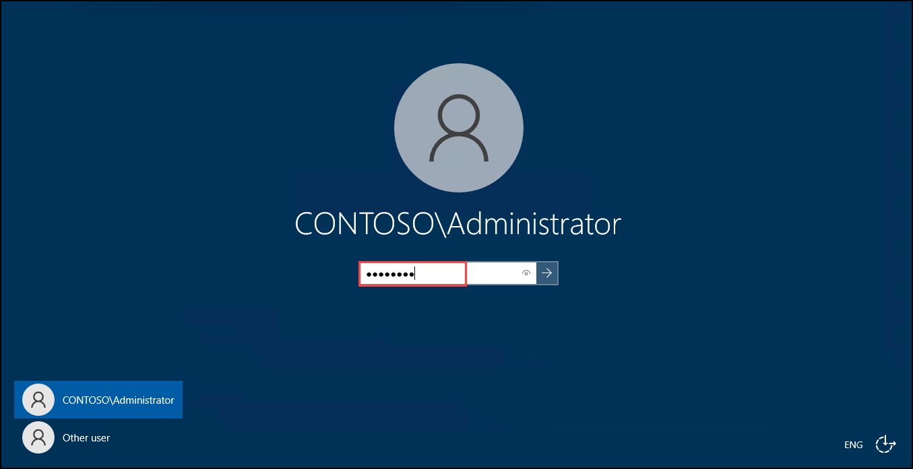

2. On the taskbar select **Microsoft Edge**, in the address bar type **https://entra.microsoft.com**, and then press **Enter**.

3. Sign in as user **<inject key="AzureAdUserEmail"></inject>**, and use the tenant Admin password **<inject key="AzureAdUserPassword"></inject>**, If the **Stay signed in?** prompt appears, select **No**. 

   > The Microsoft Entra admin center opens.

4. In the Microsoft Entra admin center, in the navigation pane, expand **Entra ID (1)** then select **Devices (2)** and click on **All devices (3)**.

   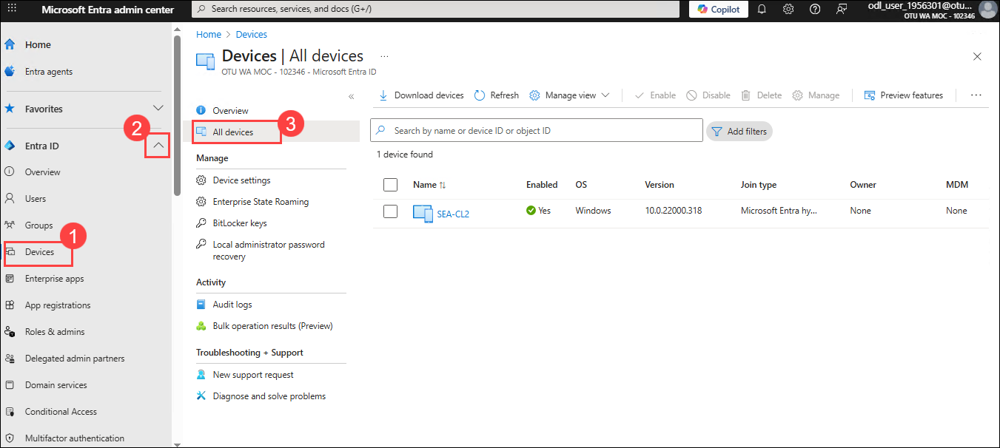

6. On the **Devices | All devices** page, select **Device settings (1)**. On the **Devices|Device settings** page, in the details pane, verify that **Users may register their devices with Entra** is set to **All (2)** and is greyed out.

   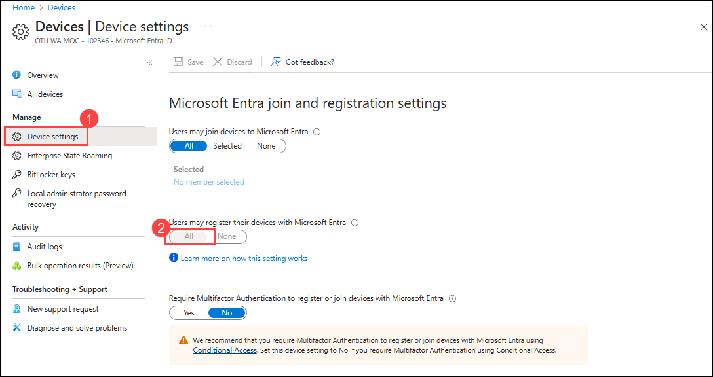

   > This option is greyed out and set to **All** by default when Microsoft Intune is enable in the tenant. This ensures that all users are able to register Windows 10 or newer personal, iOS, Android, and macOS devices with Azure AD.

### Task 2: Perform Entra registration

In this task you will register the SEA-WS1 Windows device with Entra by adding Joni Sherman’s work account.

1. Switch to **HOSTVM** and sign in to **SEA-WS1** VM through desktop shortcut as **Admin** with the password of **Pa55w.rd**.

2. On the taskbar, select **Start (1)** and then select **Settings (2)**.

   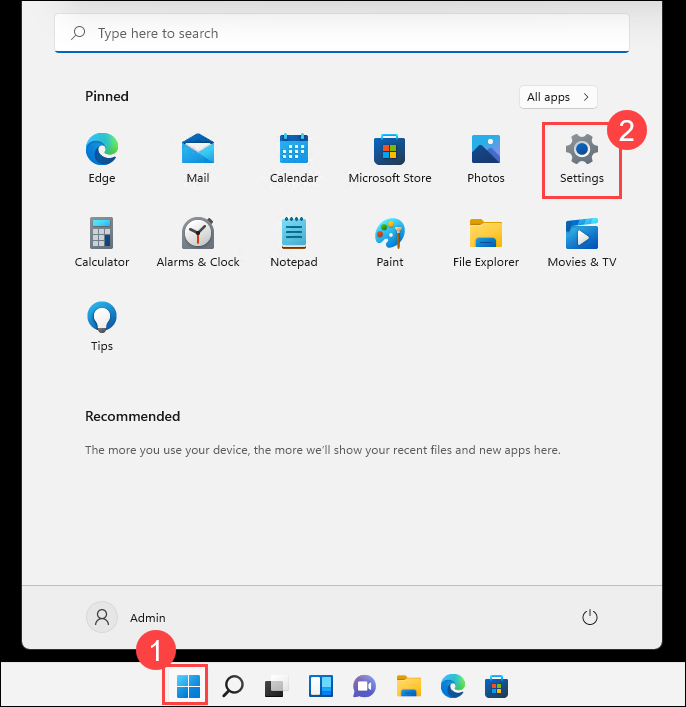

3. In the **Settings** window, select **Accounts (1)**. On the Accounts page, select **Access work or school (2)**.

   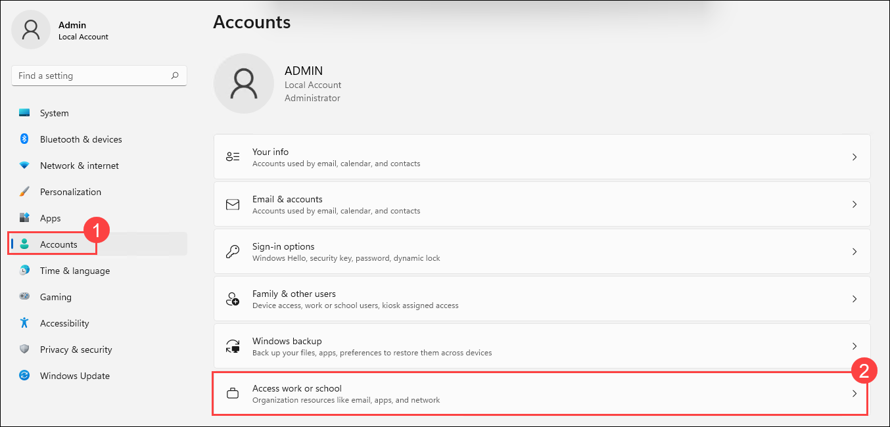

5. In the **Access work or school** page, select **Connect**.

   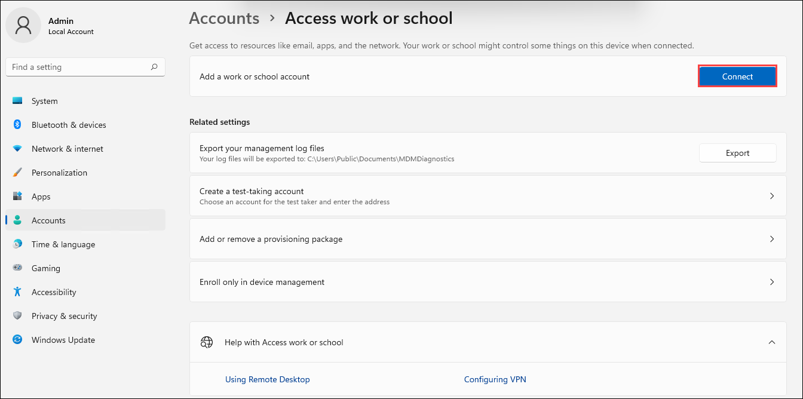

6. In the **Microsoft account** window, in the Email address box, enter **`JoniS@yourtenant.onmicrosoft.com`** and then select **Next**.

   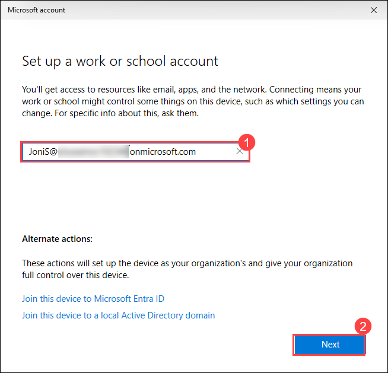

7. On the **Enter password** page, enter the user password **Pa55-w.rd!** and then select **Sign in**.

   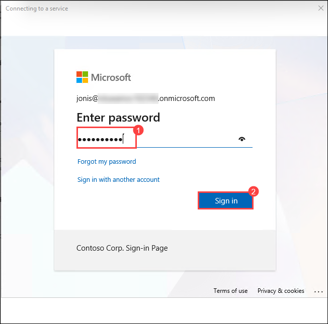

8. On the **Account added to this device** page, select **Done**.

9. On the **Access work or school** page, verify that Joni's Work or school account is displayed.

   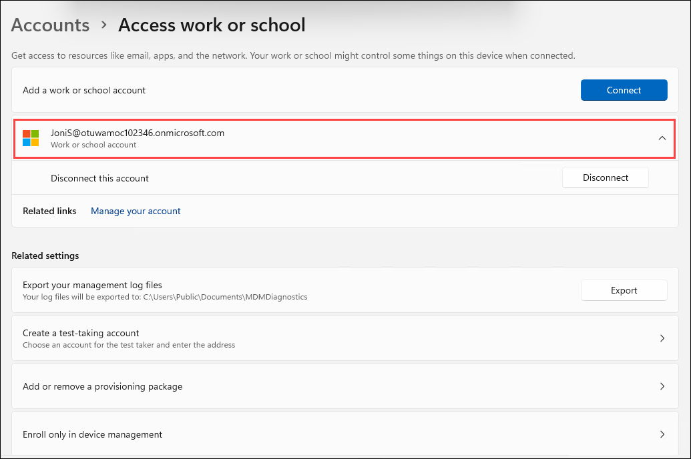

10. Close the **Settings** page.

### Task 3: Validate Entra registration

In this task you will verify that the device registration was successful by checking the Workplace Join status and confirming the device appears as Entra registered.

1. On SEA-WS1, right-click **Start (1)**, and then select **Windows Terminal (Admin) (2)**. At the User Account Control, select **Yes**.

   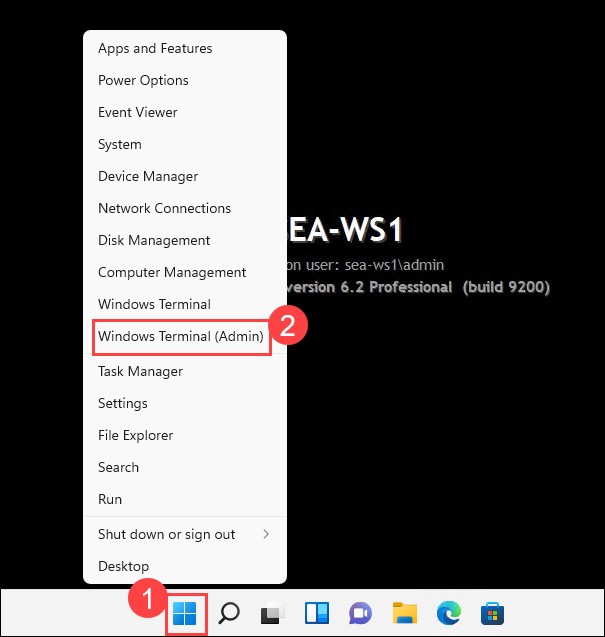

   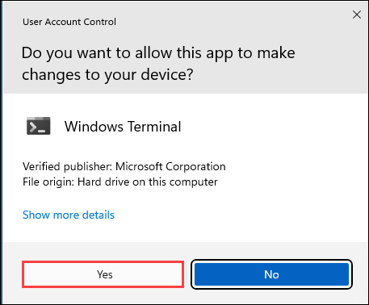

2. In the PowerShell console, type the following and press **Enter**: 

    ```
    dsregcmd /status
    ```

3. In the output under **User State**, verify that **WorkplaceJoined : YES** is displayed. This indicates that the user has performed a device registration in Microsoft Entra.

   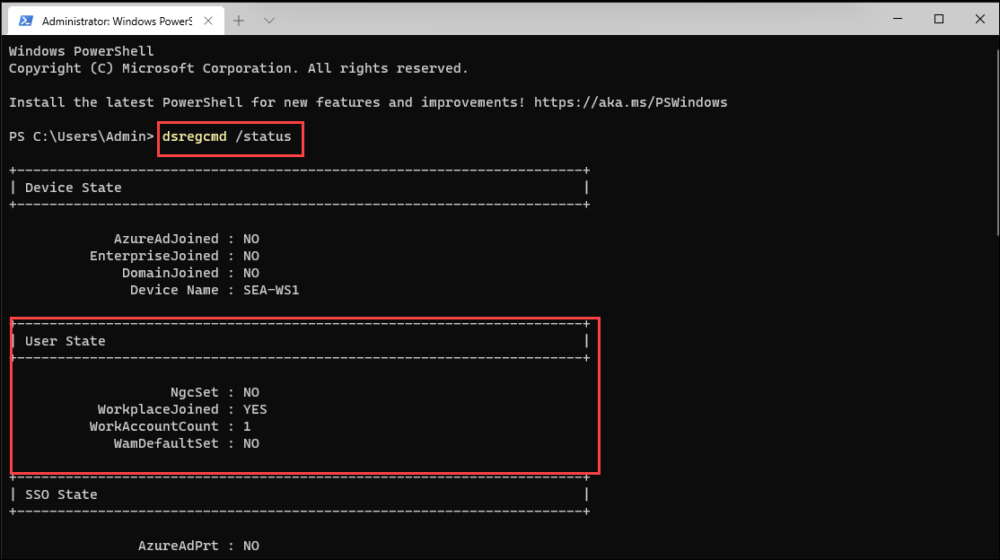

4. Close PowerShell and then sign out of SEA-WS1.

5. Switch to **SEA-SVR1**.

6. In Microsoft Edge, in the Microsoft Entra admin center, expand **Entra ID (1)**. Select **Devices (2)**, then select **All devices**. In the Devices pane, notice that **SEA-WS1 (3)** is listed. Verify that the **Join Type** is listed as **Microsoft Entra registered (4)** and that the owner is **Joni Sherman**.  

    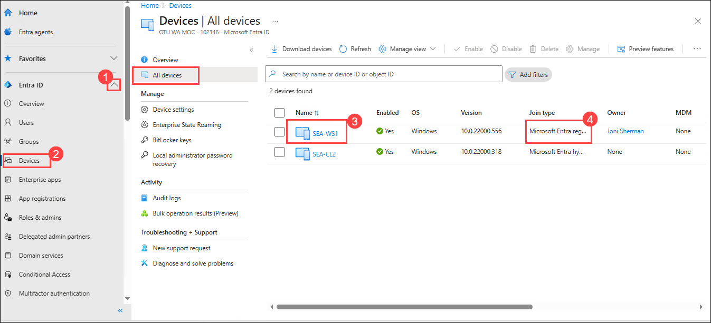

   Notice that the device is Microsoft Entra registered, NOT Microsoft Entra joined. Entra registered devices are typically devices that cannot be Entra joined, or devices that are personally owned by the user. Registering a device will provide access to Cloud based resources.

9. Close Microsoft Edge.

### Task 4: Sign in to Windows and disconnect from the organization

In this task you will test sign-in behavior on an Entra registered device and then disconnect the device from Entra.

1. Switch to **HOSTVM** and attempt to sign in to **SEA-WS1** as **`JoniS@yourtenant.onmicrosoft.com`**.

   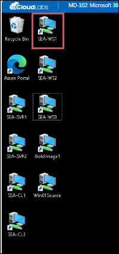

   >**Note**: Notice that unlike Entra Joined devices, an Entra registered device does not allow a user to sign in to the device with an Entra credential

2. On SEA-WS1, sign in as **Admin** with the password of **Pa55w.rd**. 

   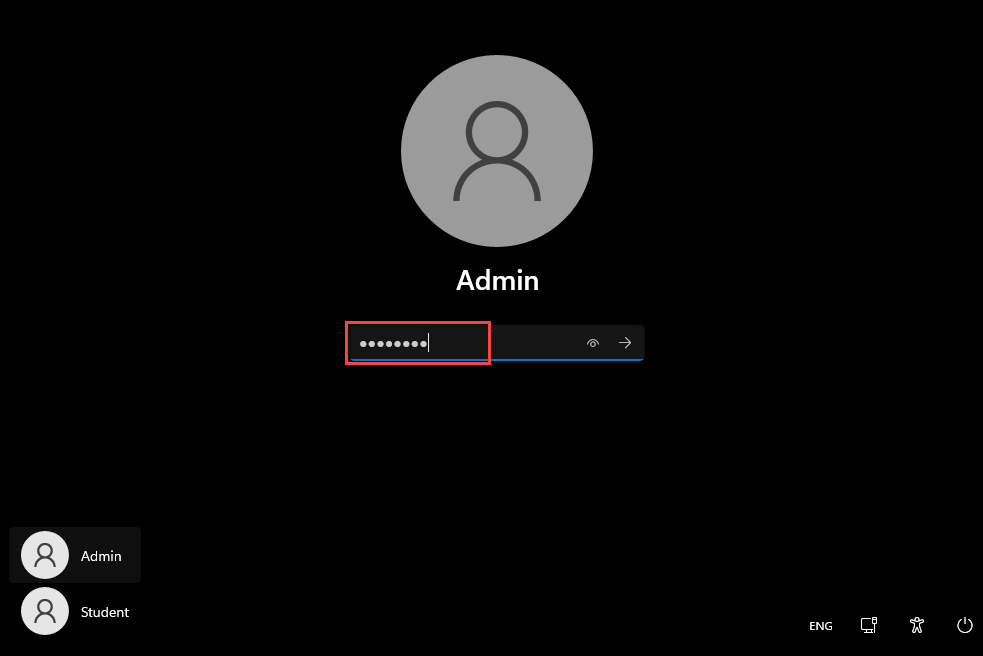

3. Select **Start (1)** and then select **Settings (2)**.

   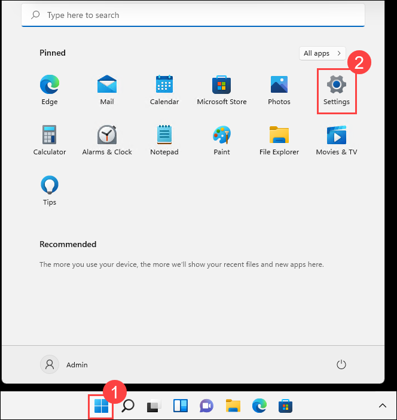

4. In the **Settings** window, select **Accounts (1)**. In the **Access work or school (2)** page, select the **JoniS** Work or School account.

   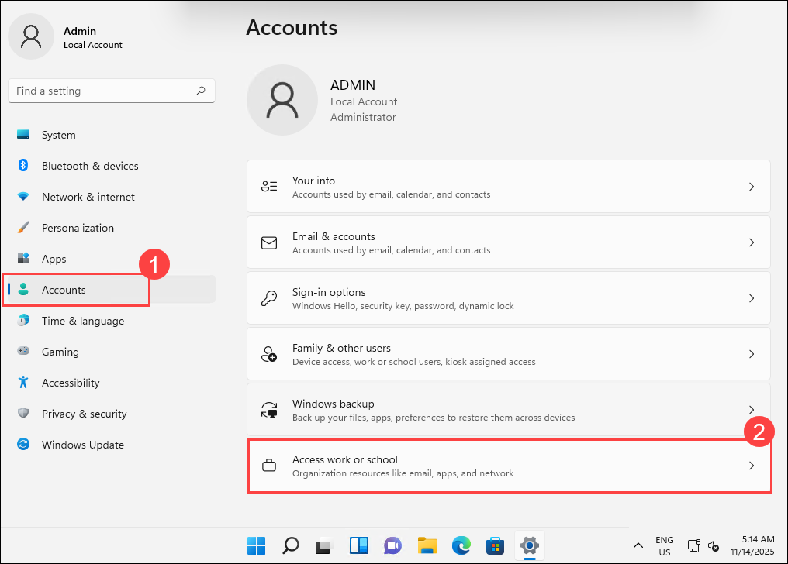

7. Next to Disconnect this account, select **Disconnect** and then select **Yes**.

   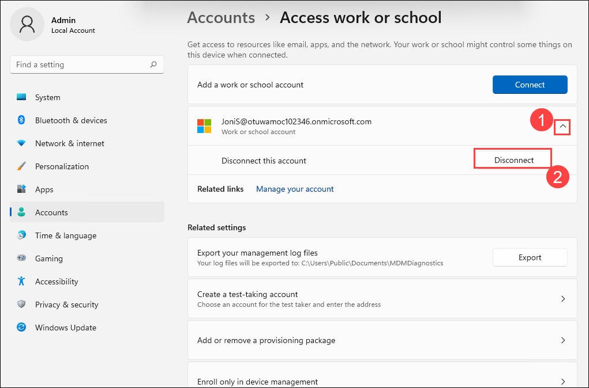

   

   > Notice that you do not have to restart to disconnect a registered device from Microsoft Entra ID.

8. Sign out of SEA-WS1.

**Results**: After completing this exercise, you will have configured Entra device registration.

**END OF LAB**
