# Practice Lab: Manage Device Enrollment into Intune

## Summary

In this lab, you prepare for device management using Microsoft Intune by reviewing and assigning licenses, configuring Windows automatic enrollment, and configuring enrollment restrictions. 

### Prerequisites

To following lab(s) must be completed before this lab:

- 0101-Managing Identities in Entra ID

- 0102-Synchronizing Identities by using Microsoft Entra Connect

  > Note: You will also need a mobile phone that can receive text messages used to secure Windows Hello sign in authentication to Azure AD.

### Scenario

You need to prepare for device management using Microsoft Intune. First of all, you need to ensure that users are assigned appropriate licenses for device management. As a verification test, you will assign Aaron Nicholls the required licenses. You also need to ensure that any Windows device that is joined or registered to Entra ID will automatically be enrolled into Intune. You have also been asked to ensure that members of the Sales group are restricted from enrolling personal Android and iOS devices into Intune and that the Enrollment Device Limit is increased to 10 devices. Finally, you need to configure Allan Deyoung as a Device enrollment manager to allow him to enroll 1000 devices.

### Task 1: Review and assign licenses for device management

In this task you will review the available licenses in the Microsoft 365 admin center and assign the required Intune-related licenses to a user.

1. On **SEA-SVR1**, if necessary, sign in as **Contoso\\Administrator** with the password of **Pa55w.rd** and close **Server Manager**.

    

    

2. On the taskbar select **Microsoft Edge**, in the address bar type **https://admin.microsoft.com**, and then press **Enter**.

3. Sign in as user **<inject key="AzureAdUserEmail"></inject>**, and use the tenant Admin password **<inject key="AzureAdUserPassword"></inject>**, If the **Stay signed in?** prompt appears, select **No**. 

   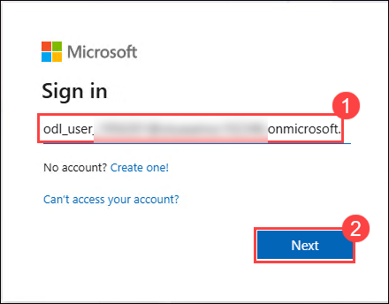

   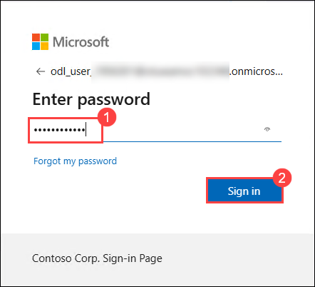

   > The Microsoft 365 admin center opens.

4. In the Microsoft 365 admin center, in the Navigation pane, select **Billing (1)** and select **Your products (2)**. On the **Your products** page, take note of the licenses that are available in the tenant.

   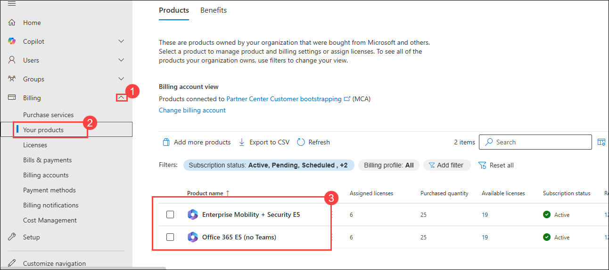

6. In the Microsoft 365 admin center navigation pane, select **Active users (2)** under **Users (1)**. Select **Aaron Nicholls (3)** (select the name, not the checkbox).

   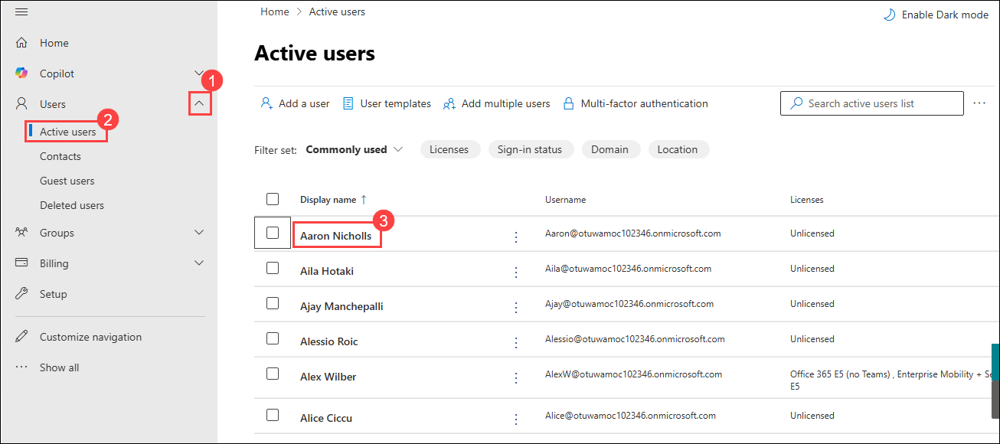

8. Select the **Licenses and apps (1)** tab if the **Select location** field is not populated, select the a location from the drop-down list and select the check boxes next to **Enterprise Mobility + Security E5** and **Office 365 E5 (no Teams)** then select the check boxes next to **Enterprise Mobility + Security E5** and **Office 365 E5 (no Teams) (2)**. Select **Save Changes (3)**.

   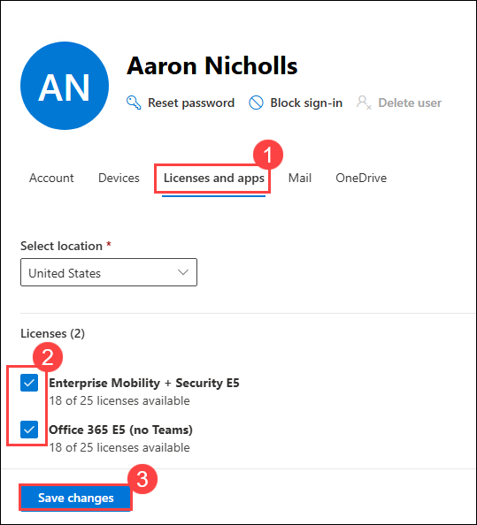

12. Once the changes have been saved, close the **Microsoft 365 admin center** tab in Edge. 

### Task 2: Enable Windows Automatic Enrollment into Microsoft Intune

In this task you will enable automatic Intune enrollment for all users so that Windows devices join or register into Entra ID automatically enroll into Intune.

1. In **SEA-SVR1**, open a new tab in **Microsoft Edge**, and then in the address bar type **https://intune.microsoft.com**, and then press **Enter**. 

   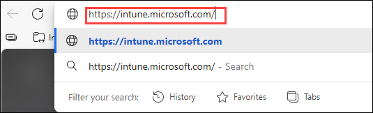

   > The Microsoft Intune admin center opens.

2. In the Microsoft Intune admin center, select **Devices (1)** select **Enrollment (2)** under Device onboarding ensure **Windows (3)** is selected. In the **Enrollment options** section, select **Automatic Enrollment (4)**.

   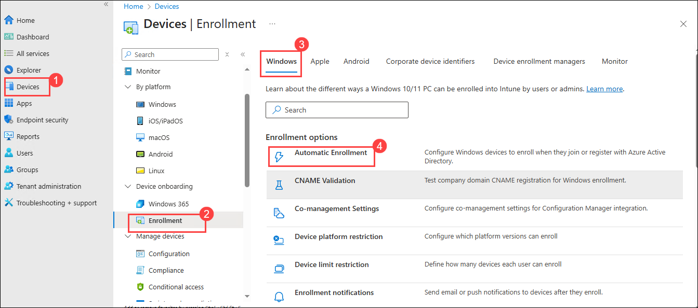

6. On the **MDM user scope** row, select **All (1)** and then select **Save (2)**.

   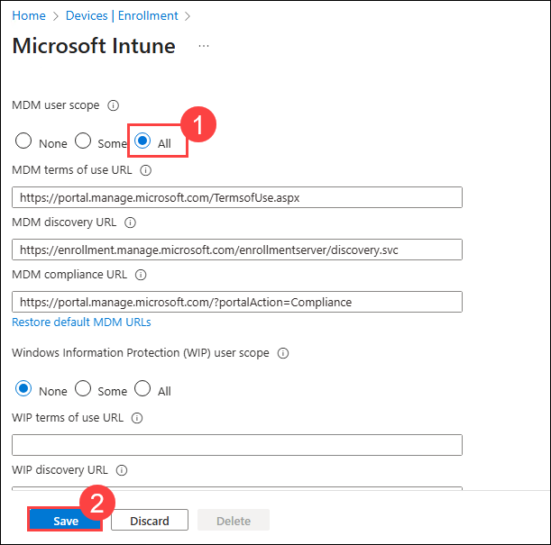

   >**Note**: By performing this step, you enabled automatic enrollment into Intune for any User that performs an Entra join or Entra registration from a Windows device.

### Task 3: Configure Enrollment Restrictions

In this task you will create enrollment restrictions that block Sales users from enrolling personal Android devices and increase their device enrollment limit to ten devices.

1. In the Microsoft Intune admin center, select **Devices (1)** on the Devices pane, under the **Device onboarding** section, select **Enrollment (2)** on the **Devices | Enrollment** page, in the **Enrollment options** section, note that you can create enrollment device limit and platform restrictions select **Device platform restriction (3)**

   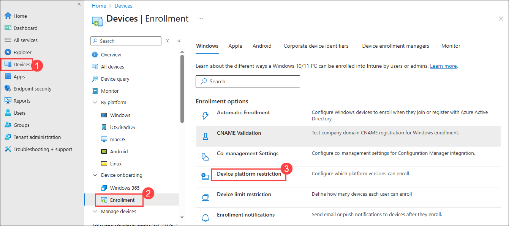

   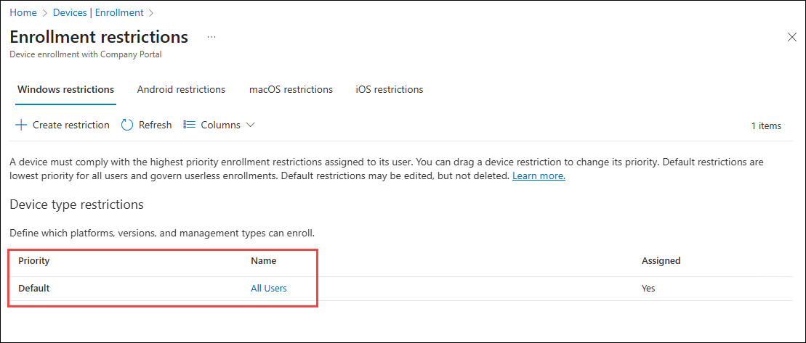

   > Notice that there is a Default device type restriction that is assigned to **All Users**. This default restriction allows all device types.

5. In the details pane, select the **Android restrictions** tab, and then select **Create restriction**.

   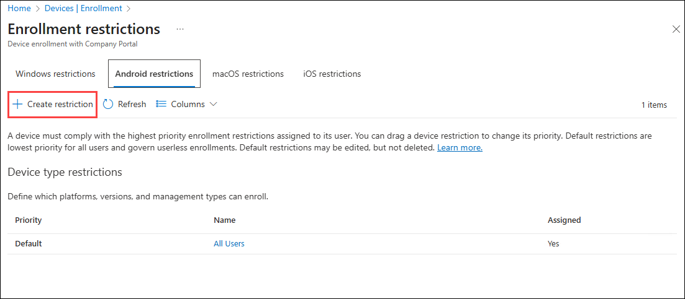

6. On the Create restriction page, in the Name box enter **Android Personal Device Restriction (1)**. Select **Next (2)**.

   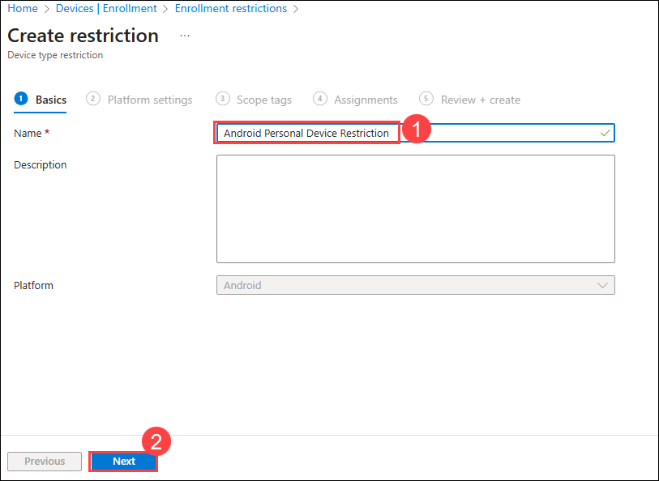

7. On the Platform settings page, under **Personally owned**, select **Block (1)** for the following device types and select **Next (2)**

   - Android Enterprise (work profile)
   - Android device administrator

     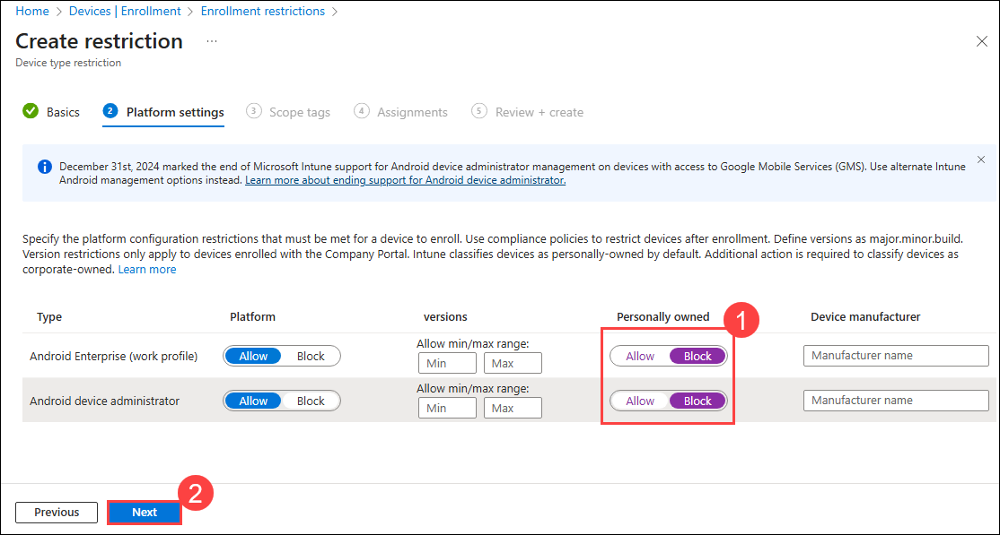

9. On the Scope tags page, select **Next**.

10. On the Assignments page, under Included groups, select **Add groups**.

    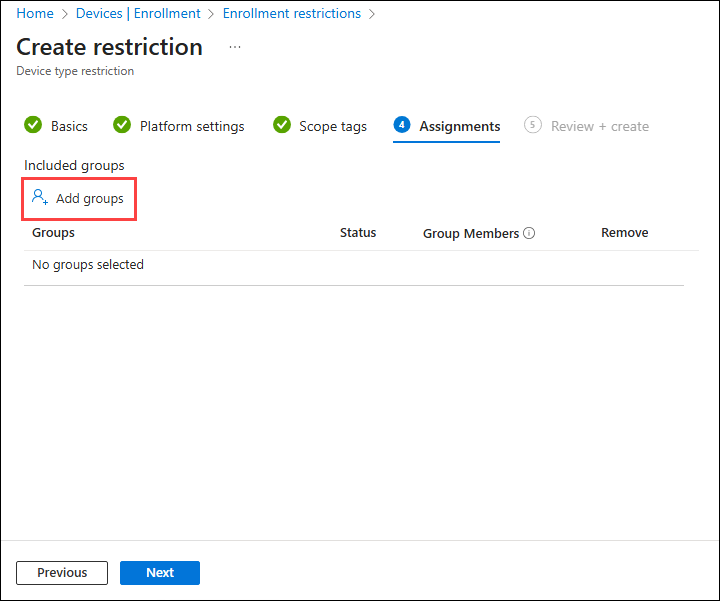

11. Search for and Select **Sales** and then click **Select** and then click **Next**.

    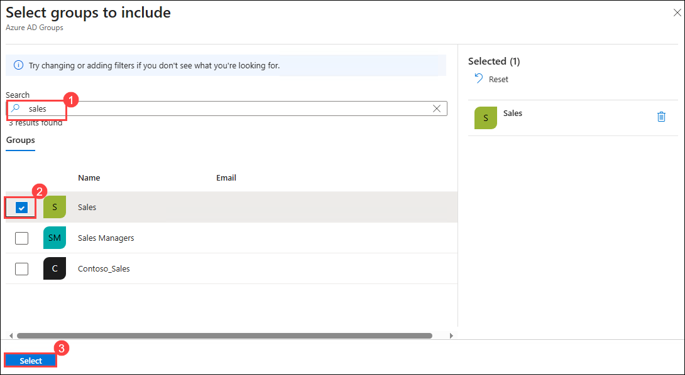

    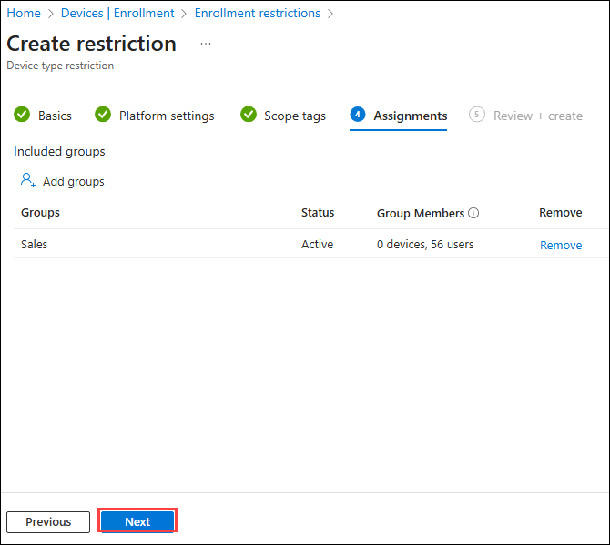

12. On the Review + create page, select **Create**.

    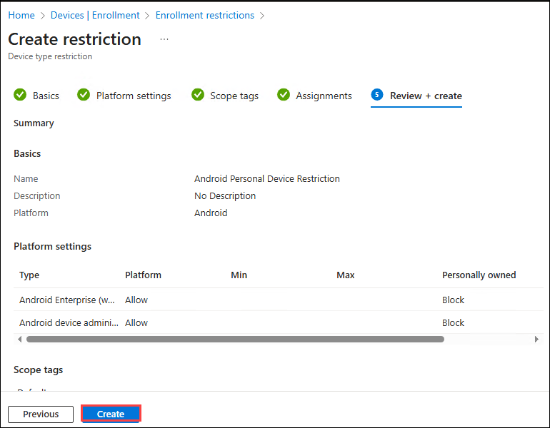

    > Notice the Android Personal Device Restriction assigned with a priority of 1.

13. On the **Enrollment (1)** pane, select **Device limit restrictions (2)**. 

      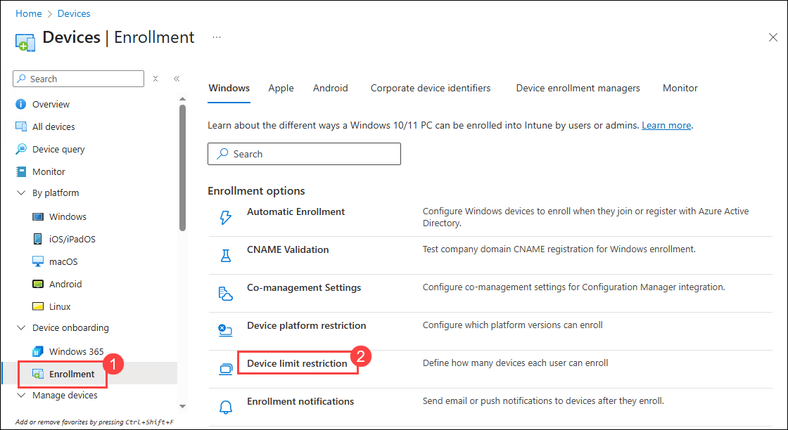

    > Notice that there is a Default device limit restriction that is assigned to **All Users**. This default restriction sets a device enrollment limit to 5 devices per user.

14. In the details pane, select **Create restriction**.

    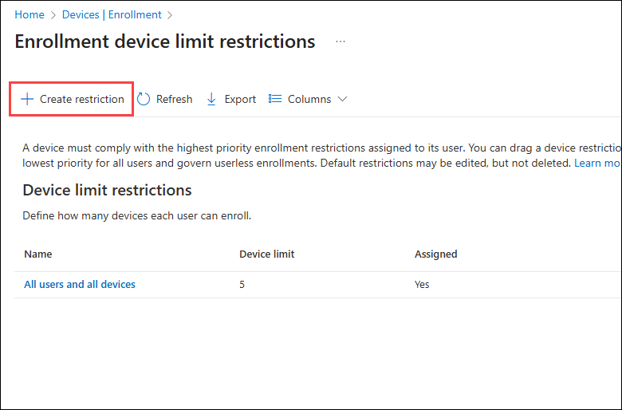

15. On the Create restriction page, in the Name box enter **Sales Device Enrollment Limit (1)**. Select **Next (2)**.

    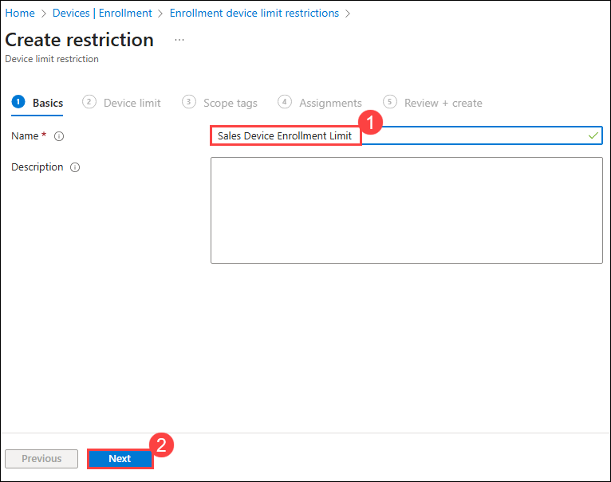

16. On the Device limit page, select **10 (1)** and then select **Next (2)**.

    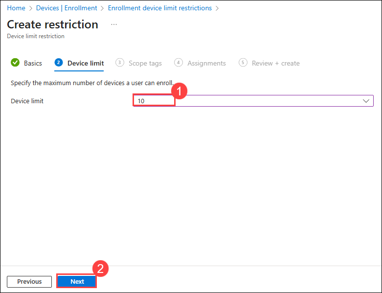

17. On the Scope tags page, select **Next**.

18. On the Assignments page, under Included groups, select **Add groups**.

     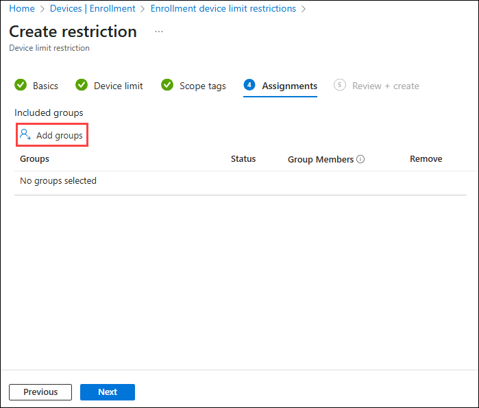

19. Search for and Select **Sales (1)** and then click **Select (2)** and then click **Next**.

     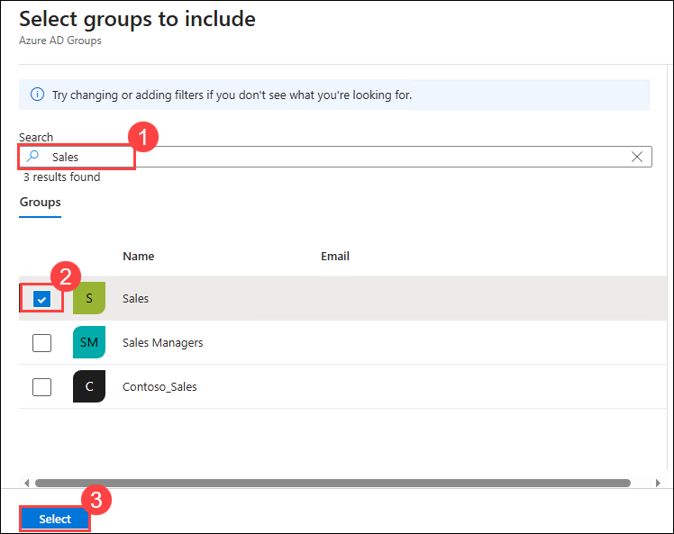

20. On the Review + create page, select **Create**.

    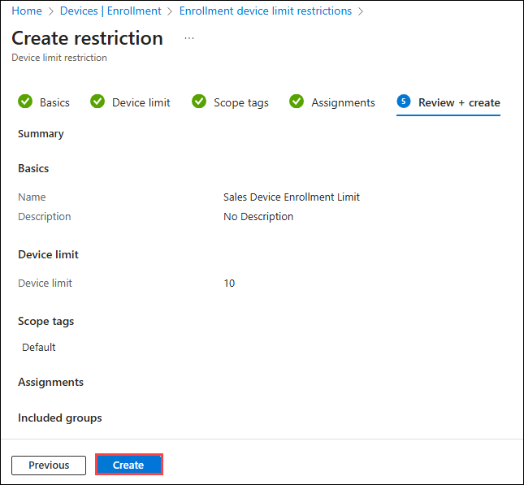

    > Notice the Sales Device Enrollment Limit, configured with a Device limit of 10 and assigned with a priority of 1.

### Task 4: Configure a Device enrollment manager

In this task you will configure a device enrollment manager by allowing Allan Deyoung to enroll up to 1000 devices into Intune.

1. In the Microsoft Intune admin center, select **Devices** onn the Devices pane, select **Enrollment** on the **Enroll devices** pane, select **Device enrollment managers** select **+ Add**.

   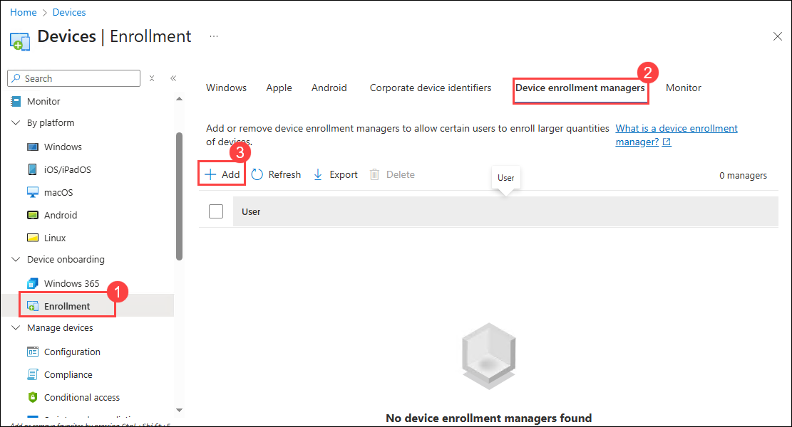
   
   > Notice that, by default, there are no Device enrollment managers configured.

5. In the **Add user** page, under User name, enter `AllanD@yourtenant.onmicrosoft.com` and then select **Add**.

   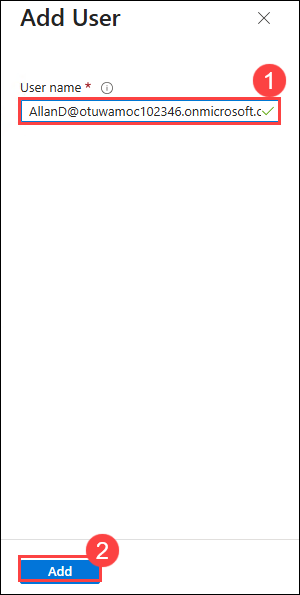

   > Allan is now allowed to enroll up to 1000 devices.

6. In the Microsoft Intune admin center, in the navigation pane, select **Home**.

7. Close Microsoft Edge.

**Results**: After completing this exercise, you will have successfully reviewed and assigned licenses, configured Windows automatic enrollment, enabled and assigned enrollment restrictions, and configured a Device enrollment manager.

**END OF LAB**
