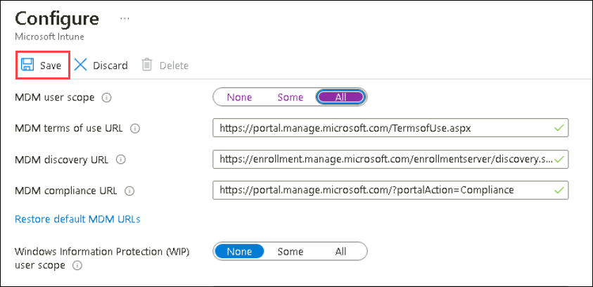
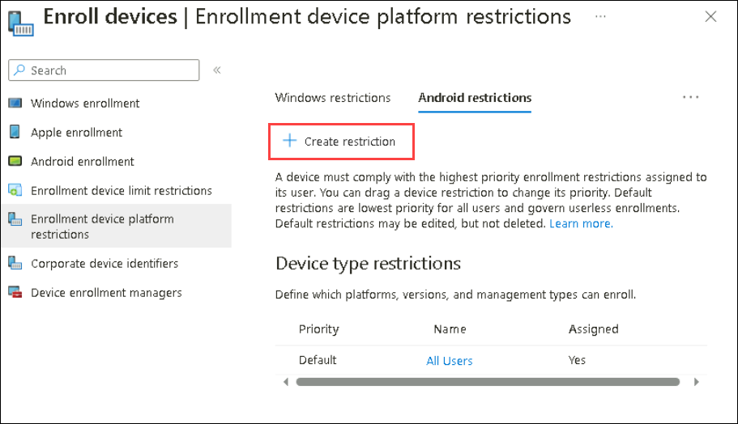

# Practice Lab: Manage Device Enrollment into Intune

## Summary

In this lab, you prepare for device management using Microsoft Intune by reviewing and assigning licenses, configuring Windows automatic enrollment, and configuring enrollment restrictions. 

### Prerequisites

To following lab(s) must be completed before this lab:

- 0101-Managing Identities in Azure AD

- 0102-Synchronizing Identities by using Azure AD Connect

  > Note: You will also need a mobile phone that can receive text messages used to secure Windows Hello sign in authentication to Azure AD.

### Scenario

You need to prepare for device management using Microsoft Intune. First of all, you need to ensure that users are assigned appropriate licenses for device management. As a verification test, you will assign Aaron Nicholls the required licenses. You also need to ensure that any Windows device that is joined or registered to Azure AD will automatically be enrolled into Intune. You have also been asked to ensure that members of the Sales group are restricted from enrolling personal Android and iOS devices into Intune and that the Enrollment Device Limit is increased to 10 devices. Finally, you need to configure Allan Deyoung as a Device enrollment manager to allow him to enroll 1000 devices.

### Task 1: Review and assign licenses for device management

1. On **SEA-SVR1**, if necessary, sign in as **Contoso\\Administrator** with the password of **Pa55w.rd** and close **Server Manager**.

2. On the taskbar select **Microsoft Edge**, in the address bar type **https://entra.microsoft.com**, and then press **Enter**.

3. Sign in as user **<inject key="AzureAdUserEmail"></inject>**, and use the tenant Admin password **<inject key="AzureAdUserPassword"></inject>**, If the **Stay signed in?** prompt appears, select **No**. 

   > The Microsoft Entra admin center opens.

4. In the navigation pane, Expand **Identity** and then select **Show more**.

5. Select **Billing** > **Licenses**.

6. On the **Licenses | Overview** page, under **Manage**, select **All products**. Take note of the licenses that are available in the tenant. 

7. Select **Enterprise Mobility + Security E5**. 
  
   > Notice all the users that have been assigned this license. You can assign and remove licenses from this location.

8. Under **General**, select **Service plan details**. Take note of the services included in the Enterprise Mobility + Security E5 license. Microsoft Intune is one of the supported services for this license.

9. In the Entra admin center navigation pane, under **Identity**, select **Users** > **All users**.

10. Select **Aaron Nicholls**.

11. In the Aaron Nicholls pane, select **Edit properties**.

12. Under Settings, in the **Usage location** field, select **United States** and then select **Save**.

    > Note: Before you can assign a license to a user, the user must have a usage location set.

13. In the Aaron Nicholls navigation pane, select **Licenses**.

14. In the Aaron Nicholls|Licenses pane, select **+ Assignments**.

15. In the **Update license assignments** page, select both **Enterprise Mobility + Security E5** and **Office 365 E5**, and then select **Save**.

### Task 2: Enable Windows Automatic Enrollment into Microsoft Intune

1. In **SEA-SVR1**, open a new tab in **Microsoft Edge**, and then in the address bar type **https://intune.microsoft.com**, and then press **Enter**. 

   > The Microsoft Intune admin center opens.

2. In the Microsoft Intune admin center, select **Devices**.

3. On the Devices pane, under **Device enrollment** select **Enroll devices**.

4. In the Enroll devices pane, select **Windows enrollment**.

5. In the General section, select **Automatic Enrollment**.

6. On the **MDM user scope** row, select **All** and then select **Save**.

     

   _**Note**: By performing this step, you enabled automatic enrollment into Intune for any User that performs an Azure AD join with a Windows device._

### Task 3: Configure Enrollment Restrictions

1. In the Microsoft Intune admin center, select **Devices**.

2. On the Devices pane, under **Device enrollment** select **Enroll devices**.

3. On the **Enroll devices** pane, note that you can create enrollment device limit and platform restrictions. 

4. Select **Enrollment device platform restrictions**. 

   > Notice that there is a Default device type restriction that is assigned to **All Users**. This default restriction allows all device types.

5. In the details pane, select the **Android restrictions** tab, and then select **+ Create restriction**.

   

6. On the Create restriction page, in the Name box enter **Android Personal Device Restriction**. Select **Next**.

7. On the Platform settings page, under **Personally owned**, select **Block** for the following device types:

   - Android Enterprise (work profile)
   - Android device administrator

8. On the Platform settings page, select **Next**.

9. On the Scope tags page, select **Next**.

10. On the Assignments page, under Included groups, select **Add groups**.

11. Search for and Select **Sales** and then click **Select** and then click **Next**.

12. On the Review + create page, select **Create**.

    > Notice the Android Personal Device Restriction assigned with a priority of 1.

13. On the **Enroll devices** pane, select **Enrollment device limit restrictions**. 

    > Notice that there is a Default device limit restriction that is assigned to **All Users**. This default restriction sets a device enrollment limit to 5 devices per user.

14. In the details pane, select **Create restriction**.

15. On the Create restriction page, in the Name box enter **Sales Device Enrollment Limit**. Select **Next**.

16. On the Device limit page, select **10** and then select **Next**.

17. On the Scope tags page, select **Next**.

18. On the Assignments page, under Included groups, select **Add groups**.

19. Search for and Select **Sales** and then click **Select** and then click **Next**.

20. On the Review + create page, select **Create**.

    > Notice the Sales Device Enrollment Limit, configured with a Device limit of 10 and assigned with a priority of 1.

### Task 4: Configure a Device enrollment manager

1. In the Microsoft Intune admin center, select **Devices**.

2. On the Devices pane, select **Enroll devices**.

3. On the **Enroll devices** pane, select **Device enrollment managers**. 

   > Notice that, by default, there are no Device enrollment managers configured.

4. On the **Enroll devices|Device enrollment managers** page, select **+ Add**.

5. In the **Add user** page, under User name, enter `AllanD@yourtenant.onmicrosoft.com` and then select **Add**.

   > Allan is now allowed to enroll up to 1000 devices.

6. In the Microsoft Intune admin center, in the navigation pane, select **Home**.

7. Close Microsoft Edge.

**Results**: After completing this exercise, you will have successfully reviewed and assigned licenses, configured Windows automatic enrollment, enabled and assigned enrollment restrictions, and configured a Device enrollment manager.

**END OF LAB**
