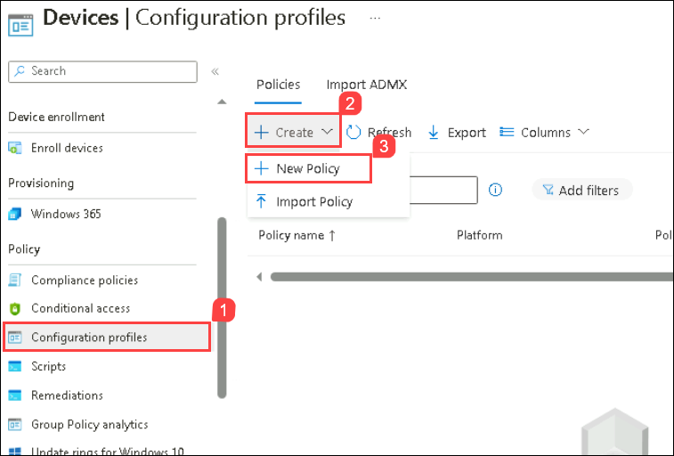
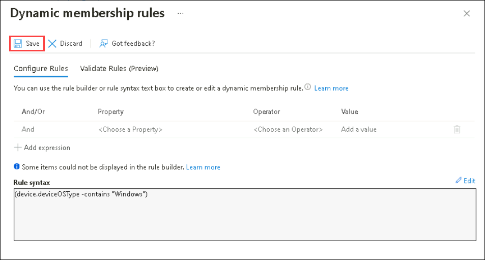

# Practice Lab: Creating and Deploying Configuration Profiles

## Summary

In this lab, you will use Microsoft Intune to create and apply a Configuration profile for a Windows 11 device.

### Prerequisites

To following lab(s) must be completed before this lab:

- 0101-Managing Identities in Azure AD

- 0102-Synchronizing Identities by using Azure AD Connect

- 0203-Manage Device Enrollment into Intune

- 0204-Enrolling devices into Intune

  > Note: You will also need a mobile phone that can receive text messages used to secure Windows Hello sign in authentication to Azure AD.

## Exercise 1: Create and apply a Configuration profile

### Scenario

You need to use Azure Active Directory (Azure AD) and Intune to manage members of the Developers department at Contoso . You have been asked to evaluate the solutions that would enable the users to work effectively and securely on Windows 11 devices. Aaron Nicholls has volunteered to help you test and evaluate the solution and provide feedback. He has also given you some initial requirements that must be included and applied to the developer's Windows devices:

- The Gaming section in Settings should not be visible.
- The Privacy section in Settings should be restricted as much as possible.
- The C:\DevProjects folder must be excluded from Windows Defender.
- The process devbuild.exe must be excluded from Windows Defender.
- Most used apps and Recently added apps should not be displayed on the Start menu.


### Task 1: Verify device settings

1. Switch to **HOSTVM** and Sign in to **SEA-WS1** VM from the desktop shortcut as **Aaron Nicholls** with the PIN **102938**

   >**Note** : Ensure that you are in basic session mode and able to view Clipboard in the menu bar as shown in the below image. If not please change it to the basic session by selecting the icon which was highlighted in the tool bar in the below image and then sign in with PIN.

   

3. On the taskbar, select **Start** and then select **Settings**.

4. On the **Settings** navigation list, verify that you can see the **Gaming** setting.

5. Select the **Personalization** setting and then on the Personalization page, select **Start**. Ensure that **Show recently added apps** and **Show most used apps** are both set to **On**.

6. In the **Settings** app, select **Privacy & security**.

7. On the **Privacy & security** page, take note of the options under **Security**, **Windows permissions**, and **App permissions**.

8. On the **Privacy & security** page, select **Windows Security** and then select **Open Windows Security**.

9. On the **Windows Security** page, select **Virus & threat protection**.

10. On the **Virus & threat protection** page, under **Virus & threat protection settings**, select **Manage settings** . 

11. Scroll down to **Exclusions** and select **Add or remove exclusions**. At the User Account Control, select **Yes**.

12. On the **Exclusions** page, verify that no exclusions have been configured.

13. Close the **Windows Security** window.

14. Close the **Settings** window.

### Task 2: Create a Configuration profile based on scenario requirements

1. Switch to **SEA-SVR1** and enter **Pa55w.rd** at the Password section.

2. On **SEA-SVR1**, on the taskbar, select **Microsoft Edge**.

3. In Microsoft Edge, type **https://intune.microsoft.com** in the address bar, and then press **Enter**. 

4. Sign in as user **<inject key="AzureAdUserEmail"></inject>**, and use the tenant Admin password **<inject key="AzureAdUserPassword"></inject>** 

5. In the Microsoft Intune admin center, select **Devices** from the navigation bar.

6. On the **Devices | Overview** page, select **Configuration Profiles**.

7. On the **Devices | Configuration profiles** blade, in the details pane, click on **Create** and select **+ New policy**.

   

8. In the **Create a profile** blade, select the following options, and then select **Create**:

   - Platform: **Windows 10 and later**
   - Profile type: **Templates**
   - Template name: **Device restrictions**

9. In the **Basics** blade, enter the following information, and then select **Next**:

- Name: **Contoso Developer - standard**
- Description: **Basic restrictions and configuration for Contoso Developers.**

10. On the **Configurations settings** blade, expand **Control Panel and Settings**. 

11. Select **Block** next to the **Gaming** and **Privacy** options.

12. On the **Device restrictions** blade, expand **Start**. 

13. Scroll down and select **Block** next to **Most used apps**, **Recently added apps** and **Recently opened items in Jump Lists**.

14. On the **Device restrictions** blade, scroll down and expand **Microsoft Defender Antivirus**. 

15. Under **Microsoft Defender Antivirus,** scroll down and expand **Microsoft Defender Antivirus Exclusions**.

16. Under **Microsoft Defender Antivirus Exclusions** in the **Files and folders** box, type the following:

    **C:\\DevProjects**.

17. In the **Processes** box, type the following:
    **DevBuild.exe**. 
18. Select **Next** three times until you reach the **Review + create** blade. Select **Create**.

### Task 3: Create the Contoso Developer device group

1. In the Microsoft Intune admin center, in the navigation pane, select **Groups**.

2. On the **Groups | All groups** blade, select **New group**.

3. On the **New Group** blade, enter the following information:

- Group type: **Security**
- Group name: **Contoso Developer devices**
- Group description: **All Windows devices in Contoso Developer department**
- Membership type: **Assigned**

4. Under **Members**, select **No members selected**. 

5. On the **Add members** blade, in the **Search** box type **Sea**. Select **SEA-WS1** and then choose **Select**.

6. On the **New Group** blade, select **Create**. 

7. On the **Groups | All groups** blade, verify that the **Contoso developer devices** group is displayed.

### Task 4: Create a dynamic Azure AD device group

1. On the **Groups | All Groups** blade, on the details pane, select **New group**.

2. On the **Group** blade, provide the following values:

   - Group type: **Security**
   - Group name: **Windows Devices**
   - Membership type: **Dynamic Device**

3. Under the **Dynamic Device Members** section, select **Add dynamic query**. 

4. On the **Dynamic membership rules** blade, in the **Rule syntax** section, select **Edit**. 
    
5. In the **Edit rule syntax** text box, add the following simple membership rule and select **OK**.

    ```
    (device.deviceOSType -contains "Windows")
    ```

6. On the **Dynamic membership rules** blade, select **Save**.

   

7. On the **New Group** page, select **Create**.

### Task 5: Assign a Configuration profile to Windows devices

1. In the Microsoft Intune admin center, in the navigation pane, select **Devices**. 

2. On the **Devices | Overview** blade, select **Configuration profiles**.

3. On the **Devices | Configuration profiles** blade, in the details pane, select the **Contoso Developer – standard** profile.

4. On the **Contoso Developer – standard** blade, scroll down to the **Assignments** section, and select **Edit**.

   

5. On the Assignments page, under **Included groups** select **Add groups**.

6. On the **Select groups to include** blade, in the **Search** box, select **Contoso Developer devices** and then select **Select**.

7. Back on the **Device restrictions** blade, select **Review + save**, then select **Save**.

8. In the Microsoft Intune admin center, select **Devices** in the breadcrumb navigation menu.

### Task 6: Verify that the Configuration profile is applied

1. Switch to **HOSTVM** and sign in to **SEA-WS1** VM from the desktop shortcut.

2. On **SEA-WS1**, on the taskbar, select **Start** and then select **Settings**.

3. In **Settings**, select **Accounts** and then select **Access work or school**.

4. In the **Access work or school** section, select the **Connected to Contoso's Azure AD** link and then select **Info**.

5. In the **Managed by Contoso** page, scroll down and then under Device sync status, select **Sync**. Wait for the synchronization to complete. 

6. Close the **Settings** app.

   _Note: The sync progress may take up to 15 minutes before the profile is applied to the Windows 11 device. Signing out or restarting the device can accelerate this process. PIN **102938**_

7. On **SEA-WS1**, select **Start** and then select **Settings**. Verify that the **Gaming** setting has been removed.

8. Select **Privacy & security** and notice that many of the privacy settings are now hidden. 

9. Select the **Personalization** setting and then select **Start**. Verify that **Show recently added apps** and **Show most used apps** are set to **Off**. 

10. In the **Settings** app, select **Privacy and Security**.

11. On the **Privacy & Security** page, select **Windows Security** and then select **Open Windows Security**.

    

12. On the **Windows Security** page, select **Virus & threat protection**.

13. On the **Virus & threat protection** page, select **Manage settings** under **Virus & threat protection settings**. 

14. Scroll down to **Exclusions** and select **Add or remove exclusions**. Select **Yes** at the User Account Control message.

15. On the **Exclusions** page, verify that **C:\\DevProjects** and **DevBuild.exe** are displayed.

16. Close the **Windows Security** page and then close the **Settings** app.

**Results**: After completing this exercise, you will have successfully created and assigned a Configuration profile for a Windows 11 device.

## Exercise 2: Modify an assigned Configuration profile policy  

### Scenario

There was an exception to Contoso's policy that specifies that members of the Developer department should not have the Privacy options blocked in Settings on their devices. This change should be implemented and tested.

### Task 1: Change settings in an assigned Configuration profile

1. Switch to **SEA-SVR1** and use password **Pa55w.rd** to login.

2. On **SEA-SVR1**, in the Microsoft Intune admin center, select **Devices** and then select **Configuration Profiles**. 

3. On the **Devices | Configuration profiles** blade, in the details pane select **Contoso Developer -  standard**.

4. On the **Contoso Developer - standard** blade, scroll down to the **Configuration settings** section, and then select **Edit**.

5. On the **Device restrictions** page, expand **Control Panel and Settings**. 

6. Next to **Privacy**, select **Not configured**. 

7. Select **Review + save**, and then select **Save**.

### Task 2: Force device synchronization from Intune Manager admin center

1. On **SEA-SVR1**, in the Microsoft Intune admin center, select **Devices** in the navigation pane and then select **All devices**.
    
2. In the details pane, select **SEA-WS1**. 
    
3. On the **SEA-WS1** blade, select **Sync** and when prompted select **Yes**. 

    

   _Note: Intune will contact the device and tell it to synchronize all policies. This may take up to 5 minutes._

4. Close Microsoft Edge.

### Task 3: Verify changes on SEA-WS1

1. Switch to **HOSTVM** and sign in to **SEA-WS1** VM from desktop shortcurt.

2. On **SEA-WS1** and on the taskbar, select **Start** and then select the **Settings** app.

3. In the **Settings** app, select **Privacy & security** and verify that all of the customization options are back.

4. Close all open windows and sign out of **SEA-WS1**.

**Results**: After completing this exercise, you will have successfully modified an assigned a Configuration profile, modified a Configuration profile, and verified the changes.

**END OF LAB**
