# Practice Lab: Using a Configuration policy to configure iOS and iPadOS Wi-Fi settings

## Summary

In this lab, you use Microsoft Intune to create and apply a Configuration policy to run configure Wi-Fi settings for iOS and iPadOS devices.

## Exercise 1: Creating a Configuration policy

### Scenario

You have been asked to create a Configuration policy to be used to automatically configure Wi-Fi settings for enrolled iOS and iPadOS devices. You need to ensure that the Wi-Fi settings are configured as follows:

- Network name: **Contoso Wi-Fi**
- SSID: **MainOffice**
- Connect automatically: **Enable**
- Security type: **WPA/WPA2-Personal**
- Pre-Shared key: **ContosoWiFi123**
- Assigned to: A new security group named **iOS_iPadOS Devices**

### Task 1: Create the iOS_iPadOS device group

In this task you will create a new Intune security group named iOS_iPadOS Devices to hold the Apple devices that will receive the Wi-Fi configuration profile.

1. Switch to **SEA-SVR1** and sign in as **Contoso\Administrator** with the password of **Pa55w.rd**. Close Server Manager.

    

    

2. On **SEA-SVR1**, on the taskbar, select **Microsoft Edge**.

3. In Microsoft Edge, type **https://intune.microsoft.com** in the address bar, and then press **Enter**. 

4. Sign in as user **<inject key="AzureAdUserEmail"></inject>**, and use the tenant Admin password **<inject key="AzureAdUserPassword"></inject>**

5. In the Microsoft Intune admin center, in the navigation pane, select **Groups (1)** on the **Groups | All groups (2)** blade, select **New group (3)**.

    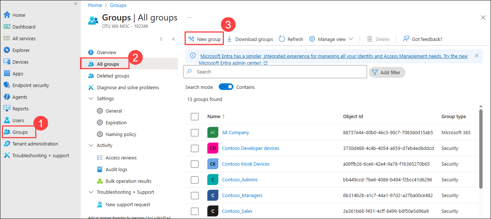

7. On the **New Group** blade, enter the following information:

    - Group type: **Security**
    - Group name: **iOS_iPadOS Devices**
    - Group description: **All iOS and iPadOS devices**
    - Membership type: **Assigned**
    - On the **New Group** blade, select **Create**. 

      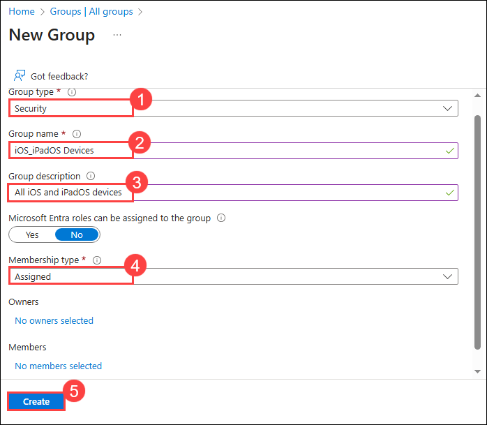

9. On the **Groups | All groups** blade, verify that the **iOS_iPadOS Devices** group is displayed. You may need to select the Refresh button for the new group to become visible.

    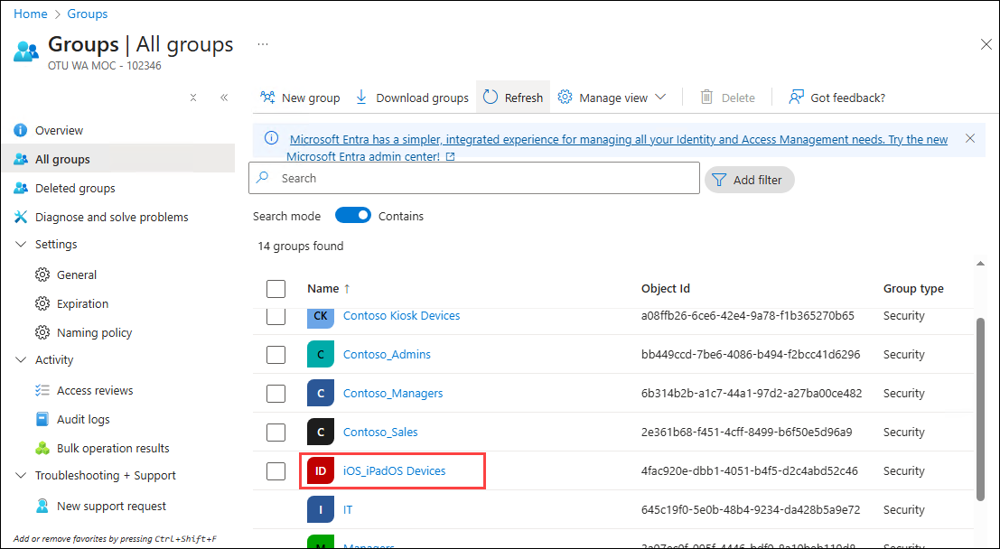

### Task 2: Create a Configuration policy based on scenario requirements

In this task you will create and assign an Intune configuration profile that automatically configures Wi-Fi settings for iOS and iPadOS devices.

1. In the Microsoft Intune admin center, select **Devices** from the navigation bar.

2. On the **Devices | Overview** page, scroll down and select **Configuration**.

3. On the **Devices | Configuration** blade, in the details pane, click on **Create** and select **+ New policy**.

    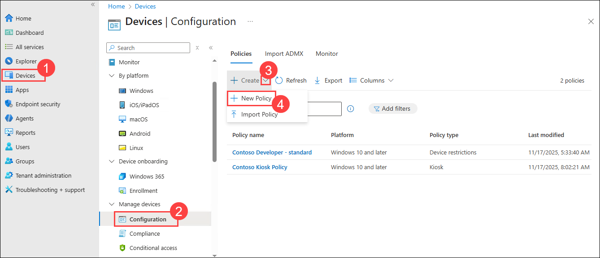

4. In the **Create a profile** blade, select the following options, and then select **Create**:

    - Platform: **iOS/iPadOS (1)**
    
    - Profile type: **Templates (2)**
    
      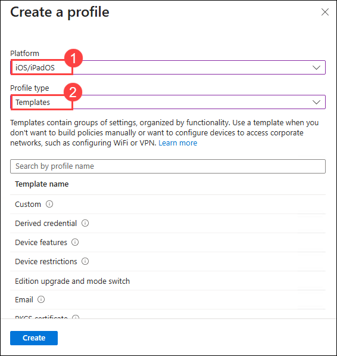

5. Select **Wi-Fi (1)** from the list of templates, and then select **Create (2)**.

     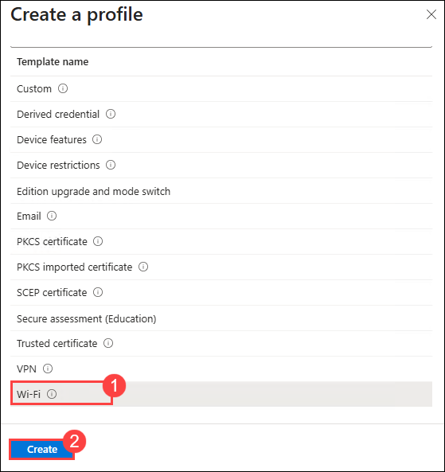

6. In the **Basics** blade, enter the following information, and then select **Next (3)**:

    - Name: **iOS/iPadOS Wi-Fi Policy (1)**
    - Description: **Wi-Fi settings for iOS/iPadOS Devices. (2)**

        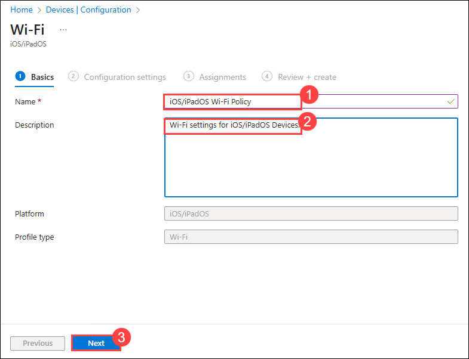

7. On the **Configuration settings** blade, next to **Wi-Fi type**, select **Basic (1)**. 

   > Additional options display based upon the type selected.

8. On the **Configuration settings** blade, select the following options, and then select **Next**:

    - Network name: **Contoso Wi-Fi (2)**
    - SSID: **MainOffice (3)**
    - Connect automatically: **Enable (4)**
    - Security type: **WPA/WPA2-Personal (5)**
    - Pre-Shared key: **ContosoWiFi123 (6)**

        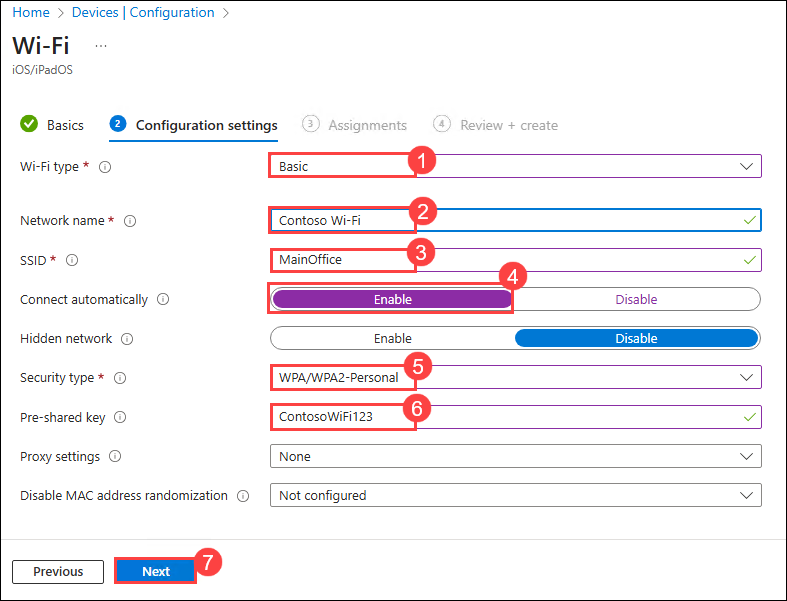

9. On the **Assignments** blade, under **Included groups**, select **Add groups**.

    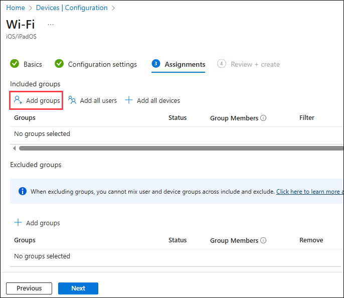

10. In the **Select groups to include** window, select **iOS_iPadOS Devices**, and then click **Select**.

    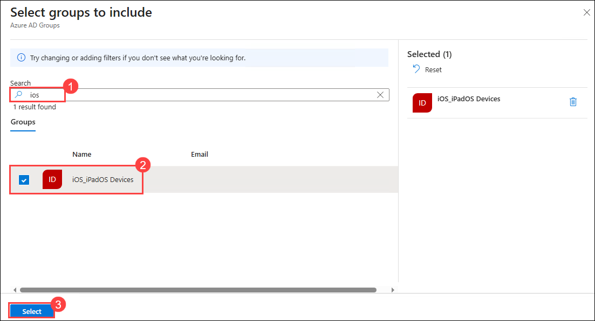

11. Select **Next** until you reach the **Review + create** blade. Select **Create**.

    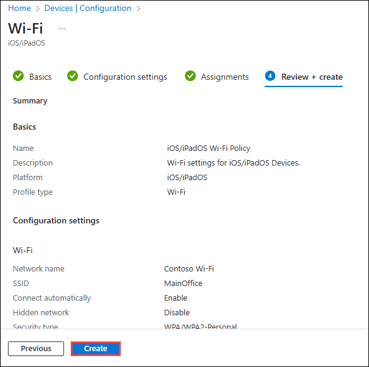

12. Refresh the **Devices | Configuration** blade, and verify that the **iOS/iPadOS Wi-Fi Policy** is listed. 

13. Close the Edge browser.

**Results**: After completing this exercise, you will have successfully created and assigned a Configuration policy to configure Wi-Fi settings for iOS and iPadOS devices.

**END OF LAB**
