# Lab 10: Using Group Policy Analytics to validate GPO support in Intune

## Summary

In this lab, you use Group Policy Analytics to import an Active Directory Group Policy Object (GPO) and identify settings that support equivalent Microsoft Intune MDM policy.

> **!IMPORTANT**: Once you launch the track, you’ll have access to a virtual machine (VM) for **40 hours**. The displayed track duration of **4 days 8 hours (104 hours)** indicates the time frame during which you can use your VM. Please plan your lab sessions accordingly. If the VM uptime of **40 hours** is fully exhausted before completing the labs, access will be lost. To avoid this and for detailed instructions on VM usage and stopping/deallocating the VM, refer to the Getting Started page.  

> If the full 40 hours of VM uptime is exhausted, the VM will no longer be accessible, and **the lab duration cannot be extended**.

### Scenario

Contoso has traditionally used Active Directory GPOs to deploy computer and user policy settings throughout the domain. You plan to move all supported GPO settings to Microsoft Intune configuration policies. You have a GPO named **Windows Client Policy**. You need to use Group Policy Analytics to validate the settings in the Windows Client Policy GPO and identify which settings can be successfully migrated into Intune.

### Task 1: Export the Windows Client Policy GPO to an XML file

In this task you will export the Windows Client Policy GPO from Active Directory to an XML file so it can be analyzed in Intune.

1. Switch to **SEA-SVR1** and, if necessary, sign in as **Contoso\Administrator** with the password of **Pa55w.rd**. 

    

    

2. If necessary, open **Server Manager**.

   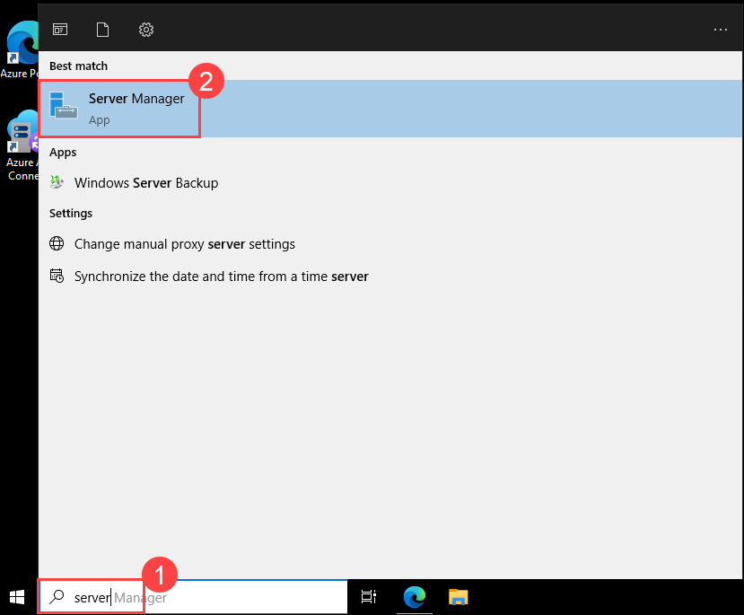

3. In Server Manager, select **Tools (1)** located in top right and then select **Group Policy Management (2)**.

   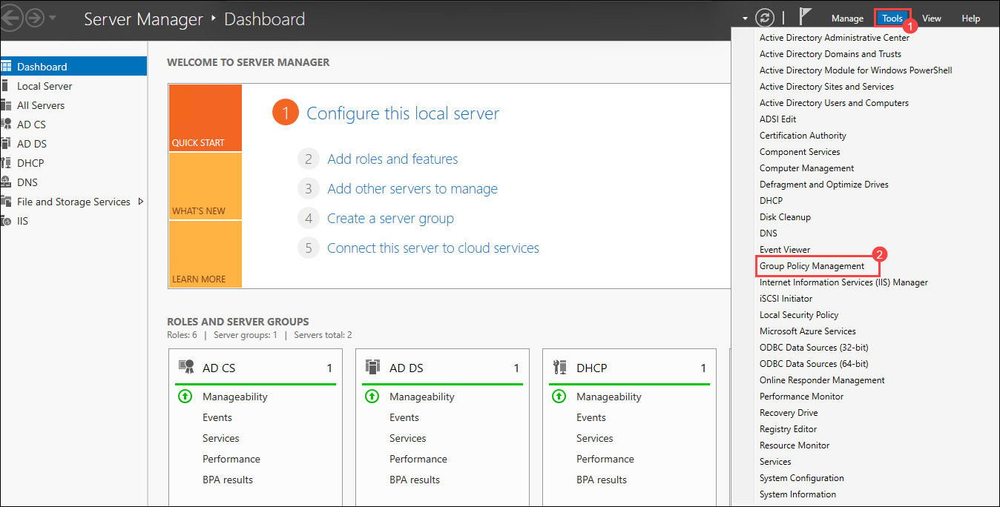

4. In the Group Policy Management console, expand **Forest:Contoso.com**, **Domains**, **Contoso.com**, and then select **Group Policy Objects**.

   > Verify that there are several Group Policy Objects listed.

5. In the details pane, select the **Windows Client Policy** GPO.

   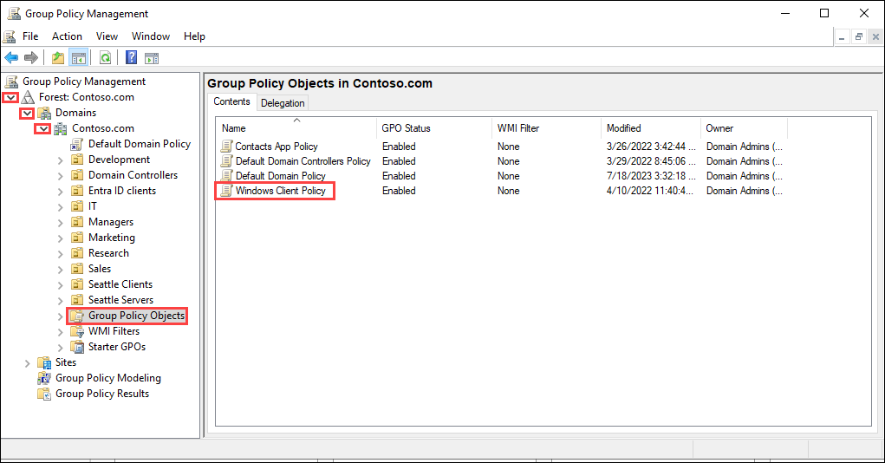

6. Right-click **Windows Client Policy (1)** and then select **Save Report (2)**.

   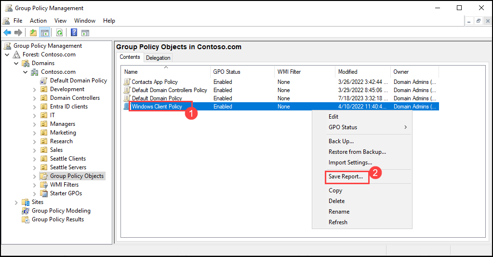

7. In the Save GPO Report dialog box, select **Documents**, change the **Save as type** to **XML file**, and then select **Save**.

   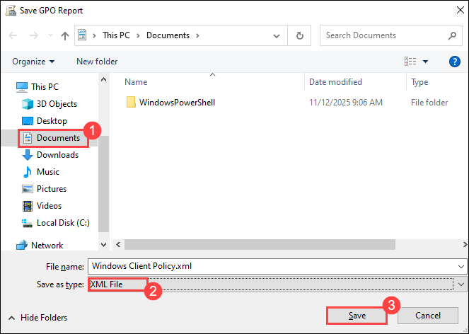

8. Close the Group Policy Management console.

9. Close Server Manager.

### Task 2: Analyze the Windows Client GPO using Group Policy Analytics

In this task you will import the exported GPO into Group Policy Analytics and review which settings are supported for migration to Intune.

1. On **SEA-SVR1**, on the taskbar, select **Microsoft Edge**.

    

2. In Microsoft Edge, type **https://intune.microsoft.com** in the address bar, and then press **Enter**. 

3. Sign in as user **<inject key="AzureAdUserEmail"></inject>**, and use the tenant Admin password **<inject key="AzureAdUserPassword"></inject>**

4. In the **Microsoft Intune admin center**, in the navigation pane select **Devices (1)**, then on the **Devices | Overview** page in the **Manage devices** section select **Group Policy analytics (2)**, and on the **Devices | Group Policy analytics** blade select **Import (3)**.

   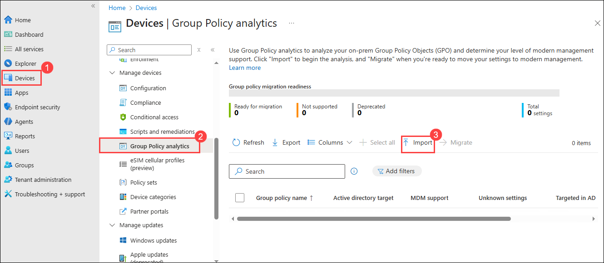

7. On the Import GPO files page, click the **Select a file** button.

   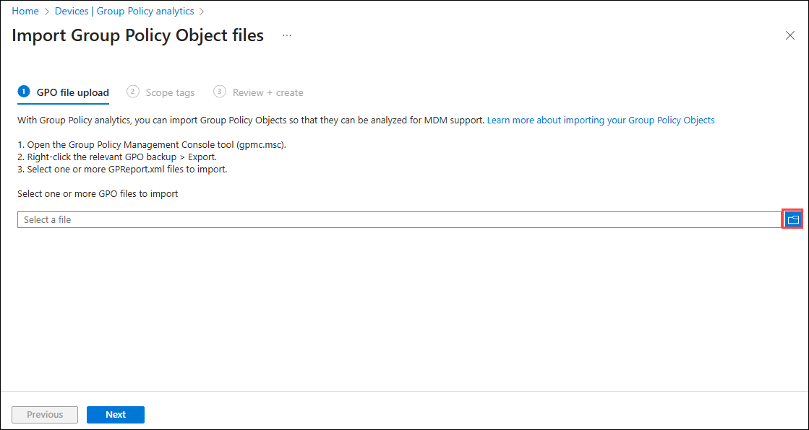

8. In the **Open** box, select **Documents (1)** and then select **Windows Client Policy.xml (2)**. Select **Open (3)**.

   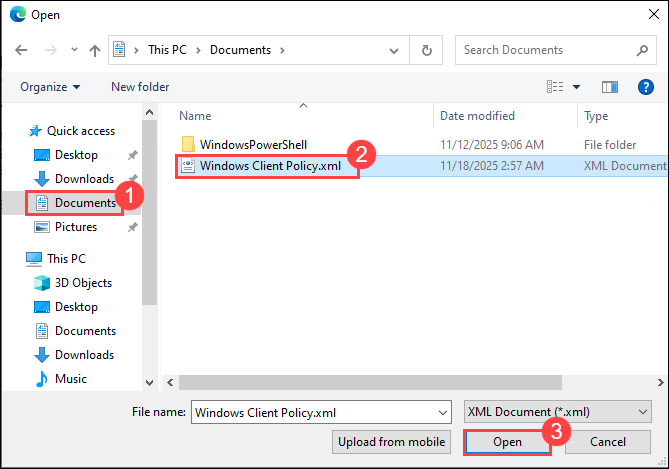

   > The Windows Client Policy GPO is immediately imported and analyzed.

9. Select Next twice, then select **Create**.

   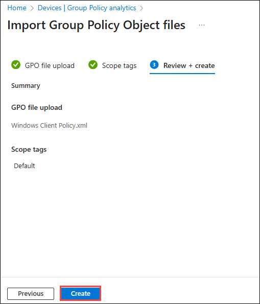

   > The Windows Client Policy GPO is imported and analyzed. It may take a few minutes to complete.

10. Close the **Import GPO files** page.

11. On the **Devices | Group Policy analytics** blade, review the information next to **Windows Client Policy**.

    > Notice that 89% of the settings have MDM support.

12. Under MDM Support, select **89%**. 

    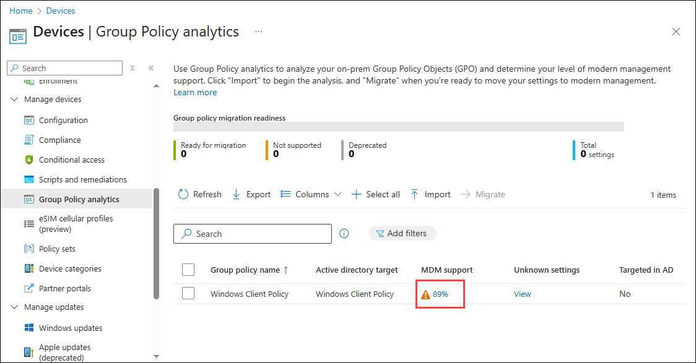

    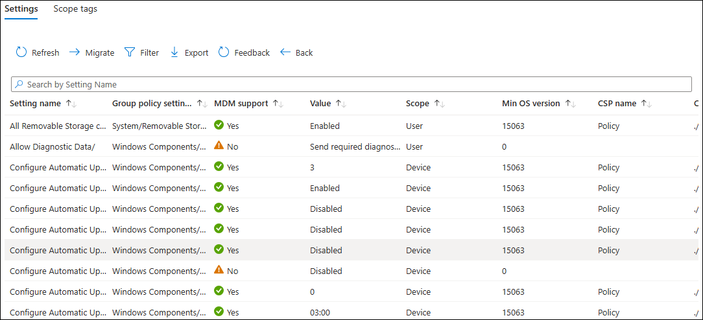

    > Notice each **Setting Name**, **MDM Support**, **CSP Name**, and the **CSP Mapping** for each supported setting. Take note of which settings do not have an equivalent CSP mapping.

### Task 3: Review the Group Policy Analytics Summary Report

In this task you will review the Group Policy Analytics summary reports to understand overall migration readiness and CSP support for the GPO settings.

1. In the **Microsoft Intune admin center**, in the navigation pane select **Reports**, then on the **Reports** page in the **Device management** section select **Group Policy analytics**, and in the details pane under **Summary** select **Refresh**.

   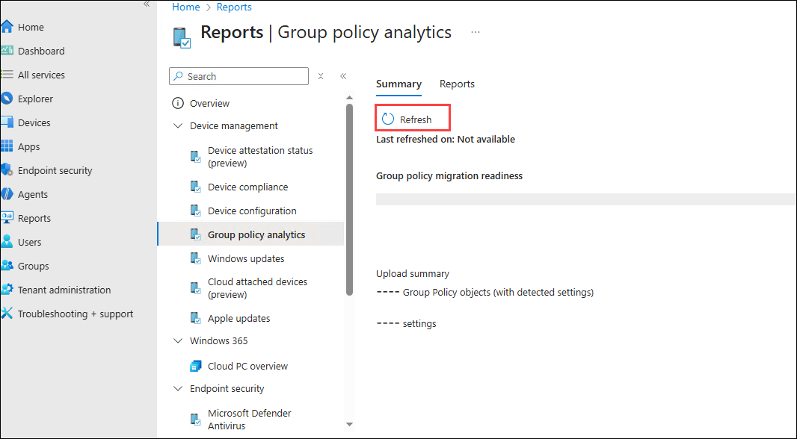

   > It may take several minutes to refresh and build the summary report. You may need to refresh several times.

4. Review the **Group policy migration readiness** information.

   > There should be a number of policies ready for migration and a number of policies not supported.

5. On the **Reports | Group policy analytics (1)** blade, select **Reports (2)** tab, and then select **Group policy migration readiness (3)**.

    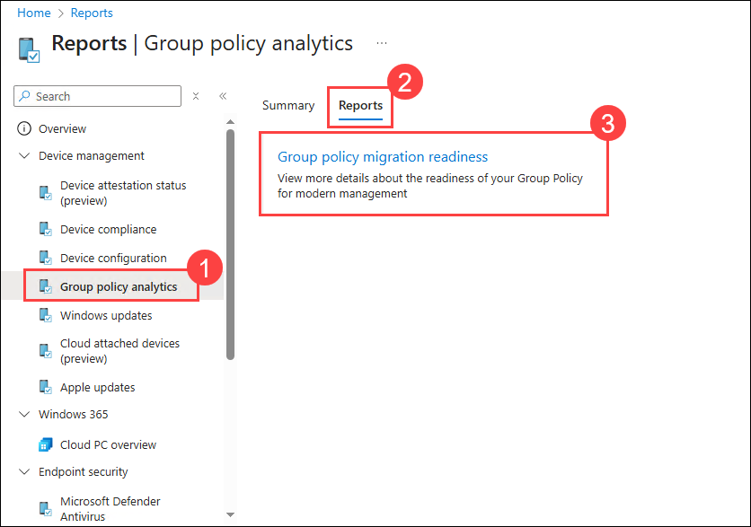

   > The Group policy migration readiness report provides information related to each setting, and the Profile Type supported.

6. Select **Generate again**. 

   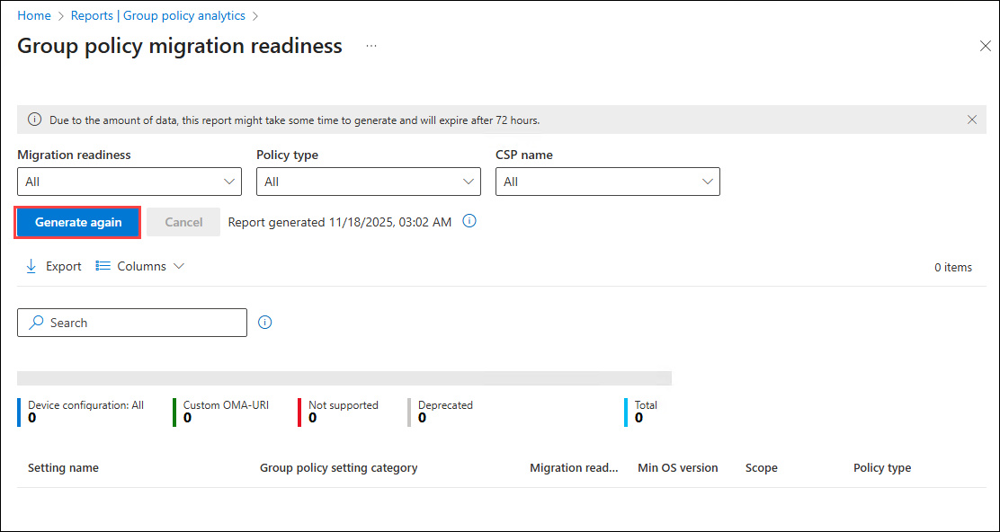

7. The Group policy migration readiness report provides information related to each setting, and the Profile Type supported.

   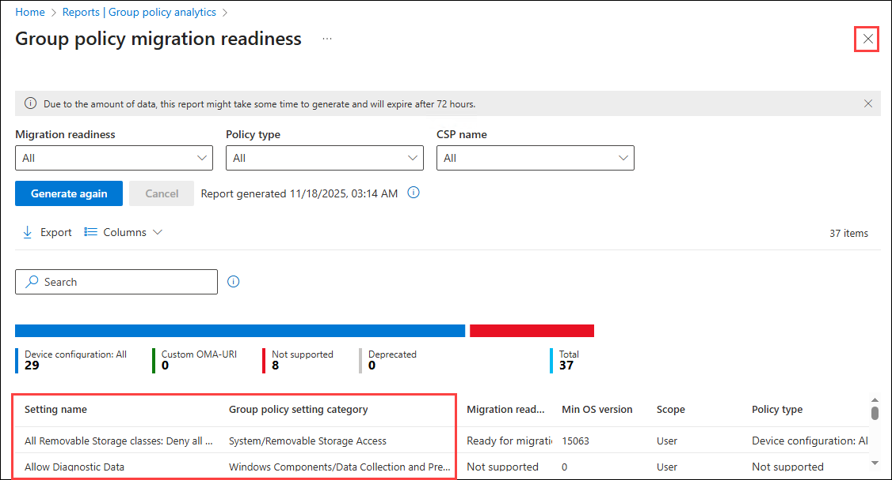

8. Close the **Group policy migration readiness** window.

9. Close Microsoft Edge.

**Results**: After completing this exercise, you will have successfully exported a GPO and used Group Policy Analytics to validate equivalent policy settings in Intune.

Click on **Next** from the lower right corner to move on to the next page.

  
