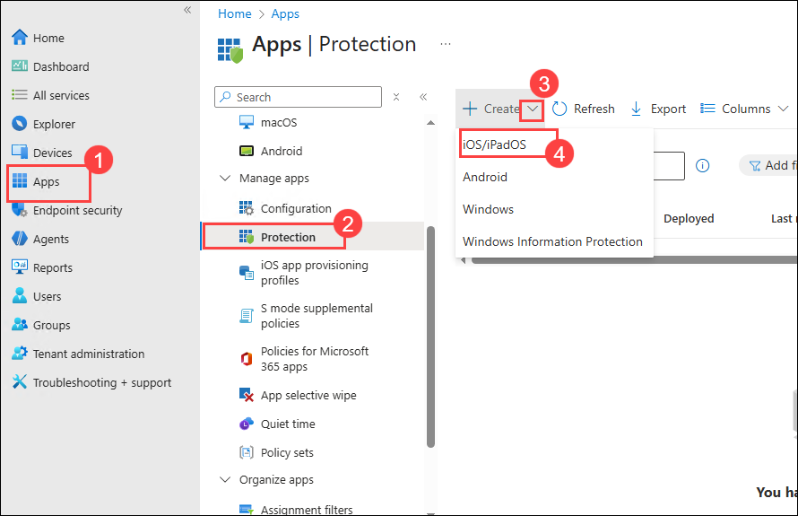
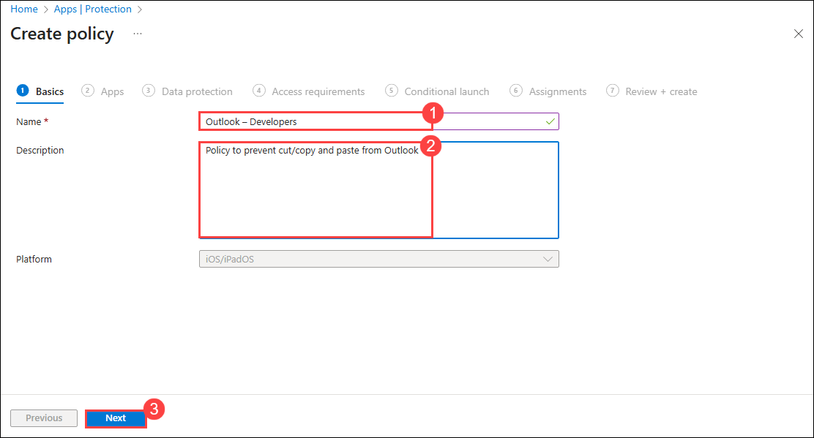
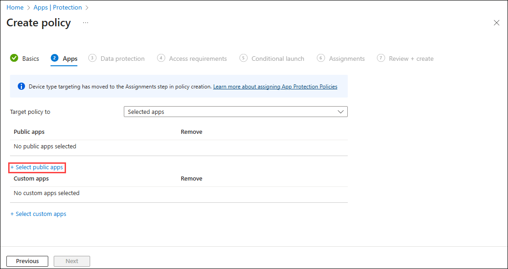
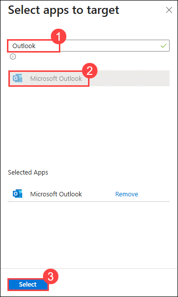
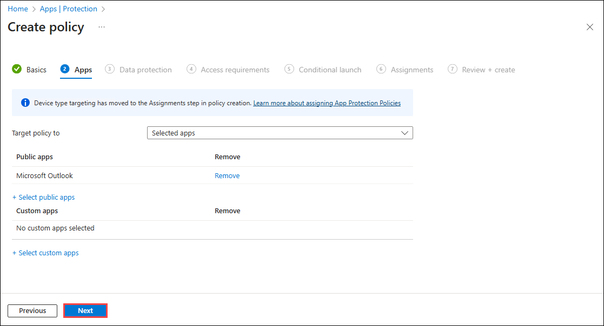
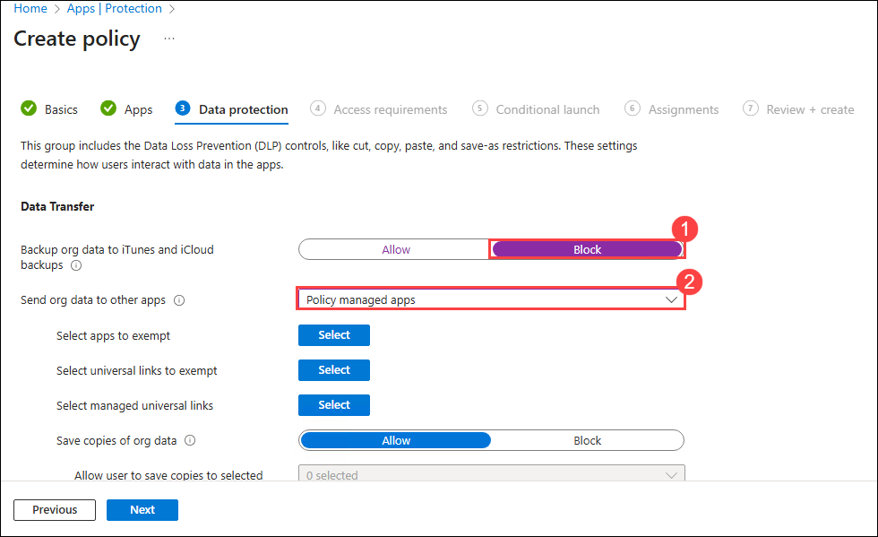
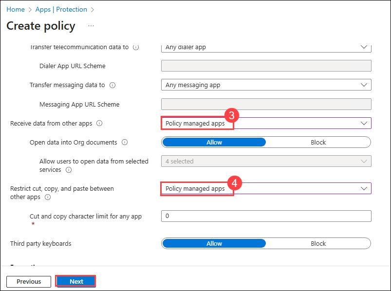
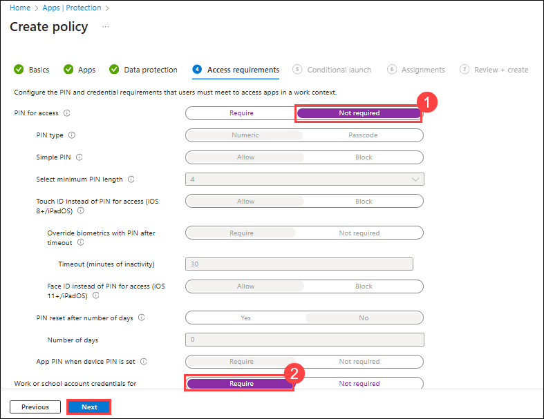
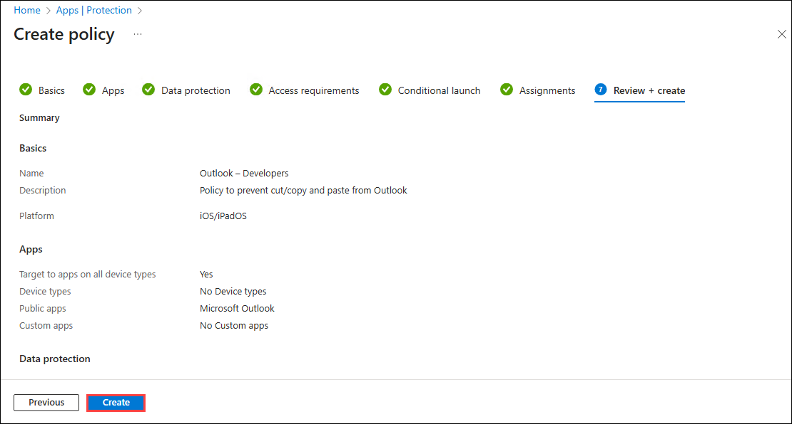
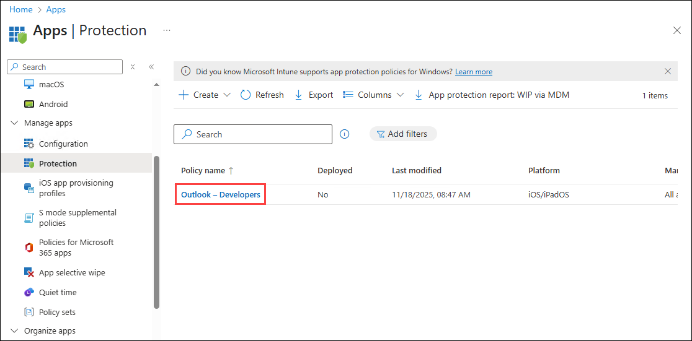

# Practice Lab: Configure App Protection Policies for Mobile Devices

## Summary

In this lab, you will configure an App protection policy for a mobile device.

### Scenario

All of the developers at Contoso have iPhones and iPads running the latest iOS/iPadOS versions. The security department in is concerned with data leaks and wants to prevent data from the corporate e-mail to be copied out to other apps on the mobile devices. You must provide a solution that addresses the concerns from the security department. You need to ensure the following:

- Outlook data must be restricted from backing up to iTunes or iCloud.
- Only policy managed apps can send and receive data from Outlook.
- Only policy managed apps can cut, copy, or paste with Outlook.
- Users must provide their Work or school account credentials for access to Outlook.

### Task 1: Create an App protection policy for iOS/iPadOS devices

1. On **SEA-SVR1**, if necessary, sign in as **Contoso\\Administrator** with the password **Pa55w.rd** and close **Server Manager**.
    
2. On the taskbar, select **Microsoft Edge**.

3. In Microsoft Edge, type **https://intune.microsoft.com** in the address bar, and then press **Enter**. 

4. Sign in as user **<inject key="AzureAdUserEmail"></inject>**, and use the tenant Admin password **<inject key="AzureAdUserPassword"></inject>**

5. On the **Microsoft Intune admin center** page select **Apps (1)**, then on the **Apps | Overview** blade under **Manage apps** select **Protection (2)**, and in the details pane select **+ Create policy (3)** and then **iOS/iPadOS (4)**.

    

8. On the **Basics** tab, configure the following options and select **Next (3)**:

    - Name: **Outlook – Developers (1)**
    - Description: **Policy to prevent cut/copy and paste from Outlook (2)**

      

9. On the **Apps** tab, click **+ Select public apps**.

    

10. On the **Select apps to target** blade, in the text box, type **Outlook (1)**. Select **Microsoft Outlook (2)** and then select **Select (3)**, and then select **Next**.

    

    

11. On the **Data protection** tab, configure the following options and select **Next**:

    - Backup Org data to ITunes and iCloud backups: **Block (1)**
    - Send Org data to other apps: **Policy managed apps (2)**
    - Receive data from other apps: **Policy managed apps (3)**
    - Restrict cut, copy, and paste between other apps: **Policy managed apps (4)**
    - Save all other settings at default

        

        

12. On the **Access requirements** tab, configure the following options and select **Next**:

    - PIN for access: **Not required (1)**
    - Work or school account credentials for access: **Require (2)**

        

13. On the **Conditional launch** tab, review the settings. Select **Next**.

    _Note: Here you can set the sign-in security requirements for your access protection policy. You can select a setting and enter the value that users must meet to sign in to your company app. Make note of the various settings but do not change anything._

14. On the **Assignments** tab, select **Next**. 

15. On the **Review + create** tab, review the settings and select **Create**. 

    

17. On the **Apps | App protection policies** blade, in the details pane, verify that **Outlook - Developers** is listed.

    

18. Close Microsoft Edge.

**Results**: After completing this exercise, you will have successfully configured an App protection policy for a mobile device.

**END OF LAB**
