# Practice Lab: Configuring Multi-factor Authentication

## Summary

In this lab, you will configure per-user multi-factor authentication (MFA) and apply MFA using a conditional access policy .

### Prerequisites

You will need a mobile phone that can receive text messages used to secure Windows Hello sign in authentication to Entra ID

## Exercise 1: Configure per-user multi-factor authentication

### Scenario

To provide additional security for user sign on events, you need to configure and test multi-factor authentication (MFA). You decide to first test out per-user MFA. Alex Wilber has agreed to validate the settings for you. 

### Task 1: Validate sign-in before enabling MFA

In this task you will sign in as Alex Wilber to confirm that he can access Outlook using only his password before MFA is enabled.

1. Switch to **SEA-WS3** and sign in as **Admin** with the password **Pa55w.rd**. 

2. On the taskbar, select **Microsoft Edge**.

3. In the address bar, enter **outlook.office.com** and press Enter.

   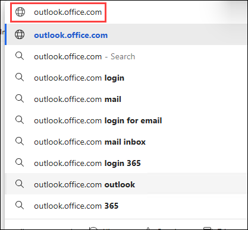
  
4. At the **Sign in** page, enter **`AlexW@yourtenant.onmicrosoft.com` (1)** and then select **Next (2)**.

     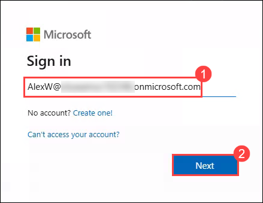

    >**Note** : Replace **yourtenant** with tenant name provided to you.

5. On the **Enter password (1)** page, enter **Pa55-w.rd!** and select **Sign in (2)**. At the Edge Save password prompt, select **Save & Turn on**.

    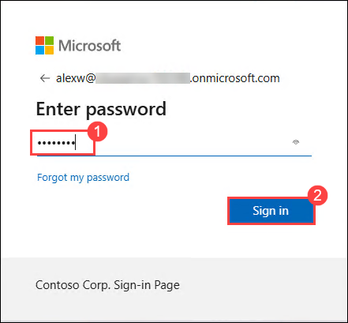

6. At the **Stay signed in** prompt, select **No**.

   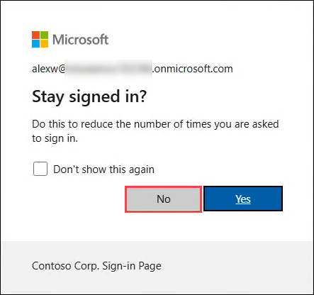

   > Outlook on the Web opens. Take note that only the password was required to sign in to Outlook on the Web.

7. At the top-right corner, select the **Account manager for Alex Wilber (1)** and then select **Sign out (2)**.

   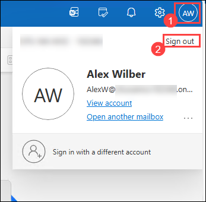

8. Close Microsoft Edge.

### Task 2: Enable MFA for a user

In this task you will enable per-user MFA for Alex Wilber and configure the service settings required for MFA.

1. Switch to **SEA-SVR1**.

2. On **SEA-SVR1**, if necessary, sign in as **Contoso\\Administrator** with the password of **Pa55w.rd** and close **Server Manager**.

3. On the taskbar select **Microsoft Edge**, in the address bar type **https://entra.microsoft.com**, and then press **Enter**.

   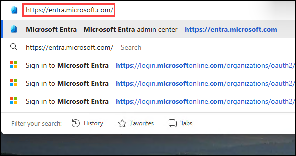

4. Sign in as user **<inject key="AzureAdUserEmail"></inject>** and use the tenant Admin password  **<inject key="AzureAdUserPassword"></inject>**. If the **Stay signed in?** prompt appears, select **No**. 

   > The Microsoft Entra admin center opens.

5. At the top of the web page, In the search resources box, type multifactor authentication and then select **multifactor authentication**.

    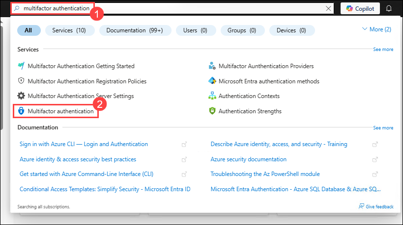

   > The multi-factor authentication page opens.

6. Select **Additional cloud-based multifactor authentication settings**.

   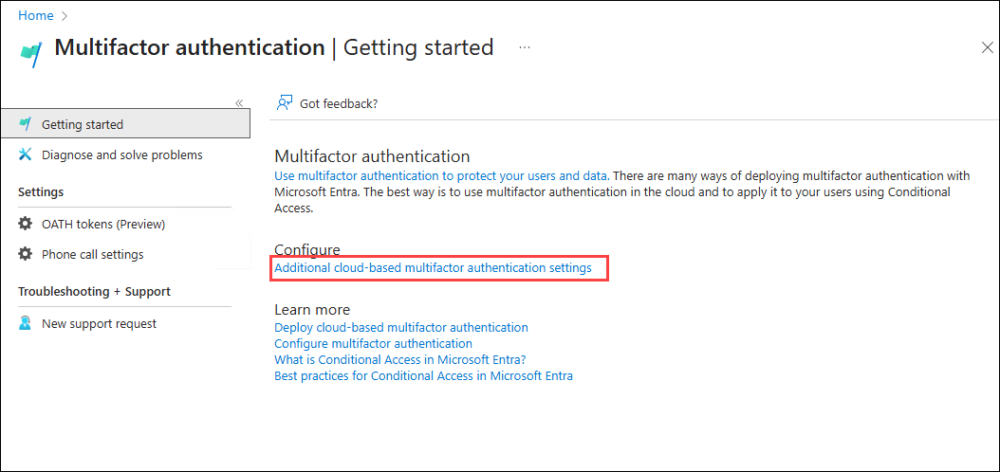

7. In the Per-user multifactor authentication page, select **Service settings**.

   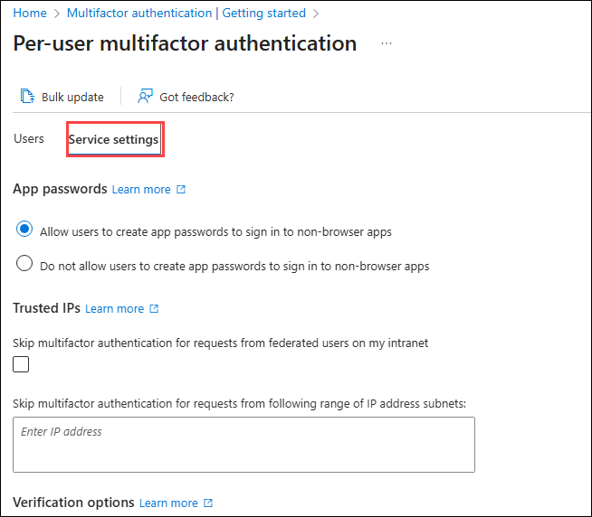

7. On the **Service settings** page, scroll down and select the checkbox for **Allow users to remember multi-factor authentication on devices they trust (1)**, then next to **Number of days users can trust devices for** enter **30 (2)** and select **Save (3)**.

   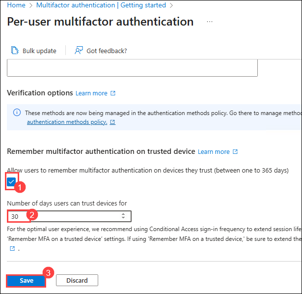

9. Once saved, scroll back to the top of the **Service settings** page and select **Users (1)**, then in the user list select the check box next to **Alex Wilber (2)**. Above the user list, select **Enable MFA (3)**.

   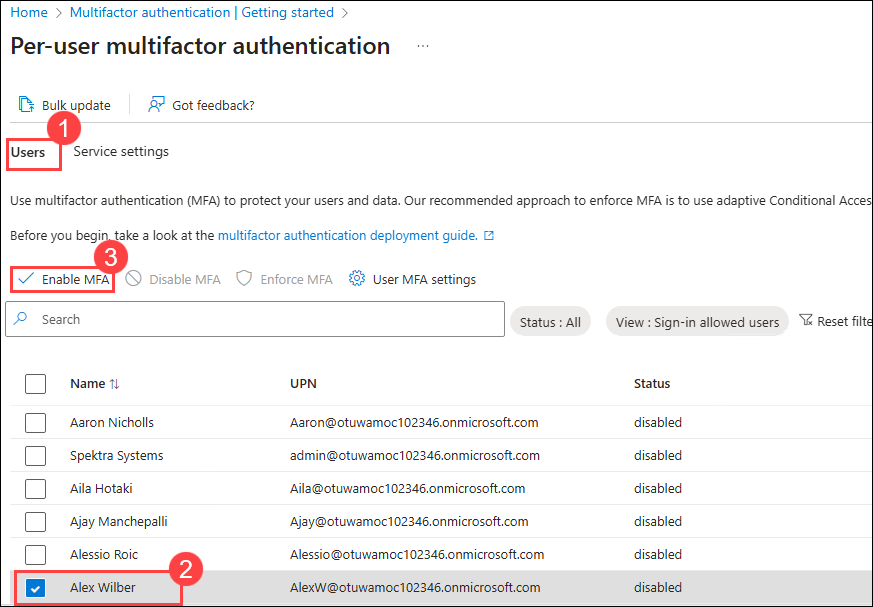

12. On the Enable multifactor authentication message, select **Enable**.

   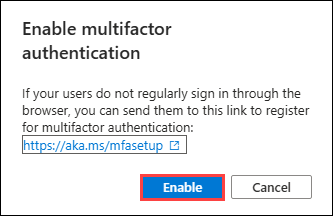

13. Once Enabled, refresh the page. Take note that the Status for Alex Wilber is now **Enabled**.

   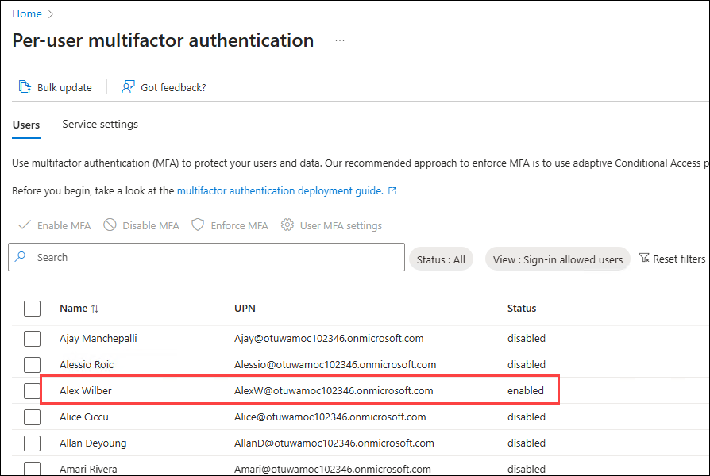

14. Close Microsoft Edge.

### Task 3: Register and Validate MFA

In this task you will sign in again as Alex Wilber to register MFA using your phone number and verify that MFA works correctly.

1. Switch to **SEA-WS3** and sign in as **Admin** with the password **Pa55w.rd**. 

2. On the taskbar, select **Microsoft Edge**.

3. In the address bar, enter **outlook.office.com** and press Enter.

4. On the **Pick an account** page, select **`AlexW@yourtenant.onmicrosoft.com`**.

   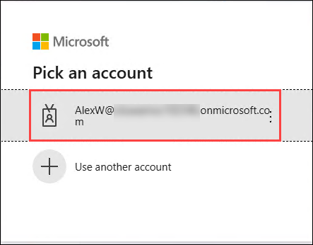

5. On the **Enter password (1)** page, enter the tenant password **Pa55-w.rd!** and select **Sign in (2)**.

   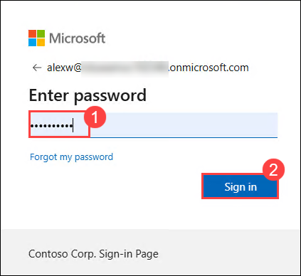

6. At the **Let's keep your account secure** page, select **Next**. The Keep your account secure page opens.

    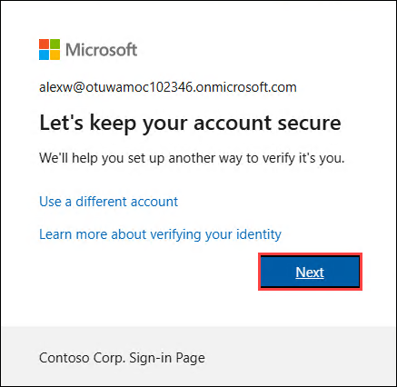

   > Typically, you will want to use the Microsoft Authenticator app to manage multi-factor authentication. However for this lab scenario, you will use text messages.

7. On the **Install Microsoft Authenticator** page, select **Set up a different way to sign in**. Chose **Phone** from the list of available choices.

   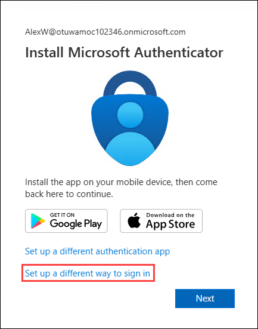

   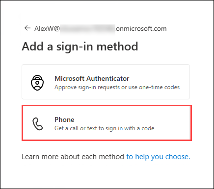

8. Enter your mobile phone number which you can receive text messages, and then select **Next**.

   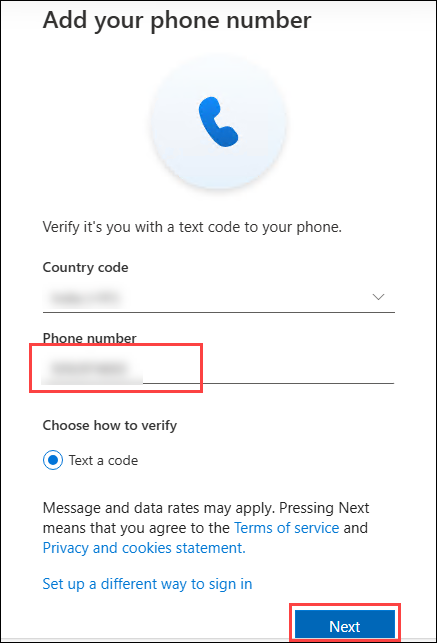

9. After you receive the verification code as a text message, enter the code where indicated on the **Verify your phone number (1)** page and then select **Next (2)**.

   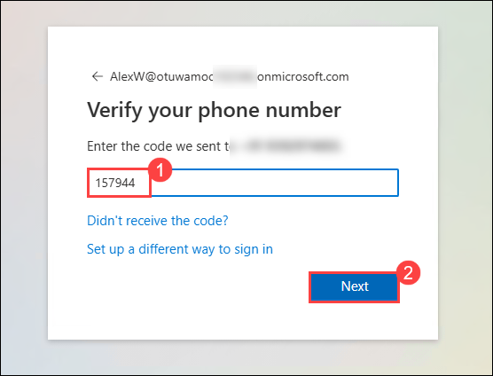

10. On the **Keep your account secure** page, you will receive a message "Great job! You have successfully set up your security info. Choose **Done** to continue signing in." Select **Done**.

   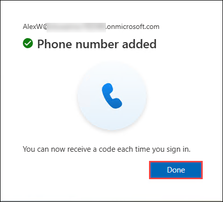

11. At the Stay signed in message, select **No**. 

    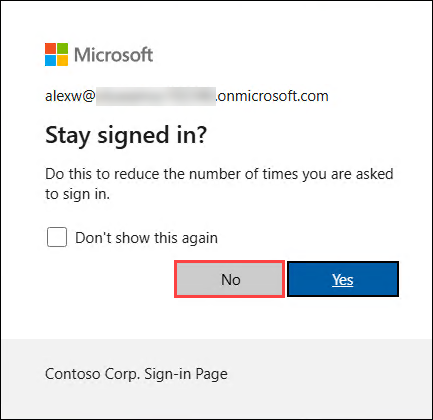

    > Outlook on the Web opens to Alex Wilber's inbox.

12. At the top-right corner, select the **Account manager for Alex Wilber** and then select **Sign out**.

    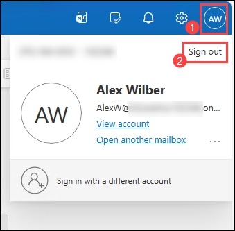

13. Close Microsoft Edge.

### Task 4: Remove per-user MFA

In this task you will disable per-user MFA for Alex Wilber to reset the account back to its original state.

1. Switch to **SEA-SVR1** and sign in with the password **Pa55w.rd**. 

2. On **SEA-SVR1**, on the taskbar select **Microsoft Edge**, in the address bar type **https://entra.microsoft.com**, and then press **Enter**.

3. Sign in as **<inject key="AzureAdUserEmail"></inject>**, and use the tenant Admin password **<inject key="AzureAdUserPassword"></inject>**, If the **Stay signed in?** prompt appears, select **No**.  

   > The Microsoft Entra admin center opens.

4. In the Microsoft Entra admin center, in the navigation pane, select **Users**.

5. Select **All users (1)** and then at the top of the results pane select **Per-user MFA (2)**. 

   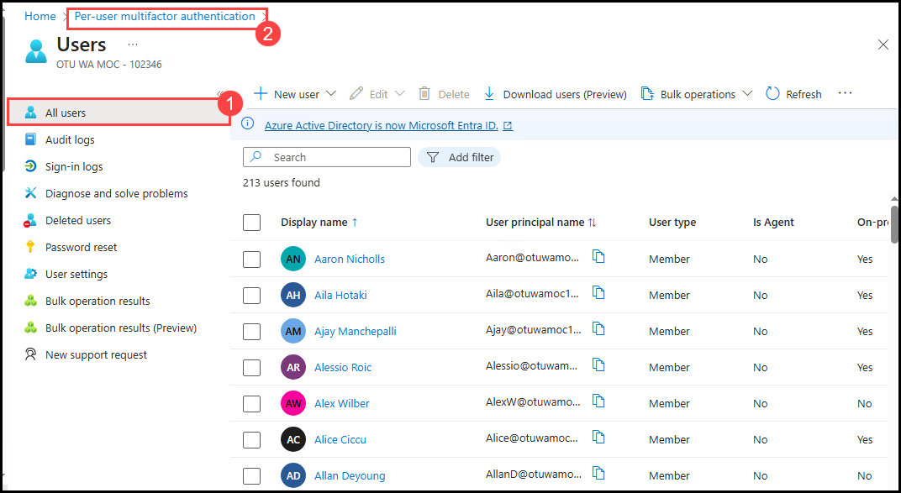
   
   > The Per-user MFA page opens.

6. In the user list, select the check box next to **Alex Wilber (1)**. Above the user list, select **Disable MFA (2)**.

   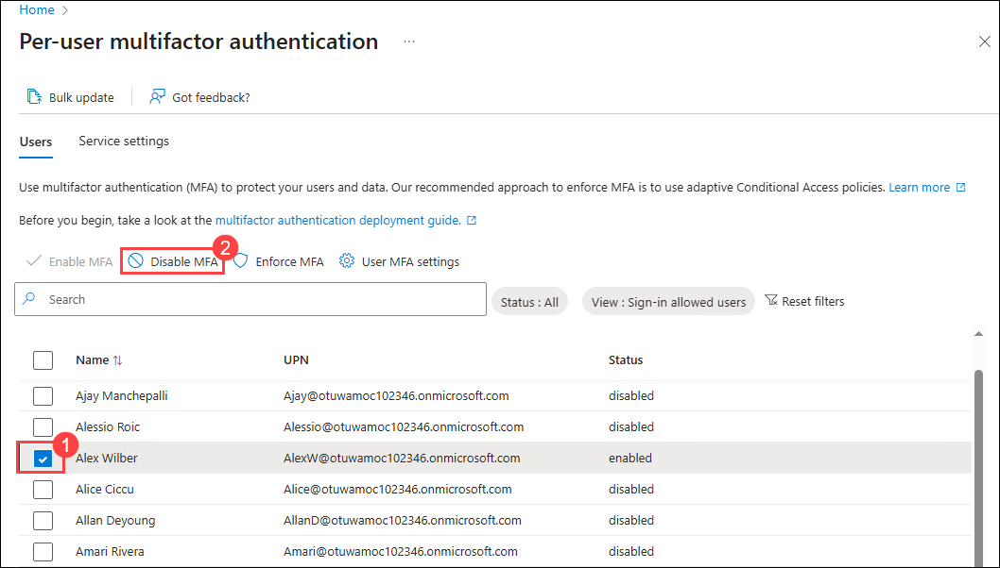

8. On the **Disable multifactor authentication** message, select **Disable**.

   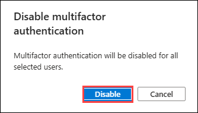

9. Once Disabled, refresh the page. Take note that the **Status** for Alex Wilber is now **Disabled**.

10. Close Microsoft Edge.

**Results**: After completing this exercise, you will have successfully configured per-user multi-factor authentication.

## Exercise 2: Configure multi-factor authentication using conditional access

### Scenario

To provide additional security for user sign on events, you need to configure and test multi-factor authentication (MFA). You decide that using a conditional access policy provides greater flexibility for your MFA requirements. Alex Wilber has agreed to validate the settings for you. 

### Task 1: Validate sign-in before enabling conditional access with MFA

In this task you will test Alex Wilber’s normal sign-in to verify that MFA is not yet required before applying conditional access.

1. Sign in to **SEA-WS3** as **Admin** with the password **Pa55w.rd**. 

2. On the taskbar, select **Microsoft Edge**.

3. In the address bar, enter **outlook.office.com** and press Enter.

   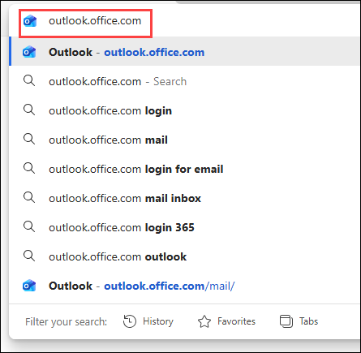

4. On the **Pick an account** page, select **`AlexW@yourtenant.onmicrosoft.com`**.

5. On the **Enter password** page, enter the tenant password **Pa55-w.rd!** and select **Sign in**.

   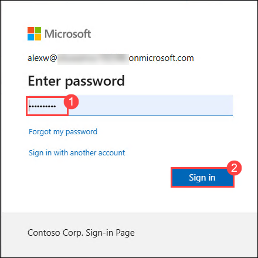

6. On the **Stay signed in** page, select **No**.

   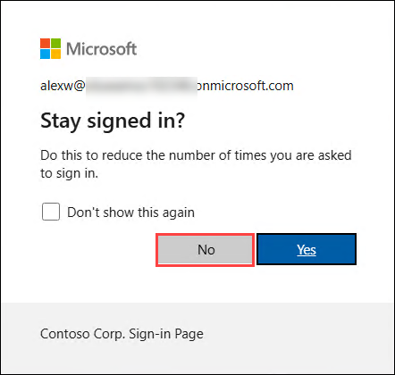

   > Outlook opens to Alex's inbox. Take note that only the password was required to sign in to Outlook on the Web as you removed the MFA in the previous Exercise.

7. At the top-right corner, select the **Account manager for Alex Wilber (1)** and then select **Sign out (2)**.

   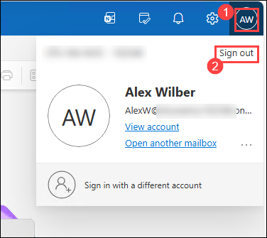

8. Close Microsoft Edge.

### Task 2: Configure conditional access with MFA

In this task you will create a conditional access policy that requires Alex Wilber to use MFA when accessing Office 365.

1. Switch to **SEA-SVR1** and sign in with the password **Pa55w.rd**. 

2. On **SEA-SVR1**, on the taskbar select **Microsoft Edge**, in the address bar type **https://entra.microsoft.com**, and then press **Enter**.

3. Sign in as **<inject key="AzureAdUserEmail"></inject>**, and use the tenant Admin password **<inject key="AzureAdUserPassword"></inject>**. If the **Stay signed in?** prompt appears, select **No**. 

   > The Microsoft Entra admin center opens.

4. In the navigation pane expand **Entra ID (1)** and select **Conditional Access (2)**, then on the **Conditional Access** page select **Policies (3)** and then **New policy (4)**.

   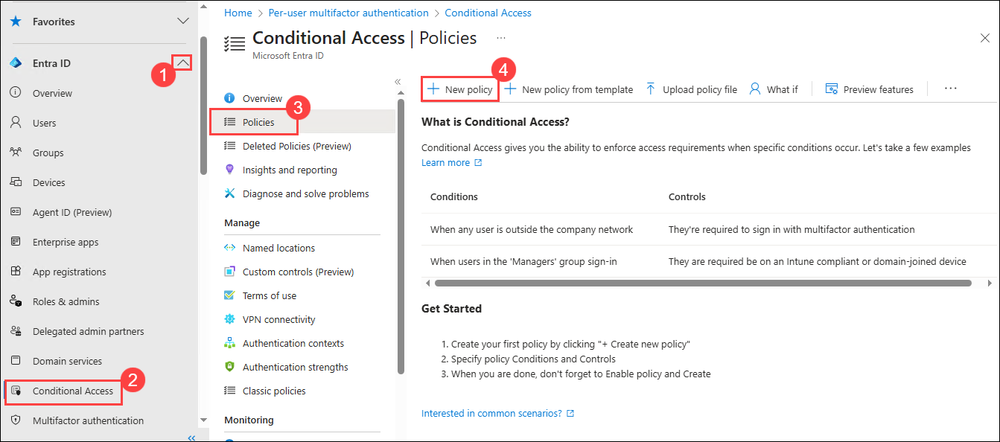

6. On the **New Conditional access policy** page, in the **Name** box enter **Contoso MFA Policy (1)**, then under **Assignments** select **0 users and groups selected (2)**.

   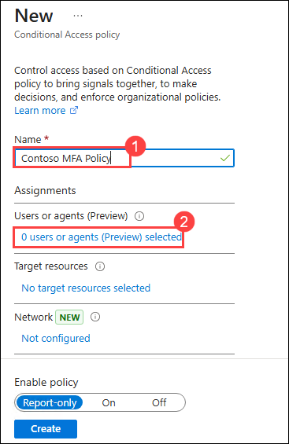

8. In the Users and groups pane, select the option next to **Select users and groups (1)** and then select the check box next to **Users and groups (2)**.

   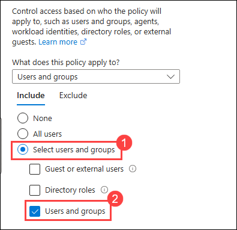

9. On the **Select users and groups** page, select **Alex Wilber (2)** and then select **Select (3)**. 

    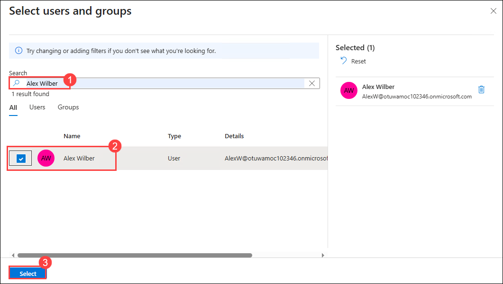

    > Note that typically you would specify a group, however for this exercise we will just test the setting on Alex Wilber.

10. Select **No target resources selected** and then click **Select resources**.

    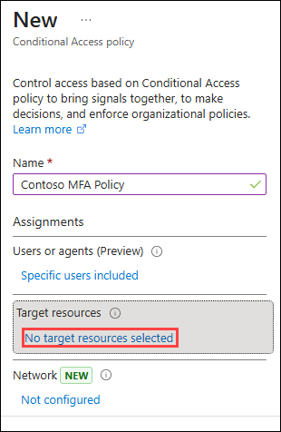

    > Note the Control access based on client app setting. This setting allows you to specify the client app that is used to access the resource. For example, you can specify that only the Outlook app can be used to access Exchange Online. 

11. On the **Select** section of the page, click **None** under Select specific resources.

    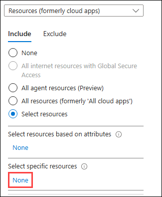

12. On the **Select** page, select the check box next to **Office 365** and then click **Select**.

    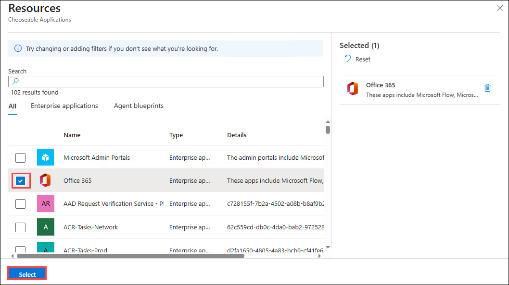

13. Under **Access controls**, in the **Grant** section, select **0 controls selected**.

    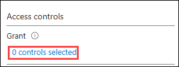

14. On the **Grant** page, select **Grant access (1)**, select the check box next to **Require multifactor authentication (2)**, and then click **Select (3)**.

    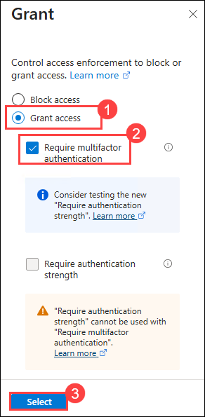

15. Under **Enable policy**, select **On**. Select **Create** to create the Contoso MFA Policy. Notice that the policy is listed with a State of **On**.

    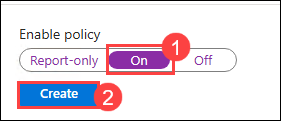

    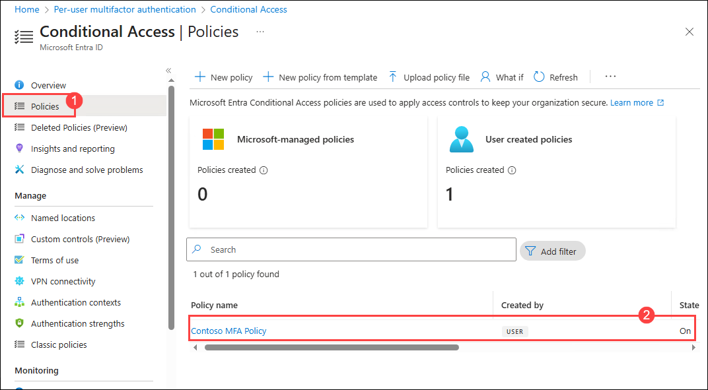

17. Close Microsoft Edge.

### Task 3: Validate conditional access MFA

In this task you will validate that the conditional access policy works by signing in as Alex and completing MFA.

1. Switch to **SEA-WS3** as **Admin** with the password **Pa55w.rd**. 

2. On the taskbar, select **Microsoft Edge**.

3. In the address bar, enter **https://outlook.office.com** and press Enter.

4. On the **Pick an account** page, select **`AlexW@yourtenant.onmicrosoft.com`**.

    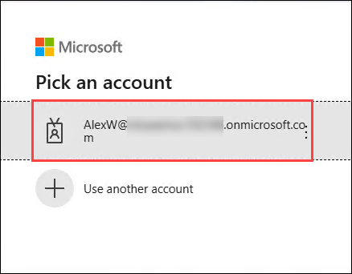

5. On the **Enter password (1)** page, enter the tenant password **Pa55-w.rd!** and select **Sign in (2)**.

    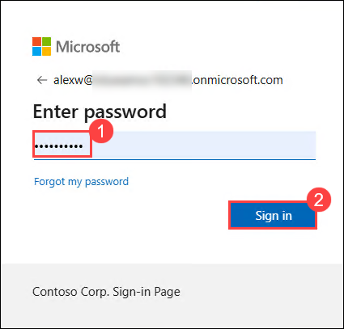

6. At the Verify your identity prompt, select your phone number.

   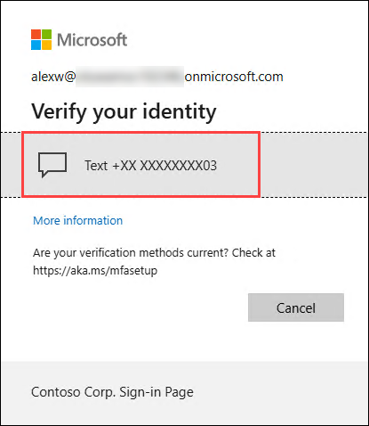

   > The Enter code dialog box opens.

7. At the **Enter code** page, enter the code sent to your mobile phone, and then select **Verify**.

    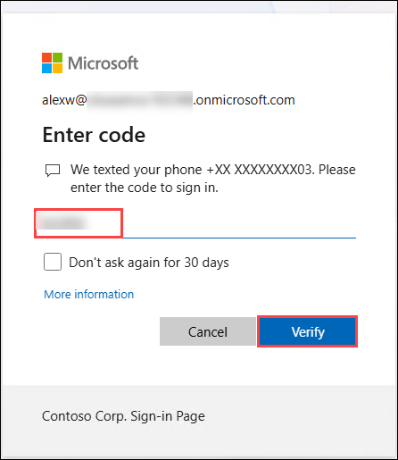

8. At the **Protect your account** page, select **skip for now**.

    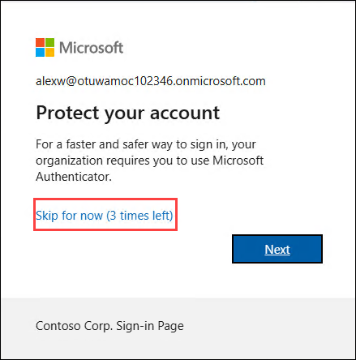

9. At the Stay signed in message, select **No**. 

   > Outlook on the Web opens to Alex Wilber's inbox.

10. At the top-right corner, select the **Account manager for Alex Wilber** and then select **Sign out**.

11. Close Microsoft Edge.

### Task 4: Remove conditional access MFA

In this task you will remove the conditional access policy to return the environment to its default configuration.

1. Switch to **SEA-SVR1** and sign in with the password **Pa55w.rd**. 

2. On **SEA-SVR1**, on the taskbar select **Microsoft Edge**, in the address bar type **https://entra.microsoft.com**, and then press **Enter**.

3. Sign in as user **<inject key="AzureAdUserEmail"></inject>**, and use the tenant Admin password **<inject key="AzureAdUserPassword"></inject>**. If the **Stay signed in?** prompt appears, select **No**. 

   > The Microsoft Entra admin center opens.

4. In the Microsoft Entra admin center, in the navigation pane, expand **Protection** and then select **Conditional Access**.

5. On the **Conditional Access** page, select **Policies** and then select **Contoso MFA Policy**.

    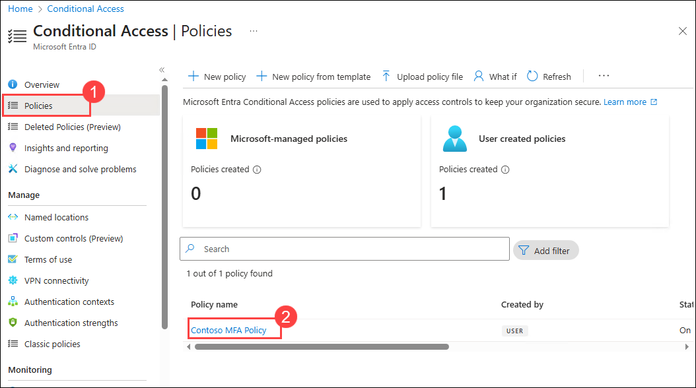

6. On the **Contoso MFA Policy** page, select **Delete**.

    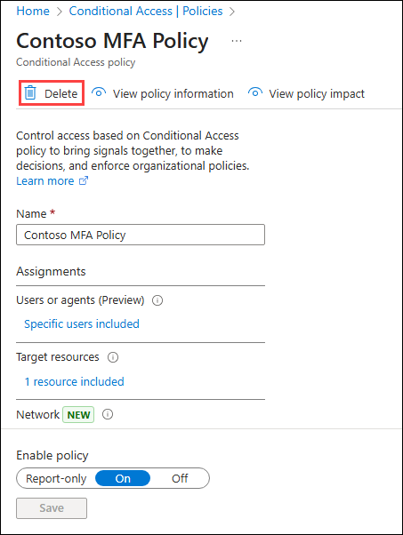

7. At the **Delete conditional access policy** prompt, select **Yes**.

    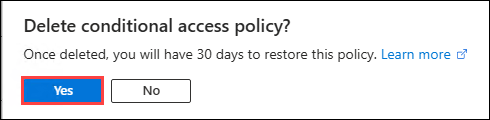

8. Close Microsoft Edge.

**Results**: After completing this exercise, you will have successfully configured multi-factor authentication by using a conditional access policy.

**END OF LAB**
