# Practice Lab: Configuring and validating device compliance

## Summary

In this lab, you validate device compliance by configuring a compliance policy and associated conditional access rule used to determine the status of a managed device. 

### Prerequisites

To following lab(s) must be completed before this lab:

- 0101-Managing Identities in Azure AD

- 0102-Synchronizing Identities by using Azure AD Connect

- 0203-Manage Device Enrollment into Intune

- 0204-Enrolling devices into Intune

- 0301-Creating and Deploying Configuration Profiles

  > Note: You will also need a mobile phone that can receive text messages used to secure Windows Hello sign in authentication to Azure AD.

## Exercise 1: Configuring compliance policies 

### Scenario

Contoso would like to ensure that Windows devices that are enrolled in Intune meet a minimum configuration specification. The following are specifications are required:

- Minimum Windows operating system version: 10.0.19041.329
- Microsoft Defender Antimalware required

If a device meets these requirements, it will be marked as compliant. If the device does not meet these requirements, the device should be marked as non-compliant.

### Task 1: Create and assign a compliance policy

In this task you will create and assign a compliance policy that checks Windows devices for a minimum OS version and requires Microsoft Defender Antimalware to be enabled.

1. Sign in to **SEA-SVR1** as **Contoso\\Administrator** with the password **Pa55w.rd** and close **Server Manager**.

2. On the taskbar, select **Microsoft Edge**.

3. In Microsoft Edge, type **https://intune.microsoft.com** in the  address bar, and then press **Enter**. 

4. Sign in as **<inject key="AzureAdUserEmail"></inject>**, and use the tenant Admin password **<inject key="AzureAdUserPassword"></inject>**

5. From the navigation pane select **Devices (1)**, then select **Compliance (2)**. On the **Compliance | Policies** blade, in the details pane select **Create policy (3)**.

     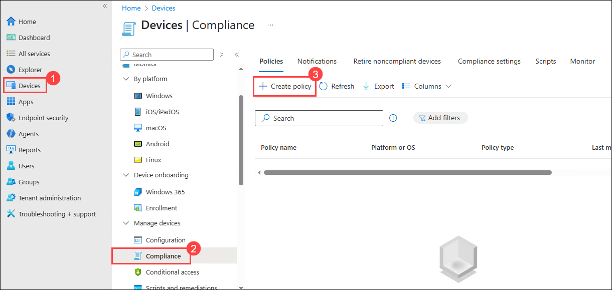

7. On the **Create a policy** blade, provide the following value and select **Create (3)**:

    - Platform: **Windows 10 and later (1)**
    - Profile type: **Windows 10/11 compliance policy (2)**

        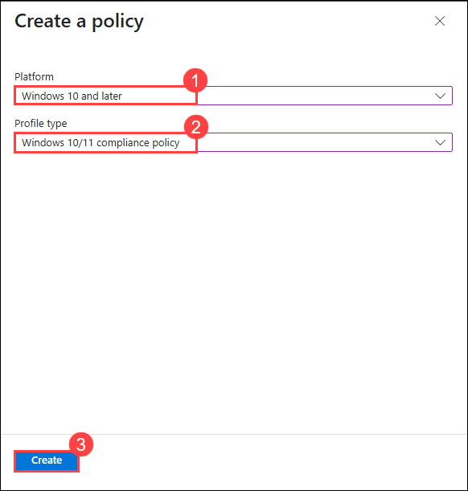

8. On the **Basics** tab, provide the following value and select **Next (2)**:

    - Name: **Compliance1 (1)**

        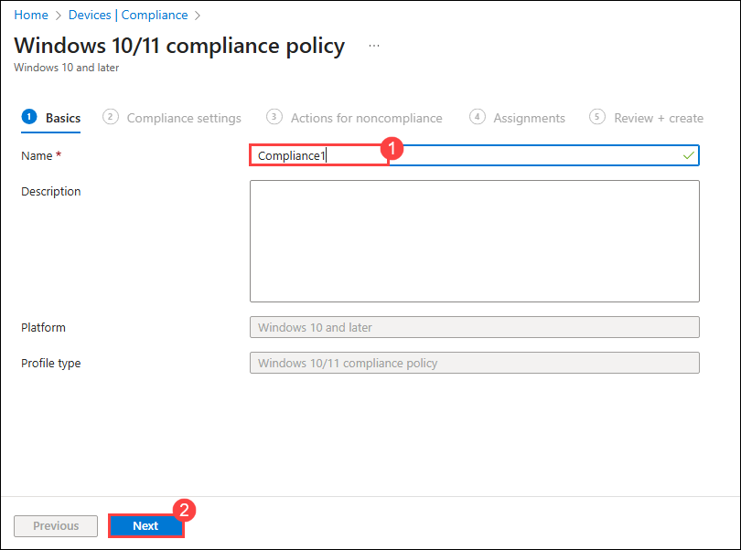

9. On the **Compliance settings** tab, expand **Device Health** and review the available settings.

     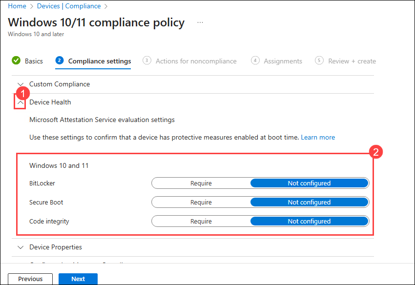

10. On the **Compliance settings** tab, expand **Device Properties (1)**. In the **Minimum OS version** field, type **10.0.19041.329 (2)**.

    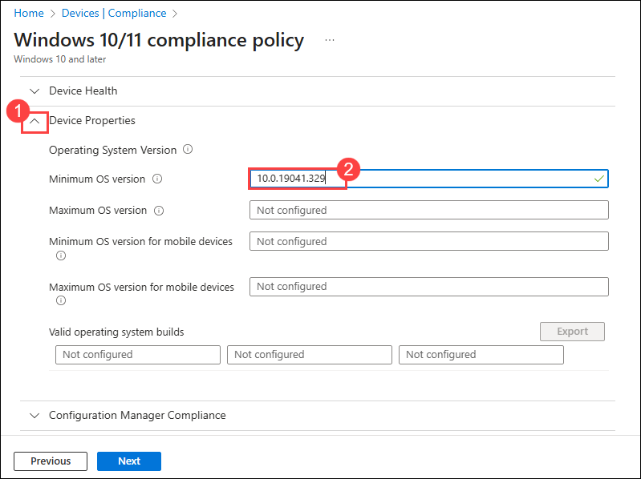

11. On the **Compliance settings** tab, expand **System Security**. Set the **Microsoft Defender Antimalware** setting to **Require (1)**. Select **Next** (2). 

     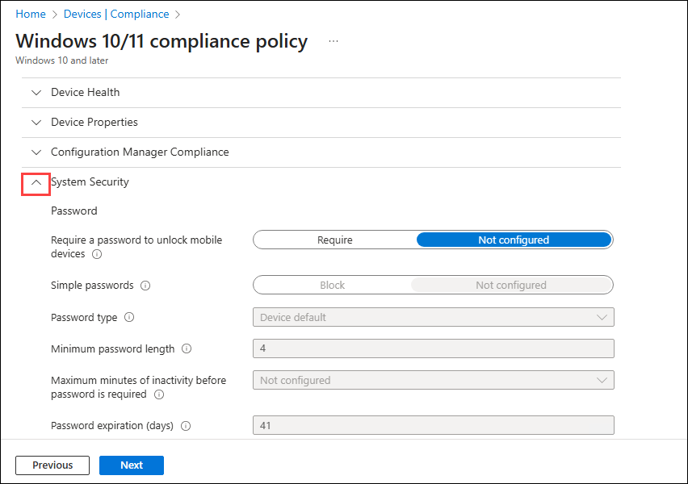

     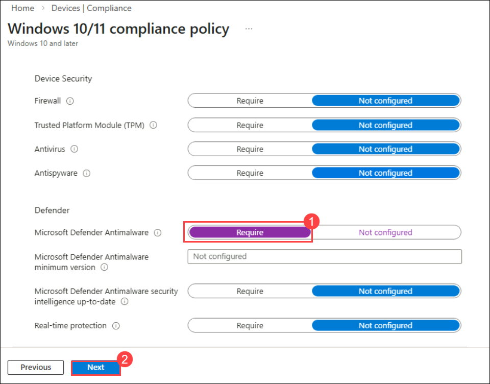

12. On the **Actions for noncompliance** tab, note the action to **Mark device noncompliant** default setting is **immediately**. Select **Next (2)**. 

     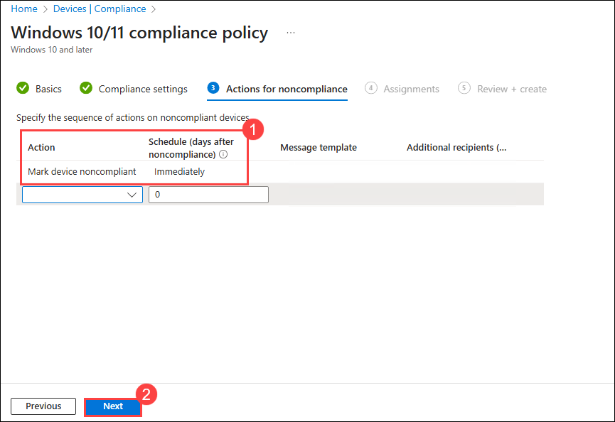

    > Review how you can configure the number of days after which the device is marked as noncompliant, and configuration additional actions. 

13. On the **Assignments** tab, under **Included groups** select **Add groups**. Search for **Windows Devices (1)** and select **Windows Devices (2)**, choose **Select (3)**, and then select **Next**. 

    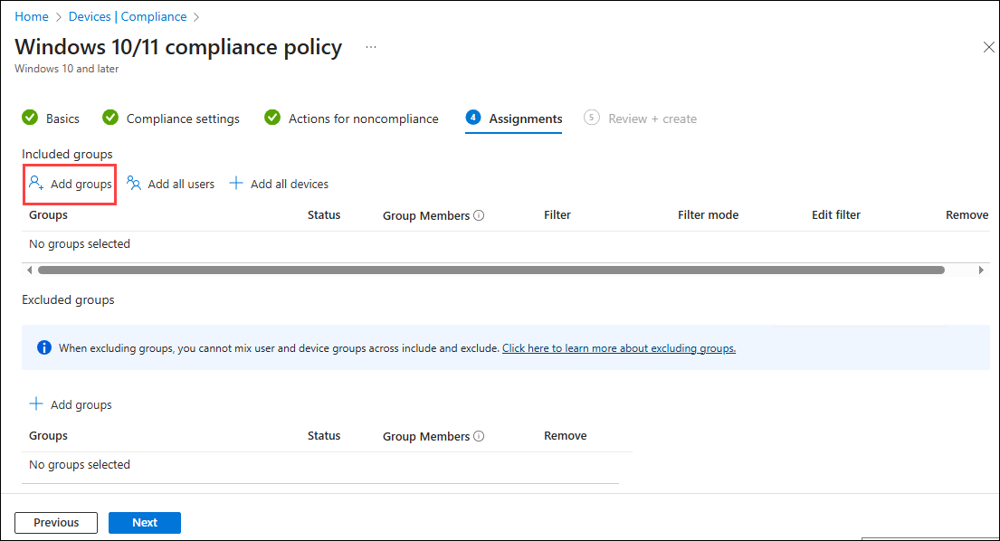

    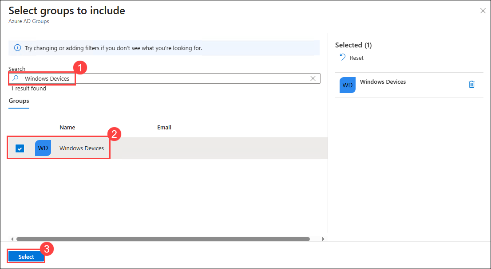

    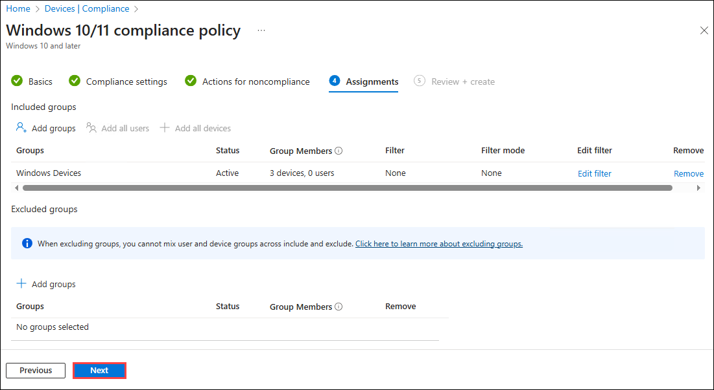

    _Note: The **Windows Devices** group was created in the Module 0301 lab._

14. On the **Review + create** tab, review the settings and then select **Create**.

     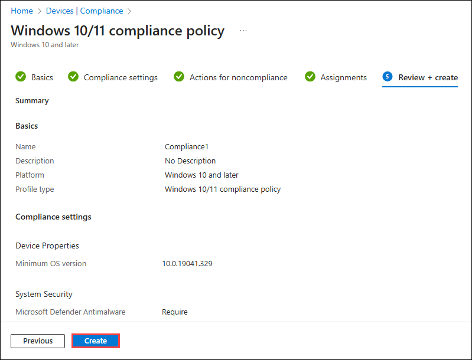

15. In the navigation menu, select **Devices** and then in the Devices navigation pane, select **Compliance policies**.

     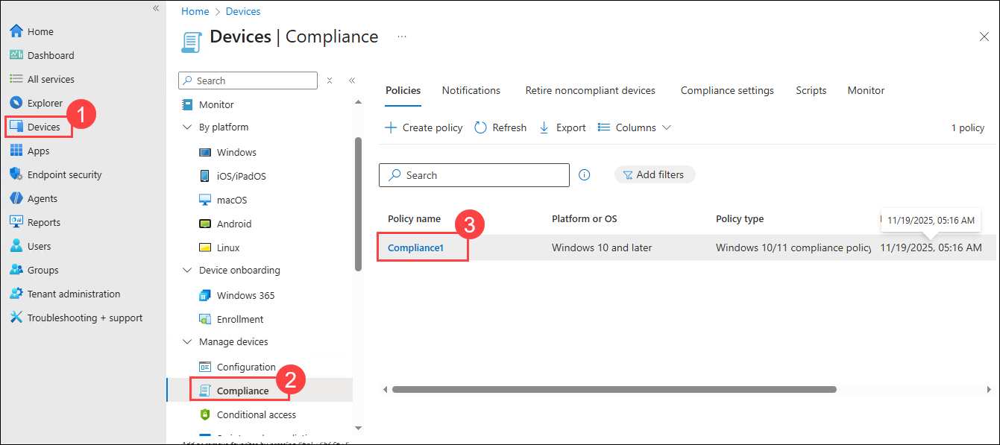

16. On the **Compliance (1)** page, select **Compliance settings (2)**.On the **Compliance policy settings** page, next to **Mark devices with no compliance policy assigned as**, select **Not Compliant (3)** and then select **Save (4)**. 

    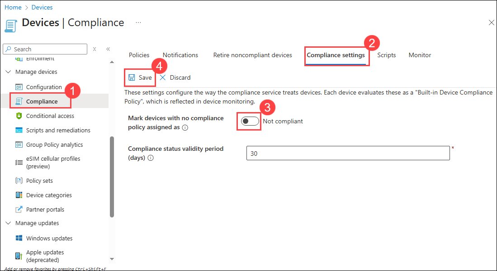

    > **Note**: This setting ensures that any device without an assigned compliance policy is marked as Not compliant. If Intune displays any errors while applying this setting, you may safely ignore them and proceed with the next tasks.

**Results**: After completing this exercise, you will have successfully configured a compliance policy.

## Exercise 2: Creating a conditional access policy to enforce compliance

### Scenario 

When a user uses a device that is marked as non-compliant, they should not be able to access their e-mail. You've been asked to configure a conditional access policy that enforces this rule, and verify it functions as expected. In some cases, the user may experience a loop where they are prompted to sign in repeatedly.

### Task 1: Create a conditional access policy

In this task you will create a conditional access policy that blocks users from accessing Exchange Online unless their Windows device is marked as compliant.

1. On **SEA-SVR1**, in the **Intune admin center** select **Devices (1)**, then select **Conditional access (2)**.

     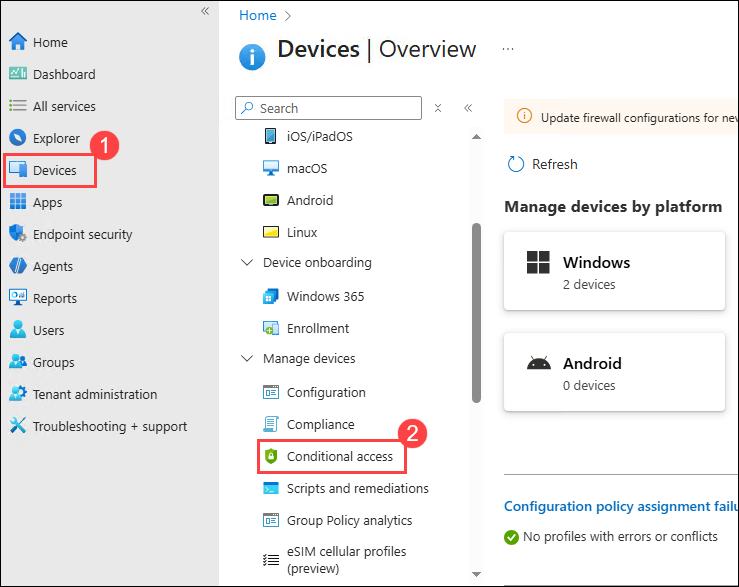

2. On the **Conditional Access | Overview** blade, select **Policies (1)**. On the **Conditional Access | Policies** blade, select **New policy (2)**.

     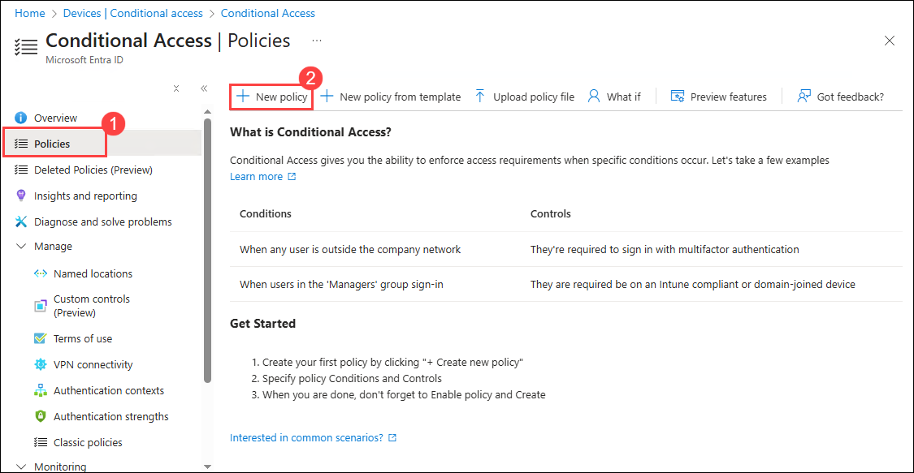

4. On the **New** blade, in the **Name** text box, type **Conditional1 (1)** and then select **0 users and groups selected (2)**.

     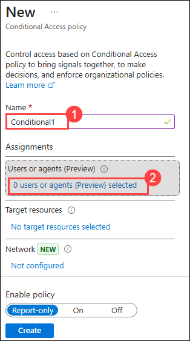

5. Under **Include**, select the **All users** radio button.

     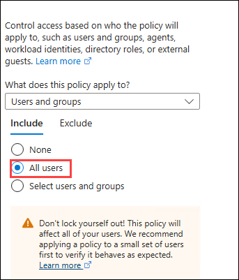

6. On the **New** blade, in the **Target resources** section, select **No target resources selected (1)**.

7. Under Include choose the **Select resources (2)** radio button, under the **Select specific resources** heading, select **None (3)**.

     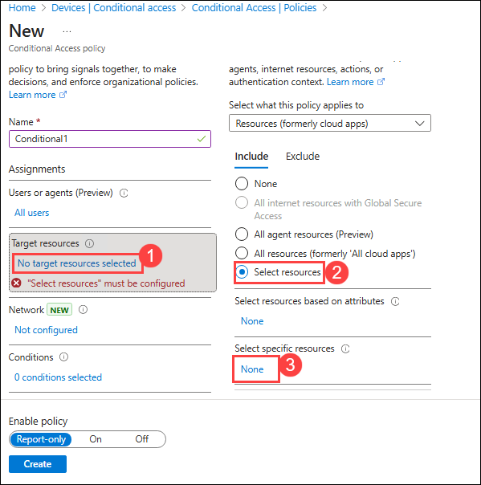

1. Select **Office 365 Exchange Online (1)**, and then click **Select (2)**.

     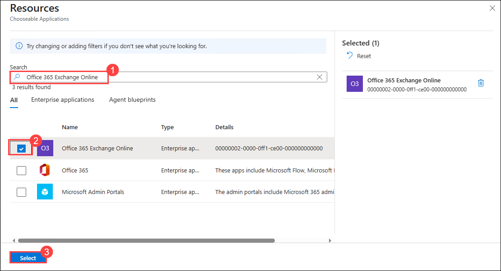

8. On the **New** blade, in the **Conditions** section, select **0 conditions selected (1)**. 

9. In the list of conditions, under **Device platforms**, select **Not configured (2)**. In the **Configure** section select **Yes (3)**, select the **Select device platforms (4)** radio button, select the **Windows (5)** check box, and then select **Done (6)**.

     .png)

10. On the **New** blade under **Access controls**, in the **Grant** section, select **0 controls selected (1)**. Select the **Require device to be marked as compliant (2) (3)** check box, and then select **Select (4)**.

     .png)

11. On the **New** blade, select **On** for the **Enable policy** option and then select **Create**.

     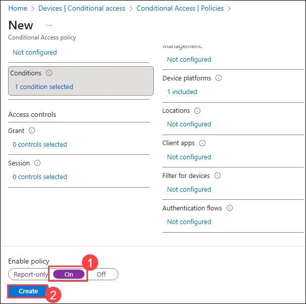

12. Close Microsoft Edge.

### Task 2: Verify that the conditional access policy is working

In this task you will verify that the conditional access policy is working by testing sign-in from a non-compliant device and from a compliant device.

1. Switch to **HOSTVM** and sign in to **SEA-WS3** VM from the desktop shortcut as **Admin** with the password of **Pa55w.rd**.

2. On **SEA-WS3**, on the taskbar, select **Microsoft Edge**.

3. In Microsoft Edge, type **outlook.office.com** and then press Enter.

     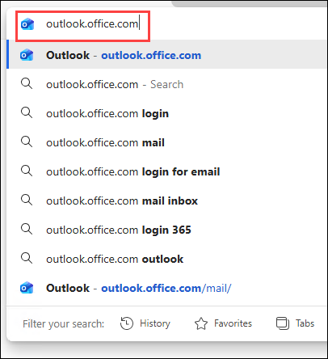

4. On the pick an account dialog box, select **`Aaron@yourtenant.onmicrosoft.com`**.

     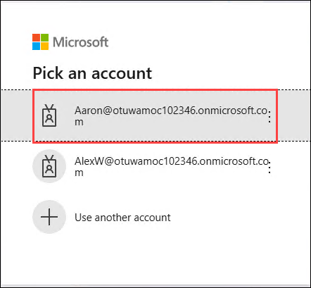

5. On the **Enter password (1)** page, enter **Pa55w.rd1234!** and select **Sign in (2)**. If the Microsoft Edge Save password prompt appears, select **Update**.

     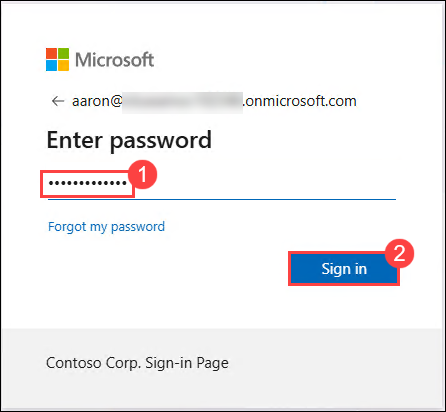

     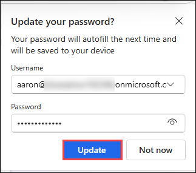

6. You should receive a message that ask you to switch Edge profile. Select **Switch Edge profile**.

     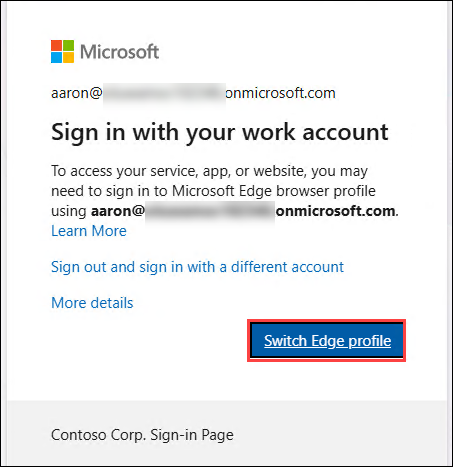

7. You will be prompted with a message stating, "**Continue with your work or school account**". Select **Sign in to sync data**.

     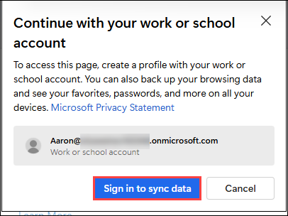

8. You will be required to enter your password again. Enter **Pa55w.rd1234! (1)** and select **Sign in (2)**.

     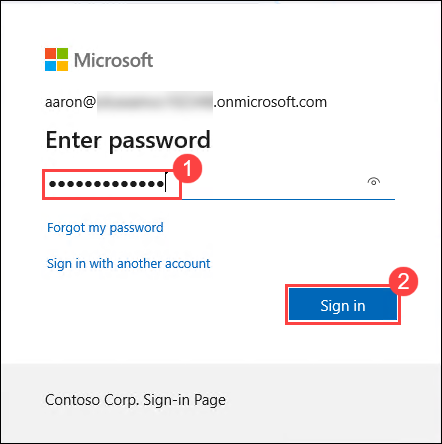

9. A message will appear stating, "**Stay signed in to all your Microsoft apps**". Select **no, sign in to this app only**.

    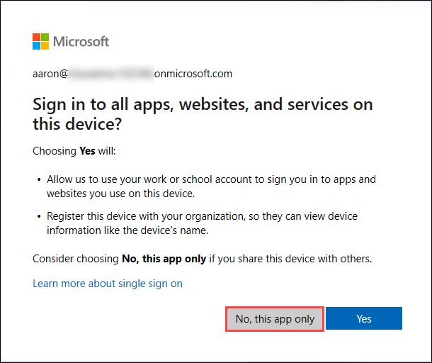

    > Note: A prompt will appear stating, "**Allow my organization to manage my device**". This is because SEA-WS3 is not joined to Azure AD and not managed by Intune. As such, you are unable to access Aarons' mailbox from this device.

10. **Close** all windows and sign out of **SEA-WS3**.

11. Switch to **SEA-WS1** VM through desktop shortcut inside HOSTVM, and ensure that you are in basic session mode and able to view Clipboard in the menu bar as shown in the below image. If not please change it to the basic session by selecting the icon which was highlighted in the tool bar in the below image and sign in as as **Aaron Nicholls** with the PIN **102938**.
  
    

12. On the taskbar, select **Microsoft Edge**.

13. In Microsoft Edge, type **outlook.office.com** and then press Enter. 

     .png)

14. Verify that you can access Aaron's mailbox. 

    > Note: This is because SEA-WS1 is a managed device and marked as compliant._

15. Close Microsoft Edge and sign out of SEA-WS1.

     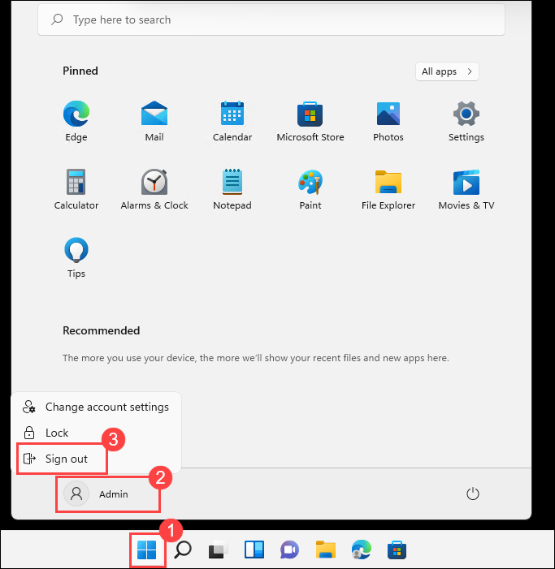

### Task 3: Disable the conditional access policy

In this task you will disable the conditional access policy so that it no longer enforces device compliance.

1. Switch to **SEA-SVR1** and enter the password **Pa55w.rd**.

2. On the taskbar, select **Microsoft Edge**.

3. In Microsoft Edge, type **https://intune.microsoft.com** in the  address bar, and then press **Enter**.

     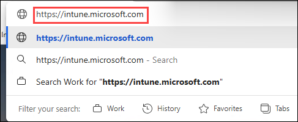

4. Sign in as **<inject key="AzureAdUserEmail"></inject>**, and use the tenant Admin password **<inject key="AzureAdUserPassword"></inject>**, If the **Stay signed in?** prompt appears, select **No**. 

     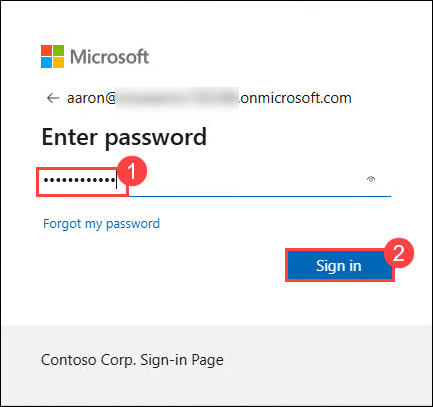

5. From the navigation pane select **Devices**, then select **All devices**.

    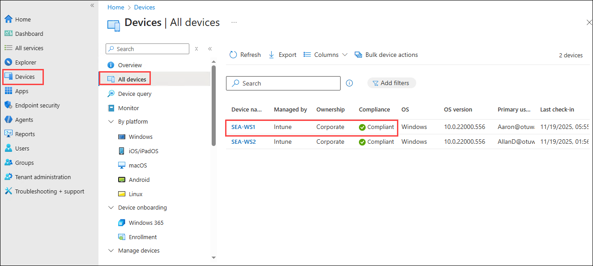

   > Notice that SEA-WS1 is compliant, which is why Aaron was allowed to access his mailbox.

6. From the navigation pane select **Devices (1)**, then select **Conditional access (2)**.

     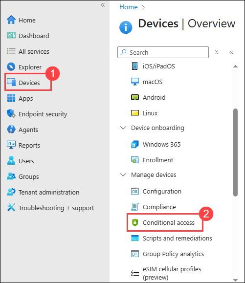

7. On the **Conditional Access** page, select **Policies (1)** and then select **Conditional1 (2)**.

     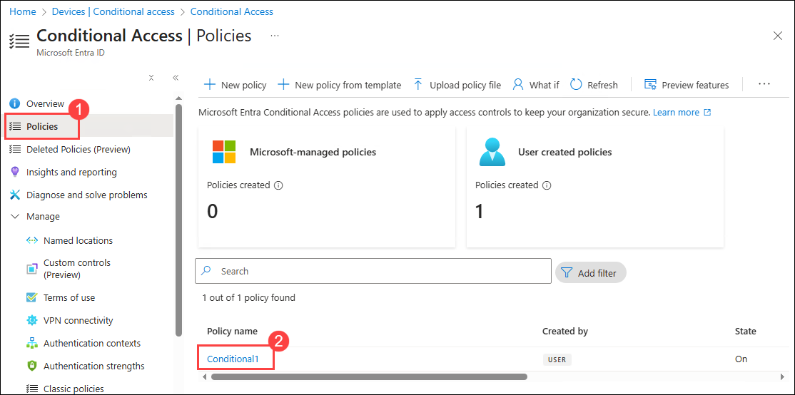

8. On the **Conditional1** page, at the bottom of the page, select **Off (1)** and then select **Save (2)**.

     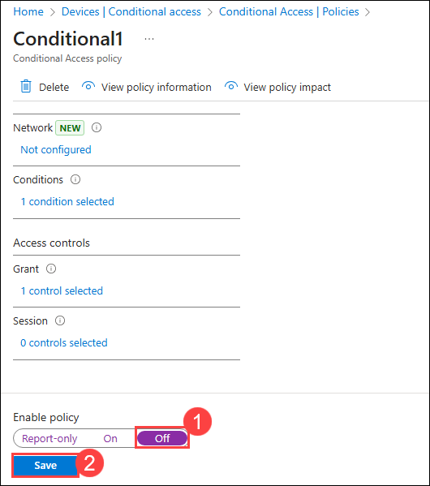

9. Close Microsoft Edge.

**Results**: After completing this exercise, you will have successfully configured a conditional access policy to determine device compliance.

**END OF LAB**
