# Practice Lab: Configuring Endpoint security using Intune

## Summary

In this lab, you will create a policy to configure Microsoft Defender for managed devices in Intune.

### Prerequisites

To following lab(s) must be completed before this lab:

- 0203-Manage Device Enrollment into Intune

- 0204-Enrolling devices into Intune

- 0301-Creating and Deploying Configuration Profiles

  Note: You will also need a mobile phone that can receive text messages used to secure Windows Hello sign in authentication to Azure AD.

### Scenario

You've been asked to ensure that the Contoso Developers Group have Microsoft Defender correctly configured. It's been requested that:
* Tamper protection be prevented
* Hide the Account protection, App and browser control, Device security, Device performance and health, and Family options areas in the Windows Security app
* Company name and phone number must be added. 
* Real-time protection, Remediation, and scan settings are also to be configured.

Settings will be verified by testing on an enrolled device, SEA-WS1 and a non-enrolled device, SEA-CL1.

### Task 1: Configure Windows Security Experience in Intune

In this task you will create a Windows Security Experience policy in Intune to configure Defender UI restrictions, tamper protection, customized notifications, and company branding for enrolled devices.

1. Sign in to **SEA-SVR1** as **Contoso\\Administrator** with the password **Pa55w.rd**. 

     

    

2. On the taskbar, select **Microsoft Edge**.

3. In Microsoft Edge, type **https://intune.microsoft.com** in the  address bar, and then press **Enter**. 

4. Sign in as user **<inject key="AzureAdUserEmail"></inject>**, and use the tenant Admin password **<inject key="AzureAdUserPassword"></inject>** 

5. From the navigation pane select **Endpoint security (1)**, then select **Antivirus (2)**. On the **Endpoint security | Antivirus** pane, select **Create Policy (3)**.

    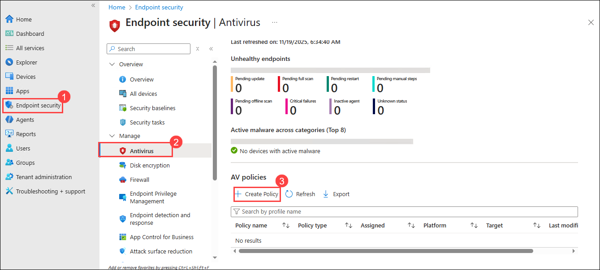

7. In the **Create a profile** pane, for **Platform**, select **Windows (1)**, in the **Profile** list, select **Windows Security experience (2)**. Then select **Create (3)**. 

    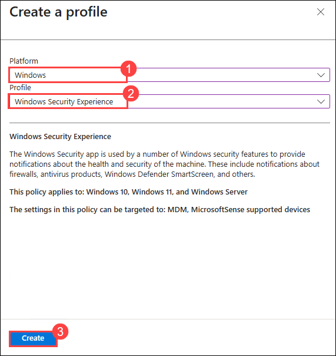

9. On the Basics tab, in the **Name** field, enter **Windows Security Settings**. Select **Next**.

    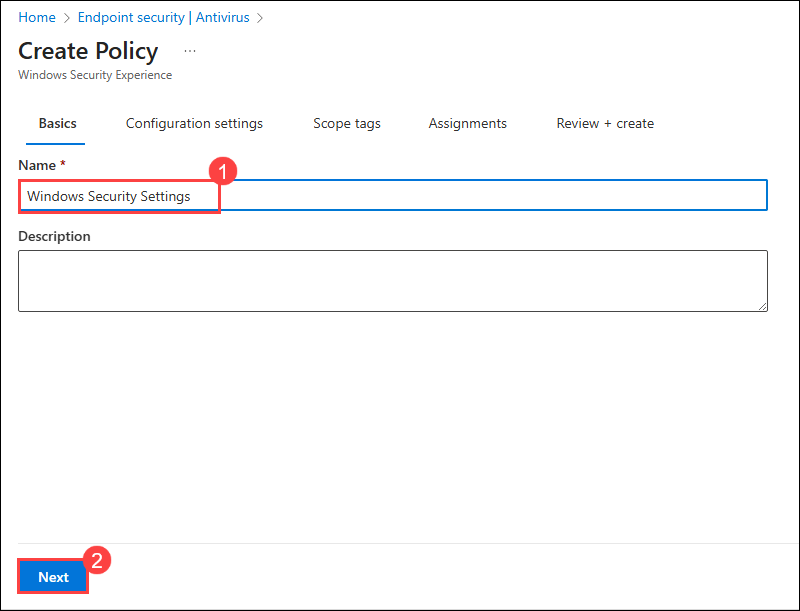

10. On the Configuration settings tab, Under **Defender**, configure the following settings:
    - TamperProtection (Device): **On**

      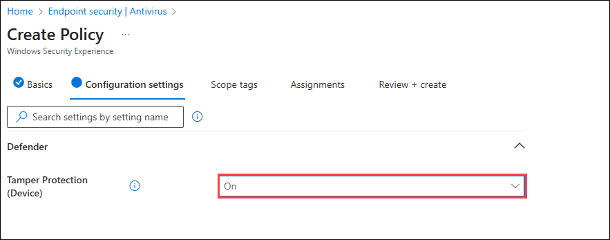

11. Under **Windows Defender Security Center**, configure the following settings:
     - Disable Account Protection UI: **Enable (1)**
     - Disable App Browser UI: **Enable (2)**
     - Disable Device Security UI: **Enable (3)**
     - Disable Family UI: **Enable (4)**
     - Disable Health UI: **Enable (5)**
     - Enable Customized Toasts: **Enable (6)**

         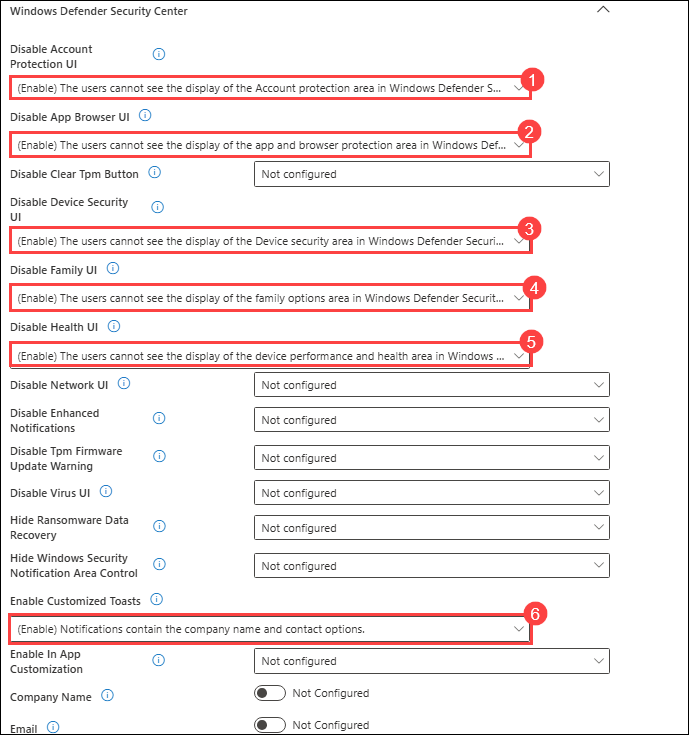

12. Under **Company name**, select **Configured (1)**, and then enter **Contoso IT (2)** for **Phone**, select **Configured (3)** and then enter **555-1234 (4)** and then select **Next (5)**.

    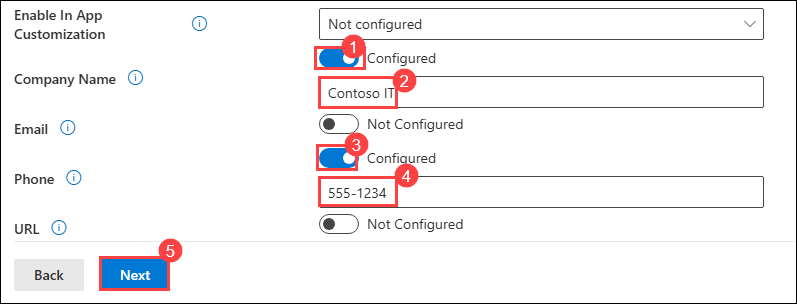

14. On the **Scope tags** page, select **Next**.

15. On the **Assignments** tab, type **Contoso** in the search box and choose the **Contoso Developer Devices** group, and then select **Next**.

    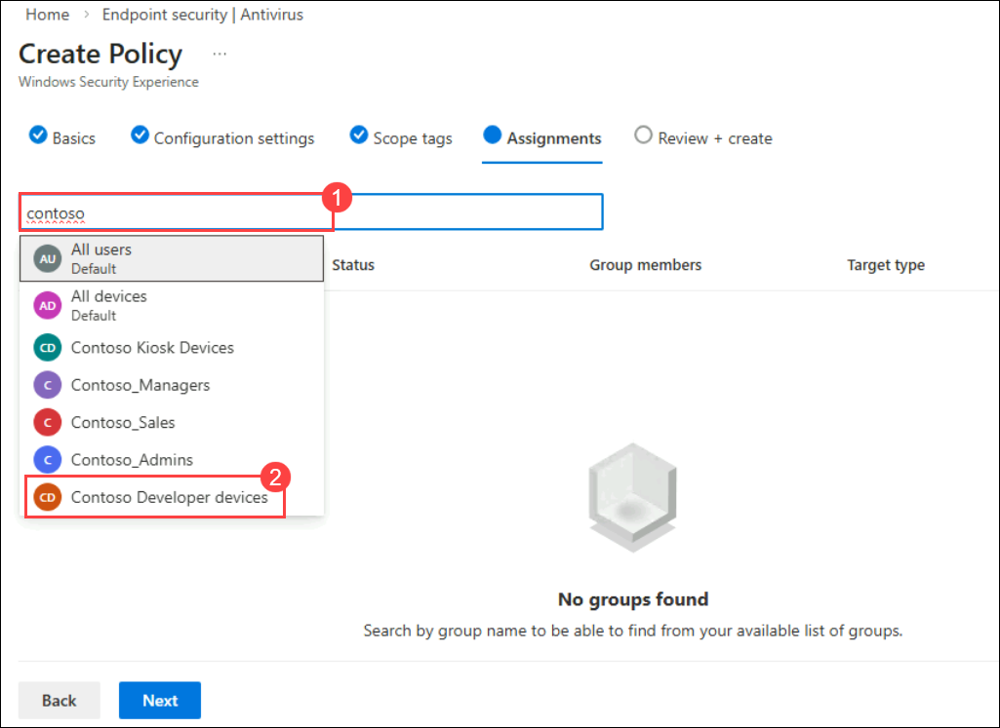

    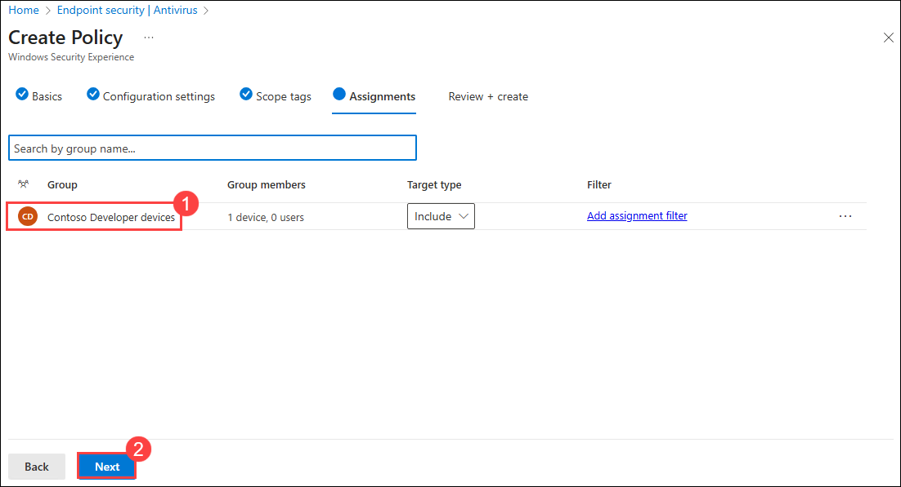

16. On the **Review + create** tab, review the information and select **Save**.

    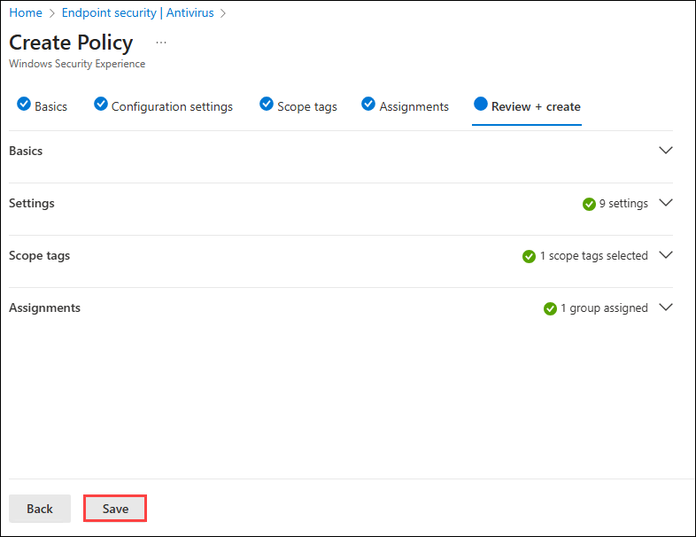

### Task 2: Configure Microsoft Defender Antivirus policy in Intune

In this task you will create and assign a Microsoft Defender Antivirus policy to configure real-time protection, scan behavior, sample submission, and malware remediation settings.

1. On the **Endpoint security |Antivirus (1)** pane, select **Create Policy (2)**.

    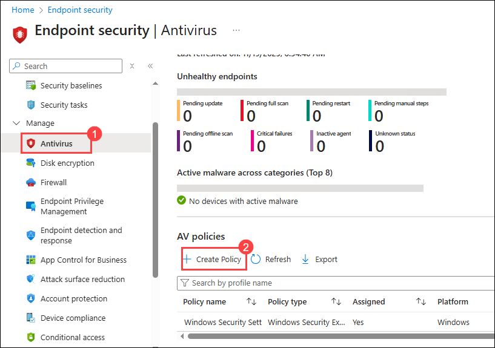

2. In the **Create a profile** pane, for **Platform**, select **Windows (1)**. In the **Profile** list, select **Microsoft Defender Antivirus (2)**, then select **Create (3)**.

    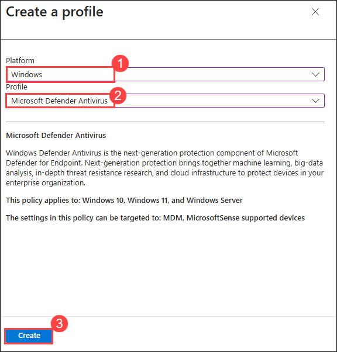

4. On the **Basics** tab, in the **Name** field, enter **Microsoft Defender Antivirus Settings (1)**. Select **Next (2)**.

    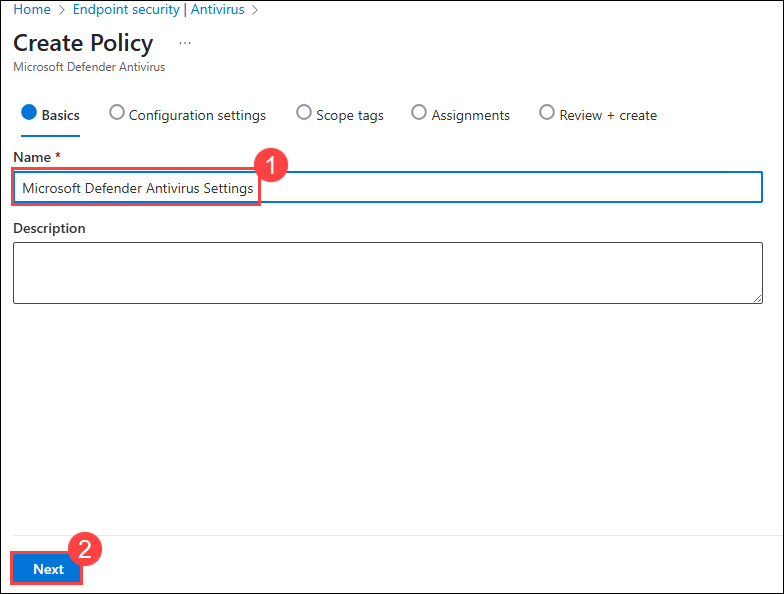

5. On the **Configuration settings** tab, configure the following settings:

   - Allow scanning of all downloaded files and attachments: **Allowed**
   - Allow Realtime Monitoring: **Allowed**
   - Check For Signatures Before Running Scan: **Enabled**
   - Days to Retain Cleaned Malware: **60**
   - Schedule Quick Scan Time: **60** (represents 1:00AM)
   - Submit samples consent: **Send safe samples automatically**

     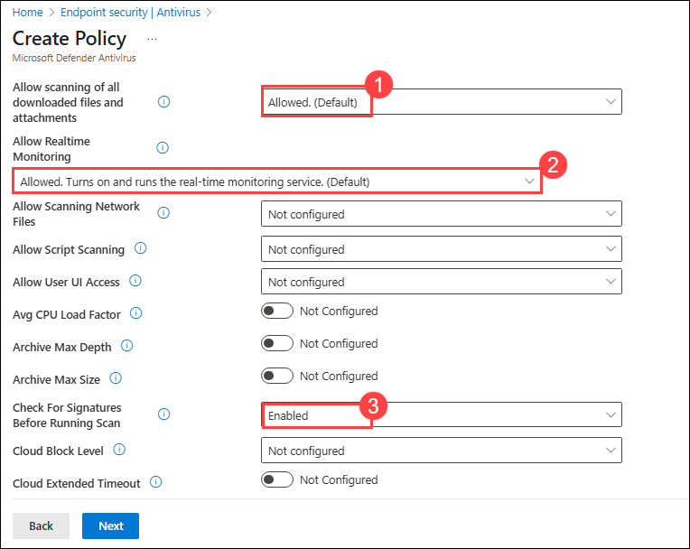

     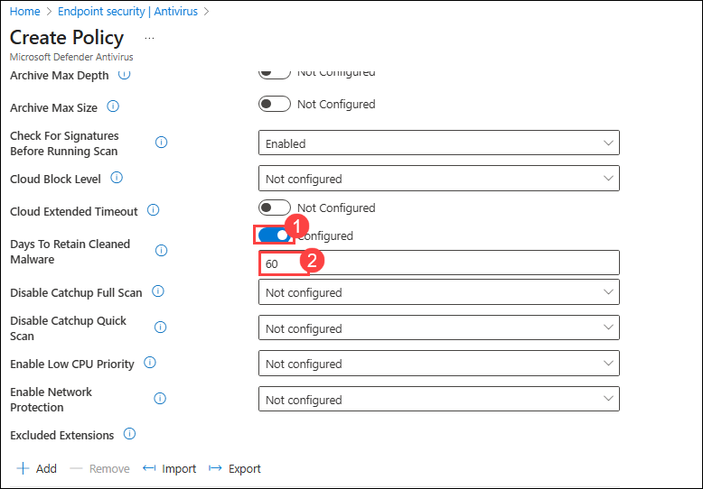

     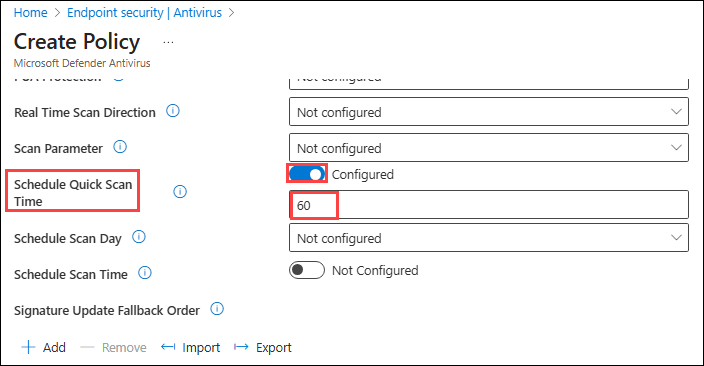

     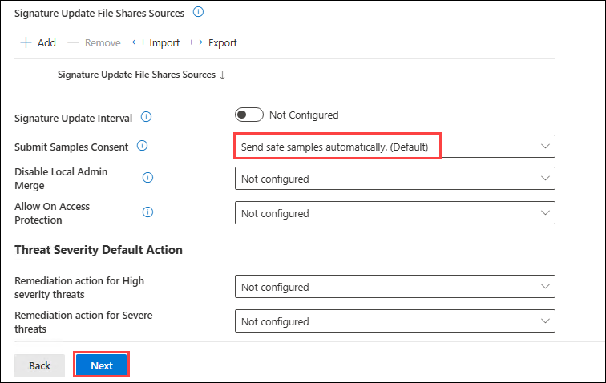

6. On the **Configuration settings** tab, select **Next** twice.

7. On the **Assignments** tab, type **Contoso** and then select the **Contoso Developer Devices (1)** group, and then choose select **Next (2)**.

    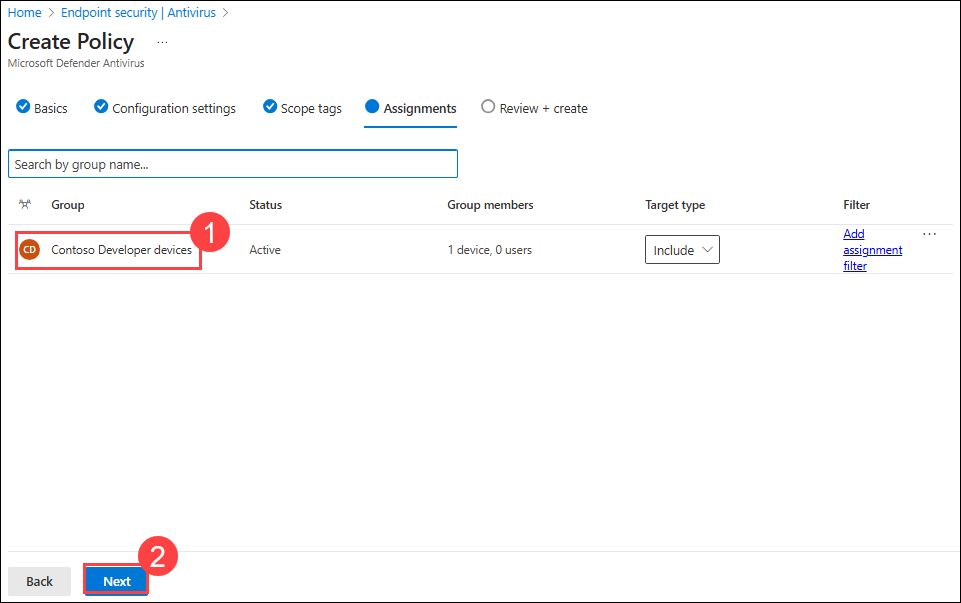

9. On the **Review + create** tab, review the information and select **Save**.

    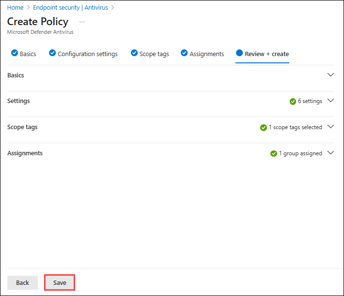

### Task 3: Sync the managed devices

In this task you will sync your Intune-managed devices to ensure that the newly created security policies are applied.

1. In the Microsoft Intune admin center, select **Devices** and then select **All devices**.  

2. On the **Devices | All devices** pane, select **SEA-WS1** and then on the **SEA-WS1** blade, select **Sync** on the toolbar, and then select **Yes**. 

    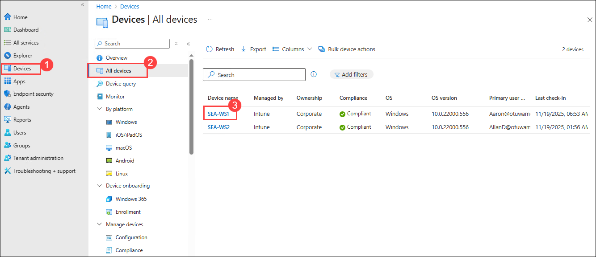

    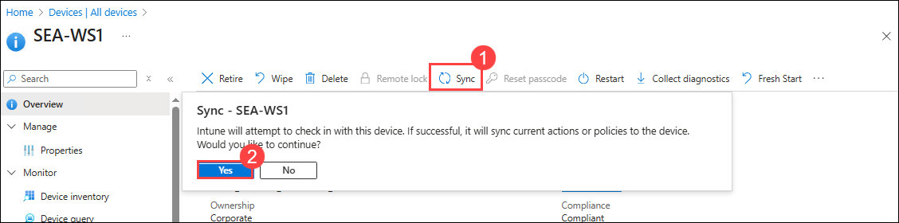

   > Wait for 3-4 minutes for the sync to complete.

3. Close Microsoft Edge.

### Task 4: Verify the configuration

In this task you will verify that the security policies are enforced on an enrolled device (SEA-WS1) and confirm that a non-enrolled device (SEA-CL1) does not receive the Intune security settings.

1. Switch to **HOSTVM** and sign in to **SEA-CL1**.

2. If necessary, sign in as **Contoso\Administrator** with the password of **Pa55w.rd**.

   >**Note**: Incase if you see the warning "Not enough memory" Go-to hyper-v manager in task bar and right click on any un used VM  and turn it off.
   >**Note**: Incase if you see the warning that restart is required, then Go-to hyper-v manager in task bar and right click on SEA-CL1 VM and select **turn off ** and do the right click again select **Settings** and disable the security boot enabled option and sign in again.

3. On **SEA-CL1**, select **Start (1)**, type **Windows Security (2)**, and then under the Windows Security icon select **Open (3)**.

   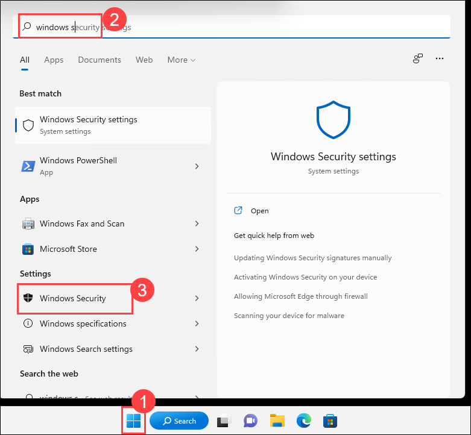

   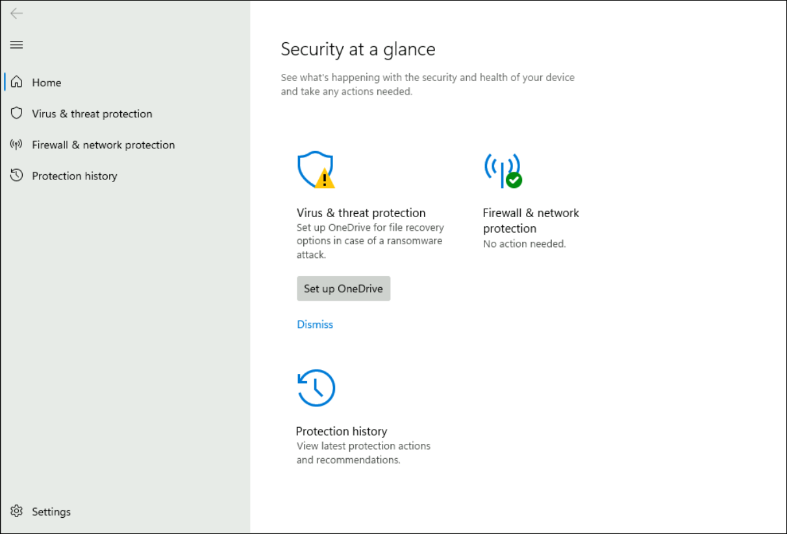

    > Notice that all security options are displayed. This is because SEA-CL1 is not enrolled to Intune.

4. Close **Windows Security** and sign out of SEA-CL1.

5. Switch to **SEA-WS1** VM through desktop shortcut inside HOSTVM and signout if necessary, and sign in as as **Aaron Nicholls** with the PIN: **102938**

     
  
   >**Note** : Ensure that you are in basic session mode and able to view Clipboard in the menu bar as shown in the below image. If not please change it to the basic session by selecting the icon which was highlighted in the tool bar in the below image.

     

6. Select **Start**, type **Windows Security**, and then under the Windows Security icon select **Open**.

   > Notice that all of the restricted areas as configured in the Intune policy are not displayed. SEA-WS1 is enrolled in Intune, which has applied the security settings.

7. Close **Windows Security** and sign out of **SEA-WS1**.

**Results**: After completing this exercise, you will have successfully created and applied a policy to configure Microsoft Defender for managed devices in Intune.

**END OF LAB**
