# Practice Lab: Configuring Disk Encryption Using Intune

## Summary

In this lab, you will configure BitLocker disk encryption using Intune.

### Prerequisites

To following lab(s) must be completed before this lab:

- 0203-Manage Device Enrollment into Intune

- 0204-Enrolling devices into Intune

- 0301-Creating and Deploying Configuration Profiles

  Note: You will also need a mobile phone that can receive text messages used to secure Windows Hello sign in authentication to Azure AD.

### Scenario

It's been determined that all the information on SEA-WS1 should be encrypted. You've been asked to configure full disk encryption on SEA-WS1 and require additional PIN authentication at startup.

### Task 1: Configure device configuration policy in Intune

In this task you will create and assign a BitLocker device configuration policy in Intune to ensure SEA-WS1 is fully encrypted and requires a PIN at startup.

1. Sign in to **SEA-SVR1** as **Contoso\\Administrator** with the password **Pa55w.rd** and close **Server Manager**.

2. On the taskbar, select **Microsoft Edge**.

3. In Microsoft Edge, type **https://intune.microsoft.com** in the  address bar, and then press **Enter**. 

4. Sign in as user **<inject key="AzureAdUserEmail"></inject>**, and use the tenant Admin password **<inject key="AzureAdUserPassword"></inject>**

5. In the **Microsoft Intune admin center** select **Endpoint security (1)** from the navigation bar, then on the **Endpoint security | Overview** page select **Disk encryption (2)**, and on the **Endpoint security | Disk encryption** blade in the details pane select **Create Policy (3)**.

    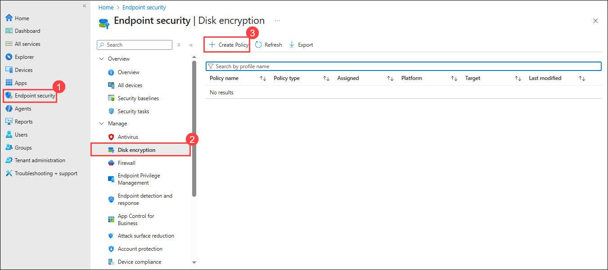

8. In the **Create a profile** page, select the following options, and then select **Create (3)**:

    -   Platform: **Windows (1)**
    -   Profile: **BitLocker (2)**

        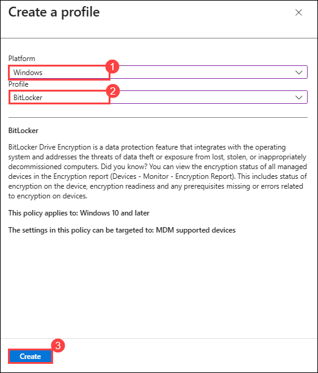

9. On the **Basics** page, enter the following information, and then select **Next (3)**:

    -   Name: **Contoso BitLocker (1)**
    -   Description: **Enable BitLocker for all devices (2)**

         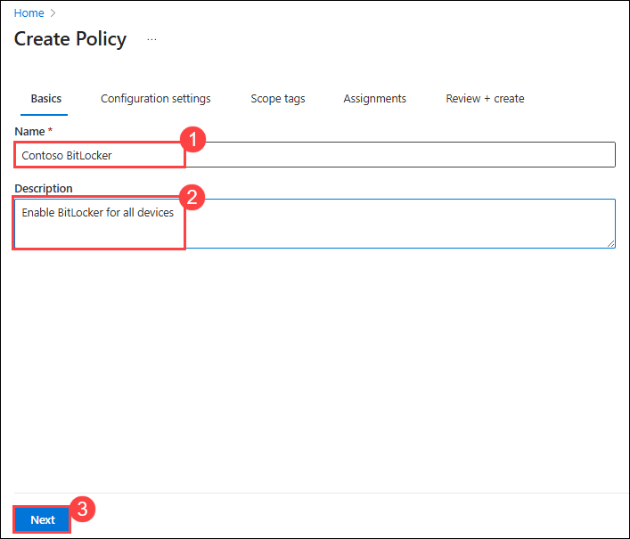

10. On the **Configurations settings** tab, expand **BitLocker (1)** and then configure the following option:

     - Require Device Encyrption: **Enabled (2)**

       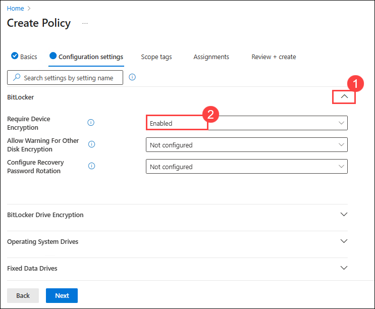

11. On the **Configurations settings** tab, scroll down to **Operating System Drives** and then configure the following options, leaving all other options to their defaults:

     - Enforce drive encryption type on operating system drives: **Enabled (1)**
     - Require additional authentication at startup: **Enabled (2)**
     - Choose how Bitlocker-protected operating system drives can be recovered: **Enabled (3)**
     - Do not enable Bitlocker until recovery info is stored to AD DS: **True (4)**
     - Omit recovery options from the BitLocker setup wizard: **True (5)**
     - Save Bitlocker recovery info to AD DS: **True (6)**

12. On the **Configurations settings** page, select **Next**.

13. On the **Scope tags** page, select **Next**.

14. On the **Assignments** tab, search for **Contoso** and then select **Contoso Developer devices**, and then select **Next**.

    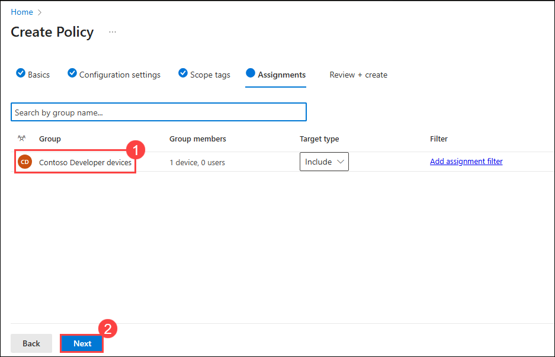

16. On the **Review + create** page, select **Save**.

    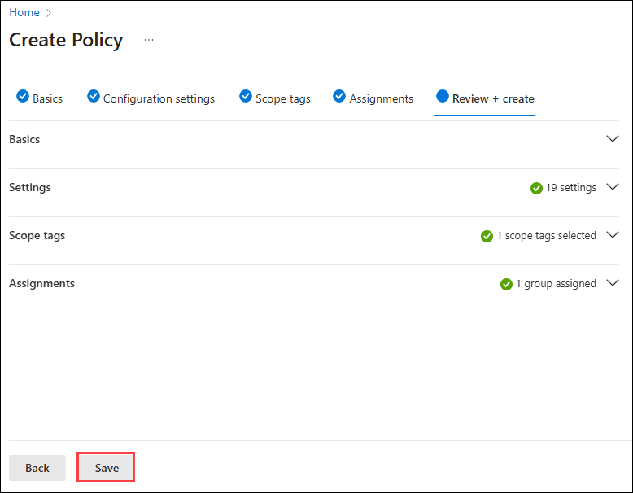

17. Close all open windows on **SEA-SVR1**.

### Task 2: Verify and enable BitLocker settings

In this task you will sync the device, trigger BitLocker activation on SEA-WS1, set the startup PIN, and complete the encryption process.

1. Switch to **HOSTVM** and sign in to **SEA-WS1** VM through desktop shortcut as **Aaron Nicholls** with the PIN **102938**. 
   
     >**Note** : Ensure that you are in basic session mode and able to view Clipboard in the menu bar as shown in the below image. If not please change it to the basic session by selecting the icon which was highlighted in the tool bar in the below image.

    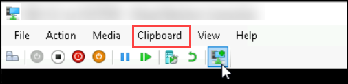
    
    >**Note**: Inorder for the **PIN** to prompt you must start the VM in **basicmode** which will result in deactivating the clipboard shortcuts. You can use the Clipboard option in toolbar to perform copy paste actions.  

2. On the taskbar, select **Start (1)** and then select the **Settings (2)** app.

    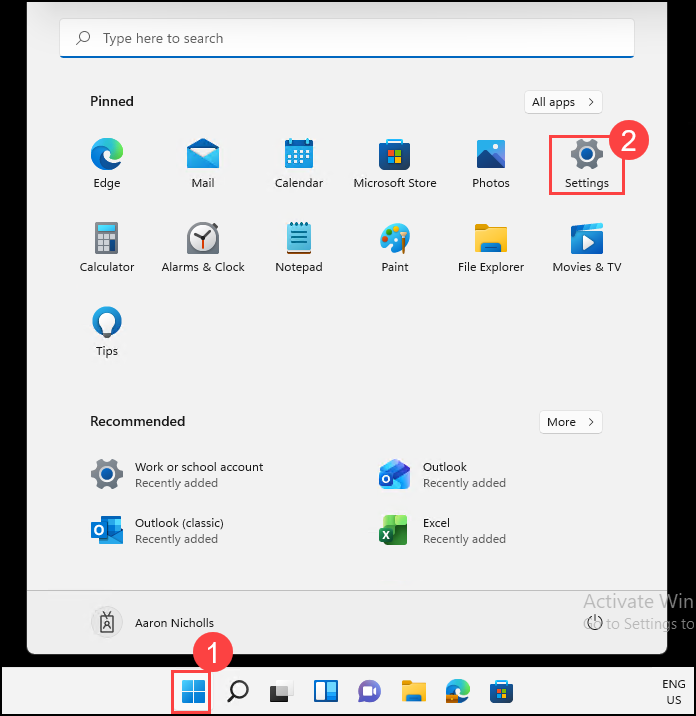

3. In the **Settings** app, select **Accounts (1)** and then select **Access work or school (2)**.

    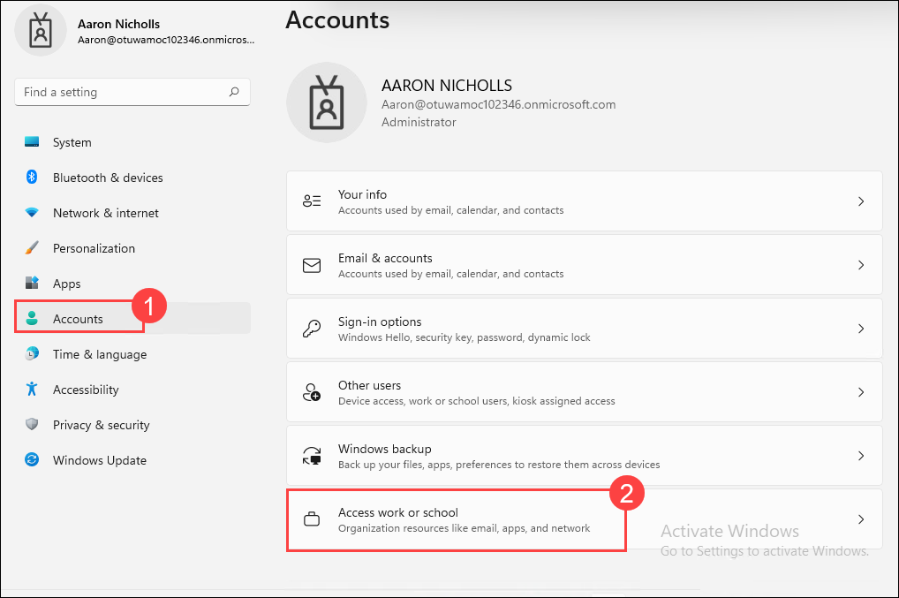

4. In the **Access work or school** section, select the **Connected to Contoso's Azure AD** link and then select **Info**. Select **Sync**.

    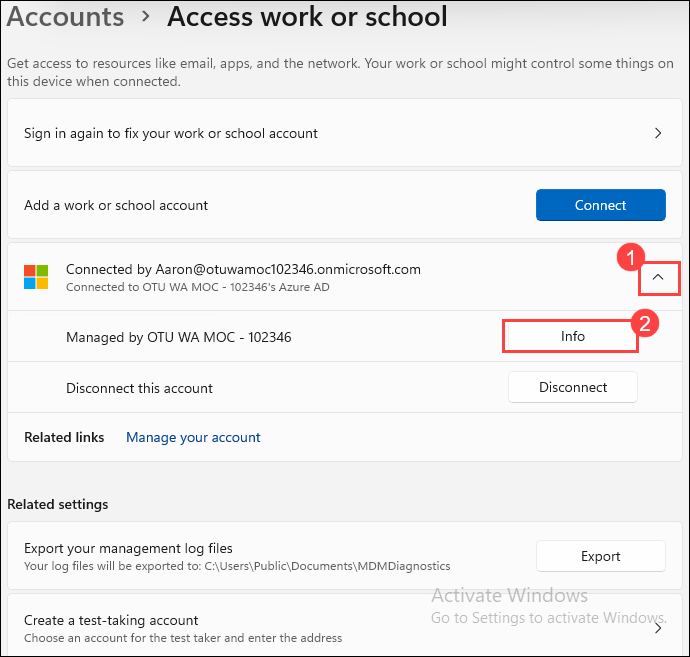

5. Select the **Encryption needed** notification.

   _Note: It may take some time until the notification shows up._

6. On the **Are you ready to start encryption?** dialog, select the checkbox next to **I don't have any other disk encryption software installed, encrypt all my disks**, and select **Yes**.

    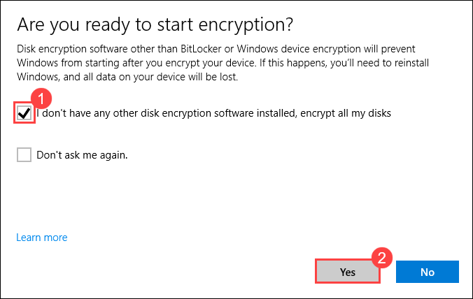

   >**Note** : If you encounter an error related to TPM when starting BitLocker, please follow the steps below, and then perform a policy **sync**

    - **Open the Group Policy Editor**  
       Press `Windows + R`, type `gpedit.msc`, and press **Enter**.

    - **Navigate to the following path**  
      `Computer Configuration > Administrative Templates > Windows Components > BitLocker Drive Encryption > Operating System Drives`

   - **Configure the policy**  
      - Double-click **Require additional authentication at startup**  
      - Set the policy to **Enabled**  

7. On the **Choose how to unlock your drive at startup?** page, select **Enter a Password**

    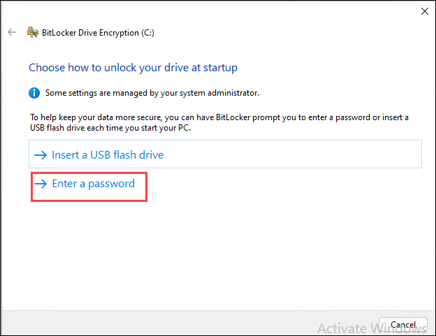

8. On the **Enter a Password** page, in the **Password** and **Reenter Password** boxes, enter **Admin@123**, and then select **Set Password**.

    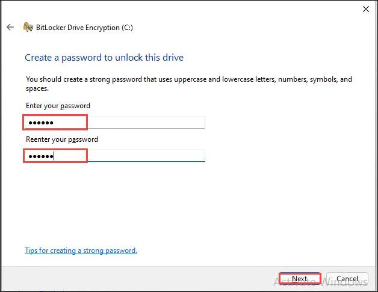

9. On the **Choose how much of your drive to encrypt** page, select **Encrypt used disk space only** and select **Next**.

    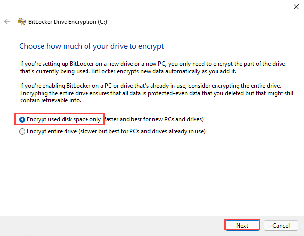
   
11. On the **Choose which encryption mode to use** page, ensure that **New encryption mode (best for fixed drives on this device)** is selected, and then select **Next**.

    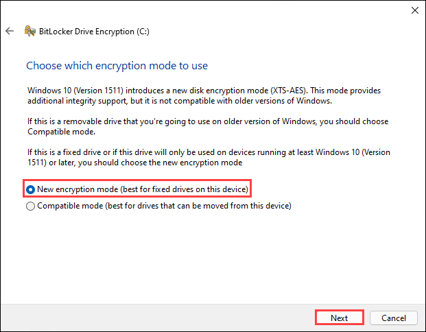
    
12. On the **Are you ready to encrypt this drive** page, select **Continue**. Wait for the encryption to complete.

    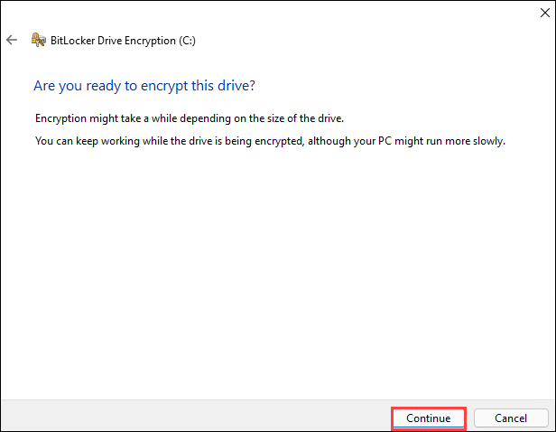

13. At the **Encryption of C: is complete** message, select **Close**, and then restart **SEA-WS1**.

    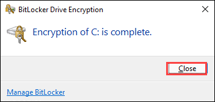

14. When **SEA-WS1** restarts, type **Admin@123** and press **Enter** to unlock the drive.

    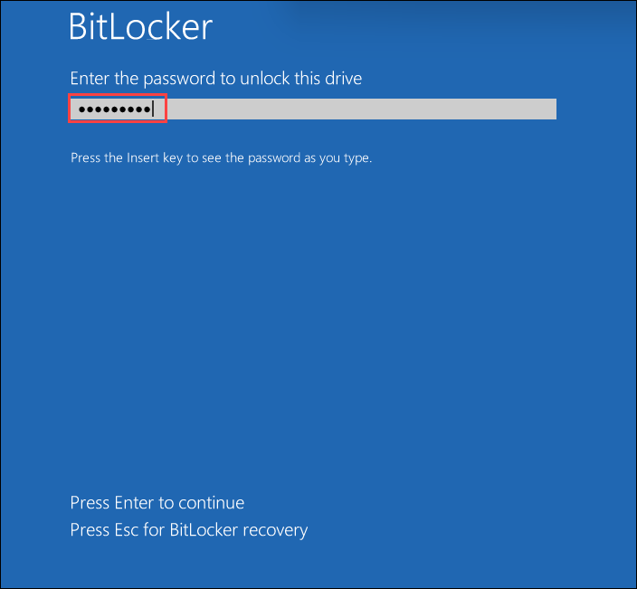

### Task 3: Verify BitLocker protection

In this task you will verify that BitLocker protection is enabled and confirm that the operating system drive is successfully encrypted.

1. Sign in to **SEA-WS1** as **Aaron Nicholls** with the Password **102938**.

2. On the taskbar, select **File Explorer** and then select **This PC**.

3. In the navigation pane, right-click **Local Disk (C:)**, select **Show more options**, and then select **Manage BitLocker**.

    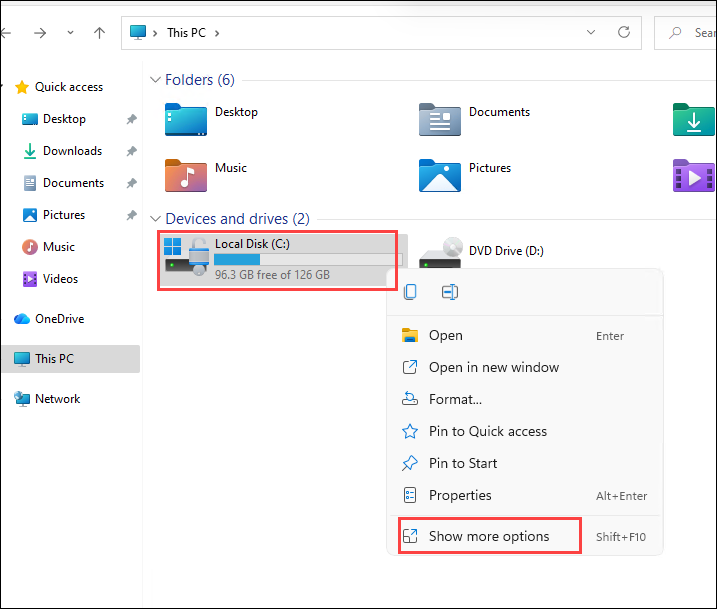

    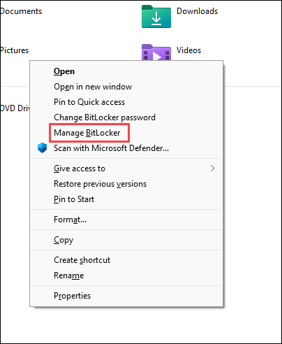

4. In the **BitLocker Drive Encryption** window, ensure that you see **C: BitLocker on** status. This means that drive is encrypted. 

    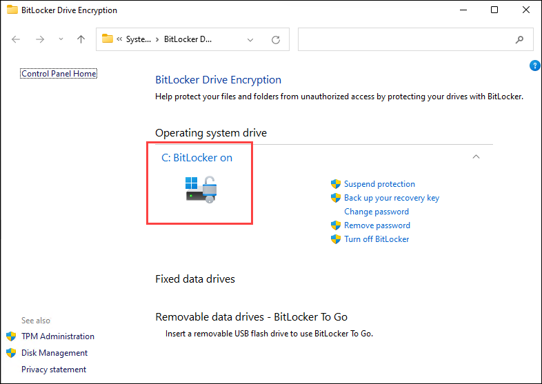

5. Close all open windows and sign out of **SEA-WS1**.

**Results**: After completing this exercise, you will have successfully configured disk encryption by using Intune.

**END OF LAB**
