# Practice Lab: Deploying Windows 11 using Microsoft Deployment Toolkit

## Summary

In this lab, you will use the Microsoft Deployment Toolkit to create and deploy a Windows 11 operating system image. 

> **!IMPORTANT**: Once you launch the track, you’ll have access to a virtual machine (VM) for **40 hours**. The displayed track duration of **30 days** indicates the time frame during which you can use your VM. Please plan your lab sessions accordingly. If the VM uptime of **40 hours** is fully exhausted before completing the labs, access will be lost. To avoid this and for detailed instructions on VM usage and stopping/deallocating the VM, refer to the Getting Started page.  

> If the full 40 hours of VM uptime is exhausted, the VM will no longer be accessible, and **the lab duration cannot be extended**.

### Scenario

You need to deploy a new Windows 11 virtual machine named SEA-WS4. You decide to use Microsoft Deployment Toolkit to deploy the operating system to a virtual machine created in Hyper-V. You will configure a new Deployment Share in MDT and then configure the task sequence that will perform the steps to deploy SEA-WS4.

### Task 1: Create a new Deployment Share

In this task you will create a new Deployment Share in MDT that will store the operating system files, applications, and task sequences needed for deploying Windows 11.

1. Switch to **HOSTVM**, select **File Explorer** from the taskbar and then browse to **D:\\Labfiles\\ISOs** **(1)**. Right-click **Win11_21H2_Eval.iso (2)** and then select **Mount (3)**. The ISO mounts as DVD Drive E.

     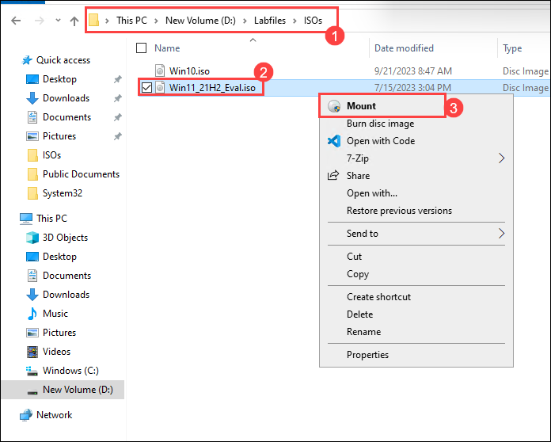

3. Close **File Explorer**.

4. Select **Start (1)**, expand **Microsoft Deployment Toolkit (2)**, and then select **Deployment Workbench (3)**.

     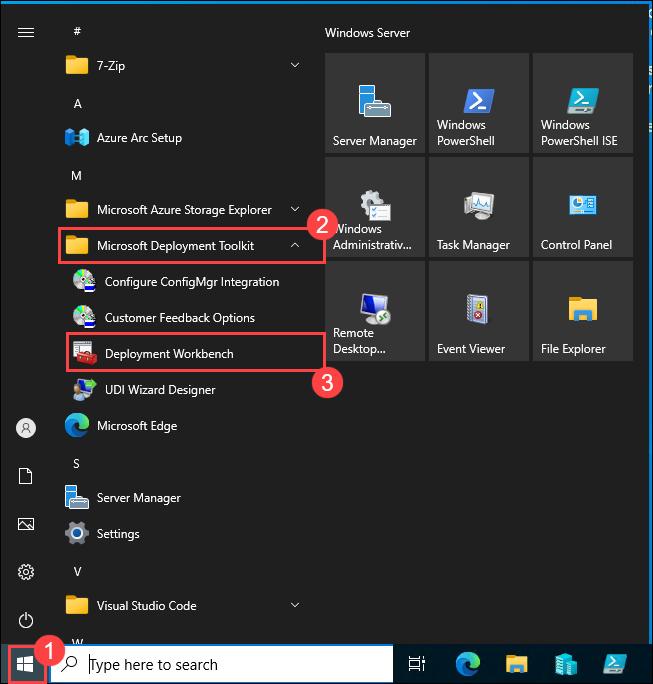

5. In the **Deployment Workbench**, right-click **Deployment Shares (1)** and then select **New Deployment Share (2)**.

    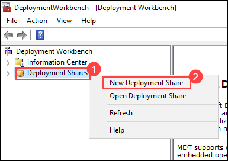

   > The **New Deployment Share Wizard** opens.

6. On the **Path** page, under **Deployment share path**, change the value to **C:\DeploymentShare** and then select **Next**.

     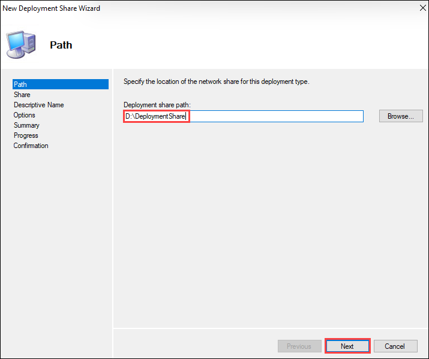

7. On the **Share** page, take note of the **Share name**, but do not change it. Select **Next**.

     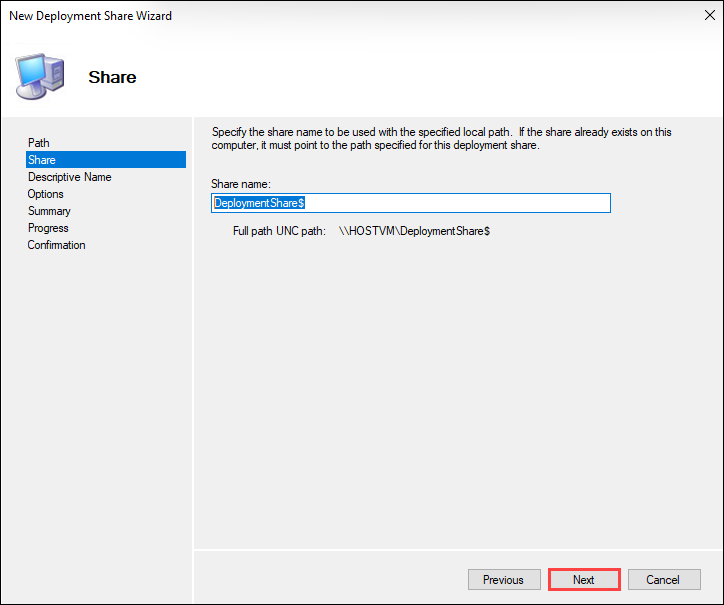

8. On the **Descriptive Name** page, accept the default value and select **Next**.

     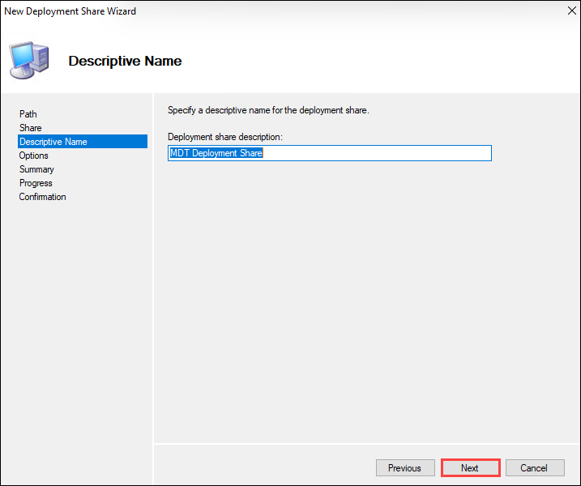

9. On the **Options** page, configure the following, and then select **Next**:

   - Ask to set the local Administrator password: **Enabled**

   - All other check boxes: **Disabled**

     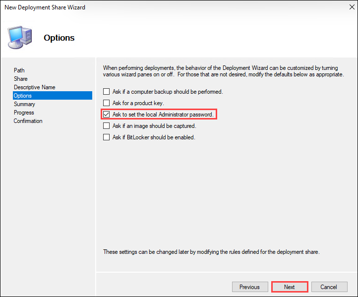

10. On the **Summary** page, review the information and then select **Next**. 

     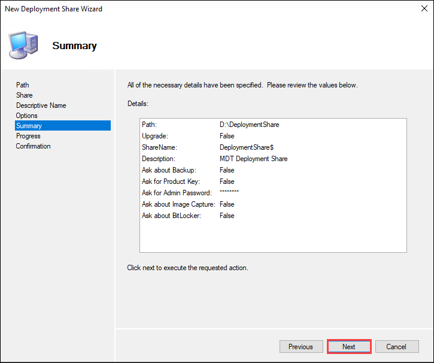

11. On the **Confirmation** page, ensure that the process completed successfully and then select **Finish**.

     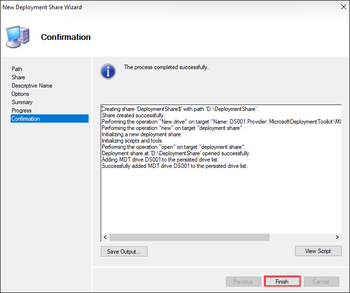

12. Under **Deployment Shares**, expand the **MDT Deployment Share** folder. 

     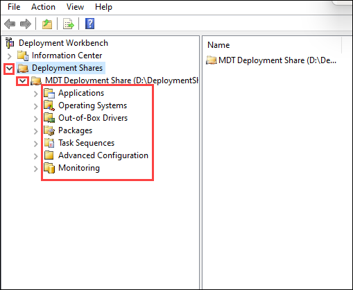

    > Take note of the various nodes that can be configured for the deployment share.

### Task 2: Add Operating System files to the Deployment Share

In this task you will import the Windows 11 operating system source files into the Deployment Share so MDT can use them for deployment.

1. In the Deployment Workbench, expand **Deployment Shares (1)**, expand **MDT Deployment Share (2)**, and then select **Operating Systems**. Right-click **Operating Systems (3)** and then select **Import Operating System (4)**. The Import Operating System Wizard opens.

    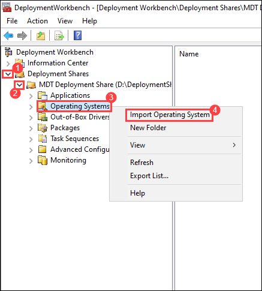 

3. In the **Import Operating System Wizard**, on the **OS Type** page, select **Full set of source files (1)** and then select **Next (2)**.

     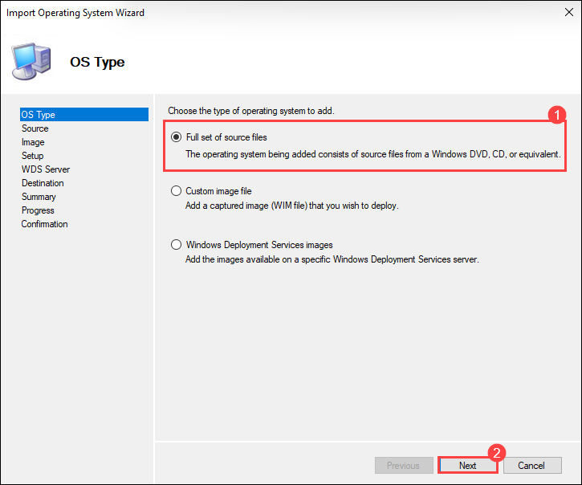

4. On the **Source** page, under **Source Directory**, enter **E:\\ (1)** and then select **Next (2)**.

     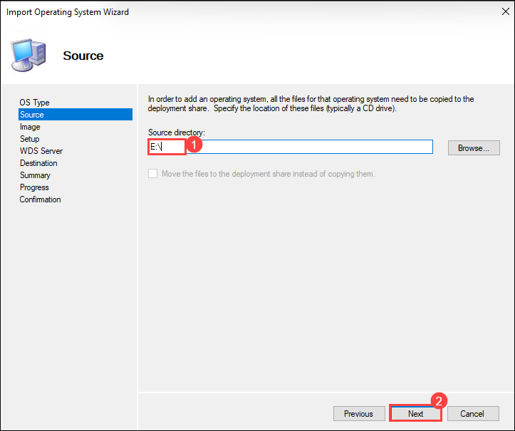

5. On the **Destination** page, change the default destination directory name to **Windows 11 Enterprise x64 (1)** and then select **Next (2)**.

     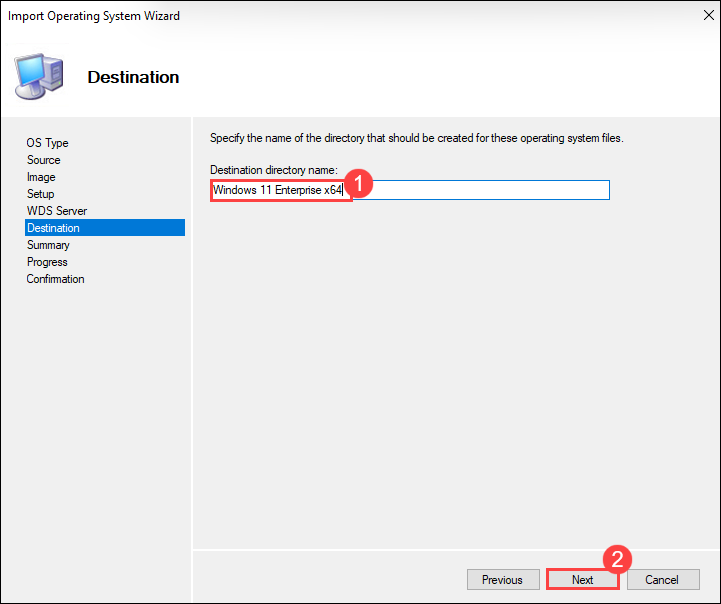

6. On the **Summary** page, review the information and then select **Next**. 

     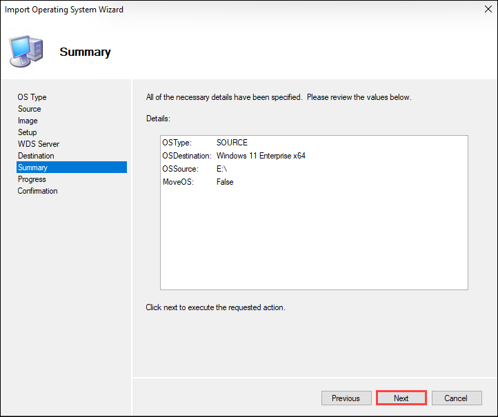

   > The operating system source files are copied into the deployment share.

7. On the **Confirmation** page, ensure that the process completed successfully and then select **Finish**.

     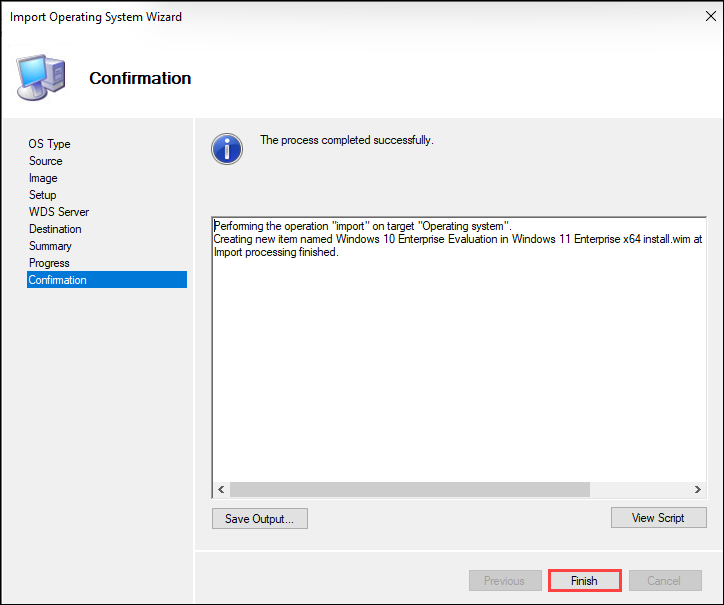

8. In the **Deployment Workbench**, with **Operating Systems** selected, verify that the operating system displays.

     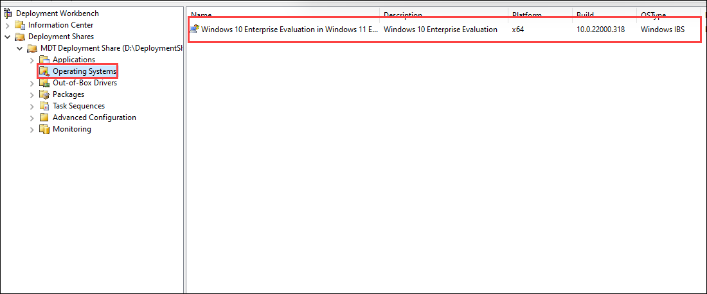

### Task 3: Add Applications to the Deployment Share

In this task you will add an application to the Deployment Share so it can be installed during the Windows 11 deployment process.

1. In the Deployment Workbench, expand **Deployment Shares**, expand **MDT Deployment Share**, and then select **Applications**. Right-click **Applications** and then select **New Application**. The New Application Wizard opens.

     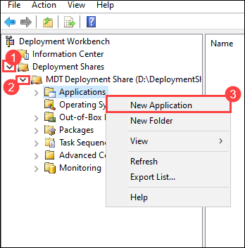

3. In the **New Application Wizard**, on the **Application Type** page, select **Application with source files** and then select **Next**.

     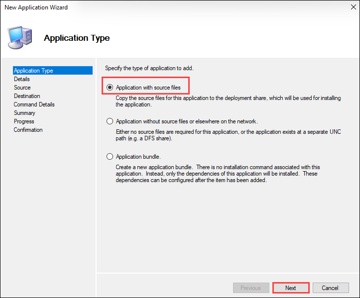

4. On the **Details** page, configure the following, and then select **Next (3)**:
    - Publisher: **Microsoft (1)**
    - Application Name: **XML Notepad (2)**

        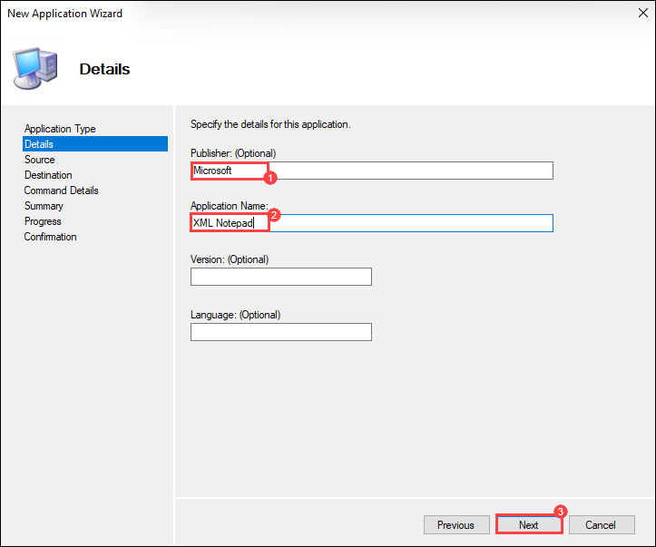

5. On the **Source** page, under **Source directory**, enter **D:\\Labfiles\\Apps** and then select **Next**.

     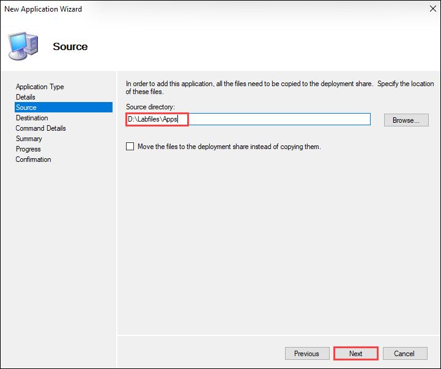

6. On the **Destination** page, accept the default destination directory name and then select **Next**.

     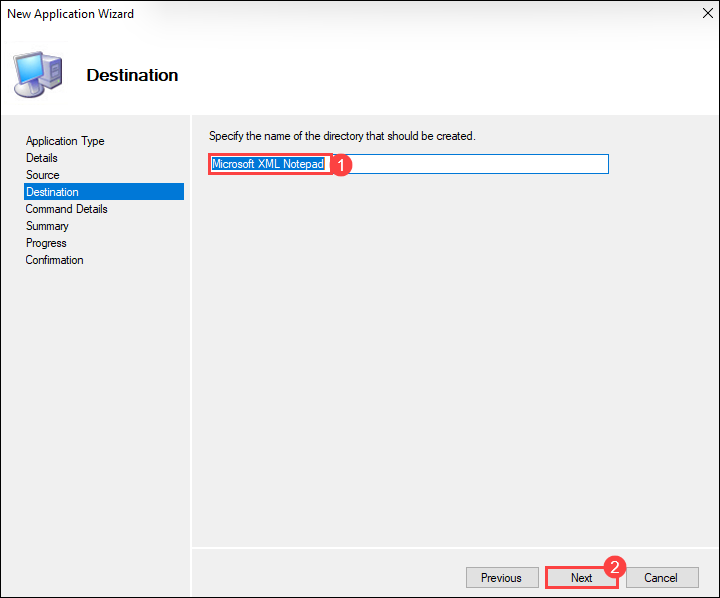

7. On the Command Details page, locate the **Command line** field.

8. Type **XmlNotepadSetup.msi /q** into the field, then click **Next** to continue.

     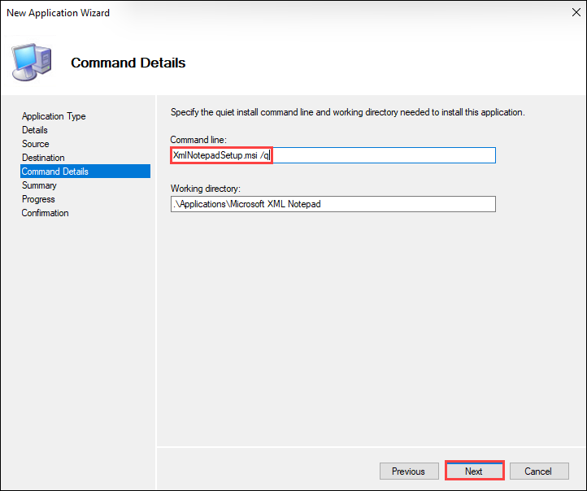

9. On the **Summary** page, review the information and then select **Next**. 

     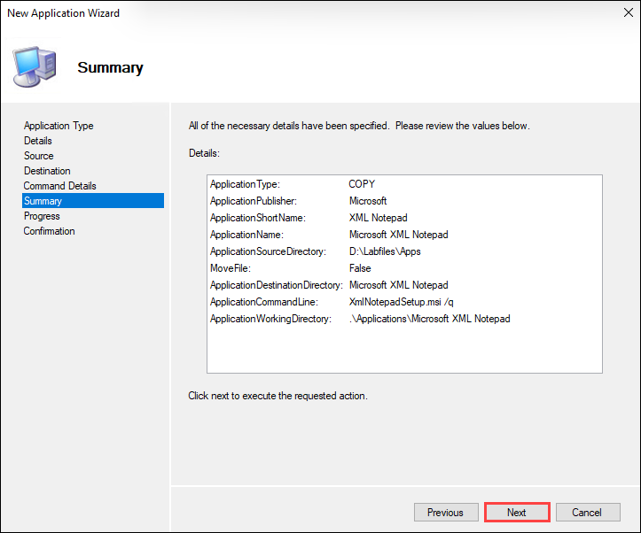

10. On the **Confirmation** page, ensure that the process completed successfully and then select **Finish**.

     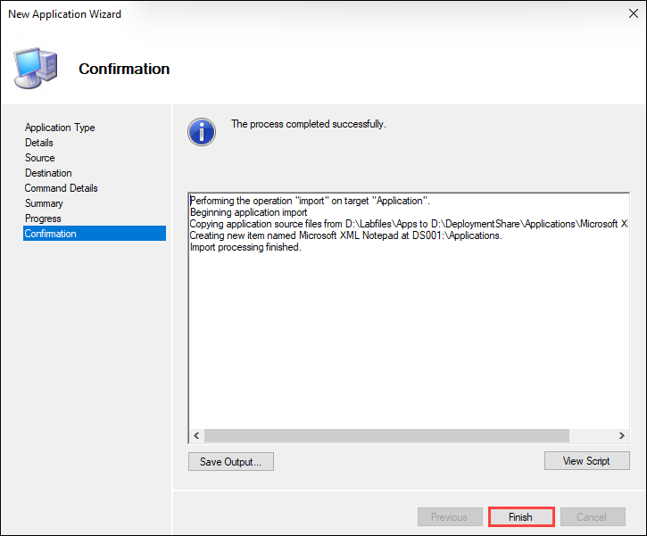

### Task 4: Create an MDT Task Sequence

In this task you will create a new MDT task sequence that automates the steps required to deploy Windows 11.

1. In the Deployment Workbench, expand **Deployment Shares (1)**, expand **MDT Deployment Share (2)**, and then select **Task Sequences**. Right-click **Task Sequences (3)** and then select **New Task Sequence (4)**. The **New Task Sequence Wizard** opens.

     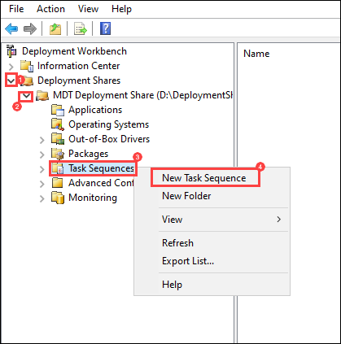

3. On the **General Settings** page, configure the following and then select **Next (3)**:
   - Task sequence ID: **001 (1)**
   - Task sequence name: **Deploy Windows 11 Enterprise (2)**

     

4. On the **Select Template** page, select **Standard Client Task Sequence (1)**, and then select **Next (2)**.

     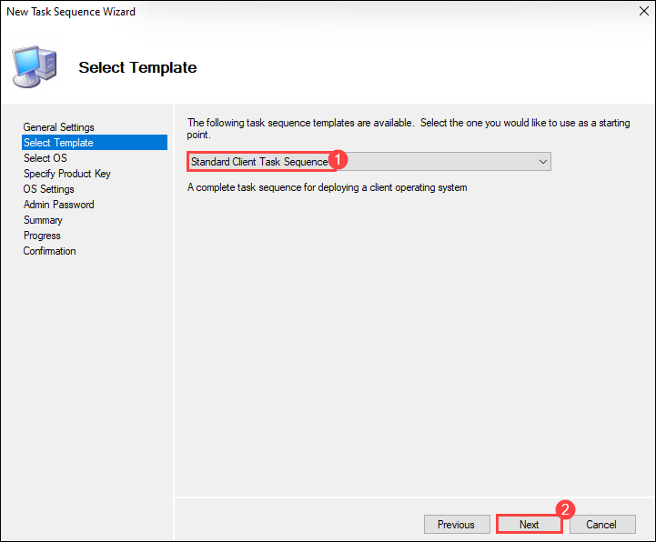

5. On the **Select OS** page, select **Windows 10 Enterprise Evaluation** and then select **Next**.

     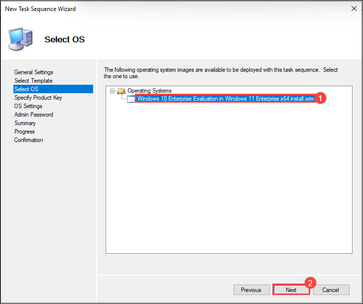

6. On the **Specify Product Key** page, select **Do not specify a product key at this time**, and then select **Next**.

     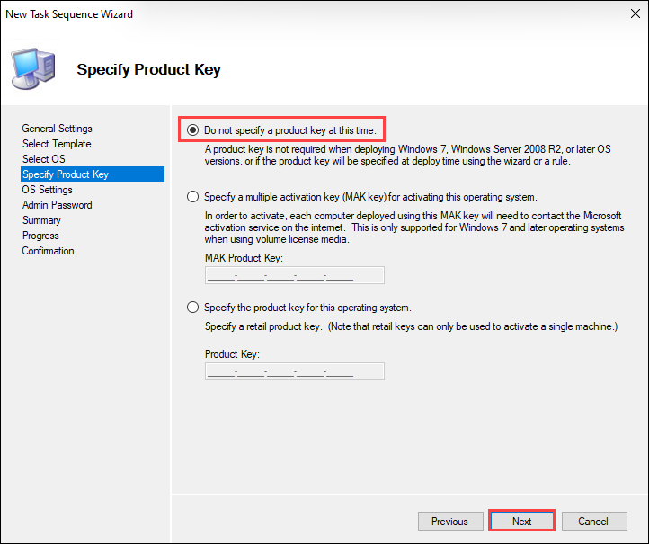

7. On the **OS Settings** page, configure the following and then select **Next (4)**:
   - Full Name: **User (1)**
   - Organization: **Contoso Corporation (2)**
   - Internet Explorer Home Page: **about:blank (3)**

      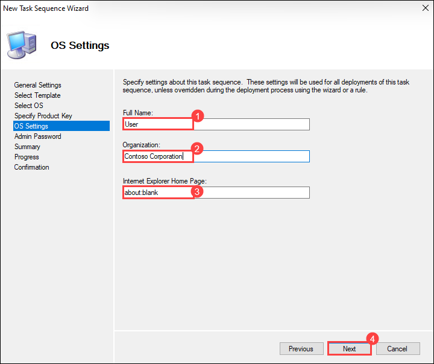

8. On the **Admin Password** page, select **Use the specified local Administrator password**, and then enter **Pa55w.rd** in both text boxes. Select **Next**.

     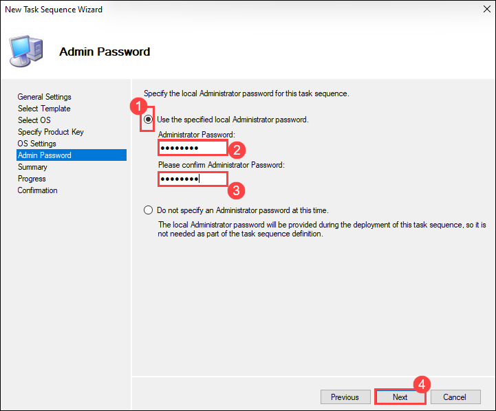

9. On the **Summary** page, review the information and then select **Next**. 

     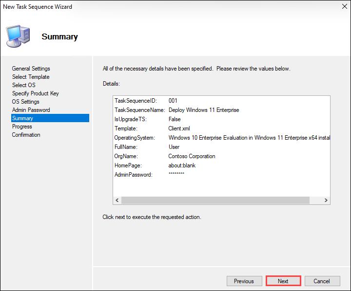

10. On the **Confirmation** page, ensure that the process completed successfully and then select **Finish**.

     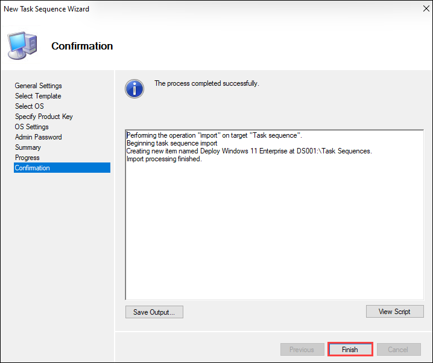

11. In the **Deployment Workbench**, with **Task Sequences** selected verify that the **Deploy Windows 11 Enterprise** task sequence displays.

     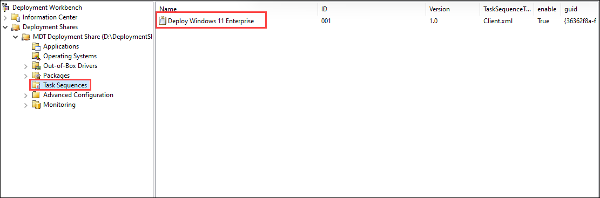

12. Right-click the **Deploy Windows 11 Enterprise (1)** task sequence, and then select **Properties (2)**. 

     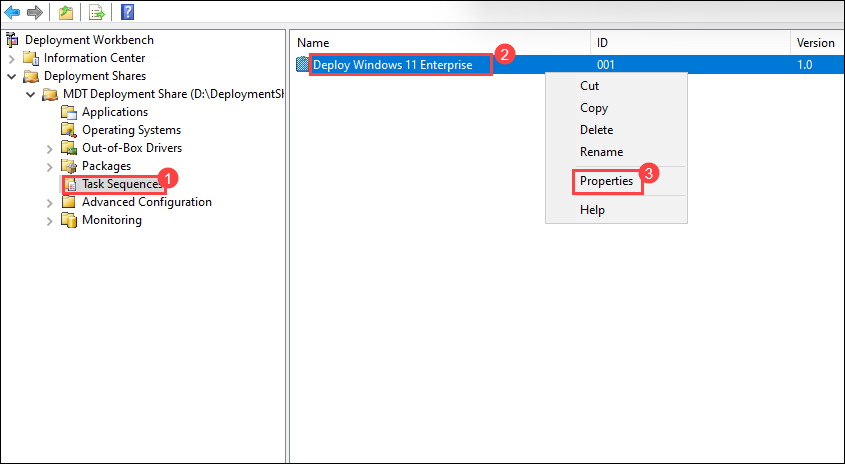

13. Select the **Task Sequence (1)** tab, then expand the **Validation (2)** node and select **Validate (3)**, and on the **Properties** page remove the check marks next to **Ensure minimum memory (4)** and **Ensure minimum processor speed (5)**.

     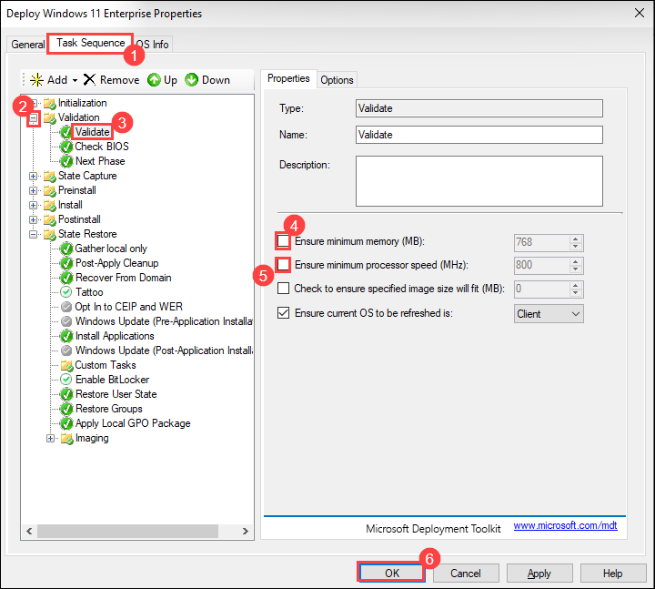

    > Do not make any other changes.

16. On the **Deploy Windows 11 Enterprise Properties** window, select **OK**.

### Task 5: Configure Deployment Share Properties and Windows PE settings

In this task you will configure the Deployment Share settings and update the Windows PE boot image used to start the deployment.

1. In the Deployment Workbench, expand **Deployment Shares**, and select **MDT Deployment Share**.

2. Right-click **MDT Deployment Share** and then select **Properties**.

     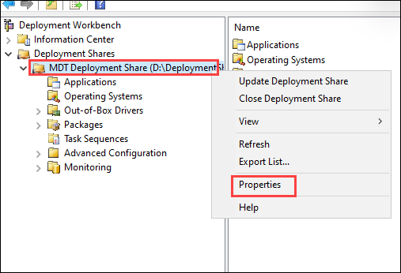

3. In the **MDT Deployment Share Properties** window, on the **General** tab, take note of the information that was provided when the deployment share was created.

     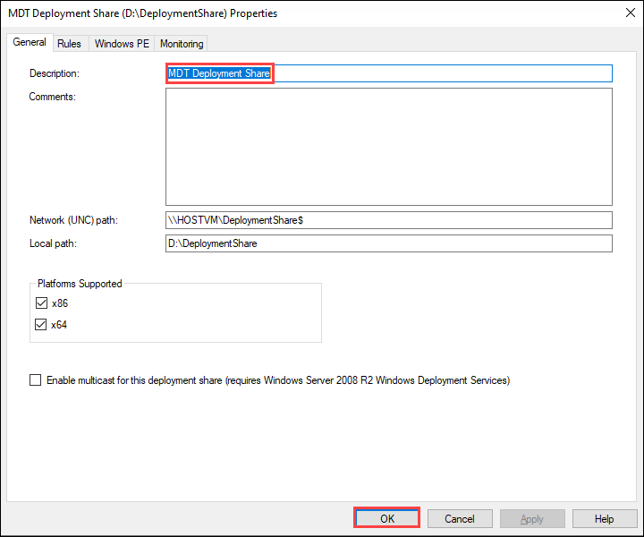

4. Select the **Rules** tab. 

     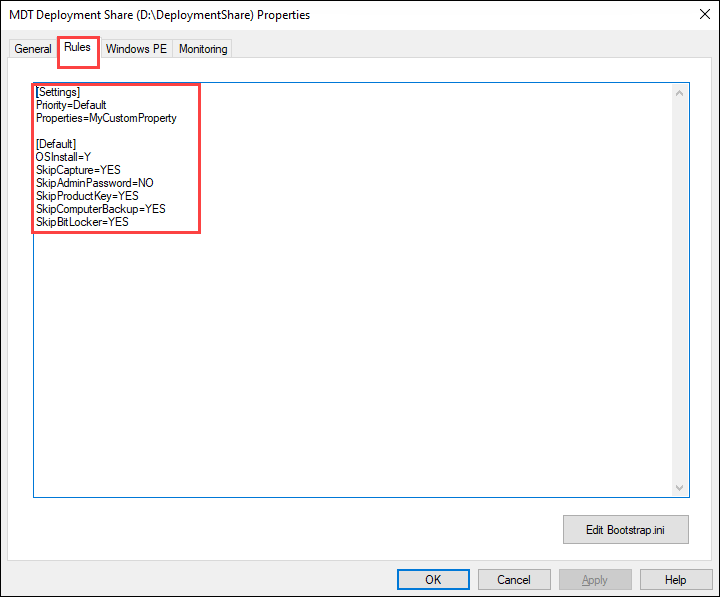

   > The Rules tab displays the content of the CustomSettings.ini file. These values were also provided during the creation of the deployment share.

5. Select the **Windows PE** tab. 

   > The Windows PE tab provides options for creating a Windows PE boot disk.

6. On the **Windows PE** tab, next to **Platform**, select **x64 (1)**. In the **Windows PE Customizations** section, next to **Scratch space size**, select **64 (2)**.

     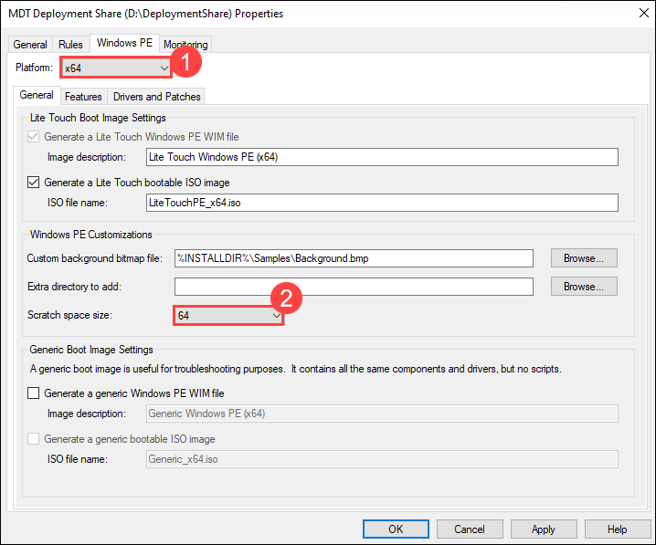

8. Select the **Features** tab and then select the check box next to the following Feature Packs:
   - DISM Cmdlets
   - Windows PowerShell
   - Microsoft Data Access Components (MDAC/ADO) support

        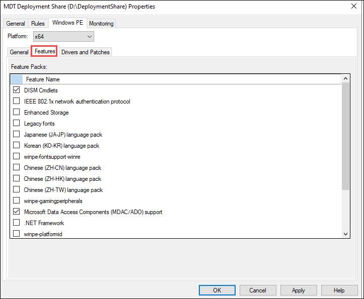

9. Select the **Monitoring** tab.

10. On the **Monitoring** tab, select the check box next to **Enable monitoring for this deployment share**.

11. In the **MDT Deployment Share Properties** window, select **OK**.

     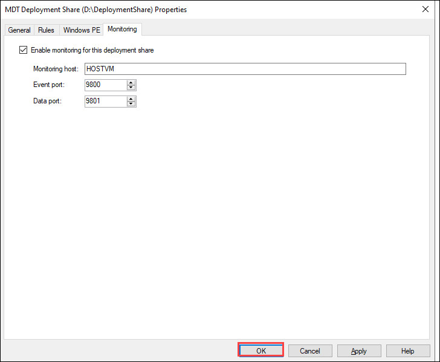

12. Right-click **MDT Deployment Share** and then select **Update Deployment Share**. The Update Deployment Share Wizard opens.

     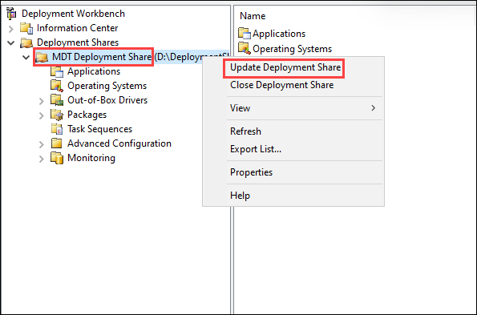

13. On the **Options** page, select **Optimize the boot image updating process** and then select **Next**.

     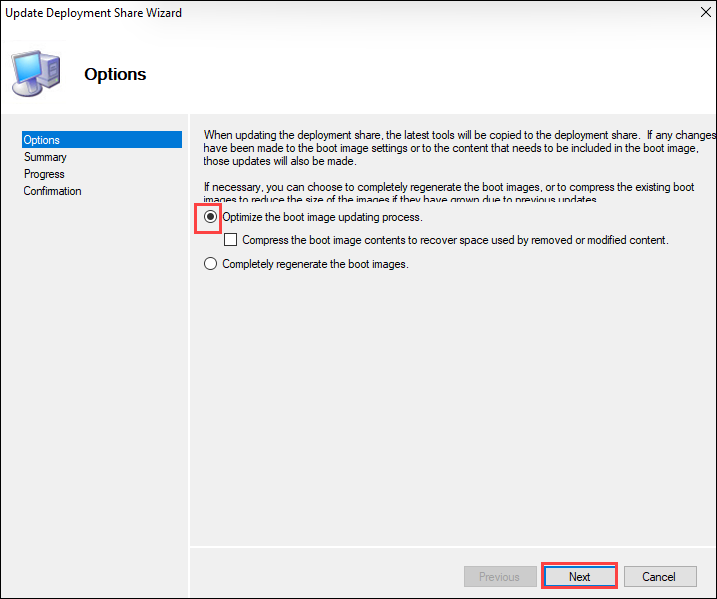

14. On the **Summary** page, select **Next**. 

    > The Deployment Share starts to update and create the Windows PE files. This will take a few minutes to complete.

15. On the **Confirmation** page, ensure that the process completed successfully and then select **Finish**.

### Task 6: Deploy Windows 11 Using MDT

In this task you will create a new virtual machine and use the MDT boot image to deploy Windows 11 through the task sequence you configured.

1. On HOSTVM, select **Hyper-V Manager** in the taskbar.

2. In Hyper-V Manager, select **New (1)** in the Actions pane and then select **Virtual Machine (2)**.

     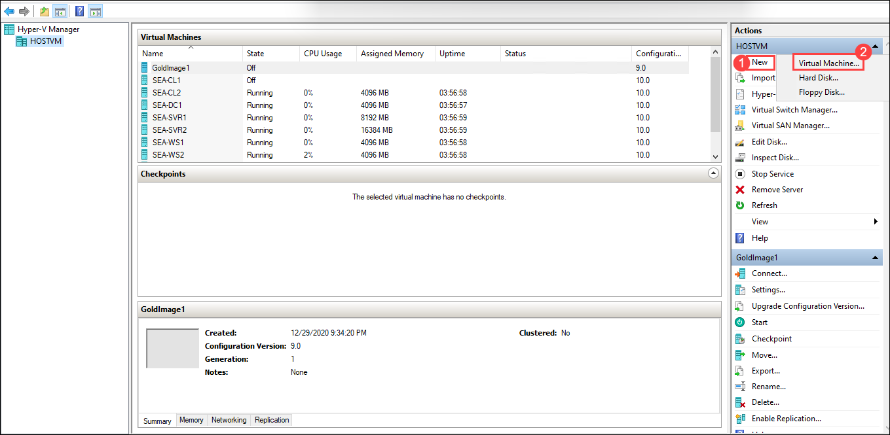

3. On the **Before you Begin** page, select **Next**.

     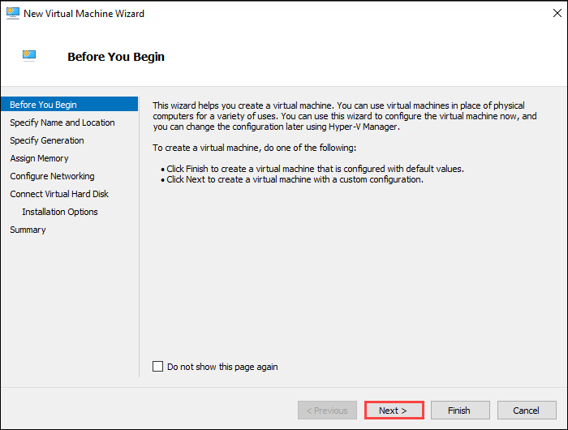

4. On the **Specify Name and Location** page, in the **Name (1)** box type **SEA-WS4**. Select the check box next to **Store the virtual machine in a different location (2)** and then next to **Location (3)** type **D:\\Labfiles\\VirtualMachines**. Select **Next (4)**.

     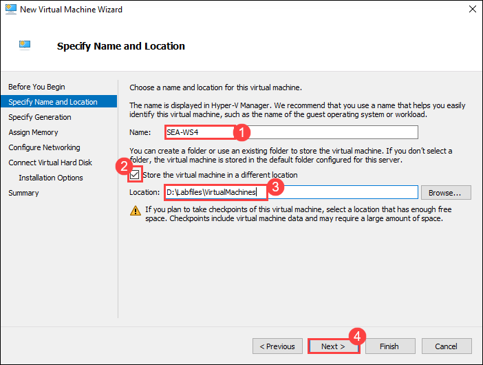

6. On the **Specify Generation** page, ensure that **Generation 2** is selected and then select **Next**.

     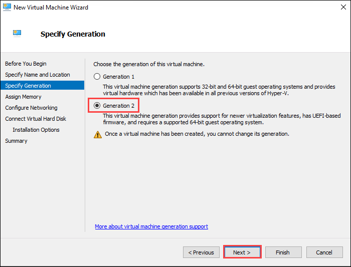

7. On the **Assign Memory** page, next to **Startup memory** type **8192** and then select **Next**.

     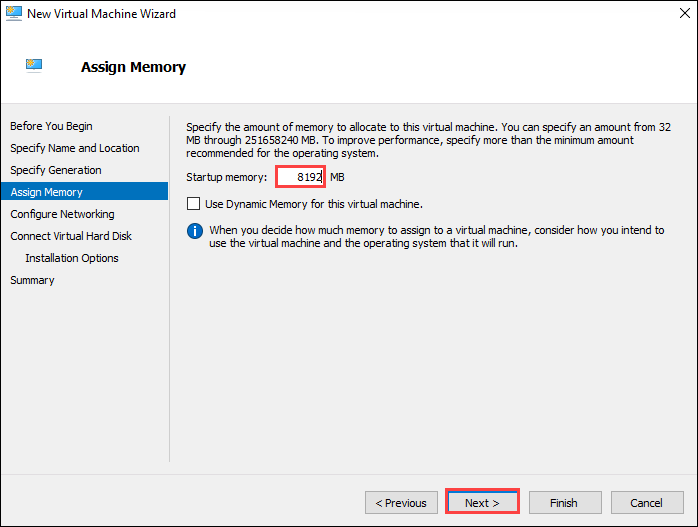

8. On the **Configure Networking** page, next to **Connection**, select **Internalswitch** and then select **Next**.

     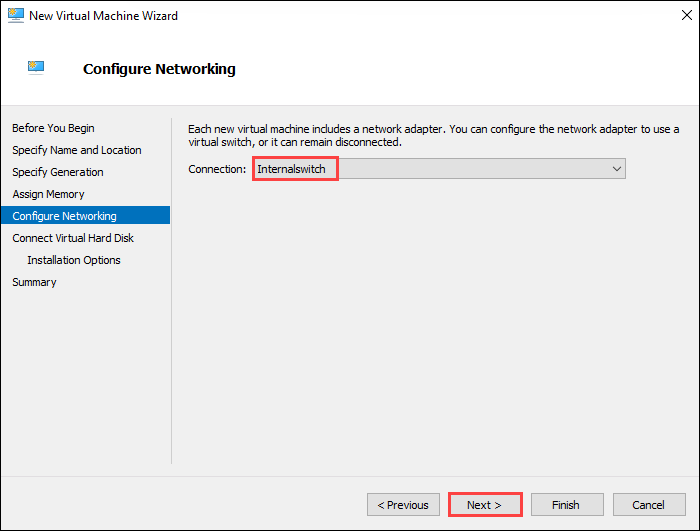

9. On the **Connect Virtual Hard Disk** page, select **Create a virtual hard disk (1)** and enter the following and then click **Next (5)**:

    - Name: **SEA-WS4.vhdx (2)**
    - Location: **D:\\Labfiles\\VirtualMachines (3)**
    - Size: **60 GB (4)**

        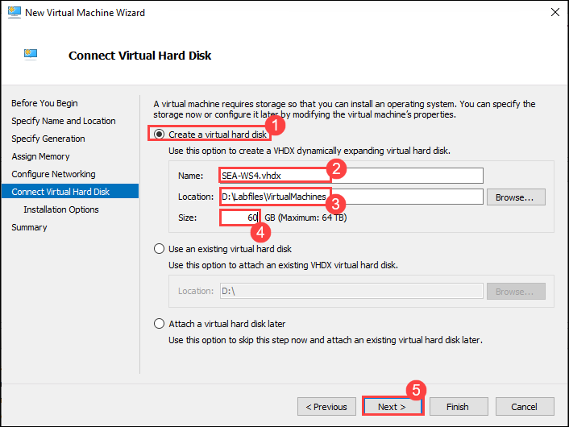

10. On the **Installation Options** page, select **Install an operating system from a bootable image file** and configure the following:

    - Image file (.iso): **D:\\DeploymentShare\\Boot\\LiteTouchPE_x64.iso**

         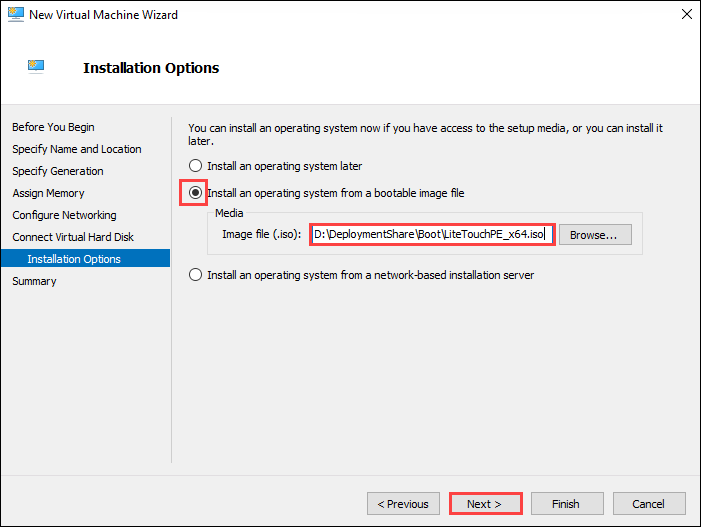

11. Select **Next** and then **Finish**.

15. In Hyper-V Manager, right-click **SEA-WS4 (1)**, and then select **Settings (2)**.

     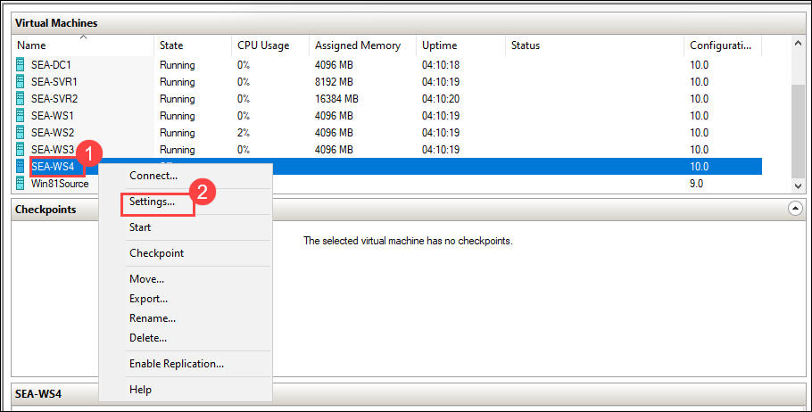

16. Select **Security (1)**, and then select the check box next to **Enable Trusted Platform Module (2)**.
     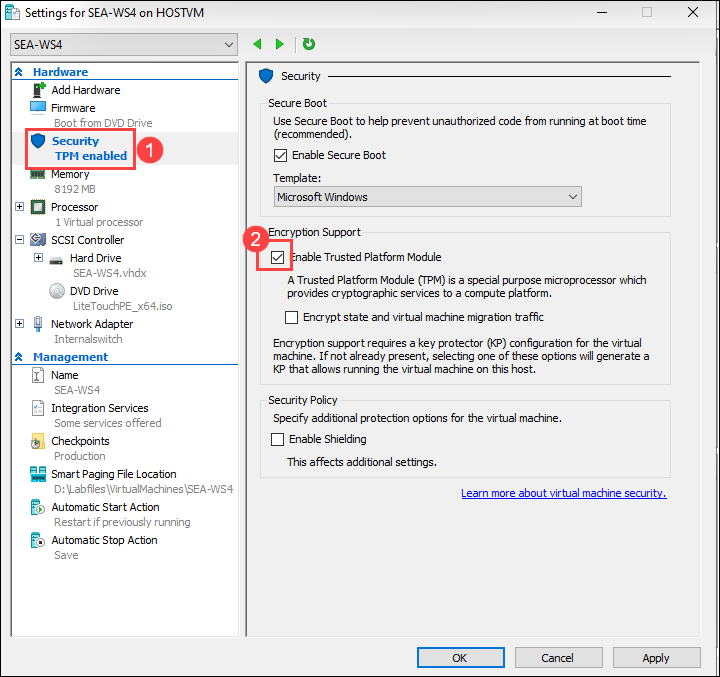

17. Select **Processor (1)**, and then change the number of virtual processors to **2 (2)**. Select **OK (3)** to close the Settings dialog box.

     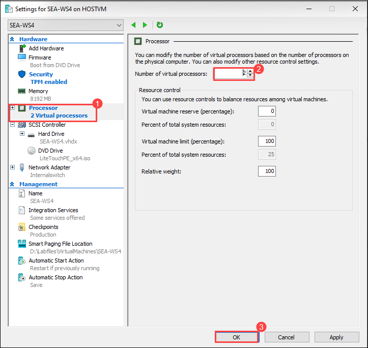

19. In Hyper-V Manager, select **SEA-WS4**, select **Connect**,  and then select **Start**.

    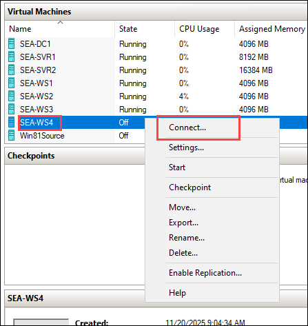

    >**Note**: Incase if you see any warning such as "Not enough storage" turn off any other unused VM  and try again.

20. As the computer starts press any key on the keyboard to invoke the MDT Deployment Wizard. Maximize the window as needed.

21. On the **Welcome** page, select **Run the Deployment Wizard to install a new Operating System**. It might take few seconds or minutes to load.

     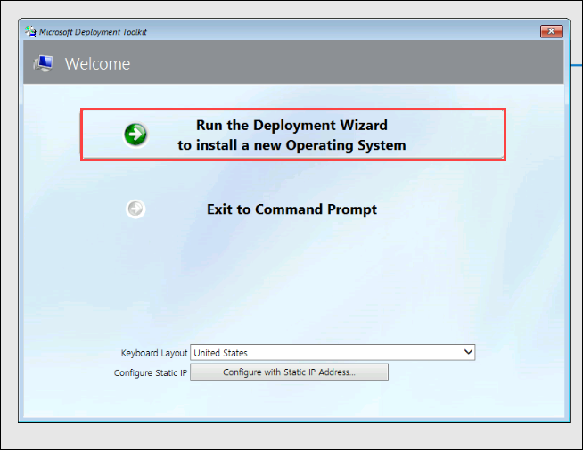

22. On the **Specify credentials for connecting to network shares** window, enter the following and then select **OK**:
    - User Name: **demouser**
    - Password: **Password.1!!**
    - Domain: **Contoso**

         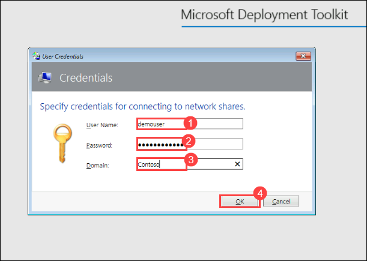

23. On the **Task Sequence** page, select **Deploy Windows 11 Enterprise** and then select **Next**.

     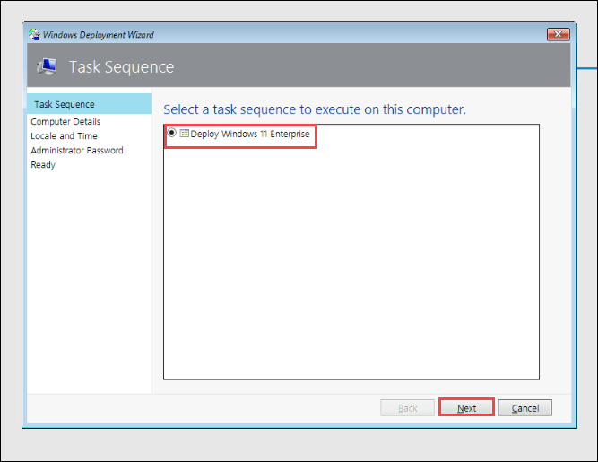

24. On the **Computer Details** page, next to **Computer name** enter **SEA-WS4 (1)** and then select **Next (2)**.

     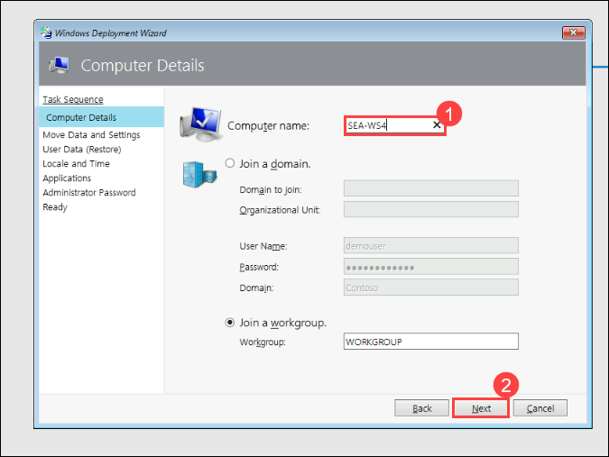

25. On the **Move Data and Settings** page, select **Next**.

     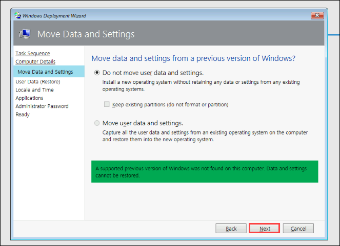

26. On the **User Data (Restore)** page, select **Next**.

     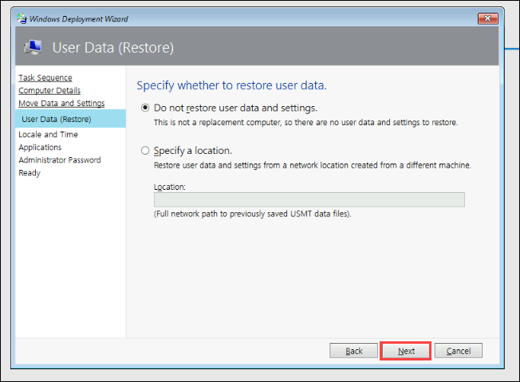

27. On the **Locale and Time** page, select **Next**.

     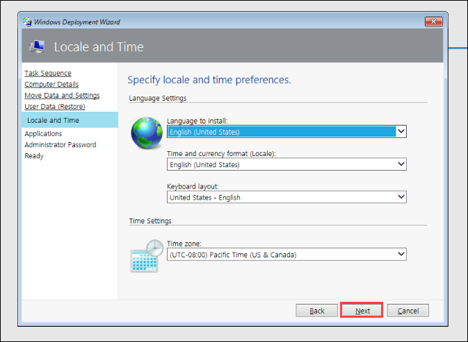

28. On the **Applications** page, select **Next**.

     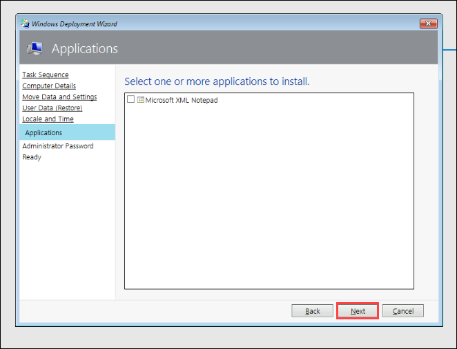

29. On the **Administrator Password** page, enter **Pa55w.rd** in both text boxes and then select **Next**.

     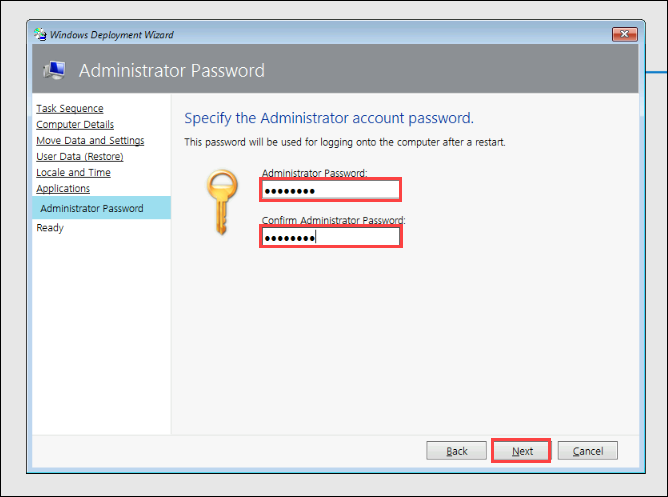

30. On the **Ready** page, select **Begin**. 

    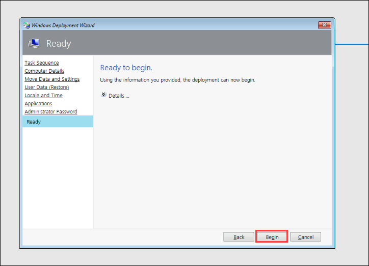

    > The installation begins. It will take 15-20 minutes to complete and will reboot SEA-WS4 during the installation as needed.

31. On Start menu under **Microsoft deployment toolkit** Select the **Deployment Workbench**.

32. In the Deployment Workbench, expand **Deployment Shares**, and expand **MDT Deployment Share**.

33. Select **Monitoring** and then in the details pane, double-click **SEA-WS4**.

    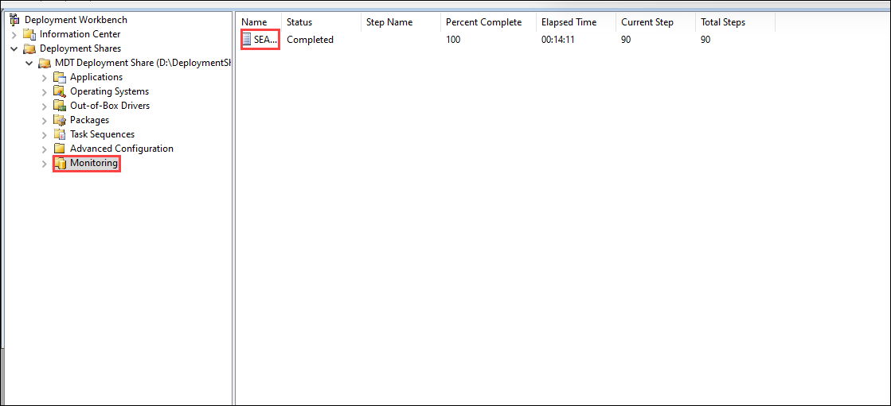

    > Review the monitoring status during the deployment.

34. Switch to **SEA-WS4**.

35. After the installation is complete, the desktop will open and finalize the deployment. At the deployment summary, select **Finish**.

     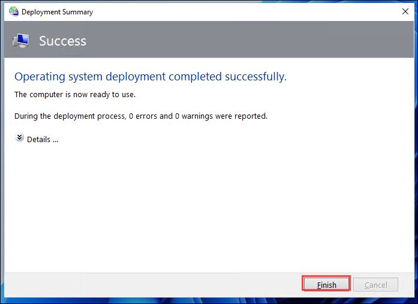

36. Shut down **SEA-WS4** and close the Virtual Machine Connection window.

37. In Hyper-V Manager, right-click **SEA-WS4** and then select **Settings**.

     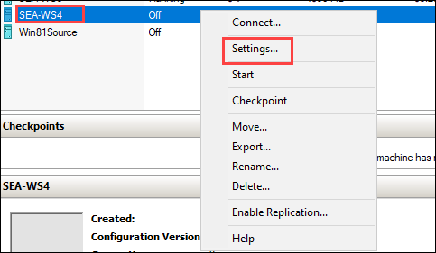

38. In the **Settings for SEA-WS4**, expand **SCSI Controller (1)** and then select **DVD Drive (2)**. In the details pane, under **Media**, select **None (3)**, and then select **OK (4)**.

     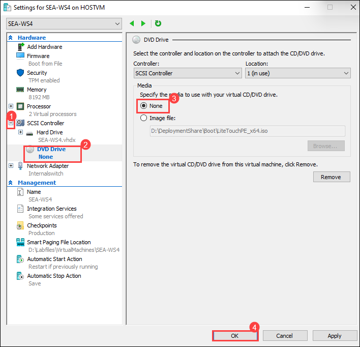

40. Right-click **SEA-WS4** and then select **Checkpoint** to create a checkpoint of the current state of SEA-WS4.

     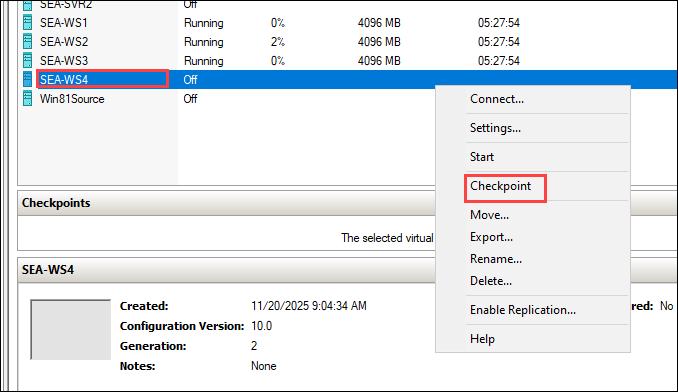

41. On HOSTVM, close **Hyper-V Manager** and close the **Deployment Workbench**.

42. Open **File Explorer**, right-click **DVD Drive E** and then select **Eject**.

     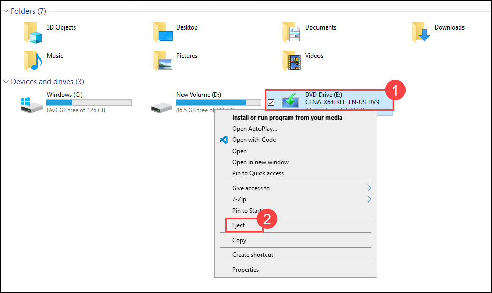

43. Close **File Explorer**.

**Results**: After completing this exercise, you will have successfully used the Microsoft Deployment Toolkit to create and deploy a Windows 11 workstation.

**END OF LAB**
