# Practice Lab: Deploying Windows with Autopilot

## Summary

In this lab you will learn how provision a Windows 11 device with Autopilot using User-driven mode.

### Prerequisites

To following lab(s) must be completed before this lab:

- 0101-Managing Identities in Entra ID

- 0102-Synchronizing Identities by using Microsoft Entra Connect

- 0701-Deploying Windows 11 using Microsoft Deployment Toolkit


### Scenario

Contoso IT is planning to roll out a deployment of new Windows 11 devices using Autopilot. The devices have a default installation of Windows 11. Users should be able to connect the device, turn it on, and answer minimal questions during the OOBE, using their Azure AD credentials to sign in. The process should automatically enroll and join the Azure AD domain. You have been asked to configure and test the experience using the SEA-WS4, which you recently installed and configured using Hyper-V.

> **Important**: We cannot use Windows 11 Hyper-V based virtual machines for Autopilot testing (Which we configured in the previous lab, 0701). This is due to a physical Trusted Platform Module (TPM) requirement. In this lab, we will test autopilot using Windows 10, however in the real world you can follow the same process for deploying windows 11 via Autopilot. for more details, see [Troubleshooting Windows Enrollment Issues](https://learn.microsoft.com/en-us/troubleshoot/mem/intune/device-enrollment/troubleshoot-windows-enrollment-errors#securing-your-hardware-failed-0x800705b4).

### Task 1: Create group in Entra ID

1. Sign in to **SEA-SVR1** as **Contoso\\Administrator** with the password **Pa55w.rd** and close **Server Manager**.

2. On the taskbar, select **Microsoft Edge**.

3. In Microsoft Edge, in the address bar, type **https://entra.microsoft.com**, and then press **Enter**. If prompted, sign in with your **<inject key="AzureAdUserEmail"></inject>**, and use the tenant Admin password **<inject key="AzureAdUserPassword"></inject>**

4. In the navigation pane, Expand **Identity**.

5. Under **Groups**, select **All groups**.

6. In the **Groups | All groups** blade, select **New group**.

7. In the **New Group** blade, in the **Group type** list, select **Security**.

8. In the **Group name** box, type **IT Devices**.

9. In the **Group description** box, type **IT Department Devices**.

10. In the **Membership type** list, select **Dynamic Device**.

11. Select **Add dynamic query**.

12. On the **Dynamic membership rules** blade select **Edit** above the **Rule syntax** box.

13. In the Edit rule syntax text box, add the following simple membership rule and select **OK**.

```
(device.devicePhysicalIDs -any (_ -contains "[ZTDId]"))
```
14. Select **Save** to close **Dynamic membership rules**, and then select **Create** to create the group.

### Task 2: Create a virtual machine using Hyper-V

1. Switch to **HOSTVM**, Click on Hyper-V manager available on the Task bar

1. In Actions click on **New(1)** and Click on **Virtual machine(2)**.

   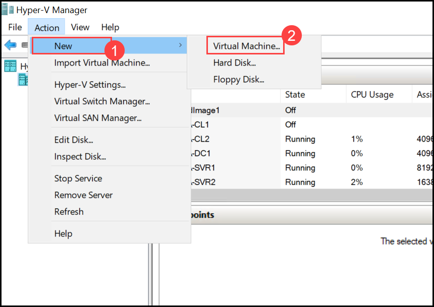

1. In the before you begin page, click on **Next**.

   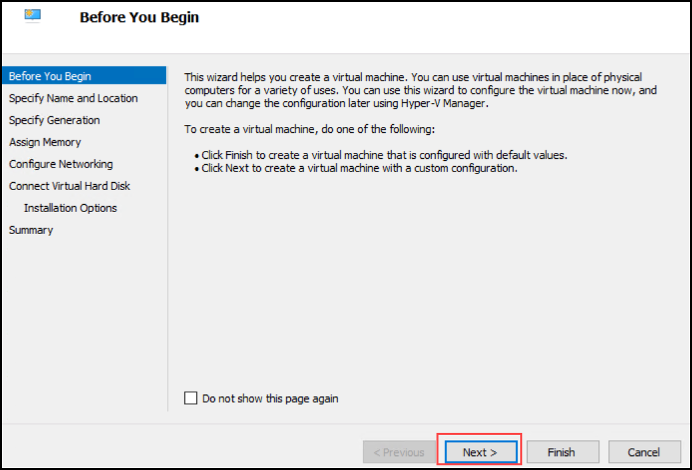

1. In Specify Name and location page, enter the name **SEA-W10-CL3(1)** and click on **Next(2)**.

   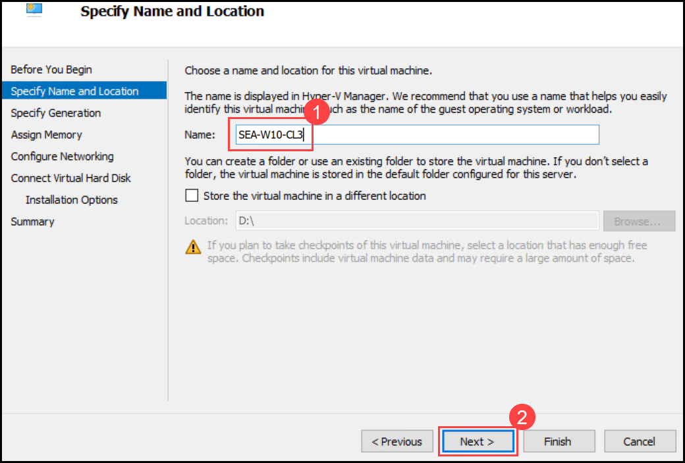

1. In Specify Generation page,  choose **Generation 1(1)** and click on **Next(2)**.

   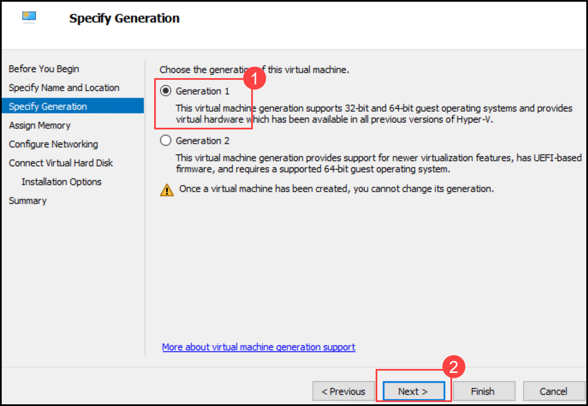

1. In Assign Memory enter the size **4096**(1) and enable **Use dynamic memory for this virtual machine(2)** and click on **Next(2)**

   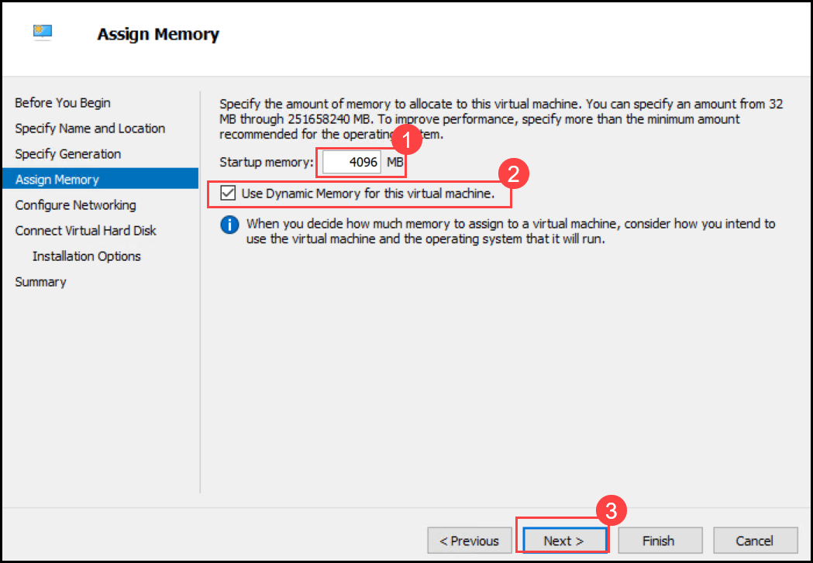

1. In Configure networking Select the drop down and choose **Internalswitch(1)** and click on **Next(2)**

   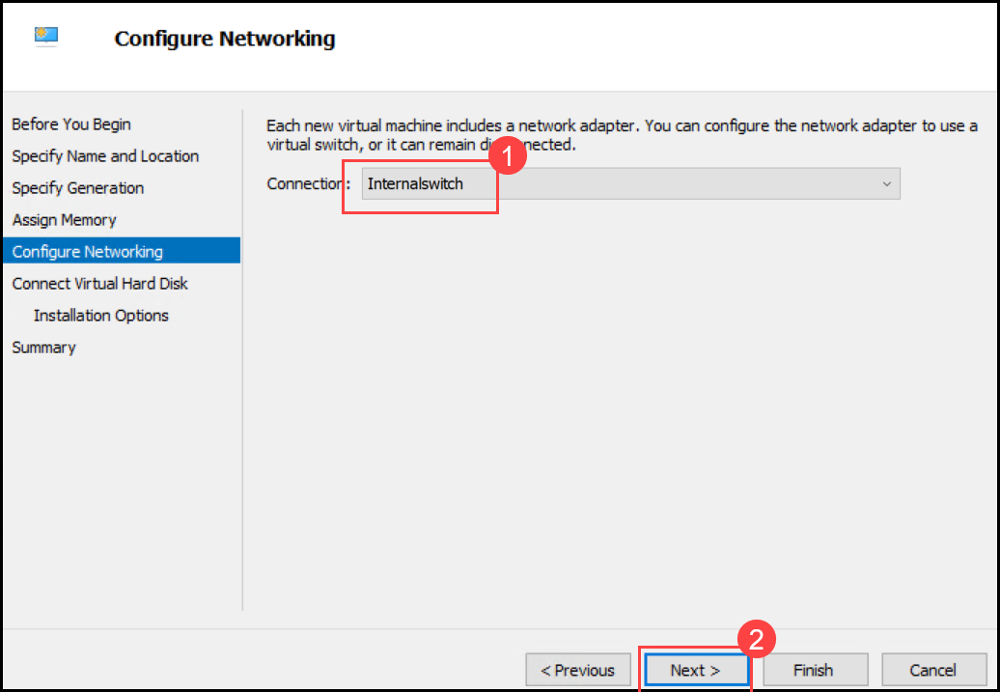

1. In Connect Virtual Hard disks Leave the default settings and click on **Next**

1. In installation options select **Install operating system from bootable CD/DVD ROM(1)**. Under that select **Image file iso(2)**

1. Click on **Browse(3)** and navigate to **D:\Labfiles\ISOs** and select **Win10.iso(4)** and click on **Next(5)**

   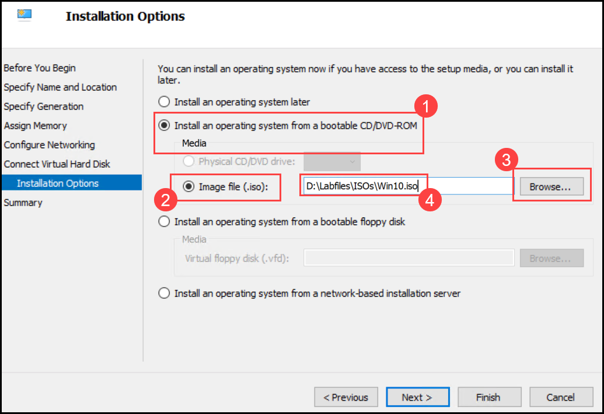

1. Review the settings on summary page and click on **Finish**

## Task 03: Configure Domain for the created virtual machine

1. Once the **SEA-W10-CL3** VM is created, right click and select **start**.

1. Once it is in the Running state, right click and select **Connect**.

   

1. You can see the Windows setup wizard.

1. Click on **Next**

1. Click on **Install now**

   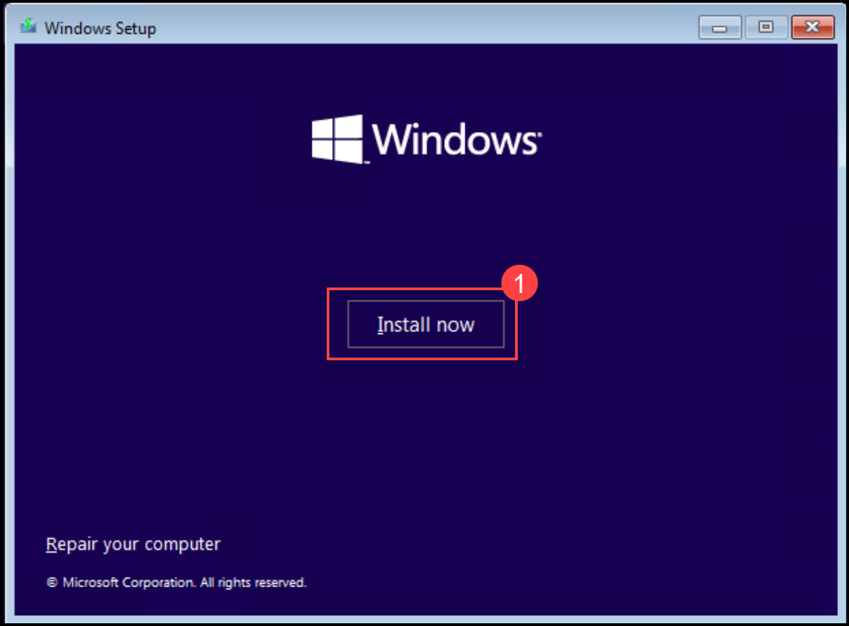

1. Select the checkbox **I Accept the License terms(1)**. and click on **Next(2)**

   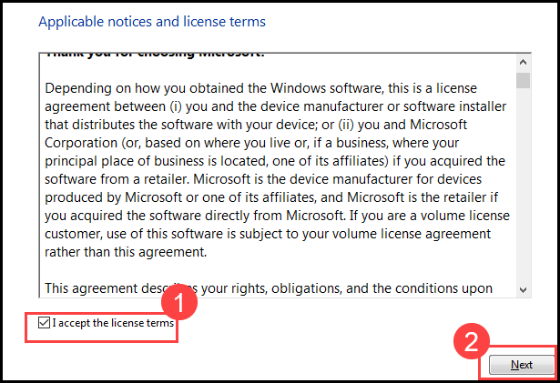

1. On the *Which type of installation do you want* page, choose **Custom:Install Windows Only (advanced)** option

1. On the *Which type of installation do you want* page, select the **Drive 0 unallocated space(1)** and click on **Next(2)** to begin the installation process.

   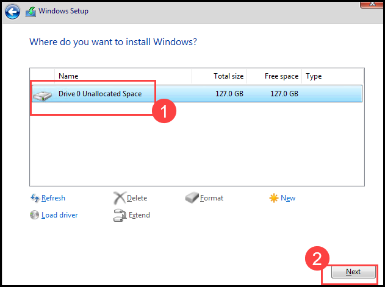

   >**Note**: Installation might roughly take upto 15-20 mins. Do Not Press any key until the Windows Logo appears.

1. Once the installation is completed it will ask you to select Region. Select The default one (United States) and select **Yes**

1. Select the Keyboard layout **US**

   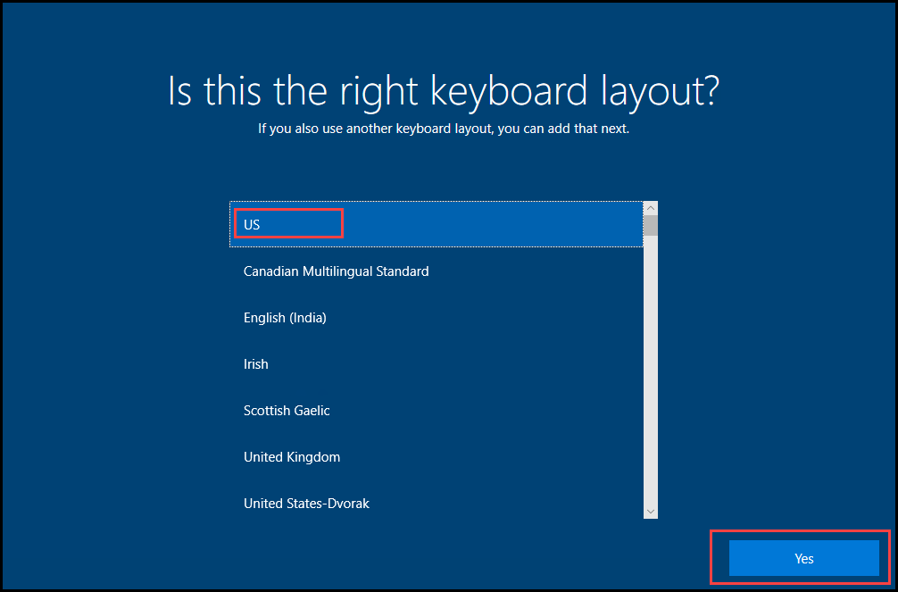

1. Skip Additional keyboard layout.

   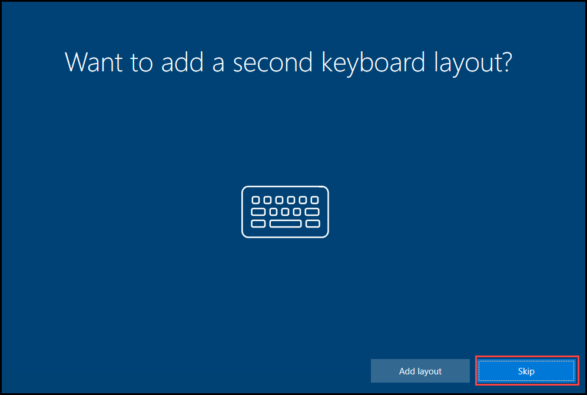

1. When the Wizard asks you to sign in with microsoft. Select **Domain join instead** from the bottom left.

   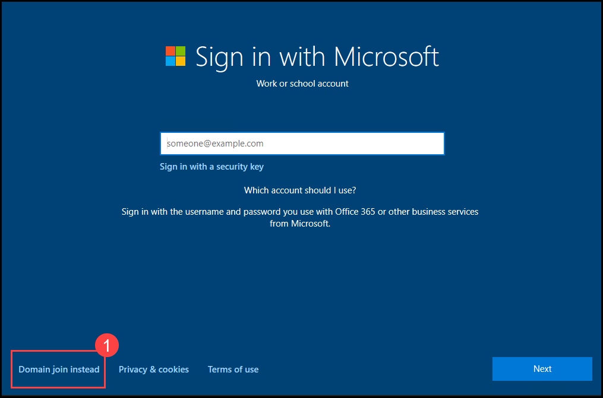

1. On *Who is going to use this PC* page, enter **Admin** at the Name text box and click on **Next**.

1. For password and Confirm password, enter **Pa55w.rd** and Select **Next**.

1. On create security questions for this account page, Select any three question of your choice and fill in the answers, then click on next.

1. Click on **Accept** for Choose privacy settings for your device page.

   

1. Click on **Not now** for the Cortana setup.

   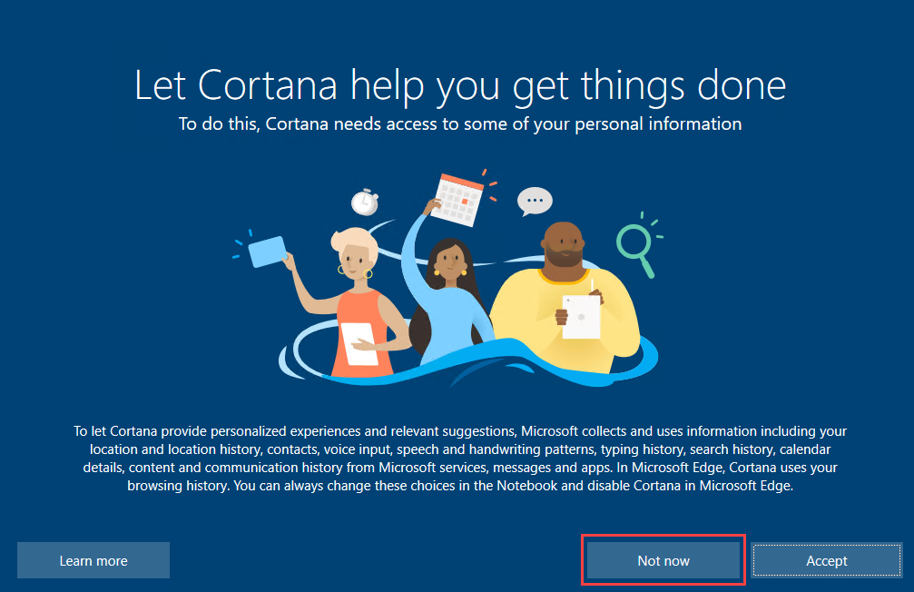

1. The setup will take few minutes to complete.

1. Once completed, the Connect screen pops up from hyper-v click on connect. The system reboots

   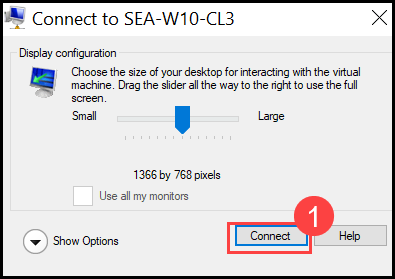

1. Once Rebooted it asks for username and password. Enter **Admin** for username and **Pa55w.rd** for password.

1. Once logged in to **SEA-W10-CL3** and search and select **Run** from Start menu to open Run command.

1. Type **sysdm.cpl** and press enter which opens System properties.

   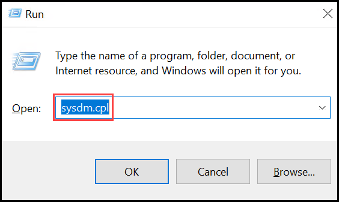
   
1. Click on **Change**.

   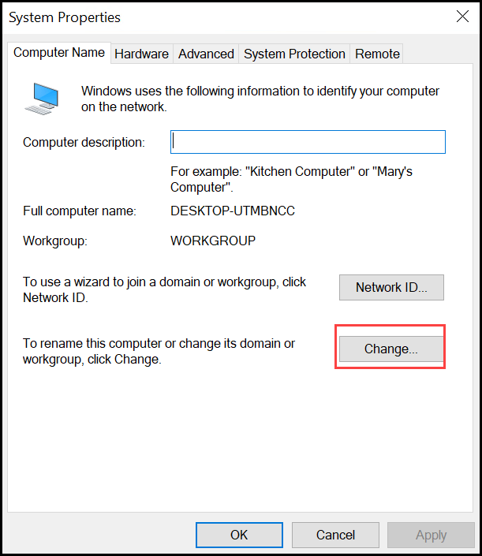

1. When the screen pops-up leave the computer name as default, and under **Member of** select Domain and Type **Contoso.com**, Select Ok

   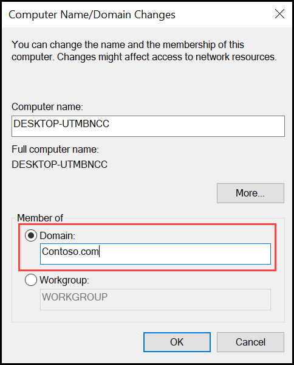

1. Windows security screen pops-up Give username as **Administrator** And Password as **Pa55w.rd**. Press enter

   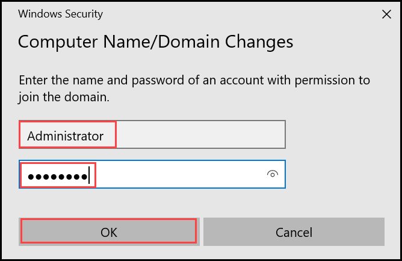

1. A screen pops-up with Restart request. Select Restart now.

  >**Note**: If the pop-up does not appear, manually restart the system.
   
### Task 4: Generate a device-specific comma-separated value (CSV) file

1. In the **SEA-W10-CL3** VM, sign in with **Admin** enter **Pa55w.rd** for password.

2. Right-click **Start**, select **Windows PowerShell (Admin)**, and then select **Yes** at the **User Account Control** prompt.

3. At the Windows PowerShell command-line prompt, type the following cmdlet, and then press **Enter**:

    ```
    Install-Script -Name Get-WindowsAutoPilotInfo
    ```

4. You will receive three prompts. Each time, type **Y**, and then press **Enter**.

5. At the Windows PowerShell command-line prompt, type the following cmdlet, and then press **Enter**:

    ```
    Set-ExecutionPolicy RemoteSigned
    ```

6. When prompted, type **Y**, and then press Enter.

7. At the Windows PowerShell command-line prompt, type the following cmdlet, and then press **Enter**:

    ```
    Get-WindowsAutoPilotInfo.ps1 -OutputFile C:\Computer.csv
    ```

8. At the Windows PowerShell command-line prompt, type the following command, press **Enter**, and then review the file content:

    ```
    type C:\Computer.csv
    ```

9. Close out of **Windows Powershell**.

### Task 5: Work with a Windows Autopilot deployment profile

1. On **SEA-W10-CL3**, in the windows taskbar, select **Microsoft Edge**.

2. In **Microsoft Edge**, navigate to **https://intune.microsoft.com**. Sign in with your  **<inject key="AzureAdUserEmail"></inject>** account.

    >Note: If prompted to register for MFA. Follow the same procedures you used earlier in the course to add your phone number.

4. In the **Microsoft Intune admin center**, select **Devices**.

4. In the **Device onboarding** section, select **Enrollment**. 

5. In the **Windows** tab, scroll down to **Windows Autopilot**, and then select **Devices**.

6. In the **Windows Autopilot devices** blade on the menu bar, select **Import**, select the **folder icon** and then browse to **C:\\**, select **Computer.csv**, select **Open**, and then select **Import**. 


6. In the **Windows Autopilot devices** blade on the menu bar, select **Import**, select the **folder icon** and then browse to **C:\\**, select **Computer.csv**, select **Open**, and then select **Import**. 

   _Note: The import process can take up to 15 minutes, but normally takes around 5 minutes._  

   _**Important**: After the process is complete, the device may not show automatically. If this is the case, select the **Refresh** button. If the device still does not appear, select the **Sync** button, wait a few minutes, and then select **Refresh**._

7. Select **X** to close the **Windows Autopilot devices** blade. 

8. On the Windows enrollment blade, in the details pane, select **Deployment Profiles**.

9. On the **Windows AutoPilot deployment profiles** blade, select **Create profile** and then select **Windows PC**.

10. In the **Basics** tab, in the **Name** text box, type **Contoso profile1**.

11. For **Convert all targeted devices to Autopilot** select **No**, and then select **Next**.

12. On the **Out-of-box experience (OOBE)** tab, ensure that the **Deployment mode** is set to **User-Driven**.

13. Ensure that **Join to Microsoft Entra ID as** is set to **Microsoft Entra Joined**.

14. Ensure that the following options are set:

    - Microsoft Software License Terms: **Hide**

    - Privacy Settings: **Hide**

    - Hide change account options: **Hide**

    - User account type: **Administrator**.

    - Allow pre-provisioned deployment: **No**

    - Language (Region): **Operating system default**

    - Automatically configure keyboard: **Yes**

    - Apply device name template: **No**

15. Select **Next**.

16. On the **Assignments** tab, under **Included groups** select **Add groups**.

17. Select the **IT Devices** group and click **Select**. Select **Next**.

18. On the **Review + create** blade, review the information and then select **Create**.

19. Close out of **Microsoft Edge**

### Task 6: Reset the PC

1. On **SEA-W10-CL3**, select **Start**, type **reset** and select **Reset this PC**.

2. In the **Reset this PC** section, select **Get started**.

3. Select **Remove everything**, and then select **Local reinstall**.

4. Select **Next** and then select **Reset**.

   >Note: Normally this task is not required for new deployment of physical devices. The device’s autopilot info is either provided by the manufacturer or can be obtained from the device prior to the OOBE. For the purposes of this lab, we must initiate a reset to simulate a new device OOBE.

   >**Note**: This process can take 30-60 minutes and will reboot several times during the process.

### Task 7: Verify Autopilot deployment

  >**Note** : Before proceeding with the next step, ensure that you are in basic session mode and able to view Clipboard in the menu bar as shown in the below image. If not please change it to the basic session by selecting the icon which was highlighted in the tool bar in the below image.

   

1. At the **Contoso Corp. Sign-in Page**, enter **`Aaron@yourtenant.onmicrosoft.com`** and select **Next**.

   >**Note**: Replace **yourtenant** with the tenant name provided to you.

2. At the Password page, enter **Pa55w.rd1234!** and select **Next**.

3. At the **Use Windows Hello with your account**, select **OK**.

4. At the **Verify your identity** page, select the Text verification method.

5. At the **Enter code** page, enter the code that has been texted to your mobile device and then select **Verify**.

6. On the **Setup up a PIN** dialog box, in the **New PIN** and **Confirm PIN** fields, enter **102938**, and then select **OK**.

7. On the **All set!** page, select **OK**.

8. Select **Start** and select **Settings**. 

9. Select **Accounts**, and then select **Access work or school**. Verify the device is connected to Contoso's Azure AD.

10. Select **Connected to Contoso's Azure AD** and select **Info**.

11. On the **Managed by Contoso** page, scroll down and then select **Sync**.

12. On **SEA-W10-CL3**, close the **Settings** window.

13. Switch to **SEA-SVR1**.

14. In the Microsoft Entra admin center, select **Identity**, select **Devices** and then select **All devices**. 

    > Note that the new device displays with an icon that indicates an Autopilot device. Also note that the Join Type is **Microsoft Entra joined** with Aaron Nicholls as the owner.

15. Select the Autopilot device and then select **Manage**. 

16. Again select the Autopilot device to review the management page. 

    > Notice that you can Retire, Wipe, Sync, and Restart the device.

17. Select the ellipsis at the end of the menu bar and take notice of the additional management capabilities.

    > Additional capabilities include Fresh Start, Autopilot Reset, Quick scan, Full scan, as well as others.

18. Close Microsoft Edge.

**Results**: After completing this exercise, you will have provisioned a Windows device with Autopilot using User-driven mode.

**END OF LAB**
