# Practice Lab: Refreshing Windows with Autopilot Reset and Self-Deploying mode

## Summary

In this lab you will learn how perform a remote Autopilot reset.

### Prerequisites

To following lab(s) must be completed before this lab:

- 0101-Managing Identities in Entra ID

- 0102-Synchronizing Identities by using Microsoft Entra Connect

- 0701-Deploying Windows 11 using Microsoft Deployment Toolkit

- 0801-Deploying Windows 11 with Autopilot

### Scenario

SEA-WS4 has been deployed by using Windows Autopilot. You need to test out another provisioning scenario that involves Autopilot Reset. You will create a new deployment profile configured with the Windows Autopilot Self-Deploying mode.

### Task 1: Configure a  Self-Deploying Windows Autopilot deployment profile

In this task you will create a new Autopilot deployment profile configured for Self-Deploying mode and assign it to the IT Devices group.

1. Switch to **SEA-SVR1**.

2. In **Microsoft Edge**, open a new tab and navigate to **https://intune.microsoft.com**. If prompted, sign in with your **<inject key="AzureAdUserEmail"></inject>**.

3. In the **Microsoft Intune admin center** select **Devices (1)**, then in the **Device onboarding** section select **Enrollment (2)**, and on the **Windows enrollment** tab scroll down to **Windows Autopilot** in the details pane and select **Deployment Profiles (3)**.

    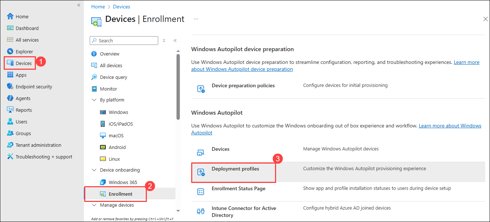

6. On the **Windows AutoPilot deployment profiles** blade, select **Contoso Profile 1** and then select **Properties**.

    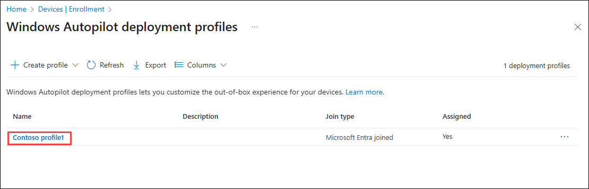

7. Scroll down to **Assignments** and then select **Edit (1)**.

    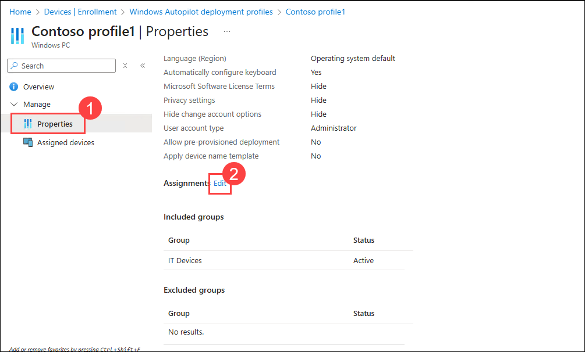

8. Next to **IT Devices**, select **Remove**.

    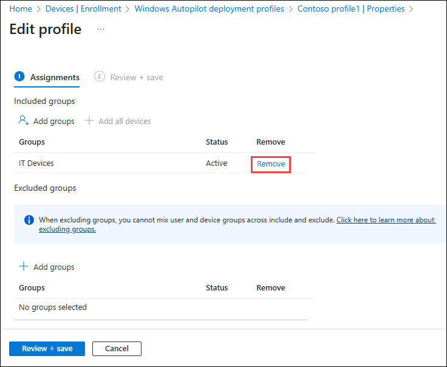

9. Select **Review and save** and then select **Save**.

    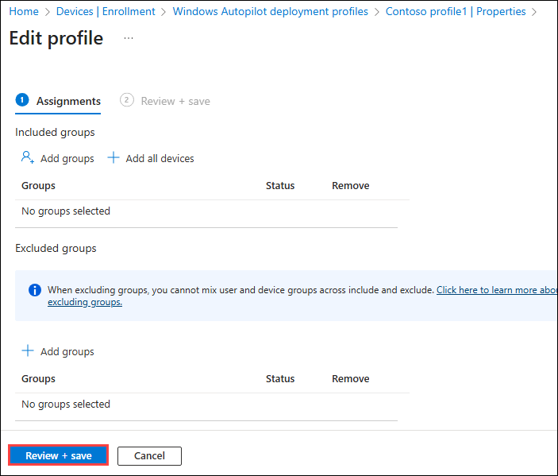

    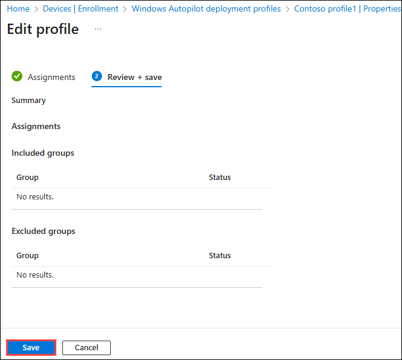

10. Close the **Contoso Profile 1|Properties** page.

11. On the **Windows AutoPilot deployment profiles** blade, select **Create profile (1)** and then select **Windows PC (2)**.

    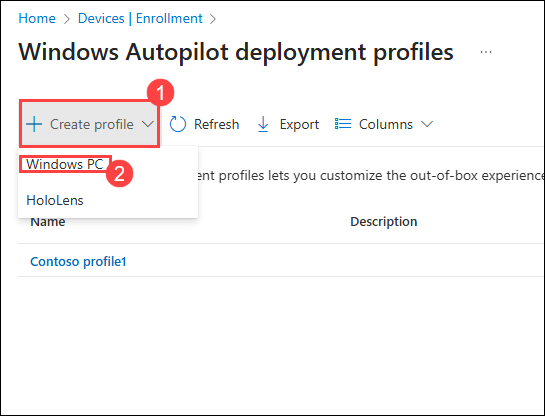

12. In the **Basics** tab, in the **Name** text box, type **Contoso profile 2 (1)**. For **Convert all targeted devices to Autopilot** select **No (2)**, and then select **Next (3)**.

    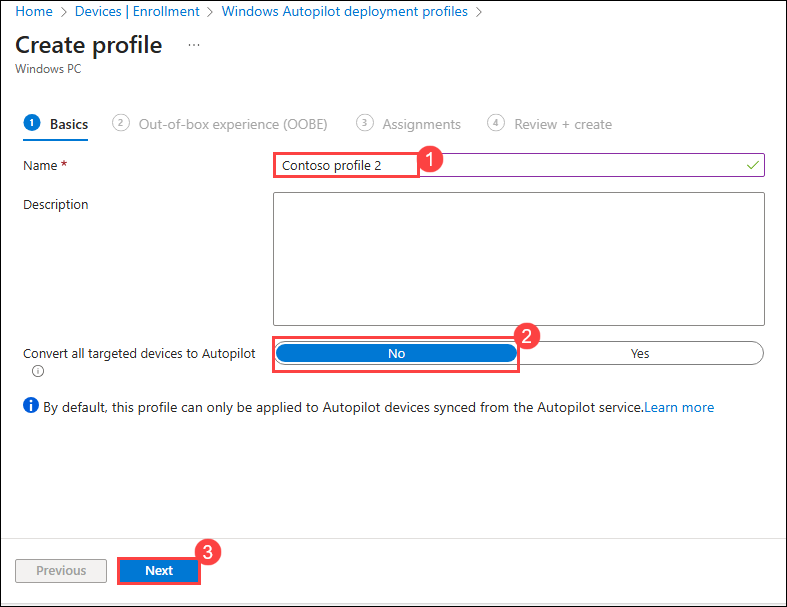

14. On the **Out-of-box experience (OOBE)** tab, ensure that the **Deployment mode** is set to **Self-Deploying**.

    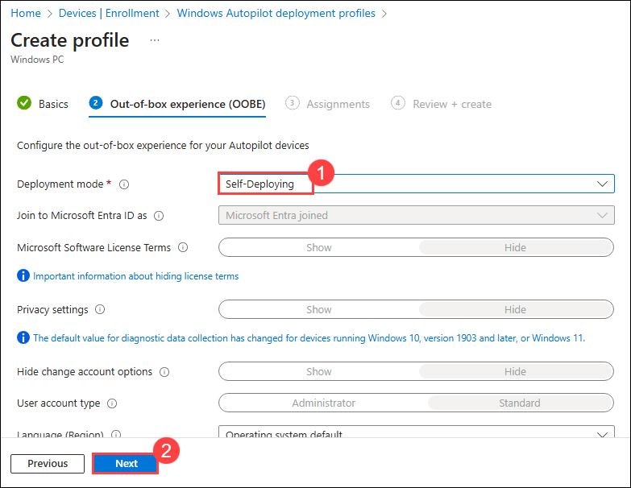

15. Ensure that the following options are set:

   - Language (Region): **Operating system default**
   - Automatically configure keyboard: **Yes**
   - Apply device name template: **Yes**
   - Enter a name: **Contoso-%RAND:2%**

16. Select **Next**.

17. On the **Assignments** tab, under **Included groups** select **Add groups**.

    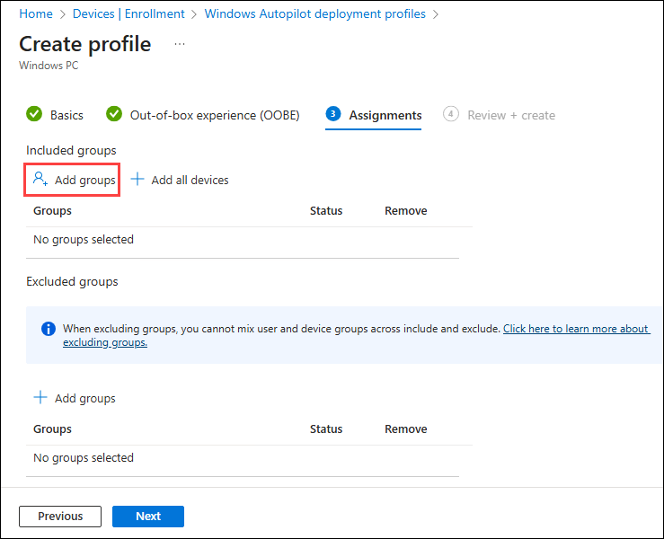

18. Select the **IT Devices** group and click **Select**. Select **Next**.

    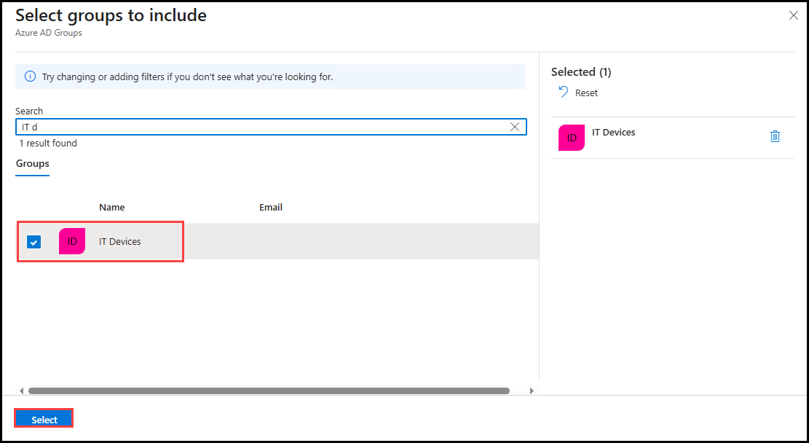

19. On the **Review + create** blade, review the information and then select **Create**.

    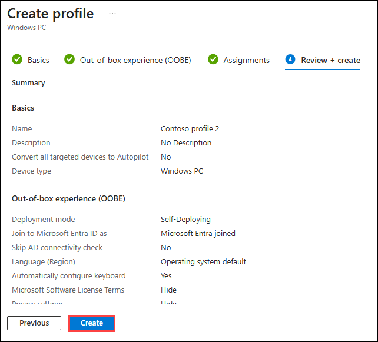

### Task 2: Perform an Autopilot reset

In this task you will remotely trigger an Autopilot Reset on the Autopilot-registered device from Intune.

1. In the **Microsoft Intune admin center**, select **Devices (1)** and then select **All devices (2)**. Select the Autopilot PC (Begins with the name DESKTOP).

    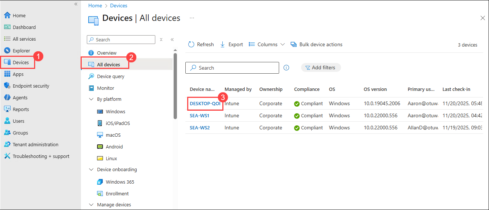

3. In the menu bar, select the ellipsis and then select **Autopilot Reset**.

    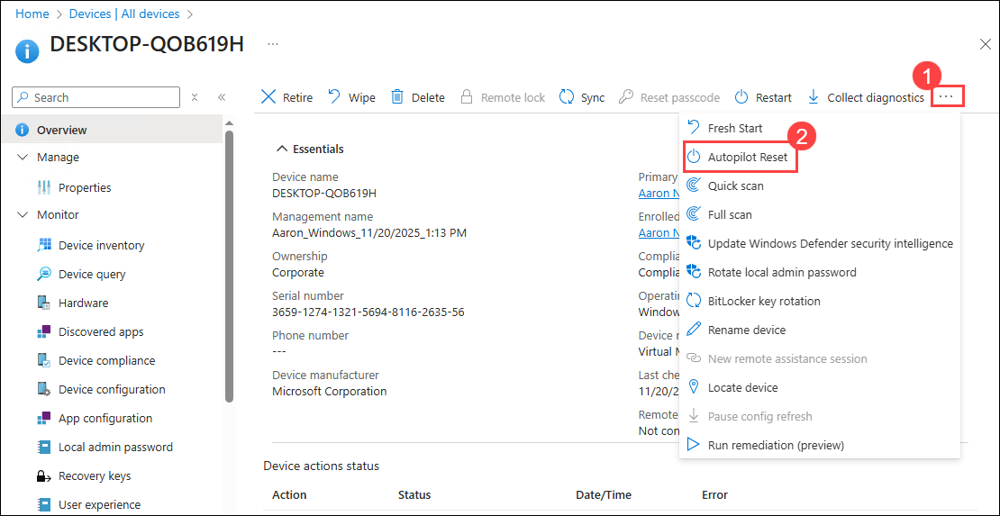

5. At the message prompt, select **Yes**.

    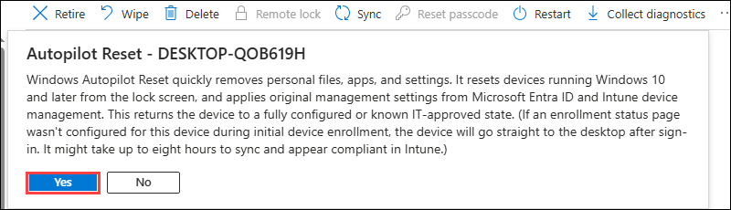

6. Switch to **HOSTVM** and sign in to **SEA-W10-CL3**.

   > Note: SEA-W10-CL3 should still be running from the previous lab.

7. Restart **SEA-W10-CL3**.

   >**Note**: This process can take 30-45 minutes and will reboot several times during the process. 

   >**Note**: If the reset process does not begin after a restart, please sign in, manually sync the device with Intune, and then restart **SEA-W10-CL3**.

### Task 3: Verify Autopilot deployment

In this task you will complete the Autopilot setup after the reset and verify that the device is joined to Entra ID and managed by Intune.

   >**Note** : Before proceeding with the next step, ensure that you are in basic session mode and able to view Clipboard in the menu bar as shown in the below image. If not please change it to the basic session by selecting the icon which was highlighted in the tool bar in the below image.

   

1. At the sign-in page, enter **`Aaron@yourtenant.onmicrosoft.com`** with the Password of **Pa55w.rd1234!**.

    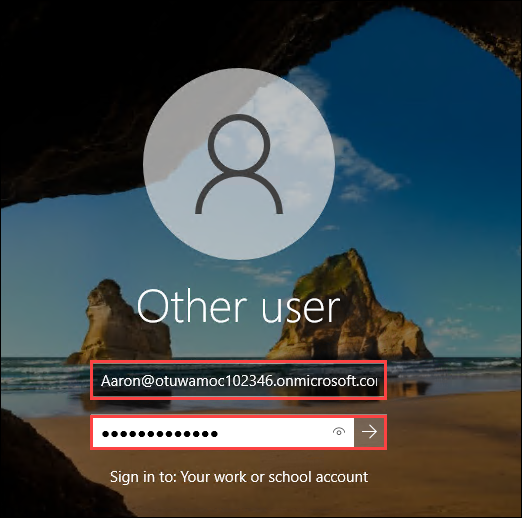

    >**Note**: Replace **yourtenant** with the tenant name provided to you 

2. At the **Use Windows Hello with your account**, select **OK**.

    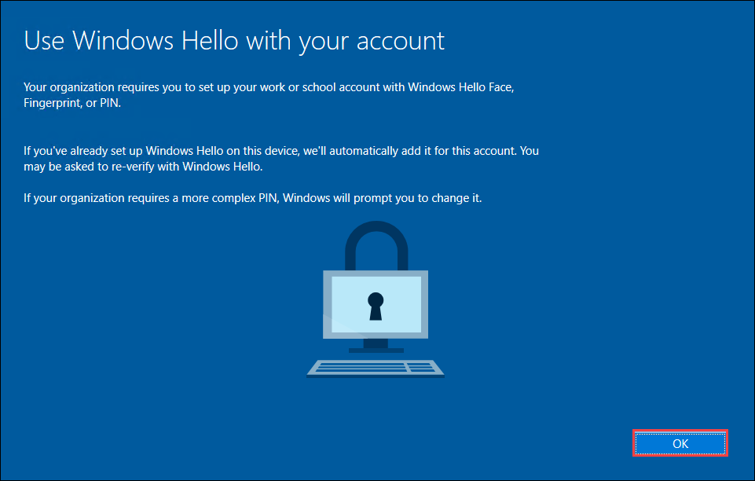

3. At the **Verify your identity** page, select the Text verification method.

    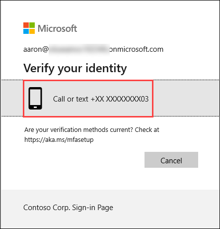

4. At the **Enter code** page, enter the code that has been texted to your mobile device and then select **Verify**.

    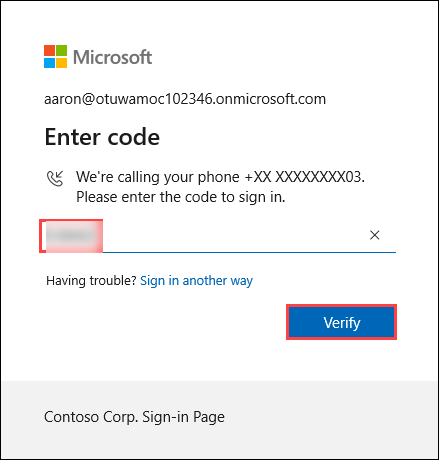

5. On the **Setup up a PIN** dialog box, in the **New PIN** and **Confirm PIN** fields, enter **102938**, and then select **OK**.

    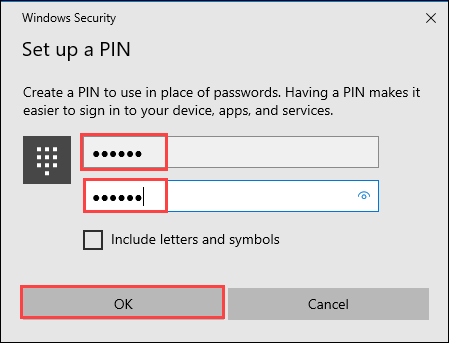

6. On the **All set!** page, select **OK**.

    

7. Select **Start** and select **Settings**. 

8. Select **Accounts**, and then select **Access work or school**. Verify the device is connected to Contoso's Azure AD. Select **Connected to Contoso's Azure AD** and select **Info**.

    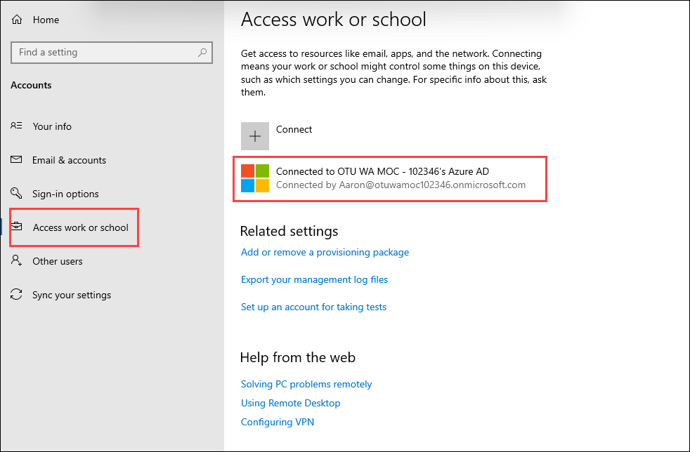

    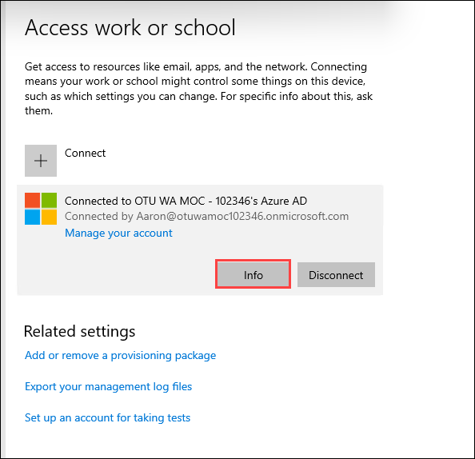

10. On the **Managed by Contoso** page, scroll down and then select **Sync**.

    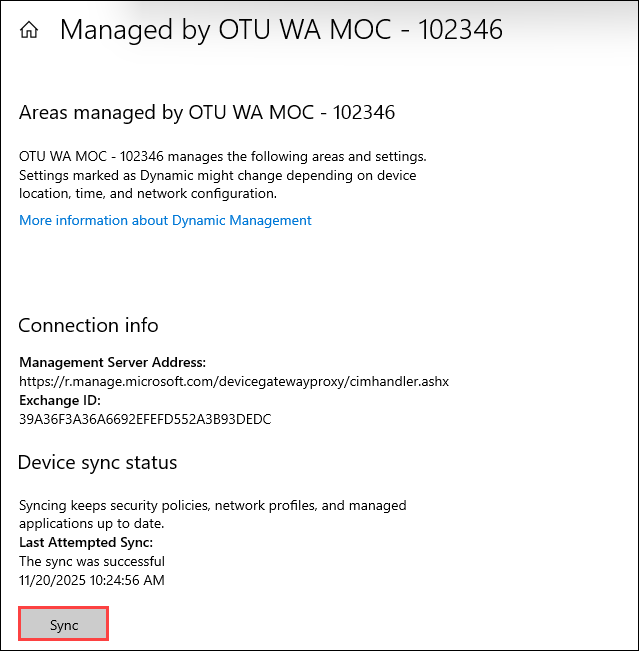

11. On **SEA-W10-CL3**, close the **Settings** window.

    **Results**: After completing this exercise, you will have provisioned a Windows device with Autopilot Reset using Self-Deploying mode.

**END OF LAB**
