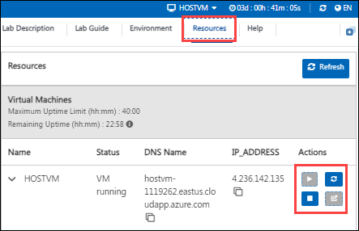

# Getting Started with Your MD-102: Endpoint Administrator Workshop

>**Note**: **Once you launch the track, you'll have access to a virtual machine (VM) for 40 hours. The displayed track duration of 4 days and 8 hours is based on an estimated usage time of 8 hours per day. Please plan your lab sessions accordingly. If the VM uptime of 40 hours is fully exhausted before completing the labs, access will be lost**
 
Welcome to your MD-102: Endpoint Administrator workshop! We've prepared a seamless environment for you to explore and learn about deploying, configuring, protecting, managing, and monitoring devices and client applications in a Microsoft 365 environment. Let's begin by making the most of this experience:
 
## Accessing Your Lab Environment
 
Once you're ready to dive in, your virtual machine and lab guide will be right at your fingertips within your web browser.
 
  

### Virtual Machine & Lab Guide
 
Your virtual machine is your workhorse throughout the workshop. The lab guide is your roadmap to success.
 
## Exploring Your Lab Resources
 
To get a better understanding of your lab resources and credentials, navigate to the **Environment Details** tab.
 
  
 
## Utilizing the Split Window Feature
 
For convenience, you can open the lab guide in a separate window by selecting the **Split Window** button from the Top right corner.
 

 
## Managing Your Virtual Machine
 
1. Feel free to start, stop, or restart your virtual machine as needed from the **Resources** tab. Your experience is in your hands!
 
   

2. To Switch between the Virtual Machines, select the required VM from the dropdown.

   
 
## Support Contact
 
The CloudLabs support team is available 24/7, 365 days a year, via email and live chat to ensure seamless assistance at any time. We offer dedicated support channels explicitly tailored for both learners and instructors, ensuring that all your needs are promptly and efficiently addressed.
 
Learner Support Contacts:
 
- Email Support: cloudlabs-support@spektrasystems.com
- Live Chat Support: https://cloudlabs.ai/labs-support

Click on **Next** from the lower right corner to move on to the next page.
 
## Happy Learning !!
