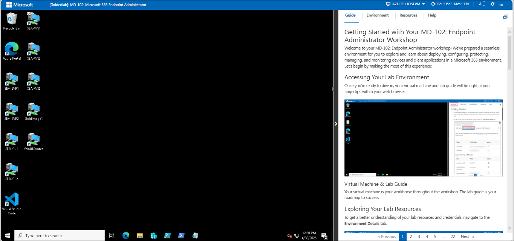
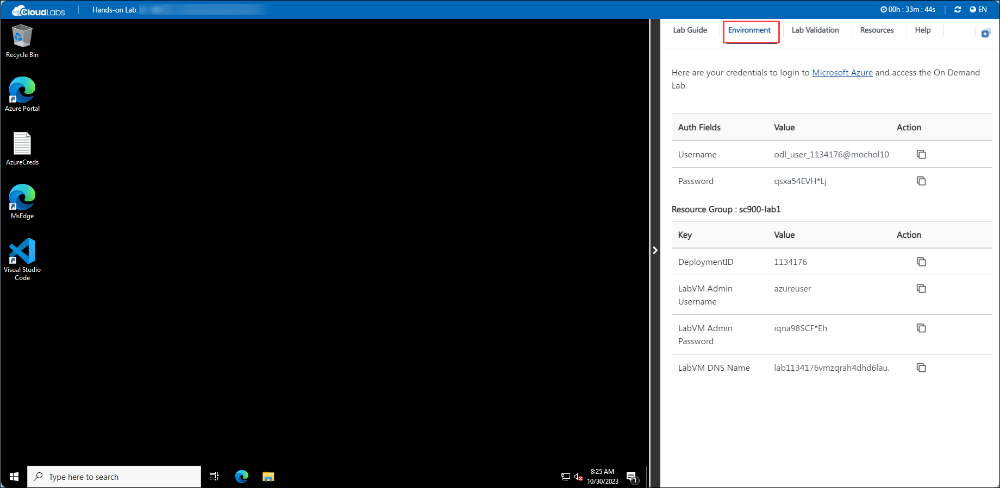
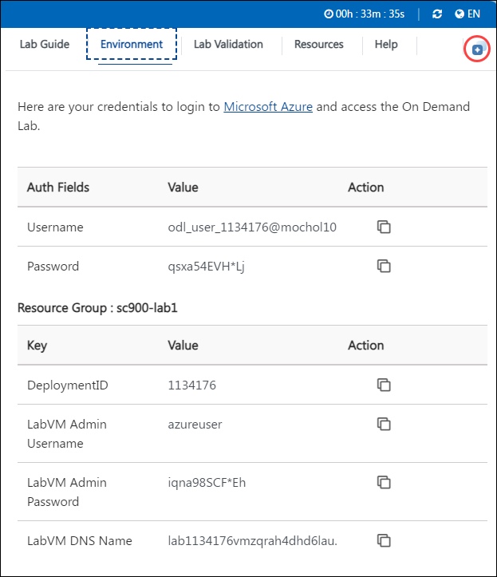
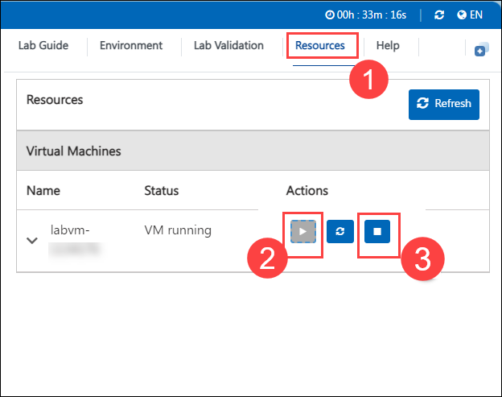
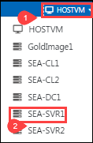
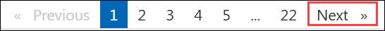

# Getting Started with Your MD-102: Endpoint Administrator Workshop
 
Welcome to your MD-102: Endpoint Administrator workshop! We've prepared a seamless environment for you to explore and learn about deploying, configuring, protecting, managing, and monitoring devices and client applications in a Microsoft 365 environment. Let's begin by making the most of this experience:

> **!IMPORTANT**: Once you launch the track, you’ll have access to a virtual machine (VM) for **40 hours**. The displayed track duration of **4 days 8 hours (104 hours)** indicates the time frame during which you can use your VM. Please plan your lab sessions accordingly. If the VM uptime of **40 hours** is fully exhausted before completing the labs, access will be lost. To avoid this and for detailed instructions on VM usage and stopping/deallocating the VM, Refer to the **[Managing Your Virtual Machine](#managing-your-virtual-machine)** section for step-by-step instructions.

> If the full 40 hours of VM uptime is exhausted, the VM will no longer be accessible, and **the lab duration cannot be extended**.
 
## Accessing Your Lab Environment
 
Once you're ready to dive in, your virtual machine and lab guide will be right at your fingertips within your web browser.
 
  

### Virtual Machine & Lab Guide
 
Your virtual machine is your workhorse throughout the workshop. The lab guide is your roadmap to success.
 
## Exploring Your Lab Resources
 
To get a better understanding of your lab resources and credentials, navigate to the **Environment Details** tab.
 
  
 
## Utilizing the Split Window Feature
 
For convenience, you can open the lab guide in a separate window by selecting the **Split Window** button from the Top right corner.
 

 
## Managing Your Virtual Machine
 
1. Feel free to **Start, Stop, or Restart** your virtual machine as needed from the **Resources (1)** tab. Your experience is in your hands.

    - Once you finish using the lab for the day, please **stop or deallocate** the VM from the Resources tab as shown in the image below.
 
    - **Label (2)** indicates **Starting the VM.** 
    
    - **label (3)** indicates **Stopping or Deallocating** it. This option will stops the VM and helps preserve the VM uptime limit so you can continue working the next day without exhausting the available uptime.
 
    - Please note that once the lab is launched, the overall lab session cannot be paused and will continue to run until the allotted time is fully consumed. Only the VM itself can be stopped or deallocated as described above.
 
      

2. To Switch between the Virtual Machines, select the required VM from the dropdown.

   

   > **Note :** If you’re unable to switch the VM from the dropdown menu, you can also access the VM directly from the desktop of your Host VM.

    

## Lab Guide Zoom In/Zoom Out
 
To adjust the zoom level for the environment page, click the **A↕ : 100%** icon located next to the timer in the lab environment.

   

## Pasting Commands in the PowerShell/CloudShell Environment

Please make sure to use the **CTRL+SHIFT+V** or **CTRL+V** keys when pasting commands inside the PowerShell/CloudShell environment instead of right-clicking

## Support Contact
 
The CloudLabs support team is available 24/7, 365 days a year, via email and live chat to ensure seamless assistance at any time. We offer dedicated support channels explicitly tailored for both learners and instructors, ensuring that all your needs are promptly and efficiently addressed.
 
Learner Support Contacts:
 
- Email Support: cloudlabs-support@spektrasystems.com
- Live Chat Support: https://cloudlabs.ai/labs-support

- Click on **Next** from the lower right corner to move on to the next page.

  

Now you're all set to explore the powerful world of technology. Feel free to reach out if you have any questions along the way. Enjoy your workshop!
 
## Happy Learning !!
