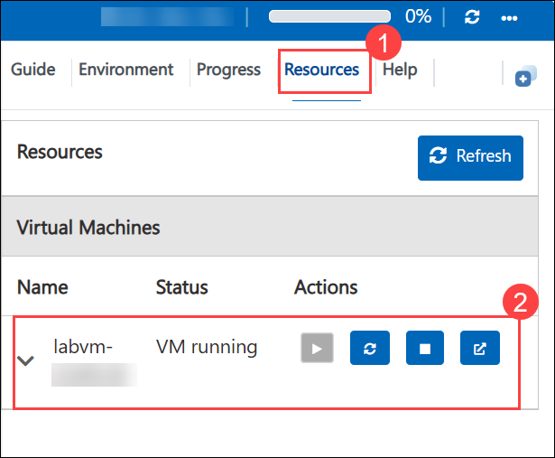

# Getting Started with Your MD-102: Endpoint Administrator Workshop
 
Welcome to your MD-102: Endpoint Administrator workshop! We've prepared a seamless environment for you to explore and learn about deploying, configuring, protecting, managing, and monitoring devices and client applications in a Microsoft 365 environment. Let's begin by making the most of this experience:

> **!IMPORTANT**: Once you launch the track, you’ll have access to a virtual machine (VM) for **40 hours**. The displayed track duration of **4 days 8 hours (104 hours)** indicates the time frame during which you can use your VM. Please plan your lab sessions accordingly. If the VM uptime of **40 hours** is fully exhausted before completing the labs, access will be lost. To avoid this and for detailed instructions on VM usage and stopping/deallocating the VM, Refer to the **[Managing Your Virtual Machine](#managing-your-virtual-machine)** section for step-by-step instructions.

> If the full 40 hours of VM uptime is exhausted, the VM will no longer be accessible, and **the lab duration cannot be extended**.

## Overview

In these hands-on labs, you will gain practical experience in managing and securing modern endpoints in a Microsoft 365 environment. The labs are designed to help you understand how to configure identities, enroll and manage devices, deploy applications, enforce compliance, protect endpoints, and support secure Windows deployment and refresh scenarios using Microsoft Intune, Microsoft Entra ID, and related Microsoft 365 tools.

## Objectives

By the end of these labs, you will be able to:

1. **Manage Microsoft Entra identities and synchronization:** Configure and manage identities, user accounts, and directory synchronization using Microsoft Entra ID and Azure AD Connect.

2. **Configure device registration and enrollment:** Set up Azure AD join, device registration, and device enrollment into Microsoft Intune for Windows, iOS, and iPadOS devices.

3. **Deploy and manage endpoint configurations:** Create and assign configuration profiles, configure kiosk mode, and apply Wi-Fi settings to supported devices.

4. **Validate and monitor endpoint management:** Use Group Policy Analytics to assess GPO support and monitor device and user activity in Intune.

5. **Deploy and protect applications:** Publish cloud apps, configure app protection policies, and manage app security for mobile devices.

6. **Secure access and enforce compliance:** Configure multi-factor authentication, self-service password reset, and device compliance policies to strengthen security.

7. **Implement endpoint security controls:** Configure endpoint security policies, manage disk encryption, and protect devices from unauthorized access.

8. **Deploy and refresh Windows devices:** Use Microsoft Deployment Toolkit, Windows Autopilot, and Autopilot Reset/Self-Deploying Mode to deploy and recover Windows devices efficiently.

## Pre-requisites

- Basic understanding of Microsoft 365 and Microsoft Entra ID concepts.
- Familiarity with Windows devices, user accounts, and endpoint management fundamentals.
- Basic knowledge of Intune, Group Policy, and device security concepts is helpful.
- Access required Microsoft 365 resources for completing the exercises.

## Architecture

The lab architecture is built around the core services used to manage and secure endpoints in a Microsoft 365 environment. Throughout these labs, you will work with identity services, device enrollment and management tools, security and compliance controls, and Windows deployment capabilities to provide a complete endpoint administration experience.

1. **Microsoft Entra ID and Azure AD Connect:** Provide identity management, authentication, and directory synchronization services for users and devices.

2. **Microsoft Intune / Endpoint Manager:** Enables device enrollment, configuration, policy enforcement, app deployment, and monitoring across corporate devices.

3. **Configuration Profiles and Device Settings:** Allow administrators to define and apply device settings such as Wi-Fi, kiosk restrictions, and other management policies.

4. **Compliance and Security Policies:** Help ensure that devices meet organizational standards through device compliance, MFA, self-service password reset, and endpoint security policies.

5. **Windows Deployment Services:** Support deployment and recovery of Windows devices using Microsoft Deployment Toolkit, Windows Autopilot, and Autopilot Reset/Self-Deploying Mode.

## Explanation of Components

1. **Microsoft Entra ID:** Provides identity and access management for users, groups, and device authentication in Microsoft 365.

2. **Azure AD Connect:** Synchronizes on-premises identities with Microsoft Entra ID to support hybrid identity scenarios.

3. **Microsoft Intune:** Manages device enrollment, configuration profiles, app deployment, compliance, and endpoint security.

4. **Configuration Profiles:** Define security and device settings that can be applied to users and devices.

5. **Group Policy Analytics:** Helps evaluate whether existing Group Policy objects are compatible with modern management approaches in Intune.

6. **Compliance Policies:** Ensure devices meet required standards before being allowed to access company resources.

7. **App Protection Policies:** Protect organizational data on mobile devices without requiring full device management.

8. **Endpoint Security Policies:** Manage security baselines, antivirus, firewall, disk encryption, and other protection settings.

9. **Windows Autopilot:** Simplifies and automates the provisioning of new Windows devices.

10. **Microsoft Deployment Toolkit:** Provides a traditional deployment approach for Windows 11 imaging and operating system deployment.

## Accessing Your Lab Environment
 
Once you're ready to dive in, your virtual machine and lab guide will be right at your fingertips within your web browser.
 
  

### Virtual Machine & Lab Guide
 
Your virtual machine is your workhorse throughout the workshop. The lab guide is your roadmap to success.
 
## Exploring Your Lab Resources
 
To get a better understanding of your lab resources and credentials, navigate to the **Environment Details** tab.
 
  
 
## Utilizing the Split Window Feature
 
For convenience, you can open the lab guide in a separate window by selecting the **Split Window** button from the Top right corner.
 

 
## Lab Progress

You can use the **Progress** tab to track your progress while working on the lab. A score will be provided after successful validation.

## Managing Your Virtual Machine

1. Feel free to **Start, Restart, or Stop (2)** your virtual machine as needed from the **Resources (1)** tab. Your experience is in your hands!
 
    

2. To Switch between the Virtual Machines, select the required VM from the dropdown.

   

   > **Note :** If you’re unable to switch the VM from the dropdown menu, you can also access the VM directly from the desktop of your Host VM.

    

## Lab Guide Zoom In/Zoom Out
 
To adjust the zoom level for the environment page, click the **A↕ : 100%** icon located next to the timer in the lab environment.

   

## Pasting Commands in the PowerShell/CloudShell Environment

Please make sure to use the **CTRL+SHIFT+V** or **CTRL+V** keys when pasting commands inside the PowerShell/CloudShell environment instead of right-clicking

## Support Contact
 
The CloudLabs support team is available 24/7, 365 days a year, via email and live chat to ensure seamless assistance at any time. We offer dedicated support channels explicitly tailored for both learners and instructors, ensuring that all your needs are promptly and efficiently addressed.
 
Learner Support Contacts:
 
- Email Support: cloudlabs-support@spektrasystems.com
- Live Chat Support: https://cloudlabs.ai/labs-support

- Click on **Next** from the lower right corner to move on to the next page.

  

Now you're all set to explore the powerful world of technology. Feel free to reach out if you have any questions along the way. Enjoy your workshop!
 
## Happy Learning !!
